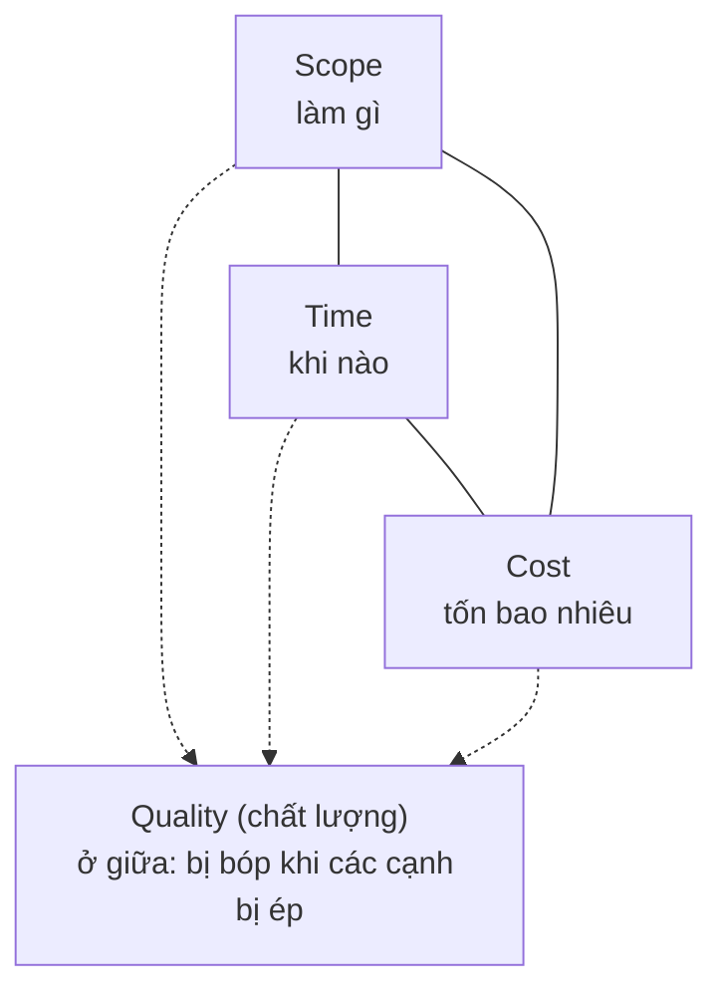
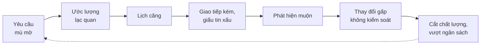

# Chương 1: Dự án và quản lý dự án là gì?

## Mục tiêu học

- Phân biệt được **dự án** (project), **vận hành** (operations) và **sản phẩm** (product) qua ba đặc điểm: tạm thời, duy nhất, có đầu ra.
- Mô tả được các ràng buộc Scope–Time–Cost và ba ràng buộc mở rộng (Quality, Risk, Resource), và giải thích vì sao sửa một cạnh thì các cạnh khác phải động theo.
- Nêu được 5 nguyên nhân gốc khiến dự án phần mềm trễ hạn, vượt ngân sách và chỉ ra dấu hiệu sớm của từng nguyên nhân.
- Đánh giá được một dự án "thành công" theo giá trị kinh doanh, không chỉ theo "đúng hạn, đúng ngân sách".
- Nắm được bối cảnh dự án FoodNow sẽ đi xuyên suốt cuốn sách.

## 1.1 Dự án là gì — và không là gì

**Dự án** (project) là một nỗ lực **tạm thời** nhằm tạo ra một **sản phẩm, dịch vụ hoặc kết quả duy nhất**. Ba từ khoá đáng nhớ:

- **Tạm thời**: có ngày bắt đầu và ngày kết thúc. Dự án kết thúc khi đạt mục tiêu, khi bị huỷ, hoặc khi hết lý do tồn tại. "Tạm thời" không có nghĩa là ngắn: một dự án 3 năm vẫn là dự án.
- **Duy nhất**: dù đội đã làm 10 app đặt đồ ăn, app thứ 11 vẫn khác ở khách hàng, ràng buộc pháp lý, tích hợp, con người. Chính "khác" này tạo ra bất định — và bất định là lý do cần quản lý.
- **Có đầu ra (deliverable)**: thứ cụ thể bàn giao được — phần mềm chạy được, tài liệu, một hệ thống đã được người dùng dùng thật.

Đối lập với dự án là **vận hành** (operations): công việc lặp lại, liên tục, nhằm duy trì hoạt động của tổ chức. Sản phẩm chạy trên production, đội hỗ trợ trả lời ticket, đội SRE giám sát hệ thống — đó là vận hành. Còn **sản phẩm** (product) là thứ sống lâu hơn dự án: một dự án có thể xây sản phẩm, một sản phẩm có thể trải qua nhiều dự án (MVP, R1, R2).

| Tiêu chí | Dự án | Vận hành | Sản phẩm |
|---|---|---|---|
| Thời gian | Có điểm đầu, điểm cuối | Liên tục | Sống theo vòng đời thị trường |
| Tính lặp lại | Duy nhất | Lặp lại | Nhiều phiên bản |
| Mục tiêu | Tạo ra đầu ra | Duy trì kết quả | Tạo giá trị cho người dùng |
| Thành công đo bằng | Đạt mục tiêu, trong ràng buộc | Ổn định, hiệu quả | Người dùng dùng và trả tiền |
| Ví dụ | Xây app FoodNow MVP | Trực ca hỗ trợ đơn hàng | App FoodNow đang chạy |

Ranh giới không phải lúc nào cũng sắc nét. **Bảo trì** phần mềm là vận hành, nhưng "nâng cấp toàn bộ hệ thống thanh toán trong 4 tháng" lại là dự án. Một quy tắc thực dụng: **nếu có ngày kết thúc dự kiến, có đầu ra xác định và có ngân sách riêng, hãy quản lý nó như một dự án**. Nếu không, hãy chọn cách quản lý khác (Kanban cho vận hành, roadmap cho sản phẩm — sẽ học ở Ch13 và Ch25).

> **Khi nào KHÔNG cần quản lý kiểu dự án?** Việc 2 ngày cho 1 người, hoặc công việc đều đặn không có đích đến. Áp bộ máy Charter–WBS–RAID vào những việc đó chỉ tạo giấy tờ.

## 1.2 Quản lý dự án là gì

**Quản lý dự án** (project management) là việc áp dụng kiến thức, kỹ năng, công cụ và kỹ thuật vào các hoạt động của dự án để đạt yêu cầu. Nói theo cách của người làm nghề: **quản lý dự án là biến một mục tiêu mơ hồ thành một chuỗi việc có thể làm, giao được cho ai đó, theo dõi được, và điều chỉnh khi thực tế lệch kế hoạch.**

Nó trả lời liên tục sáu câu hỏi:

1. **Làm cái gì?** (phạm vi, yêu cầu)
2. **Khi nào xong?** (lịch, mốc)
3. **Tốn bao nhiêu?** (ngân sách, nguồn lực)
4. **Tốt đến đâu thì đủ?** (chất lượng, tiêu chí chấp nhận)
5. **Điều gì có thể sai?** (rủi ro)
6. **Ai làm, ai quyết định, ai cần biết?** (con người, giao tiếp)

Cuốn sách này đi theo đúng thứ tự đó: sáu câu hỏi tương ứng với các Phần 1–7. Ch03 sẽ đặt chúng vào năm nhóm quy trình (Khởi động, Lập kế hoạch, Thực thi, Giám sát, Đóng) của vòng đời dự án.

## 1.3 Ràng buộc dự án: từ "tam giác" đến bảng cân bằng

### Tam giác Scope–Time–Cost

Mọi dự án bị giới hạn bởi ba ràng buộc lớn:

- **Scope** (phạm vi): làm những gì, đến mức nào.
- **Time** (thời gian): hạn chót, các mốc.
- **Cost** (chi phí): ngân sách, gồm cả công người.

Chúng gắn với nhau: **đổi một cạnh, ít nhất một cạnh khác phải đổi** — hoặc chất lượng trả giá. Muốn thêm phạm vi mà giữ nguyên hạn và ngân sách thì bạn đang lấy chất lượng hoặc sức khoẻ của đội để bù.

### Ba ràng buộc mở rộng

Thực tế dự án phần mềm còn ba yếu tố quyết định thắng thua:

- **Quality** (chất lượng): "đúng hạn, đúng ngân sách nhưng đầy lỗi" là thất bại có bao bì đẹp. Chất lượng thường là cạnh bị hy sinh đầu tiên vì khó nhìn thấy ngay.
- **Risk** (rủi ro): sự kiện chưa xảy ra nhưng có thể làm lệch mục tiêu. Kế hoạch đúng trong thế giới không có rủi ro là kế hoạch sai.
- **Resource** (nguồn lực): con người, hạ tầng, công cụ. Với phần mềm, nguồn lực chủ yếu là con người — và con người không co giãn như dự toán.

### Ưu tiên ràng buộc — quyết định đầu tiên của PM

Không thể tối ưu cả ba cạnh cùng lúc. Việc đầu tiên khi nhận dự án là hỏi Sponsor: **"Nếu buộc phải đánh đổi, anh/chị giữ cái nào cố định, cái nào linh hoạt, cái nào là mục tiêu?"** Ví dụ cho ba tình huống điển hình:

| Tình huống | Cố định | Linh hoạt | Hệ quả cho PM |
|---|---|---|---|
| Ra mắt trước mùa Tết để bán hàng | **Time** | Scope (cắt tính năng) | Chốt MVP tối thiểu, ưu tiên MoSCoW |
| Hệ thống tuân thủ quy định, có kiểm toán | **Scope + Quality** | Time, Cost | Lịch có buffer, kiểm thử dày |
| Startup cạn tiền, còn 6 tháng runway | **Cost** | Scope, Time | Đội nhỏ, giao từng phần nhỏ |

Ở FoodNow, Sponsor Trần Quốc Bảo muốn "ra mắt sớm" nhưng ngân sách có giới hạn, còn chất lượng thanh toán là bất khả nhượng. Bạn sẽ thấy ở Ch07 cách Hà biến câu trả lời đó thành phạm vi MVP.

> **Mẹo thực chiến:** hãy ghi ưu tiên ràng buộc thành một dòng trong Charter (Ch05): "Time cố định; Scope linh hoạt; Cost trong ngân sách; Quality: không có bug Critical/High khi go-live". Khi có tranh cãi, bạn chỉ việc trỏ vào dòng đó.

## 1.4 Vì sao dự án phần mềm hay trễ và vượt ngân sách

Phần mềm không có khối lượng nhìn thấy được, yêu cầu thay đổi khi người dùng chạm vào sản phẩm, và ước lượng công sức trí óc vốn khó chính xác. Trong thực tế, phần lớn các dự án trục trặc quy về năm nguyên nhân gốc sau. (Cuốn sách chỉ mô tả định tính; các con số thống kê ngành khác nhau tuỳ nguồn và phương pháp nên sẽ không trích ở đây.)

| # | Nguyên nhân gốc | Dấu hiệu sớm | Sách xử lý ở đâu |
|---|---|---|---|
| 1 | **Yêu cầu mù mờ** | "Cứ làm đi, xong rồi xem"; mỗi người hiểu một kiểu; tiêu chí chấp nhận không có | Ch07, Ch24, Ch37 |
| 2 | **Ước lượng lạc quan** | Ước lượng là một con số duy nhất, không có khoảng; đội bị ép "nghĩ lại"; hạn chót có trước ước lượng | Ch11, Ch12 |
| 3 | **Thay đổi không kiểm soát** | Thêm "chút xíu" nhiều lần; không ai đánh giá tác động; baseline không bao giờ cập nhật | Ch20, Ch36 |
| 4 | **Giao tiếp kém** | Họp nhiều mà quyết định ít; tin xấu đến muộn; báo cáo luôn "xanh" | Ch06, Ch28, Ch35 |
| 5 | **Bỏ qua rủi ro** | Không có risk register, hoặc có nhưng không ai mở; mọi việc phụ thuộc "hy vọng" | Ch18, Ch19 |

Một điểm hay bị hiểu sai: **năm nguyên nhân này không độc lập, chúng khuếch đại nhau.** Yêu cầu mù mờ làm ước lượng lệch; ước lượng lệch làm lịch căng; lịch căng làm đội che giấu vấn đề; che giấu làm tin xấu đến muộn; đến muộn thì hết đường xử lý và người ta chấp nhận cắt chất lượng. Vòng xoáy này thường bắt đầu từ tuần đầu tiên nhưng chỉ lộ ra ở tháng thứ 6.

Hàm ý cho PM: công việc quan trọng nhất **không phải chữa cháy khi tháng thứ 6 đỏ, mà là chặn vòng xoáy ở tháng thứ nhất**: làm rõ yêu cầu, ước lượng bằng khoảng, dựng kênh báo tin xấu an toàn.

## 1.5 Thế nào là dự án "thành công"

Định nghĩa cũ: **đúng hạn + đúng ngân sách + đúng phạm vi**. Định nghĩa này cần thiết nhưng không đủ. Có ba tầng thành công:

1. **Thành công quản lý dự án**: đạt Scope–Time–Cost–Quality đã cam kết. Đo được ngay khi dự án kết thúc.
2. **Thành công sản phẩm**: người dùng thực sự dùng; sản phẩm hoạt động ổn định. Đo được sau go-live vài tuần.
3. **Thành công kinh doanh**: đạt mục tiêu doanh thu, chi phí, thị phần đã nêu trong Business Case. Đo được sau 3–6 tháng.

Hai phản ví dụ cần nhớ:

- **Đúng hạn nhưng vô dụng**: dự án giao đủ 100% tính năng đúng ngày, nhưng người dùng không dùng vì không giải quyết nhu cầu. Thành công tầng 1, thất bại tầng 2 và 3.
- **Trễ nhưng thắng lớn**: dự án trễ 3 tuần vì đội quyết định đổi thiết kế thanh toán sau khi phát hiện rủi ro gian lận, và nhờ đó giữ được uy tín. Thất bại tầng 1 nếu chỉ nhìn lịch, nhưng thành công tầng 2 và 3.

Vì vậy, **PM giỏi đo thành công bằng cả ba tầng và thoả thuận với Sponsor ngay từ đầu**: "Chúng ta sẽ coi dự án thành công nếu…". Với FoodNow, mục tiêu kinh doanh được viết sẵn: **500 đơn/ngày sau 3 tháng go-live, tỷ lệ huỷ đơn dưới 5%, thời gian giao trung bình dưới 35 phút, payback dưới 18 tháng**. Đó là thước đo tầng 3; các tiêu chí tầng 1 (ngân sách 2,4 tỷ, go-live tuần 39) chỉ là điều kiện cần.

Đo mà không hành động thì vô nghĩa. Cách nối ba tầng này vào Charter ở Ch05, vào báo cáo ở Ch35 và vào việc đo lợi ích sau dự án ở Ch41.

## 1.6 Bối cảnh dự án xuyên suốt: FoodNow

Từ chương này đến hết sách, mọi ví dụ bám vào một dự án duy nhất: **FoodNow**.

**FoodNow JSC** (Hà Nội) là startup giao đồ ăn nội thành, muốn có app riêng thay vì phụ thuộc app bên thứ ba. Họ thuê **BrightSoft** — công ty phần mềm outsource ở Hà Nội — xây dựng hệ thống. Hợp đồng theo dạng **Hybrid**: khung fixed-price theo giai đoạn (MVP, R1, R2) cộng change request tính theo T&M (time & material — tính theo công thực tế). Bạn sẽ hiểu vì sao chọn dạng này ở Ch03 và Ch21.

| Hạng mục | Giá trị |
|---|---|
| Thời gian MVP | 9 tháng: kickoff **05/01/2026**, go-live **thứ Bảy 03/10/2026** (tuần 39), hypercare 4 tuần |
| Phạm vi MVP | 3 app: Khách hàng (iOS/Android), Nhà hàng (web tablet), Tài xế (Android); Admin web; thanh toán thẻ + COD |
| Ngân sách MVP | 2,4 tỷ VND (gồm 12% dự phòng) |
| Đội | 12 người |
| Nhịp làm việc | Sprint 2 tuần; Sprint 0 chuẩn bị 2 tuần |
| Mục tiêu kinh doanh | 500 đơn/ngày sau 3 tháng go-live; huỷ đơn < 5%; giao TB < 35 phút; payback < 18 tháng |
| Lộ trình release | MVP (10/2026) → R1 (Q1/2027) → R2 (Q3/2027) |

**Nhân vật chính** bạn sẽ gặp lặp lại:

- **Nguyễn Thu Hà** — Project Manager của BrightSoft, 6 năm kinh nghiệm, từng là BA; cẩn trọng, nói thẳng. Trong nhiều tình huống, "bạn" chính là Hà.
- **Trần Quốc Bảo** — Sponsor, CEO FoodNow; nóng vội, hay thêm ý tưởng, quan tâm ngày launch.
- **Lê Minh Châu** — Product Owner phía FoodNow; hiểu nghiệp vụ nhưng thiếu thời gian.
- **Phạm Đức Dũng** — Tech Lead; cẩn thận, hay đòi refactor.
- **Vũ Thị Lan** — Business Analyst, đồng nghiệp thân cận của PM.
- **Đỗ Hoàng Nam** — QA Lead; cứng rắn về chất lượng.

Các nhân vật khác (Sơn, Mai Anh, Khoa, Ánh, Huy, Yến…) sẽ xuất hiện đúng lúc cần.

Nếu bạn cũng đang đọc *IT Business Analyst — Từ Zero Đến Thành Thạo*, đây là cùng vũ trụ FoodNow, chỉ khác ghế ngồi: BA nhìn từ yêu cầu, PM nhìn từ ràng buộc và con người.

## Tình huống FoodNow

Tháng 12/2025, trước khi Charter được ký, Hà ngồi với anh Bảo. Anh Bảo mở đầu bằng một câu rất quen thuộc với mọi PM: "Chị cho tôi app chạy trước Tết được không?" Hà không trả lời "được" hay "không". Chị hỏi lại ba câu: *Nếu buộc phải chọn, anh giữ ngày launch hay giữ đủ tính năng? Ngân sách 2,4 tỷ là trần cứng hay là con số dự kiến? Và với anh, "thành công" sau 3 tháng là gì?*

Anh Bảo trả lời: thanh toán phải chắc, không để mất tiền của khách; ngày launch quan trọng nhưng "mất mặt vì lỗi thanh toán còn tệ hơn trễ hai tuần"; và mục tiêu là 500 đơn/ngày sau 3 tháng. Từ ba câu trả lời đó Hà viết ba dòng vào bản nháp Charter: **Quality của luồng thanh toán là ràng buộc cứng; ngân sách 2,4 tỷ là trần; Scope là cạnh linh hoạt.** Chị cũng nói thẳng: "Trước Tết thì không thể — em ước lượng sơ bộ cần khoảng 9 tháng cho MVP đủ ba app. Nếu anh cần sớm hơn, mình cắt phạm vi, không cắt kiểm thử."

Quyết định của Hà ở đây chưa phải là lập kế hoạch, mà là **thống nhất luật chơi đánh đổi trước khi có chuyện**. Đến tuần 6, khi anh Bảo ép rút MVP xuống 6 tháng (Ch11), chị chỉ cần mở lại ba dòng này.

## Bài tập

**Bài 1 (làm ra sản phẩm) — Phân loại.** Với mỗi hoạt động dưới đây, ghi "dự án" hay "vận hành" và nêu **một** lý do (dùng ba tiêu chí: tạm thời, duy nhất, có đầu ra):

1. Di chuyển cơ sở dữ liệu khách hàng từ máy chủ nội bộ lên cloud trong 3 tháng.
2. Trực ca 24/7 xử lý ticket hỗ trợ khách hàng của app.
3. Xây tính năng "đặt món theo nhóm" cho phiên bản 2.0.
4. Sao lưu cơ sở dữ liệu vào 2 giờ sáng mỗi ngày.
5. Tổ chức đợt kiểm thử bảo mật thâm nhập một lần trước khi ra mắt.
6. Vá các lỗi nhỏ do người dùng báo hằng tuần.

**Bài 2 (làm ra sản phẩm) — Ưu tiên ràng buộc.** Với mỗi tình huống, xác định ràng buộc **cố định**, **linh hoạt**, và viết một câu bạn sẽ hỏi Sponsor để xác nhận:

- (a) Ngân hàng yêu cầu ra mắt tính năng chuyển tiền trước ngày quy định mới có hiệu lực.
- (b) Startup còn đủ tiền hoạt động trong 8 tháng, muốn thử ý tưởng mới.
- (c) Công ty y tế xây phần mềm quản lý hồ sơ bệnh án; lỗi dữ liệu có thể gây hại cho bệnh nhân.

**Bài 3 (tình huống ngắn).** Bạn nhận dự án 5 tháng cho một chuỗi cà phê. Tuần 3, bạn thấy: (i) khách nói "cứ làm đi, khi nào thấy thì mình sửa", (ii) đội đưa ước lượng "3 tháng" cho toàn bộ dự án mà không hề chia nhỏ, (iii) chưa có ai ghi lại rủi ro. Bạn thấy nguyên nhân gốc nào trong năm nguyên nhân ở mục 1.4 đang xuất hiện? Việc đầu tiên bạn sẽ làm trong tuần này là gì?

Gợi ý đáp án

**Bài 1:** (1) Dự án — có ngày kết thúc, đầu ra là hệ thống đã chuyển. (2) Vận hành — liên tục, không có điểm dừng. (3) Dự án — đầu ra duy nhất là tính năng mới. (4) Vận hành — lặp lại hằng ngày. (5) Dự án — một lần, có báo cáo là đầu ra. (6) Vận hành (bảo trì) — lặp lại, dù mỗi lỗi khác nhau; nếu gom thành đợt "làm sạch 100 lỗi trong 2 tháng" thì có thể coi là dự án.

**Bài 2:** (a) Cố định: **Time** (và Quality); linh hoạt: Scope, Cost. Câu hỏi: "Ngày hiệu lực có thể dời không? Nếu không, tính năng nào là bắt buộc tối thiểu?" (b) Cố định: **Cost**; linh hoạt: Scope, Time. Câu hỏi: "Anh muốn dùng 8 tháng để có thứ gì đủ cho người dùng thử, hay để có sản phẩm hoàn thiện?" (c) Cố định: **Quality và Scope**; linh hoạt: Time, Cost. Câu hỏi: "Nếu phải chọn giữa ngày ra mắt và kiểm thử kỹ, anh chọn cái nào?"

**Bài 3:** Nguyên nhân (1) yêu cầu mù mờ, (2) ước lượng lạc quan, (5) bỏ qua rủi ro; cả ba đang chạy cùng lúc. Việc đầu tiên: **làm rõ yêu cầu**, vì nó chi phối hai cái còn lại — tổ chức workshop 2–3 giờ với khách để liệt kê các chức năng chính và tiêu chí chấp nhận, sau đó mới ước lượng theo khoảng và lập risk register sơ bộ (hai việc này làm được trong cùng tuần). Đáp án hợp lệ khác: bắt đầu bằng pre-mortem 60 phút để lộ cả ba vấn đề. Điểm cần tránh: giữ nguyên con số "3 tháng" chỉ vì đã lỡ báo với khách.

## Sai lầm thường gặp

1. **Sai lầm:** Đánh đồng "dự án thành công" với "đúng hạn". → **Hậu quả:** đội chạy đua giao đủ tính năng nhưng không ai kiểm tra người dùng có cần hay không; sau go-live mục tiêu doanh thu không đạt. **Cách khắc phục:** ghi tiêu chí thành công ở cả ba tầng (mục 1.5) vào Charter và đo lại sau go-live.
2. **Sai lầm:** Nhận dự án mà không hỏi ưu tiên ràng buộc. → **Hậu quả:** khi chuyện xảy ra, mỗi bên tự cho rằng ràng buộc của mình mới là số một; PM bị ép "giữ cả ba". **Cách khắc phục:** xin câu trả lời ngay ở buổi làm việc đầu với Sponsor và văn bản hoá trong Charter.
3. **Sai lầm:** Coi kế hoạch là bản khắc trên đá. → **Hậu quả:** thực tế lệch thì PM giấu, báo cáo luôn xanh, tin xấu đến muộn. **Cách khắc phục:** coi kế hoạch là giả thuyết tốt nhất tại thời điểm hiện tại, có cơ chế cập nhật (Ch17, Ch20).
4. **Sai lầm:** Quản lý dự án như vận hành, hoặc ngược lại — áp bộ máy nặng cho việc nhỏ. → **Hậu quả:** dự án lớn thiếu kiểm soát; việc nhỏ ngập trong giấy tờ. **Cách khắc phục:** dùng ba tiêu chí ở mục 1.1 để chọn cách quản lý phù hợp; tài liệu tỷ lệ với rủi ro.
5. **Sai lầm:** Chỉ nhìn tam giác Scope–Time–Cost mà quên Quality và Risk. → **Hậu quả:** cạnh nào cũng đạt trên giấy, nhưng sản phẩm đầy lỗi hoặc một rủi ro không ai theo dõi làm đổ cả dự án. **Cách khắc phục:** đưa Quality và Risk vào mọi cuộc thảo luận về đánh đổi; có tiêu chí chất lượng đo được (Ch15) và risk register sống (Ch18).

## Tóm tắt & tiếp theo

- Dự án là nỗ lực **tạm thời, duy nhất, có đầu ra**; vận hành là công việc lặp lại; sản phẩm sống lâu hơn dự án.
- Quản lý dự án là biến mục tiêu mơ hồ thành việc làm được, giao được, theo dõi được và điều chỉnh được.
- Scope–Time–Cost gắn với nhau, cộng thêm Quality, Risk, Resource; **việc đầu tiên của PM là chốt ưu tiên ràng buộc** với Sponsor.
- Năm nguyên nhân gốc — yêu cầu mù mờ, ước lượng lạc quan, thay đổi không kiểm soát, giao tiếp kém, bỏ qua rủi ro — khuếch đại lẫn nhau; hãy chặn ngay từ tuần đầu.
- Thành công có ba tầng: quản lý dự án, sản phẩm, kinh doanh. FoodNow là dự án sẽ đi cùng bạn xuyên suốt.

Chương 2 sẽ nói về người đứng ở giữa tất cả những điều này: **Project Manager làm gì, không làm gì**, và khác gì với Scrum Master, Product Owner, BA hay Tech Lead.
