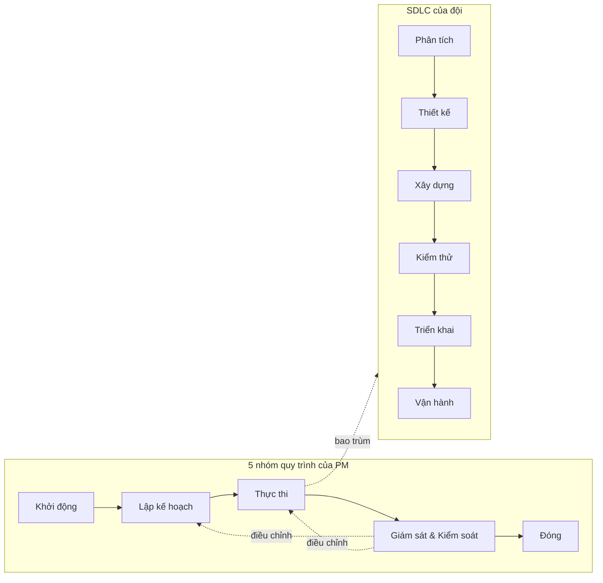

# Chương 3: Vòng đời dự án phần mềm & các mô hình: Waterfall, Agile, Hybrid

## Mục tiêu học

- Kể được 5 nhóm quy trình quản lý dự án và các giai đoạn của vòng đời phát triển phần mềm (SDLC).
- Phân biệt được Waterfall, Agile (Scrum, Kanban, XP) và Hybrid qua cách xử lý phạm vi, thay đổi và bàn giao.
- Chấm điểm được một dự án theo tiêu chí chọn mô hình và giải thích lựa chọn.
- Ghép được loại hợp đồng (fixed-price, T&M, dedicated team) với mô hình phù hợp.

## 3.1 Hai cách nhìn một dự án: nhóm quy trình và vòng đời

Có hai trục tách biệt mà người mới hay trộn lẫn:

- **Nhóm quy trình quản lý dự án** — *PM làm gì*: Khởi động → Lập kế hoạch → Thực thi → Giám sát & Kiểm soát → Đóng. Đây là công việc của PM, chạy song song và lặp lại.
- **Vòng đời phát triển phần mềm (SDLC)** — *đội làm ra sản phẩm thế nào*: Phân tích → Thiết kế → Xây dựng → Kiểm thử → Triển khai → Vận hành.

Năm nhóm quy trình gồm:

| Nhóm | Câu hỏi | Kết quả tiêu biểu | Chương |
|---|---|---|---|
| **Khởi động** | Có nên làm không? Ai duyệt? | Business Case, Charter, stakeholder | 5–9 |
| **Lập kế hoạch** | Làm thế nào, bao lâu, tốn bao nhiêu? | WBS, lịch, ngân sách, PM Plan | 10–17 |
| **Thực thi** | Làm ra sản phẩm | Increment, tài liệu, release | 23–33 |
| **Giám sát & Kiểm soát** | Có đúng kế hoạch không? | Báo cáo, EVM, change control | 18–22, 34–38 |
| **Đóng** | Bàn giao và học | Nghiệm thu, lessons learned | 39–41 |

Điểm mấu chốt: các nhóm này **chồng lấn**. Ngay trong lúc thực thi, PM vẫn lập kế hoạch lại và giám sát. Sơ đồ tuần tự chỉ là cách trình bày.

## 3.2 Waterfall và V-model

**Waterfall** (thác nước) chia dự án thành các giai đoạn nối tiếp, giai đoạn sau chỉ bắt đầu khi giai đoạn trước hoàn tất và được duyệt: Yêu cầu → Thiết kế → Xây dựng → Kiểm thử → Triển khai.

**V-model** là biến thể gắn mỗi giai đoạn phát triển với một cấp kiểm thử đối ứng: yêu cầu ↔ UAT, thiết kế hệ thống ↔ kiểm thử hệ thống, thiết kế chi tiết ↔ kiểm thử tích hợp, code ↔ unit test. Ưu điểm: lập kế hoạch kiểm thử từ sớm.

**Khi nào dùng:** yêu cầu ổn định và được hiểu rõ; hợp đồng fixed-price với phạm vi chốt; yêu cầu tuân thủ cao (y tế, tài chính, hạ tầng); môi trường ít thay đổi.

**Khi nào KHÔNG dùng:** yêu cầu chưa rõ; thị trường đổi nhanh; cần phản hồi người dùng sớm.

**Điểm mạnh:** kế hoạch, ngân sách và hợp đồng rõ; tài liệu đầy đủ, dễ kiểm toán. **Điểm yếu:** phát hiện sai yêu cầu muộn (khi kiểm thử hoặc UAT); thay đổi tốn kém; giá trị chỉ đến ở cuối.

## 3.3 Agile: tư duy và các khung làm việc

**Agile** không phải một quy trình mà là một **tư duy** được nêu trong *Agile Manifesto* (2001) với bốn giá trị: cá nhân và tương tác hơn quy trình và công cụ; phần mềm chạy được hơn tài liệu đầy đủ; hợp tác với khách hơn đàm phán hợp đồng; phản hồi với thay đổi hơn bám theo kế hoạch. Vế bên phải vẫn có giá trị, nhưng vế bên trái được ưu tiên hơn.

Mười hai nguyên tắc đi kèm có thể tóm thành sáu ý: (1) giao phần mềm chạy được sớm và thường xuyên; (2) chào đón thay đổi, kể cả muộn; (3) nhà kinh doanh và đội phát triển làm việc cùng nhau hằng ngày; (4) đội tự tổ chức, người có động lực và được tin tưởng; (5) đơn giản — tối đa hoá phần việc **không** phải làm; (6) định kỳ nhìn lại và cải tiến.

Ba khung phổ biến:

| Khung | Cốt lõi | Nhịp | Hợp khi | Chương |
|---|---|---|---|---|
| **Scrum** | Sprint cố định 1–4 tuần; vai trò PO/SM/Dev; sự kiện Planning–Daily–Review–Retro | Sprint | Phát triển sản phẩm, yêu cầu thay đổi | Ch23 |
| **Kanban** | Hiển thị công việc, giới hạn WIP, tối ưu dòng chảy | Liên tục | Bảo trì, hỗ trợ, việc đến ngẫu nhiên | Ch25 |
| **XP** (Extreme Programming) | Thực hành kỹ thuật: TDD, pair programming, CI, refactor | Vòng ngắn | Nâng chất lượng kỹ thuật | Ch29 |

**Điểm mạnh của Agile:** giá trị đến sớm, phản hồi nhanh, rủi ro nhận diện sớm. **Điểm yếu:** khó cam kết giá/ngày cố định cho toàn bộ phạm vi; đòi hỏi khách tham gia thường xuyên; dễ trôi nếu thiếu kỷ luật ưu tiên.

## 3.4 Hybrid: khung Waterfall, ruột Agile

**Hybrid** kết hợp hai bên: dùng **khung kế hoạch cấp cao theo kiểu Waterfall** (giai đoạn, mốc, ngân sách, kiểm soát thay đổi) và **thực thi bên trong theo Agile** (sprint, backlog, demo).

Vì sao Hybrid phổ biến trong công ty outsource: khách hàng cần biết **tổng chi phí và mốc** để duyệt ngân sách và thanh toán; nhưng yêu cầu chi tiết thay đổi khi khách nhìn thấy sản phẩm. Hybrid cho cả hai: hợp đồng chốt phạm vi ở mức epic, phạm vi chi tiết được tinh chỉnh qua backlog trong ngân sách cố định.

Có một biến thể xấu cần tránh: **"Water-Scrum-Fall"** — phân tích yêu cầu kiểu Waterfall trước 3 tháng, chạy sprint ở giữa như một dây chuyền, rồi test/UAT kiểu Waterfall ở cuối. Bề ngoài có sprint nhưng phản hồi vẫn đến muộn. Cách tránh: có demo với khách mỗi sprint, kiểm thử chạy trong sprint, UAT theo từng release chứ không dồn cuối. (Ch26 quay lại.)

| Khía cạnh | Waterfall | Agile | Hybrid |
|---|---|---|---|
| Phạm vi | Chốt từ đầu | Đổi liên tục theo backlog | Chốt ở mức epic, chi tiết đổi trong ngân sách |
| Kế hoạch | Chi tiết toàn dự án | Chi tiết theo sprint, roadmap mở | Baseline cấp cao + kế hoạch sprint |
| Thay đổi | Qua CCB, tốn kém | Chào đón | Trong phạm vi: backlog; ngoài phạm vi: CR |
| Giao hàng | Cuối | Mỗi sprint | Mỗi sprint lên staging; release theo mốc |
| Đo tiến độ | % hoàn thành, EVM | Velocity, burndown | Cả hai |
| Vai trò PM | Kiểm soát kế hoạch | Hỗ trợ đội, gỡ vướng | Cầu nối khung kế hoạch và đội Agile |

## 3.5 Chọn mô hình: bảng tiêu chí

Không có mô hình "tốt nhất"; có mô hình **phù hợp bối cảnh**. Tám tiêu chí:

1. **Độ ổn định yêu cầu** — ổn định → Waterfall; hay đổi → Agile.
2. **Hợp đồng & ngân sách** — cần giá và mốc cố định → Waterfall/Hybrid.
3. **Mức tham gia của khách** — tham gia thường xuyên → Agile; ít → Waterfall/Hybrid.
4. **Quy mô & độ phức tạp** — lớn cần phối hợp → khung kế hoạch (Hybrid).
5. **Rủi ro kỹ thuật/bất định** — cao → Agile (học sớm).
6. **Tuân thủ pháp lý** — cao → Waterfall/Hybrid (tài liệu, vết kiểm toán).
7. **Kinh nghiệm của đội** — dùng cái đội đã quen, trừ khi có lý do đổi.
8. **Nhu cầu giá trị sớm** — cần ra thử sớm → Agile.

📎 Mẫu đầy đủ: `templates/pm-plan/methodology-decision-matrix.md`

Trích kết quả chấm FoodNow (trọng số 20/20/10/10/15/10/10/5):

| Mô hình | Điểm có trọng số |
|---|---|
| Waterfall | 3,05 |
| Agile | 3,90 |
| **Hybrid** | **4,20** |

Hybrid thắng không nhờ "đa năng" mà vì FoodNow vừa cần trần 2,4 tỷ và mốc thanh toán (kéo về Waterfall) vừa có yêu cầu sẽ đổi và rủi ro tích hợp (kéo về Agile). **Đừng dùng bảng như phép màu**: nếu hai mô hình cách nhau dưới 0,3 điểm, ưu tiên cái đội quen.

### Hợp đồng × mô hình

| Hợp đồng | Bản chất | Hợp mô hình | Rủi ro cho nhà thầu |
|---|---|---|---|
| **Fixed-price** | Giá cố định cho phạm vi cố định | Waterfall; Hybrid nếu chốt phạm vi từng giai đoạn | Scope creep ăn biên lợi nhuận |
| **T&M** (time & material) | Trả theo công thực tế | Agile, Hybrid | Khách khó dự báo tổng chi phí |
| **Dedicated team** | Khách thuê đội chuyên trách theo tháng | Agile | Phụ thuộc vào một khách |

Nếu hợp đồng fixed-price nhưng khách muốn "Agile", hãy cảnh giác: ai chịu rủi ro khi backlog phình? Thường là nhà thầu. Giải pháp của FoodNow: khung fixed-price theo giai đoạn (MVP, R1, R2) + change request tính T&M (Ch20, Ch21).

## Tình huống FoodNow

Cuối tháng 12/2025, Hà và Dũng ngồi lại chọn mô hình. Dũng nghiêng về Scrum thuần: "Yêu cầu sẽ đổi, mình cứ chạy sprint." Hà nhắc: anh Bảo cần con số ngân sách 2,4 tỷ để trình hội đồng quản trị và muốn thanh toán theo mốc. Cả hai chấm bảng tiêu chí riêng rồi so kết quả. Điểm lệch nhau ở tiêu chí 2 (hợp đồng) và 6 (tuân thủ thanh toán): Dũng chấm Agile 4 cho hợp đồng, Hà chấm 2 vì "không ai duyệt ngân sách nếu chỉ nói 'chạy sprint đến khi hết tiền'".

Kết quả: Hybrid 4,20 so với Agile 3,90. Hà giữ khung Waterfall cho ngân sách và mốc (MVP → R1 → R2, baseline scope/lịch/chi phí) và bên trong dùng Scrum sprint 2 tuần, có Sprint 0 chuẩn bị. Chị thêm một điều khoản vào kế hoạch: **phạm vi trong giai đoạn đổi qua backlog, ngoài giai đoạn qua Change Request**. Dũng đồng ý vì đội vẫn được sprint, và chị Châu vẫn được đổi thứ tự ưu tiên hằng sprint.

## Bài tập

**Bài 1 (làm ra sản phẩm) — Chọn mô hình.** Dùng ma trận (chấm 1–5, trọng số tự đặt, tổng 100%) để chọn mô hình cho 4 dự án; nêu điểm số và lý do:

- (a) Phần mềm điều khiển thiết bị y tế, yêu cầu ổn định, phải qua kiểm định.
- (b) Web bán hàng của startup, chưa biết khách muốn gì.
- (c) Nâng cấp hệ thống kế toán cho ngân hàng, hợp đồng fixed-price, phạm vi chốt.
- (d) Đội hỗ trợ và sửa lỗi nhỏ cho một app đang chạy, việc đến hằng ngày.

**Bài 2 (tình huống ngắn).** Khách hàng ký hợp đồng fixed-price 1,2 tỷ nhưng yêu cầu "làm Agile, tính năng gì tuần nào tôi cũng có thể đổi". Bạn là PM. Nêu rủi ro và hai cách xử lý.

**Bài 3 (làm ra sản phẩm).** Vẽ sơ đồ Mermaid vòng đời Hybrid cho dự án của bạn: các mốc cấp cao và các sprint bên trong.

Gợi ý đáp án

**Bài 1:** (a) Waterfall/V-model — tuân thủ, yêu cầu ổn định. (b) Agile (Scrum) — bất định cao, cần phản hồi. (c) Waterfall hoặc Hybrid nhẹ — hợp đồng và phạm vi chốt. (d) Kanban — việc đến ngẫu nhiên, không có sprint hợp lý.

**Bài 2:** Rủi ro: phạm vi phình mà giá cố định, nhà thầu chịu lỗ; khách hiểu "Agile" là "miễn phí thay đổi". Cách A: chốt phạm vi ở mức epic với "ngân sách năng lực" cố định (số story point/công), thay đổi được nhưng **hoán đổi** (thêm cái này thì bỏ cái kia). Cách B: chuyển sang hợp đồng khung + T&M có trần. Cả hai cần quy trình CR rõ. Sai lầm: nhận "Agile" mà không đổi cách tính tiền.

## Sai lầm thường gặp

1. **Sai lầm:** Chọn mô hình theo trào lưu ("công ty nào cũng Agile"). → **Hậu quả:** áp không hợp bối cảnh, đội mất thời gian mà không có lợi ích. **Cách khắc phục:** chấm điểm theo tiêu chí và ghi lý do.
2. **Sai lầm:** Nhầm "Agile" với "không cần kế hoạch/tài liệu". → **Hậu quả:** trôi tiến độ, không ai duyệt ngân sách. **Cách khắc phục:** Agile vẫn có kế hoạch (roadmap, release) — chỉ lập theo mức chi tiết phù hợp.
3. **Sai lầm:** Water-Scrum-Fall. → **Hậu quả:** phản hồi đến muộn, lỗi yêu cầu phát hiện ở UAT. **Cách khắc phục:** demo mỗi sprint, test trong sprint, UAT theo release.
4. **Sai lầm:** Fixed-price + Agile mà không có cơ chế thay đổi. → **Hậu quả:** nhà thầu lỗ, quan hệ căng. **Cách khắc phục:** khung Hybrid + CR T&M.
5. **Sai lầm:** Đổi mô hình giữa chừng không chuẩn bị. → **Hậu quả:** đội rối, mất tốc độ. **Cách khắc phục:** đổi ở mốc chuyển giai đoạn, kèm đào tạo và thống nhất working agreement (Ch08).

## Tóm tắt & tiếp theo

- Năm nhóm quy trình mô tả **việc của PM**; SDLC mô tả **việc của đội**; hai trục này chạy song song.
- Waterfall mạnh về kế hoạch và tuân thủ, yếu ở phản hồi muộn; Agile mạnh ở giá trị sớm, yếu ở cam kết cố định; Hybrid ghép khung kế hoạch với thực thi Agile.
- Chọn mô hình bằng tiêu chí và ghi lý do; kiểm tra hợp đồng cho khớp.
- FoodNow chọn Hybrid: khung fixed-price theo giai đoạn + Scrum sprint 2 tuần + CR tính T&M.

Chương 4 giới thiệu **bộ khung kiến thức, chứng chỉ và lộ trình nghề PM**, để bạn biết nên học gì tiếp theo và không đi vào ngõ cụt chứng chỉ.
