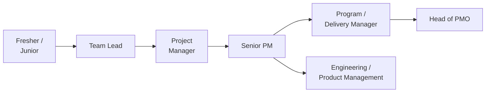
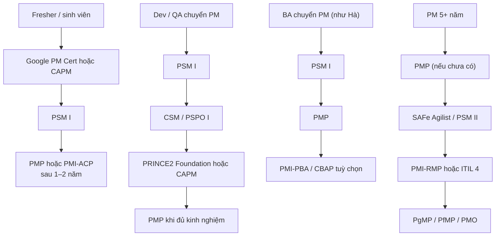

# Chương 4: Bộ khung kiến thức, chứng chỉ & lộ trình nghề PM

## Mục tiêu học

- Phân biệt được PMBOK, PRINCE2, Scrum Guide và ISO 21500/21502 về mục đích và cách dùng.
- Mô tả được lộ trình nghề từ Fresher đến Head of PMO và tự đặt mình vào đúng bậc.
- Chọn được chứng chỉ phù hợp bằng ma trận quyết định thay vì chạy theo số lượng.
- Lập được kế hoạch chứng chỉ 24 tháng có lịch học, ngân sách và mốc dự phòng.

## 4.1 Các bộ khung kiến thức

Khi bạn đọc tài liệu PM, mỗi nguồn dùng từ vựng hơi khác. Biết vai trò của từng bộ khung giúp bạn không rối.

| Bộ khung | Là gì | Điểm mạnh | Hạn chế | Hợp với ai |
|---|---|---|---|---|
| **PMBOK Guide** (PMI) | Bộ kiến thức chung về quản lý dự án; các phiên bản gần đây bổ sung cách tiếp cận theo nguyên tắc và giá trị, nhìn dự án như hệ thống tạo giá trị | Từ vựng chung toàn cầu; phủ rộng; nền của PMP | Là "bộ kiến thức", không phải phương pháp từng bước | Mọi PM |
| **PRINCE2** | Phương pháp quản lý dự án có cấu trúc: nguyên tắc, chủ đề, quy trình, cơ chế theo giai đoạn và ngoại lệ | Rõ vai trò, kiểm soát giai đoạn; tốt cho khu vực công, châu Âu | Có thể nặng nếu áp máy móc | PM ở môi trường cần kiểm soát chặt |
| **Scrum Guide** | Định nghĩa Scrum: vai trò, sự kiện, artifact | Ngắn, rõ, miễn phí | Chỉ nói về Scrum, không về ngân sách/hợp đồng | Đội Agile; PM Hybrid |
| **ISO 21500 / 21502** | Chuẩn quốc tế về hướng dẫn quản lý dự án | Được công nhận; dùng cho tuân thủ | Ít chi tiết thực hành | Tổ chức cần chuẩn hoá |

Cách dùng thực tế: PMBOK cho từ vựng và phạm vi kiến thức, Scrum Guide cho phần Agile, PRINCE2 nếu khách hàng yêu cầu, ISO khi cần chuẩn hoá tổ chức. Sách này diễn đạt lại bằng lời riêng và luôn nêu nguồn ở Phụ lục G.

### Bảng đối chiếu thuật ngữ

| PMBOK | Agile | Cách gọi trong sách |
|---|---|---|
| Project Charter | Vision / Product Charter | Project Charter |
| WBS | Epic → Feature → Story | WBS |
| Schedule baseline | Roadmap / Release plan | Lịch & roadmap |
| Sponsor | Product Owner (một phần) | Sponsor / PO |
| Issue log | Impediment list | RAID (Issue) |
| Lessons learned | Retrospective | Retro / lessons learned |

## 4.2 Lộ trình nghề PM

| Bậc | Trách nhiệm chính | Bằng chứng để lên bậc |
|---|---|---|
| Fresher / Junior | Làm việc được giao, học quy trình | Hoàn thành đúng hạn, biết hỏi |
| Team Lead | Điều phối đội 3–6 người, sprint | Đội chạy ổn, ít blocker |
| Project Manager | Dẫn dự án end-to-end 8–15 người | Ít nhất một dự án đạt mục tiêu |
| Senior PM | Dự án lớn/khó, dẫn dắt PM khác | Nhiều dự án thành công, có người kèm |
| Program / Delivery Manager | Nhiều dự án liên quan | Quản lý được phụ thuộc chéo đội |
| Head of PMO | Chuẩn, phương pháp, danh mục | Xây được PMO có tác động |

Mức lương và thu nhập chỉ nêu định tính: **tăng theo phạm vi trách nhiệm**, thay đổi theo công ty, thị trường và thời điểm; hãy tự tra khi cần. Đừng đặt mục tiêu theo con số trong sách.

📎 Mẫu đầy đủ: `templates/pm-plan/pm-career-roadmap.md`

## 4.3 Hệ thống chứng chỉ PM

> **Kiểm tra lại trên trang chính thức của tổ chức cấp — thông tin có thể đã đổi.** Sách này biên soạn tháng 9/2026; điều kiện, hình thức thi, chi phí, thời hạn hiệu lực và tên gọi thay đổi thường xuyên. Sách chỉ nêu mức chi phí tương đối ($ / $$ / $$$), số tuần học là **ước lượng của tác giả**, không nêu mức lương cụ thể.

### Nguyên tắc trước khi chọn

- **Chứng chỉ không thay thế kinh nghiệm.** Nhà tuyển dụng cần cả hai; kinh nghiệm dẫn dắt thật không mua được bằng đề thi.
- **Chọn theo mục tiêu nghề và thị trường tuyển dụng**, không theo số lượng. Ba chứng chỉ đúng hướng tốt hơn mười chứng chỉ rời rạc.
- **Tính chi phí gia hạn** ngay từ đầu; chứng chỉ có gia hạn định kỳ là cam kết dài hạn.

### Bản đồ 5 nhóm chứng chỉ

| Nhóm | Mục đích | Chứng chỉ tiêu biểu |
|---|---|---|
| **1. PM tổng quát (Predictive/Hybrid)** | Nền tảng PM được công nhận rộng | PMI: CAPM, PMP, PgMP, PfMP · PRINCE2 Foundation/Practitioner · IPMA Level D/C/B/A · CompTIA Project+ · Google Project Management Certificate · ISO 21500 (nhận biết) |
| **2. Agile & Scrum** | Điều hành dự án Agile | Scrum.org: PSM I/II/III, PSPO, PAL-E, PSK · Scrum Alliance: CSM, CSPO, A-CSM, CSP-SM · PMI-ACP · Kanban University: KMP · AgilePM |
| **3. Scale, Program & Enterprise Agile** | Nhiều đội, tổ chức lớn | SAFe: Agilist, Scrum Master, POPM, RTE · Disciplined Agile · Scrum@Scale · MSP |
| **4. Vận hành, DevOps, quản trị dịch vụ IT** | Nối dự án với vận hành | ITIL 4 Foundation → Managing Professional · DevOps Foundation · AWS Cloud Practitioner / Azure AZ-900 / Google Cloud Digital Leader · ISTQB Foundation |
| **5. Chuyên sâu bổ trợ** | Rủi ro, lịch, BA, chất lượng, bảo mật, PMO | PMI-RMP · PMI-SP · PMI-PBA / CBAP–CCBA · Lean Six Sigma · ISO/IEC 27001 · PMI-PMOCP · CISSP/Security+ (mức nhận biết) |

📎 Mẫu đầy đủ: `templates/pm-plan/pm-certification-map.csv` (mỗi chứng chỉ một "thẻ" theo cùng khung; đầy đủ ở Phụ lục H).

### Bốn cấp độ

| Cấp | Đối tượng | Mục tiêu | Ứng viên (chọn 1–2) |
|---|---|---|---|
| **L0 — Nhập môn** | Sinh viên, chưa có kinh nghiệm dự án | Có từ vựng và tư duy nền | CAPM, Google PM Certificate, PSM I/CSM, ITIL 4 Foundation, chứng chỉ cloud cơ bản |
| **L1 — Junior PM / Team Lead** | Điều phối đội 1–3 năm | Điều hành đội và sprint | PSM I, CSM, PMI-ACP (khi đủ điều kiện), PRINCE2 Foundation, ISTQB Foundation |
| **L2 — Project Manager** | Đã dẫn dự án end-to-end | Được công nhận toàn diện | PMP, PRINCE2 Practitioner, PSM II, SAFe Agilist/SSM, ITIL 4 Foundation |
| **L3 — Senior PM / Program / PMO** | Nhiều dự án/đội | Chiến lược, danh mục, tổ chức | PgMP, PfMP, PMI-RMP, PMI-PMOCP, SAFe RTE, IPMA C/B, MSP |

Điều kiện chuyển cấp **không** dựa số năm cứng trong sách; hãy theo điều kiện chính thức của từng chứng chỉ.

### Lộ trình theo persona

Theo bối cảnh công ty:

- **Outsource / xuất khẩu phần mềm:** ưu tiên PMP, PSM/CSM, ITIL 4 Foundation, cloud cơ bản.
- **Dự án khu vực công / châu Âu / Anh / Úc:** cân nhắc PRINCE2.
- **Doanh nghiệp lớn dùng SAFe:** SAFe Agilist / Scrum Master.

### Ma trận quyết định "có nên thi chứng chỉ X?"

Chấm 1–5 tám tiêu chí theo trọng số: mục tiêu nghề (20%), tin tuyển dụng (15%), yêu cầu khách/đối tác (10%), mức phủ công việc (15%), chi phí (10%), điều kiện đăng ký (10%), hạn gia hạn (5%), giá trị dài hạn (15%). Đọc **ít nhất 20 tin tuyển dụng thật** trước khi chấm tiêu chí 2.

📎 Mẫu đầy đủ: `templates/pm-plan/certification-decision-matrix.md`

Ví dụ điền sẵn:

| Người | Chứng chỉ | Điểm | Quyết định |
|---|---|---|---|
| Hà (BA chuyển PM) | PSM I | 4,35 | Thi trước |
| Hà | PMP | 4,10 | Sau ~12 tháng |
| Dũng (Tech Lead) | CSM | 3,35 | Hoãn, chỉ thi nếu công ty yêu cầu |
| Lan (BA) | PMI-PBA | 3,40 | Đợi kế hoạch chuyên sâu |

### Kế hoạch ôn thi mẫu

Kế hoạch 8 tuần cho PSM I và 12 tuần cho PMP; mỗi tuần có mục tiêu, tài liệu chính thức, chương sách liên quan, luyện tập và ôn lỗi (error log). Quy tắc quan trọng: **chỉ thi khi 3 đề thử liên tiếp vượt ngưỡng tự đặt**; có kế hoạch dự phòng nếu trượt; có kế hoạch gia hạn ngay khi đạt.

📎 Mẫu đầy đủ: `templates/pm-plan/certification-study-plan.md`

### Cảnh báo đạo đức & thực tế

- **Không dùng "braindump"/đề rò rỉ.** Vi phạm đạo đức và điều khoản thi; có thể bị thu hồi chứng chỉ.
- **Không nhờ người thi hộ.** Hậu quả nặng, kể cả cấm thi.
- **Chứng chỉ ≠ năng lực.** Người phỏng vấn giỏi sẽ hỏi bạn xử lý tình huống thật.
- **Đừng dồn chứng chỉ khi chưa có kinh nghiệm.** Chứng chỉ cấp cao sẽ vô nghĩa nếu bạn chưa gặp bối cảnh của nó.
- **Ghi trung thực kinh nghiệm khi đăng ký.** Tổ chức cấp có thể kiểm tra/audit hồ sơ.
- **Tính chi phí gia hạn** trước khi thi.

## Tình huống FoodNow

Tháng 12/2025, chị Hà (6 năm kinh nghiệm, từng là BA) cân nhắc PMP hay PSM I. Bạn bè trong công ty khuyên "có PMP thì mới thành PM thật". Hà không chọn theo lời khuyên; chị mở ma trận và chấm.

Chị đọc 22 tin tuyển dụng PM phần mềm ở Hà Nội: nhiều tin nhắc PMP, và một số công ty Agile nhắc PSM/CSM. Chị chấm PSM I 4,35 và PMP 4,10. PMP chỉ thua nhờ chi phí và hồ sơ: chị cần chứng minh giờ dẫn dự án trong hồ sơ đăng ký và cần ngân sách gia hạn. PSM I rẻ, nhanh (8 tuần), phủ sát cách làm Hybrid ở FoodNow, và tài liệu chính thức miễn phí.

Hà quyết định: **PSM I trước (tháng 3–5/2026), PMP sau khoảng 12 tháng** khi FoodNow MVP xong và hồ sơ giờ dẫn dự án đủ. Chị ghi quyết định và ngày vào file kế hoạch, và dặn mình: chỉ đặt lịch thi khi 3 đề thử liên tiếp vượt 85%. Lan (BA) hỏi có nên thi PMP luôn không; Hà đưa file ma trận cho Lan tự chấm — kết quả PMI-PBA 3,40 khiến Lan hoãn.

## Bài tập

**Bài 1 (làm ra sản phẩm) — Kế hoạch chứng chỉ 24 tháng.** Lập kế hoạch cho bản thân: (a) chọn **không quá 3** chứng chỉ, dùng ma trận quyết định (có bảng điểm); (b) lịch học theo tuần cho chứng chỉ đầu tiên; (c) ngân sách (dùng mức $ tương đối hoặc con số bạn tự tra từ trang chính thức, ghi ngày tra); (d) mốc thi dự phòng nếu trượt; (e) kế hoạch gia hạn.

**Bài 2 (tình huống ngắn).** Một người bạn có 8 năm làm Dev, chưa từng dẫn dự án, muốn thi PMP "cho nhanh lên PM". Bạn tư vấn thế nào?

**Bài 3.** Chọn 3 tin tuyển dụng PM thật; liệt kê chứng chỉ được nhắc và so với ma trận của bạn.

Gợi ý đáp án Bài 2

Hỏi lại: PMP thường yêu cầu bằng chứng kinh nghiệm dẫn dự án theo quy định chính thức — bạn có đủ chưa? Chứng chỉ không thay thế kinh nghiệm. Lộ trình gợi ý: (1) xin dẫn một nhóm nhỏ hoặc một mảng trong dự án hiện tại (làm Team Lead); (2) học PSM I để hiểu vận hành đội; (3) sau khi có giờ dẫn dự án và ít nhất một dự án hoàn tất, cân nhắc PMP. Lưu ý: kiểm tra điều kiện chính thức, không kê khai sai kinh nghiệm.

## Sai lầm thường gặp

1. **Sai lầm:** Săn nhiều chứng chỉ vì "hồ sơ đẹp". → **Hậu quả:** tốn tiền, không có trọng tâm, người phỏng vấn hỏi tình huống thì lúng túng. **Cách khắc phục:** chọn ≤ 3 chứng chỉ theo mục tiêu nghề.
2. **Sai lầm:** Học để đậu thay vì học để hiểu. → **Hậu quả:** quên sau 3 tháng, không áp dụng được. **Cách khắc phục:** gắn mỗi chủ đề với việc thật trong dự án; dùng error log.
3. **Sai lầm:** Dùng braindump. → **Hậu quả:** có thể bị huỷ kết quả, mất uy tín. **Cách khắc phục:** chỉ luyện từ đề thử hợp pháp và tài liệu chính thức.
4. **Sai lầm:** Quên chi phí và hạn gia hạn. → **Hậu quả:** chứng chỉ hết hiệu lực sau vài năm. **Cách khắc phục:** ghi lịch và ngân sách duy trì ngay khi đạt.
5. **Sai lầm:** Dựa vào thông tin cũ trong sách/blog. → **Hậu quả:** đăng ký sai điều kiện, học sai đề cương. **Cách khắc phục:** luôn đối chiếu với trang chính thức.

## Tóm tắt & tiếp theo

- PMBOK cho từ vựng và phạm vi kiến thức, PRINCE2 cho phương pháp có kiểm soát, Scrum Guide cho Scrum, ISO cho chuẩn hoá.
- Lộ trình: Fresher → Team Lead → PM → Senior PM → Program/Delivery Manager → Head of PMO; mỗi bậc cần bằng chứng, không chỉ chứng chỉ.
- Chọn chứng chỉ bằng ma trận 8 tiêu chí, đọc ≥ 20 tin tuyển dụng; chứng chỉ không thay thế kinh nghiệm.
- Luôn kiểm tra lại thông tin trên trang chính thức; tuyệt đối không dùng braindump.

Hết Phần 0. Chương 5 bước vào **khởi động dự án**: làm Business Case để thuyết phục Sponsor và viết **Project Charter** để chính thức hoá dự án.
