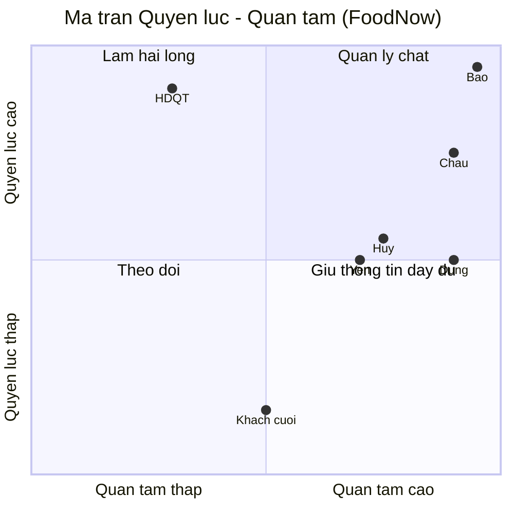

# Chương 6: Stakeholder & Kế hoạch giao tiếp

## Mục tiêu học

- Nhận diện được stakeholder bằng checklist 8 nhóm, kể cả những người "ẩn".
- Xếp được stakeholder vào ma trận Quyền lực–Quan tâm và chọn chiến lược cho từng ô.
- Lập được Stakeholder Register và ma trận RACI đúng quy tắc mỗi việc một "A".
- Viết được kế hoạch giao tiếp và quy tắc leo thang có hạn phản hồi cụ thể.

## 6.1 Stakeholder là ai

**Stakeholder** (các bên liên quan) là mọi cá nhân hoặc nhóm có thể **ảnh hưởng** đến dự án hoặc **bị ảnh hưởng** bởi dự án. Nhiều dự án phần mềm thất bại không vì kỹ thuật mà vì bỏ sót một người có quyền chặn — hoặc quyền làm dự án vô nghĩa.

Checklist 8 nhóm để rà soát (không bỏ nhóm nào):

| # | Nhóm | Ví dụ FoodNow |
|---|---|---|
| 1 | Nhà tài trợ / ra quyết định ngân sách | Bảo (CEO), Hội đồng quản trị |
| 2 | Chủ sản phẩm / đại diện nghiệp vụ | Châu (PO) |
| 3 | Người dùng cuối | Khách hàng, nhà hàng, tài xế |
| 4 | Đội dự án | Dũng, Lan, Nam, Mai Anh, Ánh… |
| 5 | Vận hành và hỗ trợ | CS Manager (Huy), đội hạ tầng |
| 6 | Bên thứ ba / vendor / đối tác | PayEasy (Yến), nhà cung cấp SMS, bản đồ |
| 7 | Pháp lý, tuân thủ, kiểm toán | Quy định bảo vệ dữ liệu cá nhân, ngân hàng đối tác |
| 8 | Lãnh đạo tổ chức của chính bạn | Giám đốc BrightSoft |

Bốn câu hỏi giúp lộ người ẩn: *Ai sẽ phải vận hành sản phẩm sau go-live? Ai sẽ nhận cuộc gọi khi hệ thống lỗi? Ai bị thay đổi quy trình làm việc? Ai có thể nói "không" ở phút chót?* Nếu câu trả lời là người chưa xuất hiện trong danh sách, hãy mời họ ngay.

## 6.2 Ma trận Quyền lực–Quan tâm và chiến lược

Ma trận **Mendelow** xếp stakeholder theo hai trục: **quyền lực** (khả năng ảnh hưởng đến kết quả) và **quan tâm** (mức họ bị ảnh hưởng, muốn biết).

| Ô | Quyền lực | Quan tâm | Chiến lược | FoodNow |
|---|---|---|---|---|
| **Quản lý chặt** | Cao | Cao | Cộng tác sát, họp thường xuyên, tham gia quyết định | Bảo, Châu |
| **Làm hài lòng** | Cao | Thấp | Thông tin ngắn, đúng lúc; không làm phiền nhưng không để bất ngờ | HĐQT, Giám đốc BrightSoft |
| **Giữ thông tin đầy đủ** | Thấp–vừa | Cao | Cập nhật đều, lấy phản hồi | Dũng, Lan, Nam, Yến, Huy |
| **Theo dõi** | Thấp | Thấp | Theo dõi tối thiểu | Khách hàng cuối (giai đoạn đầu) |

Lưu ý: vị trí **thay đổi theo thời gian**. Người ở ô "Theo dõi" ở tuần 4 có thể ở ô "Quản lý chặt" ở tuần 30 (UAT). Xem lại ma trận mỗi tháng.

## 6.3 Stakeholder Register

**Stakeholder Register** là bảng ghi từng stakeholder: vai trò, quyền lực, quan tâm, thái độ, chiến lược, người phụ trách, kênh, tần suất. Nó là tài liệu sống và **nhạy cảm** (có ghi thái độ), nên chỉ chia sẻ trong đội PM.

Cột nên có: ID · Tên · Tổ chức · Vai trò · Quyền lực (1–5) · Quan tâm (1–5) · Ô Mendelow · Thái độ · Chiến lược · Người phụ trách · Kênh · Tần suất · Ngày thêm · Ghi chú.

📎 Mẫu đầy đủ: `templates/stakeholder-comms/stakeholder-register.csv`

Trích 3 dòng (từ 15 dòng trong mẫu):

| ID | Tên | Vai trò | Quyền lực | Quan tâm | Chiến lược |
|---|---|---|---|---|---|
| S01 | Trần Quốc Bảo | Sponsor / CEO | 5 | 5 | Họp Sponsor hằng tuần, không bất ngờ |
| S07 | Cao Thị Yến | Vendor PayEasy | 3 | 4 | Đồng bộ hằng tuần, chốt ngày hứa bằng văn bản |
| S11 | Phan Quang Huy | CS Manager | 3 | 4 | Mời vào đội UAT, xây quy trình hỗ trợ |

## 6.4 Ma trận RACI

**RACI** phân vai cho từng hạng mục công việc: **R**esponsible (người làm), **A**ccountable (người chịu trách nhiệm cuối, quyết định), **C**onsulted (được hỏi ý kiến trước), **I**nformed (được báo sau).

Quy tắc bắt buộc:

1. **Mỗi việc đúng một "A".** Hai "A" nghĩa là không ai chịu trách nhiệm; không có "A" nghĩa là việc mồ côi. Nếu một người vừa làm vừa chịu trách nhiệm, ghi "A/R".
2. Mỗi việc có ít nhất một "R".
3. Ít "C" thôi — mỗi "C" là một cuộc họp thêm; chỉ hỏi người thật sự cần.
4. "I" không có quyền chặn.
5. Ma trận phải được **các bên xác nhận** (thường ở kickoff, Ch09) chứ không PM tự viết rồi dán lên.

📎 Mẫu đầy đủ: `templates/stakeholder-comms/raci-matrix.csv` (18 hạng mục × 10 vai)

Trích:

| Hạng mục | Hà | Châu | Bảo | Dũng | Lan |
|---|---|---|---|---|---|
| Duyệt mục tiêu và ngân sách | R | C | **A** | C | I |
| Ưu tiên backlog | C | **A** | I | C | R |
| Chọn kiến trúc và công nghệ | C | I | I | **A** | C |
| Lịch và dự báo ngày xong | **A** | C | I | R | C |
| Duyệt change request lớn | R | C | **A** | C | C |

## 6.5 Kế hoạch giao tiếp

Kế hoạch giao tiếp trả lời năm câu cho mỗi nhóm: **ai — cần gì — qua kênh nào — bao lâu một lần — ai phụ trách**. Nguyên tắc:

- **Một sự thật, một nơi**: quyết định, kế hoạch ở một kho (Confluence); chat chỉ để trao đổi nhanh.
- **Kênh theo mục đích**: quyết định → họp/email có văn bản; cập nhật → báo cáo; hỏi nhanh → chat; khủng hoảng → gọi điện rồi văn bản hoá.
- **Tần suất theo nhu cầu người nhận**, không theo thói quen người gửi.
- **Văn bản hoá sau họp**: email chốt 3–5 dòng trong 24 giờ.

📎 Mẫu đầy đủ: `templates/stakeholder-comms/communication-plan.md`

### Quy tắc leo thang (escalation)

Leo thang là chuyển một vấn đề lên người có đủ quyền giải quyết. Nó **không phải thất bại**; im lặng mới là thất bại. Quy tắc gồm cấp, điều kiện, người xử lý, hạn phản hồi:

| Cấp | Điều kiện | Ai xử lý | Hạn phản hồi |
|---|---|---|---|
| 1 | Blocker đội không tự gỡ trong 1 ngày | Tech Lead → PM | 1 ngày làm việc |
| 2 | Ảnh hưởng mốc hoặc > 5% ngân sách | PM → Sponsor | 2 ngày làm việc |
| 3 | Vượt quyền Sponsor / tranh chấp hợp đồng | Sponsor + Giám đốc BrightSoft | 3 ngày làm việc |

Mọi leo thang gồm năm phần: **vấn đề – tác động – phương án – khuyến nghị – hạn cần quyết định**. Đừng "ném" vấn đề lên mà không kèm đề xuất.

## Tình huống FoodNow

Sáng thứ Hai 26/01/2026, tuần 4. Trong lúc rà RAID, Lan nhắc: "Chị Hà, hôm qua em nghe anh Huy — CS Manager của FoodNow — hỏi bao giờ đội hỗ trợ được training. Em không thấy anh ấy trong danh sách." Hà mở Stakeholder Register: không có Huy. Chị tự hỏi lại bốn câu hỏi: *ai nhận cuộc gọi khi app lỗi?* — đội CS của anh Huy.

Chiều cùng ngày, Hà gọi cho anh Huy. Anh Huy nói thẳng: "Tôi chưa được ai mời họp. Nếu app go-live mà tôi không có quy trình hỗ trợ, đội tôi sẽ ngập ticket, và người bị hỏi sẽ là tôi." Hà nhận lỗi: "Em đã bỏ sót anh trong danh sách; hôm nay em bổ sung." Chị thêm Huy vào Register (S11, quyền lực 3, quan tâm 4, ô "Giữ thông tin đầy đủ"), mời anh vào đội UAT và cập nhật kế hoạch giao tiếp v1.1 (30/01/2026) với họp đồng bộ hằng tuần. Chị cũng thêm hạng mục "Quy trình hỗ trợ khách hàng" vào RACI với anh Huy là A.

Kết quả: phát hiện ở tuần 4 chỉ tốn 2 giờ họp. Nếu phát hiện ở tuần 35, có thể đã dẫn đến No-Go vì thiếu kịch bản hỗ trợ. Bài học của Hà: **rà lại danh sách stakeholder bằng bốn câu hỏi ở mỗi mốc lớn**, không chỉ lúc khởi động.

## Bài tập

**Bài 1 (làm ra sản phẩm) — Stakeholder Register.** Lập Register (≥ 10 dòng) cho dự án "hệ thống đặt lịch khám bệnh cho phòng khám": xếp vào ma trận Quyền lực–Quan tâm và nêu chiến lược cho từng người.

**Bài 2 (làm ra sản phẩm) — RACI.** Lập RACI cho 8 hạng mục của dự án trên, kiểm tra quy tắc mỗi việc một "A".

**Bài 3 (tình huống ngắn).** Bạn phát hiện một Trưởng phòng Pháp chế của khách hàng chưa được mời họp, dù dự án có xử lý dữ liệu bệnh nhân. Dự án đã chạy 8 tuần. Bạn làm gì trong 24 giờ đầu?

Gợi ý đáp án Bài 3

**Chẩn đoán:** thiếu stakeholder có quyền chặn (tuân thủ pháp lý), phát hiện muộn. **Việc trong 24 giờ:** (1) xin Sponsor giới thiệu rồi gọi trực tiếp để nghe yêu cầu; (2) thêm vào Register, RACI và RAID (rủi ro tuân thủ); (3) rà lại các quyết định đã chốt có chạm dữ liệu bệnh nhân. **Phương án:** A — mời họp và rà soát riêng (ưu: nhanh, rủi ro thấp); B — lập một buổi review tuân thủ chính thức (ưu: có dấu vết; nhược: tốn công). Khuyến nghị: A ngay, B trong 2 tuần. **Sai lầm:** giấu vì sợ mất mặt; hoặc tự suy đoán yêu cầu pháp lý. **Phòng ngừa:** dùng checklist 8 nhóm ở mỗi mốc lớn.

## Sai lầm thường gặp

1. **Sai lầm:** Lập Register một lần rồi cất. → **Hậu quả:** người mới xuất hiện, quan hệ đổi mà không ai biết. **Cách khắc phục:** xem lại hằng tháng và ở mỗi mốc lớn.
2. **Sai lầm:** Chỉ quan tâm người có quyền cao. → **Hậu quả:** người dùng và vận hành, tuy quyền thấp, phản đối ở go-live. **Cách khắc phục:** dùng đủ 8 nhóm; mời người vận hành từ sớm.
3. **Sai lầm:** RACI có hai "A" hoặc không có "A". → **Hậu quả:** việc bị đẩy qua lại hoặc bị bỏ quên. **Cách khắc phục:** kiểm bằng script/lọc bảng; mỗi việc đúng một "A".
4. **Sai lầm:** Giao tiếp theo thói quen người gửi (báo cáo 10 trang cho CEO). → **Hậu quả:** không ai đọc. **Cách khắc phục:** hỏi người nhận cần gì, ở dạng nào, bao lâu một lần.
5. **Sai lầm:** Leo thang muộn hoặc leo thang không kèm phương án. → **Hậu quả:** Sponsor bất ngờ hoặc phải tự nghĩ giải pháp. **Cách khắc phục:** quy tắc cấp + hạn, mẫu 5 phần.

## Tóm tắt & tiếp theo

- Stakeholder là ai ảnh hưởng hoặc bị ảnh hưởng; rà bằng 8 nhóm và 4 câu hỏi để tìm người "ẩn".
- Mendelow xếp bốn ô với bốn chiến lược; vị trí thay đổi theo thời gian.
- RACI: mỗi việc đúng một "A", ít "C", được xác nhận bởi các bên.
- Kế hoạch giao tiếp quy định ai–cần gì–kênh–tần suất–người phụ trách; leo thang có cấp, hạn và mẫu 5 phần.

Chương 7 xác định **phạm vi (scope)**: viết Scope Statement, cắt MVP và chặn scope creep từ đầu.
