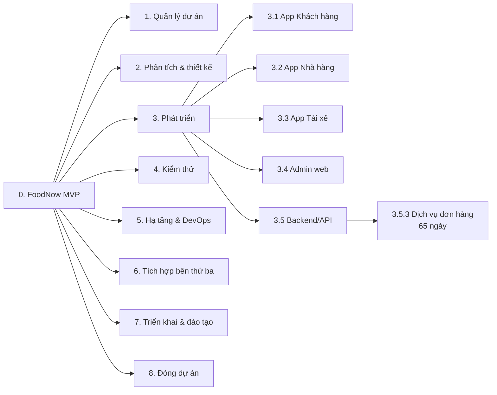

# Chương 10: WBS (Work Breakdown Structure)

## Mục tiêu học

- Giải thích được WBS là gì và không là gì; phân biệt WBS với danh sách việc theo thời gian.
- Áp dụng được quy tắc 100%, phân rã đến work package 8–80 giờ, đánh mã 1.1.2.
- Chọn được cách phân rã (theo deliverable, giai đoạn hay thành phần) phù hợp.
- Lập được WBS cho dự án Waterfall và cho Agile (Epic → Feature → Story).
- Nối được WBS với ước lượng và lịch.

## 10.1 WBS là gì, không là gì

**WBS** (Work Breakdown Structure — cấu trúc phân rã công việc) là cách chia **toàn bộ phạm vi** dự án thành các phần nhỏ dần, có thể ước lượng, giao và theo dõi. Ba điều cốt lõi:

1. WBS phân rã **deliverable** (sản phẩm bàn giao) chứ **không** phải danh sách hoạt động theo thứ tự thời gian. Câu hỏi để phân rã là "**cái gì** cần được tạo ra?" chứ không phải "làm **gì** trước, gì sau?".
2. WBS chứa **100% phạm vi**, kể cả quản lý dự án, kiểm thử, đào tạo. Cái không có trong WBS thì không nằm trong phạm vi.
3. WBS **không** có thời gian, người theo lịch, hay phụ thuộc. Những thứ đó thuộc lịch (Ch12).

| WBS | Danh sách việc / lịch |
|---|---|
| Danh từ: "App Khách hàng", "Dịch vụ đơn hàng" | Động từ: "Thiết kế", "Code", "Test" |
| Cấu trúc cây, không có thứ tự | Có thứ tự thời gian |
| Kiểm soát phạm vi | Kiểm soát tiến độ |
| Nền để ước lượng | Kết quả của ước lượng + phụ thuộc |

## 10.2 Quy tắc và kỹ thuật phân rã

**Quy tắc 100%**: tổng công việc của các nút con phải **bằng đúng** nút cha — không thiếu, không thừa. Nếu cha là "Backend" thì các con cộng lại phải gồm mọi việc Backend, và không có việc nằm ngoài mà vẫn thuộc Backend.

**Work package** (gói công việc) là **lá** của cây: đủ nhỏ để ước lượng và giao cho một người/nhóm chịu trách nhiệm. Quy tắc thực dụng: **8–80 giờ** (1–10 ngày) cho gói nhỏ, tối đa khoảng 2 tuần công của một người. Ở WBS cấp cao của FoodNow, một số gói lớn hơn (tới 65 ngày) vì tương ứng cả dịch vụ; chúng sẽ được chia thành story khi vào backlog.

**Mã hoá**: mỗi nút có mã phân cấp — `1`, `1.1`, `1.1.2` — ổn định và duy nhất. Mã cho phép cộng dồn và truy vết; không đổi khi có thay đổi nhỏ.

**Các cách phân rã:**

| Cách | Ví dụ | Khi nào dùng | Nhược điểm |
|---|---|---|---|
| **Theo deliverable/sản phẩm** | App Khách hàng, App Nhà hàng, Backend | Dự án nhiều thành phần độc lập | Dễ quên việc chung (kiểm thử, triển khai) |
| **Theo giai đoạn** | Phân tích, Thiết kế, Code, Test | Waterfall thuần | Cạnh tranh với phạm vi; khó theo dõi từng sản phẩm |
| **Theo thành phần/tầng** | UI, API, DB | Đội chuyên hoá theo tầng | Khó giao tính năng end-to-end |
| **Kết hợp** | Cấp 2 theo giai đoạn/chức năng, cấp 3 theo deliverable | Thực tế nhất | Cần thống nhất quy ước |

FoodNow dùng **kết hợp**: cấp 2 là 8 nhóm (Quản lý dự án, Phân tích & thiết kế, Phát triển, Kiểm thử, Hạ tầng, Tích hợp, Triển khai, Đóng), cấp 3 phân theo thành phần sản phẩm (App KH, App NH, App TX, Admin, Backend), cấp 4 là work package.

## 10.3 WBS Dictionary

**WBS Dictionary** (từ điển WBS) mô tả từng work package quan trọng: phạm vi, deliverable, tiêu chí hoàn thành, người chịu trách nhiệm, ước lượng, phụ thuộc, rủi ro. Chỉ viết cho gói **lớn hoặc rủi ro cao**; nếu viết cho mọi gói, không ai đọc.

Ví dụ gói 6.1.1 (Tích hợp PayEasy và chứng nhận): người chịu trách nhiệm Dũng; ước lượng 40 ngày **chưa gồm thời gian chờ chứng nhận của vendor**; rủi ro cao. Việc ghi rõ "chưa gồm thời gian chờ" giúp tránh hiểu nhầm khi vendor trễ (Ch21).

📎 Mẫu đầy đủ: `templates/wbs/wbs-dictionary.md`

## 10.4 WBS cho Waterfall và cho Agile

| | Waterfall / khung Hybrid | Agile |
|---|---|---|
| Đơn vị lá | Work package (ngày công) | User story (story point) |
| Cấu trúc | Deliverable → gói | **Epic → Feature → Story** |
| Ổn định | Baseline, đổi qua CR | Backlog sống, PO sắp xếp |
| Ước lượng | Ngày công / PERT | Story point / velocity |
| Dùng để | Ngân sách, lịch, hợp đồng | Lập kế hoạch sprint |

Trong Hybrid như FoodNow, hai cái cùng tồn tại: **WBS làm baseline** cho ngân sách và mốc, còn **backlog** là cách đội thực thi. Cần **ánh xạ**: mỗi work package (ví dụ 3.1.3 "Giỏ hàng và đặt đơn") tương ứng một nhóm story trong Epic E3. Khi backlog đổi trong phạm vi epic thì baseline không đổi; khi thêm epic mới thì đi qua change request (Ch20). Backlog và ưu tiên được học ở Ch24.

## 10.5 WBS → ước lượng → lịch

Ba tài liệu nối nhau:

1. **WBS** cho biết **cái gì** (66 work package).
2. **Ước lượng** (Ch11) cho biết **bao nhiêu công** mỗi gói; tổng là 1.927 ngày công.
3. **Lịch** (Ch12) sắp xếp các gói theo **phụ thuộc và nguồn lực** thành timeline.

Hai phép kiểm tra hữu ích ngay ở bước WBS:

- **Tổng WBS so với năng lực**: FoodNow có năng lực khoảng 12 FTE × 185 ngày = 2.220 ngày; WBS 1.927 ngày ≈ 87%. Phần 13% còn lại cho họp, nghỉ phép, học việc và phát sinh. Nếu WBS chiếm 100% năng lực thì lịch đã hỏng từ đầu.
- **Kiểm tra bằng khách hàng**: đưa WBS cho Sponsor và PO; hỏi "có gì bạn mong đợi mà không thấy ở đây?".

📎 Mẫu đầy đủ: `templates/wbs/FoodNow-WBS.md`, `templates/wbs/FoodNow-WBS.csv`

Trích cấp 2 của WBS FoodNow:

| Mã | Nhóm | Work package | Ngày công |
|---|---|---|---|
| 1 | Quản lý dự án | 5 | 186 |
| 2 | Phân tích và thiết kế | 8 | 227 |
| 3 | Phát triển | 27 | 937 |
| 4 | Kiểm thử | 7 | 277 |
| 5 | Hạ tầng và DevOps | 5 | 92 |
| 6 | Tích hợp bên thứ ba | 5 | 90 |
| 7 | Triển khai và đào tạo | 6 | 100 |
| 8 | Đóng dự án | 3 | 18 |
| | **Tổng** | **66** | **1.927** |

## Tình huống FoodNow

Tuần 5 (02–06/02/2026), sau khi chốt Scope Statement v1.0, Hà ngồi với Dũng, Lan và Nam ba buổi chiều để dựng WBS. Ban đầu Dũng đưa ra một danh sách phân rã theo giai đoạn: "Phân tích, Thiết kế, Code, Test, Deploy". Hà đề nghị đổi: "Nếu mình phân theo giai đoạn thì rất khó trả lời anh Bảo câu hỏi 'App Tài xế đang ở đâu?'." Cả nhóm chuyển sang cấu trúc kết hợp: 8 nhóm cấp 2, sản phẩm ở cấp 3.

Khi rà lại quy tắc 100%, Nam phát hiện: **không có work package nào cho kiểm thử hiệu năng và bảo mật**, và Lan chỉ ra thiếu **đào tạo người dùng và tài liệu vận hành**. Nếu không có bước này, hai hạng mục này sẽ trở thành "việc phát sinh" và ăn vào dự phòng. Kết quả là WBS baseline v1.0 có **66 work package, tổng 1.927 ngày công**, tương đương 87% năng lực đội. Hà lưu ý riêng với Sponsor: gói 6.1.1 (PayEasy) chưa tính thời gian chờ vendor — một dòng nhỏ giúp tránh tranh cãi sau này.

## Bài tập

**Bài 1 (làm ra sản phẩm) — WBS khách sạn nhỏ.** Lập WBS 4 cấp cho "website đặt phòng khách sạn nhỏ" (đội 5 người, 4 tháng): gồm ≥ 8 nhóm cấp 2, ≥ 25 work package, mã hoá đúng, tổng kiểm tra; viết WBS Dictionary cho 2 gói lớn nhất.

**Bài 2 (làm ra sản phẩm).** Với WBS trên, tô màu ánh xạ sang backlog Agile: mỗi work package ứng với epic nào?

**Bài 3 (tình huống ngắn).** Một Tech Lead nộp "WBS" gồm các dòng: "Tuần 1 thiết kế DB", "Tuần 2–3 viết API", "Tuần 4 test", "Tuần 5 deploy". Đây có phải WBS không? Bạn góp ý thế nào?

Gợi ý đáp án Bài 3

Đây là **lịch/danh sách hoạt động theo thời gian**, không phải WBS: có động từ và thời điểm, không phân rã deliverable, thiếu quản lý dự án, đào tạo, tài liệu. Góp ý: liệt kê **sản phẩm bàn giao** (ví dụ CSDL, API đơn hàng, API thanh toán, bộ test), phân rã đến gói 1–10 ngày, kiểm tra quy tắc 100%, sau đó mới sắp lịch. Lời nói mẫu: "Danh sách này rất hữu ích cho lịch. Mình thử tách phần 'cái gì cần giao' ra trước để chắc không sót việc, rồi dựng lịch từ đó." Sai lầm: chê thẳng; hoặc chấp nhận và để thiếu việc.

## Sai lầm thường gặp

1. **Sai lầm:** WBS phân theo người ("việc của Sơn", "việc của Khoa"). → **Hậu quả:** người nghỉ thì cấu trúc sụp; không thấy tiến độ theo sản phẩm. **Cách khắc phục:** phân theo deliverable; người chỉ là cột "Owner".
2. **Sai lầm:** Bỏ quản lý dự án, kiểm thử, đào tạo khỏi WBS. → **Hậu quả:** ước lượng thiếu, các việc này trở thành phát sinh. **Cách khắc phục:** liệt kê cả project scope; rà quy tắc 100%.
3. **Sai lầm:** Phân rã quá sâu (gói 1 giờ). → **Hậu quả:** WBS ngập chi tiết, tốn công cập nhật. **Cách khắc phục:** dừng ở gói 1–10 ngày; chi tiết hơn để story trong backlog.
4. **Sai lầm:** Phân rã quá nông (gói 100 ngày). → **Hậu quả:** không theo dõi và ước lượng chính xác được. **Cách khắc phục:** chia đến khi giao được cho một người trong 2 tuần, hoặc ghi rõ đó là gói cấp cao chờ backlog.
5. **Sai lầm:** Sửa WBS sau baseline mà không ghi lại. → **Hậu quả:** không so sánh được kế hoạch và thực tế. **Cách khắc phục:** đổi qua change control (Ch20) và lưu phiên bản.
6. **Sai lầm:** WBS chiếm 100% năng lực đội. → **Hậu quả:** lịch không có chỗ cho họp, nghỉ, phát sinh. **Cách khắc phục:** kiểm tra tổng so với năng lực; giữ 10–15% dư.

## Tóm tắt & tiếp theo

- WBS phân rã **deliverable**, chứa 100% phạm vi, không có thứ tự hay thời gian.
- Work package là lá đủ nhỏ để ước lượng và giao; mã hoá ổn định; từ điển chỉ cho gói lớn/rủi ro.
- Hybrid: WBS là baseline cho ngân sách và mốc, backlog là cách thực thi; ánh xạ hai bên.
- FoodNow: 66 work package, 1.927 ngày công ≈ 87% năng lực đội (2.220 ngày).

Chương 11 chuyển sang **ước lượng**: biến mỗi work package thành một khoảng có độ tin cậy, và đàm phán khi khách ép ngày.
