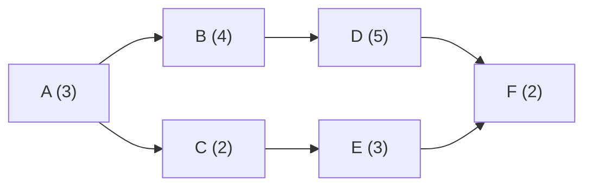
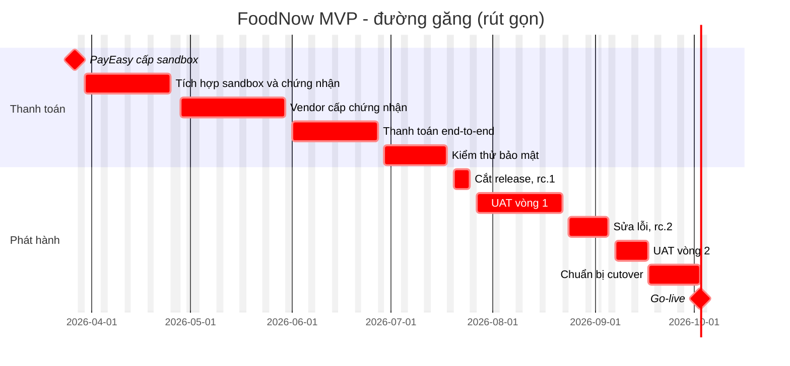

# Chương 12: Lập lịch: Timeline, Gantt, Critical Path

## Mục tiêu học

- Phân biệt 4 loại quan hệ phụ thuộc (FS/SS/FF/SF) và lead/lag.
- Tính tay ES/EF/LS/LF, float và tìm đường găng cho một mạng nhỏ.
- Chọn giữa crashing và fast-tracking khi cần rút ngắn lịch.
- Xử lý ràng buộc nguồn lực, ngày nghỉ (Tết, lễ) và trình bày Gantt cho lãnh đạo.
- Lập được lịch cho Waterfall, Hybrid và Agile (sprint/release).

## 12.1 Từ ước lượng đến lịch

Ước lượng cho biết **cần bao nhiêu công**; lịch cho biết **khi nào làm và theo thứ tự nào**. Ba đầu vào của lịch:

1. **Work package** từ WBS (Ch10) và ước lượng công (Ch11);
2. **Quan hệ phụ thuộc** giữa các gói;
3. **Nguồn lực và lịch làm việc** (ai làm, ngày nào không làm được).

Lịch cần đến ba hình thức: **bảng** (dùng để tính), **Gantt** (dùng để trình bày) và **mạng** (dùng để phân tích đường găng). Trong sách này, Mermaid `gantt` là định dạng chính vì diff được bằng git.

## 12.2 Quan hệ phụ thuộc, lead và lag

| Loại | Ý nghĩa | Ví dụ |
|---|---|---|
| **FS** (Finish-to-Start) | B chỉ bắt đầu khi A **xong** | Xong tích hợp PayEasy → mới chạy end-to-end |
| **SS** (Start-to-Start) | B bắt đầu khi A **bắt đầu** | Bắt đầu viết test case khi bắt đầu viết story |
| **FF** (Finish-to-Finish) | B chỉ xong khi A **xong** | Tài liệu API xong cùng lúc API xong |
| **SF** (Start-to-Finish) | B chỉ xong khi A **bắt đầu** | Hiếm; ví dụ ca trực cũ chỉ kết thúc khi ca mới bắt đầu |

FS chiếm đa số; SF thực tế gần như không dùng. Ngoài ra có hai điều chỉnh:

- **Lead** (dẫn trước): cho phép B bắt đầu **trước** khi A xong (FS − 3 ngày: B bắt đầu 3 ngày trước khi A kết thúc).
- **Lag** (trễ): buộc B chờ thêm sau khi A xong (FS + 5 ngày: bê tông cần 5 ngày khô; với phần mềm: vendor cần 5 ngày xử lý sau khi nộp hồ sơ).

Phụ thuộc có 4 nguồn: **bắt buộc** (bản chất công việc: phải có API mới test được API), **tuỳ chọn** (quy ước tốt nhất, có thể vi phạm khi cần), **bên ngoài** (vendor, khách, quy định) và **nội bộ** (nguồn lực dùng chung). **Phụ thuộc bên ngoài là nơi rủi ro nhiều nhất** — vì bạn không kiểm soát được, hãy ghi ngày cần và ngày họ hứa vào RAID (Ch19).

## 12.3 Đường găng (Critical Path Method)

**Đường găng** là chuỗi task dài nhất trong mạng phụ thuộc; nó quyết định **thời gian ngắn nhất** để xong dự án. Task trên đường găng có **float bằng 0** — trễ một ngày là trễ dự án một ngày. Task ngoài đường găng có float dương.

Các đại lượng cho từng task (đơn vị: ngày làm việc; quan hệ FS):

- **ES** = max(EF các tiền nhiệm), hoặc 0;  **EF = ES + Duration**;
- **LF** = min(LS các hậu nhiệm), hoặc EF lớn nhất của dự án nếu là task cuối; **LS = LF − Duration**;
- **Float = LS − ES = LF − EF**.

### Ví dụ tính tay (6 task)

| Task | Duration | Tiền nhiệm |
|---|---|---|
| A | 3 | — |
| B | 4 | A |
| C | 2 | A |
| D | 5 | B |
| E | 3 | C |
| F | 2 | D, E |

**Lượt đi:** A 0→3; B 3→7; C 3→5; D 7→12; E 5→8; F: ES = max(12, 8) = 12 → EF = 14.
**Lượt về:** F: LF = 14, LS = 12; D: LF = 12, LS = 7; E: LF = 12, LS = 9; B: LF = 7, LS = 3; C: LF = 9, LS = 7; A: LF = min(3, 7) = 3, LS = 0.

| Task | ES | EF | LS | LF | Float |
|---|---|---|---|---|---|
| A | 0 | 3 | 0 | 3 | **0** |
| B | 3 | 7 | 3 | 7 | **0** |
| C | 3 | 5 | 7 | 9 | 4 |
| D | 7 | 12 | 7 | 12 | **0** |
| E | 5 | 8 | 9 | 12 | 4 |
| F | 12 | 14 | 12 | 14 | **0** |

Đường găng **A → B → D → F = 14 ngày**. C và E có float 4 ngày: có thể trễ tới 4 ngày mà dự án không chậm. Lưu ý: **float dùng chung** — nếu C dùng hết 4 ngày, E không còn float.

📎 Mẫu đầy đủ: `templates/timeline-gantt/critical-path-worksheet.md`

Hai chú ý thực tế:

1. **Đường găng có thể đổi**: khi task găng được rút ngắn hoặc task không găng trễ quá float, đường găng chuyển sang chuỗi khác. Tính lại thường xuyên.
2. **Task gần găng** (float rất nhỏ) nguy hiểm không kém; theo dõi chúng cùng đường găng.

## 12.4 Rút ngắn lịch: crashing và fast-tracking

Khi cần rút ngắn, chỉ tác động lên **đường găng** — rút ngắn task không găng không giúp gì.

| Kỹ thuật | Cách làm | Chi phí | Rủi ro | Khi nào dùng |
|---|---|---|---|---|
| **Crashing** | Thêm nguồn lực/giờ làm cho task găng | Tăng chi phí | Không hiệu quả nếu task không chia được (Brooks); mệt mỏi, giảm chất lượng | Task chia được, người thêm có kỹ năng, ngân sách cho phép |
| **Fast-tracking** | Chạy song song các task vốn tuần tự (dùng lead) | Ít tiền | Làm lại nếu giả định sai; rủi ro chất lượng | Phụ thuộc là tuỳ chọn, chấp nhận rủi ro |
| **Cắt phạm vi** | Bỏ bớt công việc trên đường găng | Giảm giá trị | Sponsor phải đồng ý | Khi hai cái trên không đủ |

Quy trình: (1) chọn task găng có **chi phí rút ngắn thấp nhất mỗi ngày**; (2) rút ngắn; (3) tính lại đường găng (có thể chuyển sang chuỗi khác); (4) lặp đến khi đủ. Mỗi lần ghi lại chi phí và rủi ro. **Không rút ngắn bằng cách bóp ước lượng** — đó không phải rút ngắn lịch, đó là dối mình.

## 12.5 Lịch theo mốc, lịch Agile và Hybrid

- **Lịch theo mốc** (milestone schedule): chỉ vài chục ngày mốc quan trọng (kickoff, Scope Freeze, UAT bắt đầu, Go-live), dùng cho Sponsor và HĐQT.
- **Lịch Agile**: lịch tổ chức theo **sprint** (ví dụ 2 tuần) và **release**; nội dung từng sprint quyết định ở Sprint Planning từ backlog ưu tiên. Không có "Gantt chi tiết" từng story; thay vào đó dùng release plan và dự báo theo velocity (Ch13, Ch24).
- **Hybrid**: khung lịch là mốc + Gantt cấp cao (15–30 dòng, gồm các chuỗi phụ thuộc bên ngoài); bên trong dùng sprint. FoodNow có 16 sprint sau Sprint 0, mỗi sprint kết thúc bằng một tag `v0.N.0` lên staging (Ch32).

Trong Hybrid, **đừng lập Gantt chi tiết cho từng story**: nó lỗi thời sau một sprint. Chỉ lập lịch chi tiết cho phần **ít thay đổi và có phụ thuộc ngoài** (tích hợp thanh toán, chứng nhận, UAT, cutover) — chính là đường găng.

## 12.6 Ràng buộc nguồn lực, lịch nghỉ, Tết

Lịch chỉ dựa vào phụ thuộc thì cho ra "lịch lý tưởng". Thực tế cần thêm:

- **San tải nguồn lực** (resource leveling): một người không thể làm hai việc 100% cùng lúc. Nếu Sơn được xếp vào ba task song song, phải dời task, chia bớt hoặc thêm người. Ch16 học cách vẽ resource histogram.
- **Lịch nghỉ**: ở Việt Nam, đặc biệt **Tết Nguyên Đán** (thường nghỉ ~1 tuần, cộng thêm thời gian "lấy đà" quanh Tết, khi nhiều người nghỉ phép dài hơn), **Giỗ Tổ Hùng Vương**, **30/4–1/5**, **2/9**. Đưa vào `excludes` của lịch và hỏi đội về dự định nghỉ phép.
- **Múi giờ và ngày lễ** của đội hoặc vendor ở nước khác.
- **Người rời/nhập đội**: mỗi lần đổi người có "thuế" học việc; ghi vào rủi ro.

Ở FoodNow, năng lực thực là khoảng **185 ngày làm việc/FTE** từ 05/01 đến 03/10/2026 sau khi trừ tuần Tết (16–20/02), bù Giỗ Tổ 27/04, 30/04–01/05 và 02/09.

## 12.7 Đọc và trình bày Gantt cho lãnh đạo

Lãnh đạo không đọc 100 dòng. Khi trình bày:

1. **Chỉ 15–30 dòng**, nhóm theo giai đoạn.
2. **Đánh dấu đường găng** bằng màu khác và giải thích một câu: "Chuỗi này quyết định ngày go-live".
3. **Hiển thị mốc** (Kickoff, Scope Freeze, UAT, Go-live) và **mốc bên ngoài**.
4. **Đưa vào những gì không kiểm soát được** (vendor) và cách bạn theo dõi.
5. **Có đường "hôm nay"** và % hoàn thành khi báo cáo tiến độ.
6. **Sẵn sàng trả lời ba câu hỏi**: Đường găng ở đâu? Float ở đâu? Nếu X trễ thì sao?

## 12.8 Lịch FoodNow

Lịch baseline FoodNow (rút gọn — bản đầy đủ có 29 dòng trong `FoodNow-Schedule.csv`):

Hai điểm mấu chốt: đường găng tổng **131 ngày làm việc** đi qua **tích hợp thanh toán** và vendor; các nhánh phát triển (app, backend) có float chỉ 2–5 ngày làm việc. Nghĩa là đội có thể sốt sắng viết code, nhưng lịch thực sự bị trói vào ngày PayEasy giao sandbox và chứng nhận.

📎 Mẫu đầy đủ: `templates/timeline-gantt/FoodNow-Gantt.md`, `templates/timeline-gantt/FoodNow-Schedule.csv`

## Tình huống FoodNow

Tuần 8 (23–27/02/2026), ngay sau Tết, Hà hoàn tất Gantt baseline và ngồi với Dũng tính đường găng. Lịch ban đầu Hà vẽ có tất cả app và Backend là găng vì "ai cũng chạy 9 tháng". Khi tính tay, chị thấy khác: các nhánh phát triển có float 5 ngày, còn chuỗi **PayEasy sandbox → tích hợp → chứng nhận → end-to-end → kiểm thử bảo mật** có float 0 và chạy thẳng vào đợt cắt release 20/07.

Dũng nói: "Vậy thì chị Yến trễ một tuần là mình trễ một tuần." Hà xác nhận và làm ba việc: (1) đưa mốc "PayEasy cấp sandbox 27/03" vào RAID như một **phụ thuộc bên ngoài** với ngày cần và ngày hứa; (2) xin chị Yến một văn bản chốt ngày sandbox và mốc chứng nhận; (3) đặt lịch họp vendor hằng tuần. Chị cũng báo anh Bảo: "Đường găng của mình đi qua PayEasy; các phần còn lại có dư chút ít. Nếu vendor trễ, mình sẽ phải dùng dự phòng để rút ngắn (crashing hoặc chạy song song)." Đây là lời cảnh báo mà 8 tuần sau (tuần 16), khi PayEasy báo trễ chứng nhận 3 tuần, giúp Hà không phải giải thích từ đầu (Ch21).

## Bài tập

**Bài 1 (làm ra sản phẩm) — Đường găng 8 task.** Điền bảng ở `critical-path-worksheet.md` mục 3 (task A–H) và trả lời: đường găng, tổng thời gian, float của C, E, F; nếu D trễ 2 ngày thì sao?

**Bài 2 (làm ra sản phẩm) — Gantt.** Lập Gantt Mermaid 15–20 dòng cho dự án "website đặt phòng khách sạn nhỏ" (Ch10), có ≥ 3 milestone, đường găng đánh dấu `crit` và ngày nghỉ lễ trong `excludes`.

**Bài 3 (tình huống ngắn).** Khách hỏi: "Nếu tôi cần xong sớm 2 tuần, cần thêm gì?" Đường găng của bạn gồm 3 task: A (20 ngày, dễ chia), B (15 ngày, phụ thuộc vendor), C (10 ngày, chia được). Bạn đề xuất gì?

Gợi ý đáp án

**Bài 1:** ES/EF: A 0–2; B 2–6; C 2–5; D 6–11; E 6–8; F 5–9; G 11–14; H 14–16. **Đường găng A → B → D → G → H = 16 ngày.** Float: C = 4, E = 3, F = 5; A, B, D, G, H = 0. Nếu D trễ 2 ngày → dự án trễ 2 ngày (D găng) → 18 ngày. Nếu E trễ 2 ngày → không trễ (float 3).

**Bài 3:** Chẩn đoán: chỉ rút ngắn task găng; B phụ thuộc vendor nên khó rút. Phương án A: crashing A và C (thêm người có kỹ năng, chi phí tăng); phương án B: fast-tracking, bắt đầu C khi A còn 3–4 ngày (rủi ro làm lại); phương án C: cắt phạm vi. Cần hỏi khách: ngân sách thêm? cắt phạm vi được không? Khuyến nghị: A + B kết hợp và cảnh báo B (vendor) không rút được. Sai lầm: hứa "được" mà không tính lại đường găng; nhét thêm người vào task không chia được.

## Sai lầm thường gặp

1. **Sai lầm:** Lập Gantt chi tiết từng story trong Hybrid/Agile. → **Hậu quả:** lịch lỗi thời sau một sprint, tốn công cập nhật. **Cách khắc phục:** Gantt cấp cao + sprint; chi tiết chỉ với phần ít đổi.
2. **Sai lầm:** Không ghi phụ thuộc bên ngoài. → **Hậu quả:** vendor trễ là bất ngờ. **Cách khắc phục:** mỗi phụ thuộc có ngày cần, ngày hứa, người liên hệ (RAID).
3. **Sai lầm:** Rút ngắn task không găng. → **Hậu quả:** tốn tiền mà lịch không đổi. **Cách khắc phục:** luôn xác định đường găng trước.
4. **Sai lầm:** Bỏ qua nguồn lực và lịch nghỉ (Tết). → **Hậu quả:** lịch "đẹp" nhưng không ai làm được. **Cách khắc phục:** dùng năng lực thực (ngày làm việc/FTE), `excludes` lễ, hỏi đội về kế hoạch nghỉ.
5. **Sai lầm:** Bóp ước lượng để lịch vừa hạn. → **Hậu quả:** trễ là chắc chắn. **Cách khắc phục:** rút ngắn bằng crashing/fast-tracking/cắt phạm vi, không bóp số.
6. **Sai lầm:** Tính đường găng một lần rồi không cập nhật. → **Hậu quả:** đường găng đã chuyển mà không ai biết. **Cách khắc phục:** tính lại khi có thay đổi lớn hoặc task trễ vượt float.

## Tóm tắt & tiếp theo

- Lịch = WBS + ước lượng + phụ thuộc (FS/SS/FF/SF, lead/lag) + nguồn lực + lịch nghỉ.
- CPM: ES/EF/LS/LF, float; đường găng float = 0, quyết định thời gian ngắn nhất; tính lại thường xuyên; để ý task gần găng.
- Rút ngắn chỉ trên đường găng: crashing, fast-tracking hoặc cắt phạm vi — không bóp ước lượng.
- Hybrid: Gantt cấp cao 15–30 dòng; FoodNow có đường găng 131 ngày làm việc đi qua tích hợp thanh toán và vendor.

Chương 13 chuyển từ lịch cam kết sang **roadmap và release plan**: cách nói về tương lai mà không hứa ngày chi tiết.
