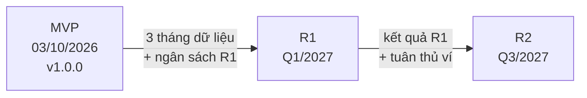

# Chương 13: Roadmap & Release Plan

## Mục tiêu học

- Phân biệt roadmap với Gantt và với backlog; giải thích vì sao roadmap không cam kết ngày chi tiết.
- Lập được roadmap Now–Next–Later theo theme/outcome, kèm OKR từng release.
- Viết được ba phiên bản roadmap cho lãnh đạo, đội và khách.
- Lập được release plan với mục tiêu, phạm vi và tiêu chí Go/No-Go cho từng release.
- Cập nhật được roadmap mà không "lật kèo" niềm tin của các bên.

## 13.1 Roadmap không phải Gantt

**Roadmap** (lộ trình sản phẩm) là bản mô tả **hướng đi** của sản phẩm theo thời gian, xoay quanh **mục tiêu và kết quả (outcome)** chứ không phải danh sách tính năng có ngày. Nhiều người nhầm với Gantt; thực tế chúng phục vụ hai câu hỏi khác nhau:

| | Roadmap | Gantt / lịch |
|---|---|---|
| Câu hỏi | Ta đi đâu, vì sao, theo thứ tự nào? | Ai làm gì, khi nào, phụ thuộc gì? |
| Đơn vị | Theme, outcome, release | Task, ngày, phụ thuộc |
| Độ chi tiết ngày | Quý/tháng, thưa dần về tương lai | Ngày cụ thể |
| Bản chất | Định hướng, có thể đổi | Kế hoạch cam kết cho phần gần |
| Người dùng chính | Lãnh đạo, khách, đội | PM, đội |
| Cập nhật | Khi có thông tin chiến lược mới | Hằng tuần |

Tại sao roadmap **không** nên có ngày chi tiết cho tương lai xa? Vì càng xa, bất định càng lớn (nón bất định, Ch11): ngày hứa hôm nay sẽ bị đổi vào tháng sau, và mỗi lần đổi là một lần mất tín nhiệm. Roadmap tốt hứa **hướng đi và kết quả**, cam kết **ngày** chỉ cho phần gần.

Ba tầng kế hoạch bổ sung nhau: **Roadmap** (hướng đi) → **Release Plan** (phạm vi và tiêu chí từng lần phát hành) → **Lịch/Delivery Plan** (task, ngày, tag, môi trường — Ch30). Backlog (Ch24) là nguồn nội dung; WBS/Gantt (Ch10, Ch12) là cách quản lý phần đã cam kết.

## 13.2 Now – Next – Later

Cách trình bày phổ biến nhất vì nó phản ánh đúng mức chắc chắn:

| Vùng | Ý nghĩa | Độ chi tiết | Độ chắc chắn |
|---|---|---|---|
| **Now** | Đang làm, đã có lịch | Có ngày cụ thể | Cao |
| **Next** | Sắp làm, đã cam kết ở mức quý | Chỉ quý/tháng | Trung bình |
| **Later** | Hướng đi, chưa cam kết | **Không ngày** | Thấp |

Cột thứ tư nên có: **độ chắc chắn** (cao/trung bình/thấp), để người đọc không tự hiểu "đã hứa".

### Theme và outcome, không chỉ tính năng

Mỗi mục trong roadmap gắn với một **theme** (chủ đề) và một **outcome** (kết quả kinh doanh/người dùng). "Thêm khuyến mãi" là tính năng; "Tăng số khách quay lại đặt trong 30 ngày" là outcome. Khi outcome rõ, đội và PO có tự do chọn cách đạt, và khi tính năng bị cắt, người ta vẫn nhìn thấy mục tiêu.

**OKR** (Objectives and Key Results) thường được dùng để viết outcome: **Objective** là mục tiêu định tính, **Key Results** là 2–3 chỉ số đo được. Ví dụ MVP FoodNow: Objective "Có kênh đặt đồ ăn riêng đáng tin cậy"; KR "500 đơn/ngày sau 3 tháng go-live; huỷ đơn < 5%; giao TB < 35 phút".

📎 Mẫu đầy đủ: `templates/roadmap/FoodNow-Product-Roadmap.md`, `templates/roadmap/roadmap.csv`

Trích roadmap FoodNow:

| Vùng | Release | Outcome | Nội dung |
|---|---|---|---|
| Now | MVP (03/10/2026) | Kênh đặt đồ ăn riêng đáng tin cậy | 11 epic E1–E11 |
| Next | R1 (Q1/2027) | Tăng đơn lặp lại, giảm huỷ | Khuyến mãi; đánh giá món; tối ưu hiệu năng |
| Later | R2 (dự kiến Q3/2027) | Thanh toán và đặt món linh hoạt | Ví điện tử; đặt món theo nhóm — **không có ngày** |

## 13.3 Một roadmap, ba phiên bản

Cùng một nội dung nhưng ba đối tượng cần ba cách trình bày:

| Đối tượng | Họ cần | Nội dung | Tránh |
|---|---|---|---|
| **Lãnh đạo/HĐQT** | Mục tiêu kinh doanh, rủi ro, đầu tư | 1 slide: release, outcome, KR, mốc lớn | Chi tiết tính năng |
| **Đội phát triển** | Theme, epic, phụ thuộc kỹ thuật, nợ kỹ thuật | 1 trang + backlog | Hứa ngày quá xa |
| **Khách/đối tác** | Thứ họ sẽ dùng, khi nào (quý) | Tóm tắt lợi ích, cửa sổ thời gian | Cam kết tính năng chi tiết |

Sai lầm phổ biến là gửi bản roadmap của đội cho khách: khách đọc thấy "tính năng X quý 2" và coi đó là hợp đồng.

## 13.4 Release Plan

**Release Plan** (kế hoạch phát hành) cụ thể hoá roadmap thành từng lần phát hành: **mục tiêu, phạm vi, tiêu chí Go/No-Go, phụ thuộc, rủi ro**. Ba khái niệm:

- **Release train** (chuyến tàu phát hành): nhịp phát hành đều đặn; tính năng nào kịp lên tàu thì đi, không kịp thì chờ chuyến sau. Giúp cắt phạm vi thay vì dời ngày.
- **Tiêu chí Go/No-Go**: điều kiện định lượng để quyết định phát hành, đặt **trước**, không phải lúc quyết định (Ch37).
- **Lộ trình MVP → R1 → R2**: mỗi release có mục tiêu riêng và điều kiện tiên quyết (dữ liệu, ngân sách, tuân thủ).

Tiêu chí Go/No-Go theo sáu nhóm: **chất lượng** (bug), **UAT** (nghiệm thu), **hiệu năng**, **vận hành** (runbook, rollback, đào tạo), **tuân thủ** (chứng nhận, quy định), **kinh doanh** (Sponsor đồng ý).

📎 Mẫu đầy đủ: `templates/roadmap/FoodNow-Release-Plan.md`

## 13.5 Cập nhật roadmap mà không "lật kèo"

Roadmap phải thay đổi khi thực tế thay đổi. Nhưng cách thay đổi quyết định niềm tin:

1. **Ghi lịch sử thay đổi**: mỗi bản có mục "đổi gì – không đổi gì – vì sao".
2. **Phân biệt ba mức đổi**: (a) đổi thứ tự trong cùng release — thông báo; (b) đổi release của một mục lớn — cần Sponsor duyệt; (c) đổi mục tiêu của release — cần HĐQT.
3. **Đừng đổi Now** nếu không bất khả kháng; nếu đổi, báo sớm kèm phương án.
4. **Dùng vùng Later như đệm**: đó là chỗ hấp thụ thay đổi mà không phá cam kết.
5. **Nói về outcome trước khi nói về tính năng**: "Mục tiêu R2 không đổi; chỉ đổi thứ tự bên trong".

## Đi sâu: viết theme, outcome và OKR cho roadmap

### Công thức viết một dòng roadmap

**[Theme] → [Outcome đo được] → [Cách đạt (giả thuyết)]**. Ví dụ: *Giữ chân khách* → *tăng tỷ lệ khách đặt lại trong 30 ngày từ 25% lên 35%* → *khuyến mãi và đánh giá món*. Nếu bạn không viết được phần outcome, đó vẫn là danh sách tính năng.

### Ba lỗi khi viết OKR

1. **KR là hoạt động** ("ra mắt khuyến mãi") thay vì kết quả ("35% khách đặt lại"). 2. **Quá nhiều KR** — giữ 2–3 mỗi release. 3. **KR không có baseline** nên không biết tiến bộ; luôn ghi giá trị hiện tại.

### Roadmap với hợp đồng fixed-price

Khách trả tiền theo phạm vi cố định thường muốn roadmap "chắc chắn". Cách hoà giải: **vùng Now** = phạm vi hợp đồng (có ngày, gắn baseline); **Next/Later** = định hướng, ghi rõ *không thuộc hợp đồng* và cần CR/hợp đồng mới. Nhờ vậy khách thấy tầm nhìn dài mà bạn không cam kết ngoài phạm vi.

### Trình bày roadmap cho HĐQT: checklist một slide

Đủ bốn thứ: (a) mục tiêu kinh doanh từng release; (b) KR đo được; (c) mốc lớn và độ chắc chắn; (d) điều cần HĐQT quyết (ngân sách release kế tiếp). Bỏ tên tính năng chi tiết, trừ khi liên quan trực tiếp đến mục tiêu.

### Cập nhật roadmap: bảng quyết định

| Loại thay đổi | Ai duyệt | Thông báo |
|---|---|---|
| Đổi thứ tự trong cùng release | PO | Đội + SteerCo tháng sau |
| Chuyển mục lớn sang release khác | Sponsor | Khách, đội, HĐQT trong 24 giờ |
| Đổi mục tiêu release | HĐQT | Toàn bộ stakeholder, kèm lý do |

## Tình huống FoodNow

Ngày 13/03/2026, Hà cùng Châu công bố Roadmap v1.0 sau khi Scope Statement v1.1 được duyệt: MVP (Now, go-live 03/10/2026), R1 (Next, Q1/2027: khuyến mãi, đánh giá món) và R2 (Later, dự kiến Q3/2027: ví điện tử, đặt món theo nhóm). Chị làm ba bản: một slide cho HĐQT với OKR từng release, một trang cho đội với epic và phụ thuộc kỹ thuật, và một tóm tắt cho nhà hàng đối tác chỉ ghi "khoảng Q1/2027 sẽ có khuyến mãi".

Anh Bảo ban đầu muốn ghi ngày cho cả R1 và R2 "để hội đồng yên tâm". Hà từ chối nhẹ nhàng: "Anh cho em ghi quý và outcome. Nếu em ghi 15/02/2027 mà sau này dời, anh sẽ mất uy tín với hội đồng hơn là nói 'Q1' ngay từ đầu." Anh Bảo đồng ý.

Ngày 06/07/2026, cố vấn pháp lý của FoodNow báo có yêu cầu tuân thủ mới về xác thực người dùng khi dùng ví điện tử, cần hoàn tất trước khi ra mắt ví. Hà cập nhật roadmap lên **v1.1**: trong R2 (vùng Later), **đặt món theo nhóm đi trước, ví điện tử đi sau**; mục tiêu R2 và quý dự kiến **không đổi**. Bảng lịch sử thay đổi ghi rõ đổi gì, không đổi gì, lý do. Vì Later không có ngày, thay đổi này không phá cam kết nào; anh Bảo chỉ cần đọc một đoạn tóm tắt thay vì họp căng thẳng.

## Bài tập

**Bài 1 (làm ra sản phẩm) — Roadmap Now–Next–Later.** Vẽ roadmap Now–Next–Later cho dự án của bạn (hoặc app đặt lịch cắt tóc ở Ch05): ≥ 3 release, mỗi release một Objective và 2–3 KR; Now có ngày, Next có quý, Later **không ngày**; thêm cột độ chắc chắn.

**Bài 2 (làm ra sản phẩm).** Viết release plan cho release đầu tiên: phạm vi, tiêu chí Go/No-Go theo 6 nhóm, phụ thuộc, rủi ro.

**Bài 3 (tình huống ngắn).** Khách xem roadmap và nói: "Slide ghi 'ví điện tử Q3/2027'. Tôi sẽ hứa với đối tác là T7/2027 có ví." Bạn xử lý thế nào?

Gợi ý đáp án Bài 3

**Chẩn đoán:** roadmap bị hiểu như cam kết; ngày đã bị thu hẹp từ quý xuống tháng. **Phương án A:** làm rõ ngay: "Q3 là cửa sổ định hướng, độ chắc chắn thấp; ví phụ thuộc vendor và yêu cầu tuân thủ." Đề nghị khách chỉ hứa "định hướng 2027" với đối tác. **Phương án B:** nếu khách bắt buộc cần ngày, đề xuất biến thành cam kết có điều kiện qua Sponsor (kèm điều kiện: vendor, tuân thủ, ngân sách) và đưa vào release plan. **Khuyến nghị:** A ngay bằng lời và email; B nếu thật sự cần. **Lời nói mẫu:** "Em rất muốn anh có thứ chắc chắn để nói với đối tác. Q3 hiện là hướng đi, chưa phải cam kết — nếu anh hứa T7, em sợ mình làm anh mất uy tín. Em đề xuất anh nói 'định hướng 2027', và em sẽ gửi anh cập nhật khi vendor xác nhận." **Sai lầm:** im lặng; để hứa rồi mới sửa.

## Sai lầm thường gặp

1. **Sai lầm:** Roadmap là danh sách tính năng có ngày. → **Hậu quả:** trở thành cam kết ngầm; mọi dời ngày là thất hứa. **Cách khắc phục:** theme/outcome + quý; Later không ngày.
2. **Sai lầm:** Gửi cùng một roadmap cho mọi người. → **Hậu quả:** khách đọc chi tiết đội, lãnh đạo bị ngập. **Cách khắc phục:** ba phiên bản từ một nguồn.
3. **Sai lầm:** Không ghi độ chắc chắn. → **Hậu quả:** mọi thứ trông như cam kết. **Cách khắc phục:** cột "độ chắc chắn"; ghi rõ giả thuyết.
4. **Sai lầm:** Đổi roadmap mà không ghi lý do. → **Hậu quả:** người xem thấy "lật kèo"; mất tin. **Cách khắc phục:** lịch sử thay đổi: đổi gì, không đổi gì, vì sao.
5. **Sai lầm:** Tiêu chí Go/No-Go đặt lúc quyết định. → **Hậu quả:** tranh cãi cảm tính, áp lực chính trị. **Cách khắc phục:** đặt trước, định lượng, ký từ đầu.
6. **Sai lầm:** Không nối roadmap với backlog và lịch. → **Hậu quả:** ba tài liệu mâu thuẫn. **Cách khắc phục:** cùng mã theme/epic; cập nhật cùng lúc.

## Tóm tắt & tiếp theo

- Roadmap là hướng đi theo outcome, không phải lịch cam kết; Now có ngày, Next có quý, Later không ngày.
- Mỗi release có OKR; viết ba phiên bản cho lãnh đạo, đội và khách.
- Release plan gồm mục tiêu, phạm vi, Go/No-Go (6 nhóm), phụ thuộc, rủi ro.
- Cập nhật roadmap bằng lịch sử thay đổi và phân mức thay đổi; dùng Later làm đệm.

Chương 14 chuyển sang **ngân sách và chi phí**: cách tính, theo dõi và bảo vệ con số 2,4 tỷ của FoodNow.
