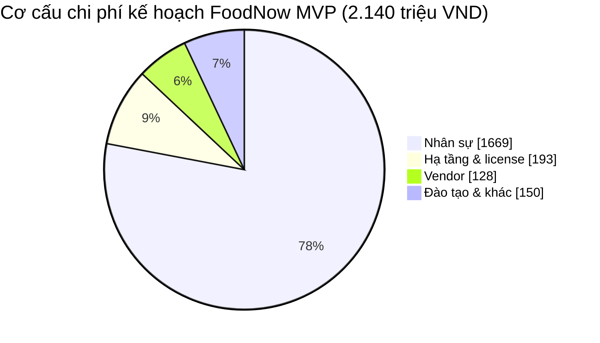

# Chương 14: Ngân sách & quản lý chi phí

## Mục tiêu học

- Liệt kê được cấu trúc chi phí của một dự án phần mềm và tính chi phí nhân sự bằng man-month và đơn giá.
- Phân biệt contingency reserve với management reserve và đặt quy tắc sử dụng.
- Lập được cost baseline theo thời gian và theo dõi Actual so với Planned.
- Lập được bảng cash flow theo mốc thanh toán.
- Tính được ROI/NPV đơn giản để bảo vệ ngân sách trước Sponsor.

## 14.1 Cấu trúc chi phí dự án phần mềm

Ngân sách dự án phần mềm thường gồm bốn nhóm chính cộng dự phòng:

| Nhóm | Gồm | Tỷ trọng FoodNow (trên chi phí kế hoạch) |
|---|---|---|
| **Nhân sự** | Lương/chi phí nhân sự nội bộ, tuyển dụng, onboarding | 78% |
| **Hạ tầng & license** | Cloud, công cụ (Jira, Figma, CI), thiết bị kiểm thử, giám sát | 9% |
| **Vendor** | Cổng thanh toán, SMS, bản đồ, dịch vụ bên thứ ba | 6% |
| **Đào tạo & khác** | Đào tạo người dùng, UAT, kiểm thử bảo mật, pháp lý, chứng chỉ | 7% |
| **Dự phòng** | Contingency reserve | 12% của chi phí kế hoạch |

Với dự án phần mềm, **nhân sự thường chiếm 70–80%**. Điều đó có nghĩa: tiết kiệm thật sự nằm ở **thời gian và số người**, không ở việc cắt license. Ngược lại, khoản "nhỏ" bị cắt (kiểm thử bảo mật, đào tạo) lại thường tạo chi phí lớn sau này.

## 14.2 Tính chi phí bằng man-month và đơn giá

**Man-month** (người-tháng) là công của một người làm việc trọn một tháng. Công thức chi phí nhân sự một vị trí:

**Chi phí = FTE × số tháng × đơn giá chi phí (triệu VND/tháng)**

Ví dụ: Tech Lead Dũng: 1,0 FTE × 10 tháng × 19 triệu = **190 triệu**. UX/UI Mai Anh 50%: 0,5 × 10 × 15 = **75 triệu**. Toàn bộ đội FoodNow: **≈ 11,9 FTE trung bình × 10 tháng** (05/01–30/10/2026, gồm hypercare) tổng **1.669 triệu**.

Hai khái niệm dễ nhầm:

- **Đơn giá chi phí** (cost rate): chi phí công ty bỏ ra cho một người-tháng (lương, bảo hiểm, thiết bị, phần chia overhead).
- **Đơn giá bán** (billing rate): giá công ty tính cho khách, gồm biên lợi nhuận. Sách này dùng **đơn giá chi phí** để lập ngân sách dự án; giá bán và biên lợi nhuận thuộc phòng kinh doanh của nhà thầu.

Hai cách đối chiếu nên làm: (1) **tổng ngày công WBS ÷ ngân sách nhân sự** — FoodNow: 1.669 triệu ÷ 1.927 ngày công ≈ 0,87 triệu/ngày công; (2) so sánh với dự án tương tự đã hoàn thành (analogous, Ch11).

📎 Mẫu đầy đủ: `templates/budget/FoodNow-Budget.csv` (công thức Excel viết sẵn; cột G = D × E × F)

## 14.3 Dự phòng: contingency và management reserve

| | **Contingency reserve** | **Management reserve** |
|---|---|---|
| Dành cho | Rủi ro **đã nhận diện** (known unknowns) | Rủi ro **chưa biết** (unknown unknowns) |
| Ai quản lý | PM (trong hạn mức) | Sponsor / cấp cao |
| Nằm trong | **Cost baseline** | Ngoài baseline, nằm trong tổng ngân sách |
| Dùng thế nào | PM dùng theo quy tắc và báo cáo | Cần phê duyệt và thường kéo theo thay đổi baseline |

FoodNow: **contingency 12% = 256,8 triệu** trong baseline, gắn với các rủi ro đã liệt kê (trễ PayEasy, mất nhân sự, thay đổi yêu cầu); Charter cho phép PM **tự dùng tới 5% ngân sách (≈ 120 triệu)** và báo cáo sau, vượt mức cần Sponsor duyệt. Phần chênh 3,2 triệu giữa tổng 2.396,8 và trần 2.400 do Sponsor giữ như management reserve nhỏ.

**Cách đặt dự phòng cho đúng:** không cảm tính. Dự phòng tối thiểu nên bằng **tổng EMV** (giá trị kỳ vọng tiền tệ, Ch18) của các rủi ro có xác suất đáng kể, cộng thêm biên độ cho bất định ước lượng (SD ở Ch11). Nếu chỉ "thấy thế nào ổn thì cho 5%", bạn không có lập luận khi Sponsor đòi cắt.

## 14.4 Cost baseline và theo dõi Actual so với Planned

**Cost baseline** là ngân sách theo thời gian đã được duyệt (không gồm management reserve), dùng để so sánh với chi thực tế. Cách lập: lấy chi phí từng gói (từ WBS/lịch) **phân bổ theo tháng** rồi cộng dồn (đường S). FoodNow:

| Tháng | Planned (PV) | Actual (AC) | PV lũy kế | AC lũy kế | Chênh lũy kế (PV − AC) |
|---|---|---|---|---|---|
| 01/2026 | 150 | 132 | 150 | 132 | +18 |
| 02/2026 | 200 | 172 | 350 | 304 | +46 |
| 03/2026 | 215 | 182 | 565 | 486 | +79 |
| 04/2026 | 225 | 185 | 790 | 671 | +119 |
| 05/2026 | 230 | 205 | 1.020 | 876 | +144 |
| 06/2026 | 235 | 265 | 1.255 | 1.141 | +114 |

(triệu VND; dữ liệu từ `budget-tracking.csv`.) Đọc số: **chi ít hơn kế hoạch không phải tin tốt** nếu kèm tiến độ chậm — ở FoodNow, năm tháng đầu chi thấp vì thiếu người (Backend, Sơn nghỉ), nghĩa là công việc cũng chậm; đến tháng 6 chi tăng vì phải "crash" (Ch21, Ch34). Vì vậy **không bao giờ đọc chi phí tách khỏi tiến độ**: EVM (Ch34) ghép hai thứ.

📎 Mẫu đầy đủ: `templates/budget/budget-tracking.csv`

Ba quy tắc theo dõi:

1. **Theo dõi hằng tuần/tháng** — PV, AC, chênh lệch, dự phòng đã dùng.
2. **Ghi lý do** cho mọi chênh lệch lớn (> 5%).
3. **Dự báo cuối dự án** (EAC — Estimate at Completion), không chỉ báo "đã chi bao nhiêu" (Ch34).

## 14.5 Cash flow theo mốc thanh toán

Trong hợp đồng Hybrid, phần khung fixed-price được **thanh toán theo mốc** — vì vậy PM phải biết dòng tiền vào và ra, để công ty không đói tiền giữa dự án. Ví dụ bảng mốc (trên chi phí kế hoạch 2.140 triệu):

| Mốc | Ngày dự kiến | % | Số tiền (triệu) |
|---|---|---|---|
| Ký hợp đồng / kickoff | 05/01/2026 | 20% | 428 |
| Xong thiết kế + Sprint 4 | 10/04/2026 | 15% | 321 |
| Demo cho HĐQT | 03/06/2026 | 15% | 321 |
| Cắt release/1.0.0 (rc.1) | 24/07/2026 | 15% | 321 |
| UAT đạt — Go/No-Go lần 2 = Go | 16/09/2026 | 15% | 321 |
| Go-live | 03/10/2026 | 10% | 214 |
| Kết thúc hypercare / nghiệm thu | 30/10/2026 | 10% | 214 |
| **Tổng** | | 100% | **2.140** |

Đối chiếu với chi tiêu tích luỹ (~150 triệu tháng 1, ~1.020 tháng 5…): nếu mốc thanh toán chậm (khách không ký nghiệm thu kịp), dòng tiền âm. Đó là một lý do PM cần **đưa tiêu chí nghiệm thu rõ ràng ngay từ Scope Statement** (Ch7).

## 14.6 Chi phí thay đổi

Trong Hybrid, thay đổi ngoài phạm vi tính bằng **change request theo T&M**: chi phí = công thêm × đơn giá đã thoả thuận, cộng phụ phí vận hành nếu có. Mọi CR phải có **đánh giá tác động chi phí** trước khi duyệt (Ch20). Với thay đổi trong phạm vi (đổi thứ tự backlog), chi phí không đổi nhưng phải kiểm tra không làm vượt ngân sách của epic.

## 14.7 Bảo vệ ngân sách bằng ROI và NPV

Khi Sponsor hỏi "sao đắt thế?" hoặc muốn cắt một khoản, PM cần dùng ngôn ngữ **giá trị và rủi ro**, không chỉ chi phí.

**ROI** (đã học ở Ch5): FoodNow 24 tháng sau go-live ≈ 157%.

**NPV** (giá trị hiện tại ròng) trừ đi giá trị thời gian của tiền: **NPV = −Đầu tư + Σ Dòng tiền ròng_t ÷ (1 + r)^t**. Với giả định của Business Case (đầu tư 2.400 triệu; ba tháng đầu mỗi tháng 92,5 triệu; từ tháng 4 đến 24 mỗi tháng 280 triệu; chiết khấu 1%/tháng ≈ 12,7%/năm): **NPV ≈ +2.997 triệu** (≈ 3,0 tỷ). NPV dương nghĩa là dự án tạo giá trị sau khi tính chi phí vốn.

**Cost of quality** (chi phí chất lượng, Ch15): tiền phòng ngừa (kiểm thử, review) thường nhỏ hơn nhiều so với tiền sửa lỗi sau go-live. Dùng EMV để bảo vệ: khoản kiểm thử bảo mật bên ngoài 45 triệu; nếu xác suất sự cố lộ dữ liệu thanh toán là 10% và thiệt hại ước lượng 800 triệu → EMV = 10% × 800 = **80 triệu > 45 triệu**; cắt khoản này là đánh cược có kỳ vọng âm.

> **Đừng cắt khoản "khó thấy".** Kiểm thử, bảo mật, đào tạo, tài liệu vận hành thường bị cắt đầu tiên vì không "nhìn thấy" lợi ích; chính chúng quyết định go-live có êm không.

## Tình huống FoodNow

Tuần 9 (02/03/2026), Hà chốt cost baseline: 2.140 triệu kế hoạch + dự phòng 12% (256,8 triệu) = 2.396,8 triệu, làm tròn theo trần 2,4 tỷ. Chị họp với anh Bảo. Anh nhìn bảng và chỉ vào dòng "Kiểm thử bảo mật bên ngoài: 45 triệu": "Khoản này cắt được không? Dev tự kiểm thử là được."

Hà không nói "không được". Chị mở EMV: "Nếu luồng thanh toán bị lộ dữ liệu thẻ, mình mất ít nhất khoảng 800 triệu (phạt, bồi thường, mất khách, chi phí sửa). Xác suất em ước lượng khoảng 10% nếu không có kiểm thử độc lập. EMV là 80 triệu — gần gấp đôi khoản 45 triệu. Ngoài ra chứng nhận PayEasy cũng cần báo cáo kiểm thử." Anh Bảo nghĩ một lúc rồi đồng ý giữ nguyên khoản 45 triệu, với điều kiện Dũng xác nhận phạm vi kiểm thử tập trung vào luồng thanh toán và đăng nhập. Ngân sách baseline không đổi.

Hà cũng ghi ba quy tắc dùng dự phòng vào Kế hoạch: (1) dự phòng chỉ dùng cho rủi ro có trong RAID; (2) tự dùng đến 5% ngân sách (≈ 120 triệu) và báo cáo trong tuần; (3) vượt mức cần Sponsor duyệt bằng văn bản. Sau này khi PayEasy trễ chứng nhận ở tuần 16 (Ch21), quy tắc này giúp họ hành động trong một ngày thay vì hai tuần.

## Bài tập

**Bài 1 (làm ra sản phẩm) — Ngân sách đội 6 người/4 tháng.** Lập ngân sách cho đội 6 người (PM 0,5 FTE, 1 BA, 1 Tech Lead, 2 Dev, 1 QA), 4 tháng: bảng nhân sự (FTE × tháng × đơn giá tự đặt, ghi rõ giả định), hạ tầng, vendor, đào tạo, dự phòng 10–15% có lý do; tính tổng, đặt công thức Excel như `FoodNow-Budget.csv`.

**Bài 2 (làm ra sản phẩm).** Lập bảng cost baseline theo tháng và cash flow theo 5 mốc thanh toán; chỉ ra tháng nào dòng tiền âm nhiều nhất.

**Bài 3 (tình huống ngắn).** Sponsor nói: "Cắt 10% ngân sách, giữ nguyên phạm vi và ngày." Bạn phản hồi thế nào? Nêu 2 hướng và lời nói mẫu.

Gợi ý đáp án Bài 3

**Chẩn đoán:** ba cạnh Scope–Time–Cost gắn nhau; nhân sự chiếm ~78% chi phí nên cắt 10% mà giữ phạm vi và ngày gần như bất khả thi nếu không hy sinh chất lượng. **Phương án A:** cắt phạm vi (MoSCoW) tương ứng 10% chi phí và giữ ngày. **Phương án B:** cắt dự phòng/giảm rủi ro chấp nhận (nêu rõ rủi ro tăng thêm và EMV). **Phương án C:** giảm chi phí không phải nhân sự (license, hạ tầng) — thường chỉ đủ 1–2%. **Khuyến nghị:** A, kèm mô tả tác động. **Lời nói mẫu:** "Cắt 10% mà giữ nguyên phạm vi và ngày, em sẽ phải cắt kiểm thử, mà đó là chỗ rủi ro nhất. Em đề xuất mình chọn 2–3 tính năng Could để bỏ khỏi bản này; em gửi anh bảng tiết kiệm trong 24 giờ." **Sai lầm:** đồng ý rồi âm thầm cắt chất lượng.

## Sai lầm thường gặp

1. **Sai lầm:** Ngân sách chỉ tính lương, quên hạ tầng, vendor, đào tạo, pháp lý. → **Hậu quả:** vượt ngân sách từ tháng đầu. **Cách khắc phục:** dùng đủ 4 nhóm; rà từng gói WBS.
2. **Sai lầm:** Dự phòng đặt cảm tính. → **Hậu quả:** khi bị cắt không có lập luận. **Cách khắc phục:** gắn với EMV rủi ro; quy tắc dùng bằng văn bản.
3. **Sai lầm:** Đọc chi phí tách khỏi tiến độ. → **Hậu quả:** "chi ít" tưởng tốt nhưng đội đang thiếu người, trễ. **Cách khắc phục:** ghép EVM (Ch34).
4. **Sai lầm:** Không lập cash flow theo mốc. → **Hậu quả:** công ty thiếu tiền giữa dự án. **Cách khắc phục:** bảng mốc thanh toán gắn tiêu chí nghiệm thu.
5. **Sai lầm:** Cắt kiểm thử/bảo mật để tiết kiệm. → **Hậu quả:** chi phí sửa lỗi sau go-live gấp nhiều lần. **Cách khắc phục:** bảo vệ bằng cost of quality và EMV.
6. **Sai lầm:** Dùng dự phòng cho việc không có trong RAID. → **Hậu quả:** dự phòng cạn trước khi rủi ro thật xảy ra. **Cách khắc phục:** quy tắc "chỉ dùng cho rủi ro đã ghi, kèm log".

## Tóm tắt & tiếp theo

- Chi phí gồm nhân sự (thường 70–80%), hạ tầng & license, vendor, đào tạo & khác, cộng dự phòng.
- Chi phí nhân sự = FTE × tháng × đơn giá chi phí; đối chiếu bằng ngày công WBS và dự án tương tự.
- Contingency (PM quản lý, trong baseline) khác management reserve (Sponsor); đặt theo EMV và có quy tắc dùng.
- Theo dõi Actual so với Planned cùng tiến độ; cash flow theo mốc; bảo vệ bằng ROI, NPV, cost of quality.

Chương 15 nói về **kế hoạch chất lượng**: Definition of Done, quality gates, chiến lược kiểm thử và chỉ số chất lượng.
