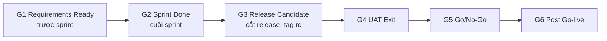

# Chương 15: Kế hoạch chất lượng

## Mục tiêu học

- Định nghĩa chất lượng theo "phù hợp mục đích" và đặt mục tiêu chất lượng có số.
- Viết được Definition of Done ở ba cấp: story, sprint, release.
- Thiết kế quality gates theo giai đoạn và biết ai có quyền chặn cổng.
- Nắm chiến lược kiểm thử ở mức PM cần biết và các thực hành code review, CI, coverage.
- Dùng được chỉ số chất lượng (defect density, escaped defects, bug leakage) và cost of quality.

## 15.1 Chất lượng là gì

Định nghĩa dùng được cho PM: **chất lượng = phù hợp mục đích sử dụng + không có lỗi nghiêm trọng làm hỏng mục đích đó.** Nó khác với "hoàn hảo": một app không lỗi nhưng chậm 10 giây mỗi lần đặt đơn thì không phù hợp mục đích; một app có 20 lỗi nhỏ về giao diện nhưng đặt đơn và thanh toán chạy chắc thì đủ tốt để ra mắt.

Ba tầng chất lượng:

1. **Chất lượng chức năng**: làm đúng cái yêu cầu.
2. **Chất lượng phi chức năng**: hiệu năng, bảo mật, độ tin cậy, khả năng dùng.
3. **Chất lượng quy trình**: cách làm giúp lỗi ít xuất hiện (review, kiểm thử, CI).

Chất lượng là **ràng buộc thứ tư** đã nhắc ở Ch01 và là cạnh thường bị hy sinh đầu tiên khi lịch căng. Vì lỗi không thấy ngay, người ta dễ cắt kiểm thử. Kế hoạch chất lượng tồn tại để **biến chất lượng từ cảm giác thành mục tiêu có số**, để khi bị ép, PM có thứ để dẫn.

## 15.2 Mục tiêu chất lượng

Mỗi mục tiêu cần **con số và cách đo**. FoodNow:

| # | Mục tiêu | Ngưỡng |
|---|---|---|
| Q1 | Không còn bug Critical/High khi go-live | 0 |
| Q2 | Luồng thanh toán | 0 lỗi mất tiền; đối soát khớp 100% |
| Q3 | Hiệu năng | Đặt đơn ≤ 2 giây (p95) |
| Q4 | Ổn định | Crash < 1% phiên |
| Q5 | Bảo mật | Không lỗ hổng mức cao |

**Phân loại lỗi (severity)** cần thống nhất từ sớm (chi tiết ở Ch37): **Critical** (sập, mất tiền/dữ liệu, chặn luồng chính, không cách né), **High** (chức năng chính lỗi, cách né khó), **Medium** (lỗi có cách né), **Low** (thẩm mỹ, nhỏ). "Không còn Critical/High" mới có nghĩa khi hai mức này được định nghĩa rõ.

## 15.3 Definition of Done ở ba cấp

**Definition of Done** (DoD) là danh sách điều kiện để coi công việc là "xong". Ở Ch08 bạn viết bản sơ bộ; ở đây mở rộng ba cấp:

| Cấp | Câu hỏi | Ví dụ điều kiện |
|---|---|---|
| **Story** | Story này xong chưa? | Code review; unit test; QA đạt tiêu chí chấp nhận; không bug Critical/High; PO chấp nhận |
| **Sprint** | Sprint này xong chưa? | Build staging có tag `v0.N.0`; regression xanh; demo xong |
| **Release** | Bản này phát hành được chưa? | UAT đạt; không Critical/High; hiệu năng và bảo mật đạt; runbook, rollback; CS được đào tạo |

Ba quy tắc: (1) **story không đạt DoD thì không tính vào velocity**; (2) hạ DoD phải có quyết định của PM + Tech Lead + QA Lead và ghi vào Decision Log; (3) nâng dần DoD khi đội trưởng thành.

📎 Mẫu đầy đủ: `templates/quality/definition-of-done.md`

## 15.4 Quality gates

**Quality gate** (cổng chất lượng) là điểm kiểm tra bắt buộc giữa các giai đoạn: **không qua cổng thì không sang giai đoạn tiếp**. Khác DoD ở chỗ cổng gắn với **người duyệt và mốc thời gian**.

| Cổng | Ai duyệt | Điều kiện then chốt |
|---|---|---|
| G1 | PO + Tech Lead | Story có tiêu chí chấp nhận, ước lượng xong |
| G2 | PO + QA Lead | Story đạt DoD; staging thành công |
| G3 | Tech Lead + QA Lead | Feature freeze; không Critical mở |
| G4 | Sponsor/PO + CS | UAT 100%; không Critical/High |
| G5 | Sponsor quyết; PM/QA/Tech Lead khuyến nghị | Cutover/rollback đã diễn tập; đào tạo xong |
| G6 | PM + Sponsor | Hypercare xong; phân tích escaped defect |

Hai lưu ý: **QA Lead cần quyền chặn cổng** (nếu không, kiểm thử chỉ mang tính tham khảo); nếu phải bỏ qua cổng vì áp lực, ghi **chấp thuận có điều kiện** vào RAID với người ký.

📎 Mẫu đầy đủ: `templates/quality/quality-gates-checklist.md`

## 15.5 Chiến lược kiểm thử ở mức PM cần biết

PM không cần viết test case, nhưng phải hiểu bảy cấp kiểm thử để hỏi đúng và lập kế hoạch nguồn lực:

| Cấp | Mục đích | Ai làm | Tự động? |
|---|---|---|---|
| **Unit** | Logic từng hàm | Dev | Có |
| **Integration** | Các thành phần, API tương tác đúng | Dev/QA | Phần lớn |
| **System** | Toàn hệ thống theo yêu cầu | QA | Một phần |
| **Regression** | Thay đổi mới không làm hỏng cái cũ | QA | Nên tự động |
| **Performance** | Chịu tải, tốc độ | QA + DevOps | Có |
| **Security** | Lỗ hổng bảo mật | Bên ngoài + Dev | Một phần |
| **UAT** | Người dùng thật xác nhận | PO, CS, nhà hàng, tài xế | Không |

**Mô hình kim tự tháp kiểm thử**: nhiều unit test (nhanh, rẻ), ít hơn integration, ít nhất UI/E2E (chậm, dễ vỡ). Nếu đội có ít unit test và rất nhiều kiểm thử tay, regression sẽ tăng thời gian mỗi sprint và trở thành nút cổ chai.

Ba thực hành hỗ trợ:

- **Code review**: mọi thay đổi có ít nhất một người khác xem; quy tắc PR nhỏ và review trong 24 giờ (Working Agreement).
- **CI (Continuous Integration)**: mỗi lần commit tự build và chạy test; lỗi phát hiện trong vài phút thay vì vài tuần (Ch29, Ch33).
- **Coverage** (độ phủ test): % code được test chạm tới. Dùng như **chỉ báo xu hướng**, không phải mục tiêu tuyệt đối — coverage 90% mà test kiểm thử vô nghĩa vẫn vô dụng. FoodNow đặt logic thanh toán ≥ 85%, module khác ≥ 70%.

## 15.6 Chỉ số chất lượng

| Chỉ số | Công thức | Cách đọc |
|---|---|---|
| **Defect density** | Số defect ÷ kích thước (KLOC hoặc 100 story point) | Theo xu hướng, không so giữa đội |
| **Escaped defects** | Defect phát hiện **sau** release | Chất lượng lọt lưới |
| **Bug leakage** | Escaped ÷ (Found trước release + Escaped) × 100% | Hiệu quả của kiểm thử |
| **Test pass rate** | Test đạt ÷ Test chạy | < 95% thì chặn cổng |
| **Defect burn-down** | Số defect mở theo thời gian | Không giảm trong UAT là dấu hiệu đỏ |

Ví dụ bug leakage: nếu đội tìm 200 defect trước release và sau go-live phát hiện 18 defect nữa: 18 ÷ (200 + 18) = **8,3%** — dưới ngưỡng cảnh báo 10%. Nếu thành 40: 40 ÷ 240 = **16,7%** — cần rà lại kiểm thử.

**Chỉ số "vanity"** (số đẹp nhưng vô nghĩa): số test case đã viết, số dòng code, số bug đã sửa (khuyến khích đội… tạo nhiều bug). Ưu tiên chỉ số phản ánh **rủi ro còn lại**: bug Critical/High đang mở, bug leakage, thời gian sửa lỗi.

## 15.7 Chi phí chất lượng

**Cost of quality** chia bốn loại: **phòng ngừa** (review, đào tạo, thiết kế tốt), **thẩm định** (test, pentest, UAT), **lỗi nội bộ** (sửa trước release), **lỗi bên ngoài** (sự cố, bồi thường, mất khách). Nguyên tắc: chi phí sửa lỗi tăng nhanh theo thời gian — sửa ở giai đoạn yêu cầu rẻ hơn nhiều so với sau go-live. Tăng phòng ngừa và thẩm định để **giảm lỗi bên ngoài**. Ở Ch14, Hà bảo vệ khoản kiểm thử bảo mật 45 triệu bằng EMV 80 triệu chính vì lẽ này.

📎 Mẫu đầy đủ: `templates/quality/quality-plan.md`

## Tình huống FoodNow

Đầu tháng 3/2026, Hà cùng Nam và Dũng ngồi lại chốt kế hoạch chất lượng. Nam đề nghị ngưỡng: "Không còn bug Critical, và High tối đa 5 cái có kế hoạch sửa." Hà đọc lại Charter — mục tiêu Q1 nói "không còn Critical/High" — và hỏi Nam: "Nếu còn High nhưng có workaround, anh có chấp nhận không?" Nam cứng rắn: "Với luồng thanh toán thì không. Với những luồng khác thì tôi bàn được." Dũng đồng ý và đề xuất thêm điều kiện: coverage logic thanh toán ≥ 85%.

Hà chốt: **cho go-live, ngưỡng là không còn Critical/High** — như Charter — và chỉ nhượng bộ ở Medium/Low. Chị viết vào DoD cấp Release và Quality Gate G4, G5, và ghi rõ Nam có **quyền chặn cổng G3–G5**. Kế hoạch có sáu cổng, DoD ba cấp. Khi anh Bảo sau này hỏi "Sao mình không cho go-live với vài lỗi High nhỏ?", Hà chỉ cần mở tài liệu đã được anh Bảo ký từ tháng 3: đó là điều đã thống nhất. Cũng nhờ kế hoạch này, Go/No-Go lần 1 ở tuần 33 (47 defect, 3 Critical) có căn cứ là No-Go (Ch37).

## Bài tập

**Bài 1 (làm ra sản phẩm) — DoD cho đội bạn.** Viết DoD ba cấp (story, sprint, release) cho đội của bạn, mỗi cấp 6–8 điều kiện; ít nhất 3 điều kiện có số; nêu ai được quyền hạ DoD.

**Bài 2 (làm ra sản phẩm).** Lập kế hoạch chất lượng 1 trang: 4 mục tiêu chất lượng có số; bảng kiểm thử theo cấp; 4 chỉ số kèm ngưỡng; 3 quality gates với người duyệt.

**Bài 3 (tình huống ngắn).** Ba ngày trước go-live, Sponsor yêu cầu bỏ đợt kiểm thử hiệu năng để kịp lịch. QA Lead phản đối. Bạn xử lý thế nào?

Gợi ý đáp án Bài 3

**Chẩn đoán:** đây là xung đột giữa Time và Quality; QA Lead đang bảo vệ mục tiêu đã ký. **Phương án A:** giữ kiểm thử nhưng rút gọn (chạy tải mức 1× thay vì 2×, chỉ luồng đặt đơn và thanh toán) — tiết kiệm nửa thời gian; rủi ro: bỏ sót ngưỡng cao. **Phương án B:** chạy kiểm thử song song với đợt cuối cutover rehearsal; nếu thất bại thì No-Go. **Phương án C:** bỏ kiểm thử — chỉ với chấp thuận có điều kiện bằng văn bản của Sponsor, kèm kế hoạch giám sát tải và rollback ngay khi vượt ngưỡng. **Khuyến nghị:** A hoặc B; C là phương án cuối. **Lời nói mẫu:** "Em không muốn bỏ kiểm thử hiệu năng vì chỗ này rủi ro lớn nhất khi có nhiều đơn. Em đề xuất chạy bản rút gọn 1 ngày thay vì 3 — nếu đạt thì mình giữ ngày go-live." **Sai lầm:** đồng ý miệng, bỏ mà không ghi; PM đứng về một phía không có phương án.

## Sai lầm thường gặp

1. **Sai lầm:** Coi kiểm thử là việc của QA "ở cuối". → **Hậu quả:** lỗi phát hiện muộn, sửa đắt, lịch vỡ. **Cách khắc phục:** chất lượng là việc cả đội; test tự động và review từ đầu.
2. **Sai lầm:** DoD mơ hồ. → **Hậu quả:** story "xong" nhưng chưa test; nợ chất lượng tích luỹ. **Cách khắc phục:** điều kiện đo được; story không đạt DoD không tính velocity.
3. **Sai lầm:** Đặt ngưỡng chất lượng lúc quyết định go-live. → **Hậu quả:** áp lực chính trị lấn át. **Cách khắc phục:** ký ngưỡng từ giai đoạn lập kế hoạch.
4. **Sai lầm:** Chạy theo coverage 100%. → **Hậu quả:** test vô nghĩa, tốn công. **Cách khắc phục:** coverage là chỉ báo xu hướng; đặt ngưỡng cao hơn cho phần rủi ro.
5. **Sai lầm:** QA không có quyền chặn cổng. → **Hậu quả:** kiểm thử thành hình thức. **Cách khắc phục:** quyền chặn được ghi vào kế hoạch chất lượng và Charter đội.
6. **Sai lầm:** Đếm "vanity metrics". → **Hậu quả:** báo cáo đẹp, rủi ro thật bị che. **Cách khắc phục:** báo cáo bug mở theo mức độ, bug leakage, thời gian sửa lỗi.

## Tóm tắt & tiếp theo

- Chất lượng là phù hợp mục đích và không có lỗi nghiêm trọng; đặt mục tiêu chất lượng có số.
- DoD ba cấp (story, sprint, release); quality gates có người duyệt và mốc thời gian.
- PM hiểu bảy cấp kiểm thử, code review, CI, coverage như chỉ báo xu hướng.
- Dùng chỉ số phản ánh rủi ro (bug leakage, escaped defects) và cost of quality để bảo vệ đầu tư vào chất lượng.

Chương 16 chuyển sang **kế hoạch nguồn lực và năng lực đội**: histogram tải, san tải, bus factor và luật Brooks.
