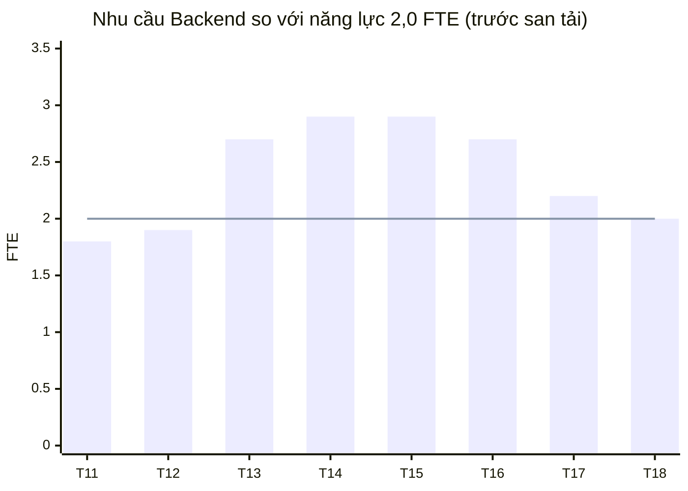

# Chương 16: Kế hoạch nguồn lực & năng lực đội

## Mục tiêu học

- Lập được Resource Plan (ai – vai trò – % thời gian – từ/đến) khớp với ngân sách và lịch.
- Đọc được resource histogram, phát hiện quá tải và san tải bằng nhiều cách.
- Đánh giá được chi phí chuyển ngữ cảnh khi nhân sự chia sẻ nhiều dự án.
- Xác định bus factor và lập kế hoạch giảm rủi ro phụ thuộc vào một người.
- Giải thích luật Brooks và biết khi nào thêm người là hợp lý.

## 16.1 Resource Plan

**Resource Plan** (kế hoạch nguồn lực) trả lời: **ai, vai trò gì, bao nhiêu phần trăm thời gian, từ ngày nào đến ngày nào**. Nó nối ba tài liệu đã có: WBS (khối lượng), ngân sách (chi phí) và lịch (khi nào). Ba đối chiếu bắt buộc:

1. **Tổng công trong Resource Plan ≥ tổng ước lượng WBS**: FoodNow: WBS 1.927 ngày công ≈ 87% năng lực 12 FTE × 185 ngày.
2. **Chi phí Resource Plan ≈ ngân sách nhân sự**: FoodNow: **1.654,8** triệu so với **1.649,9** của baseline (chênh +4,9 triệu — nằm trong khoản gộp tuyển dụng/onboarding/phép 19,3 triệu).
3. **Không ai quá 100%**: nếu lịch xếp một người vào ba task cùng lúc, đó không phải kế hoạch mà là ước mơ.

Các cột nên có: Người · Vai trò · % phân bổ · Từ · Đến · Số tháng · Đơn giá · Chi phí · Ghi chú (bus factor, chia sẻ, rủi ro).

📎 Mẫu đầy đủ: `templates/pm-plan/resource-plan.csv`

## 16.2 Resource histogram và san tải

**Resource histogram** là biểu đồ cột thể hiện **nhu cầu nguồn lực theo thời gian** so với **năng lực sẵn có**. Cột vượt đường năng lực là **quá tải** (over-allocation).

Ví dụ nhóm Backend FoodNow (năng lực 2,0 FTE) trước khi san tải, tính theo lịch baseline:

| Tuần | T11 | T12 | T13 | T14 | T15 | T16 | T17 | T18 |
|---|---|---|---|---|---|---|---|---|
| Nhu cầu (FTE) | 1,8 | 1,9 | 2,7 | 2,9 | 2,9 | 2,7 | 2,2 | 2,0 |
| Năng lực (FTE) | 2,0 | 2,0 | 2,0 | 2,0 | 2,0 | 2,0 | 2,0 | 2,0 |
| Mức tải | 90% | 95% | **135%** | **145%** | **145%** | **135%** | **110%** | 100% |

Bốn cách **san tải** (resource leveling), từ ít đau đến nhiều đau:

| Cách | Mô tả | Ưu | Nhược |
|---|---|---|---|
| **Dùng float** | Dời task không găng trong phạm vi float | Không tốn tiền | Float là dùng chung, mất đệm |
| **Thêm nguồn lực đúng lúc** | Người bán thời gian/bench cho đỉnh tải | Giải quyết trực tiếp | Chi phí học việc; chỉ hợp khi việc chia được |
| **Đổi thứ tự/tách task** | Chuyển một phần việc sang người còn dư | Nhanh | Cần kỹ năng phù hợp |
| **Giảm phạm vi/kéo dài** | Cắt hoặc dời | Bảo vệ chất lượng | Sponsor phải đồng ý |

Nguyên tắc: **san tải trước, tăng ca sau**. Tăng ca là khoản vay nặng lãi: một hai tuần thì được, bốn tuần thì đổi bằng nghỉ việc và lỗi.

## 16.3 Nhân sự chia sẻ nhiều dự án

Tài liệu "Mai Anh 50%, Ánh 50%" nhìn hợp lý trên giấy, nhưng **chia đôi một người không cho hai nửa năng suất**. Mỗi lần chuyển giữa dự án tốn thời gian **chuyển ngữ cảnh** (nhớ lại vấn đề, nạp lại môi trường, phản hồi tin nhắn cũ). Quy tắc kinh nghiệm: mỗi dự án chia sẻ thêm làm mất khoảng **10–20% năng suất** — một người 50% thường cho khoảng 40% hiệu quả. Hệ quả cho PM:

- **Đặt lịch theo khối** (ví dụ Mai Anh làm dự án FoodNow thứ Hai–Ba–Tư, dự án khác thứ Năm–Sáu) thay vì "50% mỗi ngày".
- **Trao đổi bằng văn bản** với người chia sẻ để họ tiếp nhận nhanh khi quay lại.
- **Không xếp người chia sẻ vào đường găng**.
- **Đặt trước với quản lý của họ** thứ tự ưu tiên khi hai dự án va nhau.

## 16.4 Bus factor và phụ thuộc vào một người

**Bus factor** (hệ số xe buýt) là số người tối thiểu mà nếu mất họ (nghỉ việc, ốm, bị rút) thì dự án gặp khó không cứu được. **Bus factor = 1** nghĩa là chỉ một người biết/làm được việc quan trọng — rủi ro rất cao.

Cách xác định: liệt kê module/kỹ năng then chốt (đơn hàng, thanh toán, hạ tầng, tích hợp PayEasy, thiết kế) và ghi ai hiểu sâu. Với mỗi việc chỉ một người, chọn biện pháp:

- **Pair programming/review chéo** để người thứ hai nắm.
- **Tài liệu và ADR** (quyết định kiến trúc) được cập nhật cùng code.
- **Người dự phòng** (shadow) tham gia PR liên quan.
- **Chia nhỏ để không giao cả cụm cho một người**.

Ghi bus factor thấp vào RAID như **rủi ro**, có chủ sở hữu và hành động (Ch18).

## 16.5 Luật Brooks: thêm người có làm nhanh hơn?

**Luật Brooks**: *thêm người vào dự án phần mềm đang trễ sẽ làm nó trễ hơn.* Ba lý do:

1. **Chi phí học việc**: người mới cần người cũ dạy — vừa mất công người mới vừa mất công người cũ.
2. **Chi phí giao tiếp tăng theo bình phương**: số kênh giao tiếp giữa n người là **n(n − 1) / 2**. Đội 12 người: 66 kênh. Thêm 4 người (16): 120 kênh — **tăng 82%**. Đội 15: 105 kênh.
3. **Không phải việc nào cũng chia được**: cần chín tháng để có một đứa trẻ, dù có chín người mẹ (ví dụ kinh điển).

Khi nào thêm người **hợp lý**:

- Việc **chia được và độc lập**, kỹ năng có sẵn (ví dụ thêm QA test song song);
- **Sớm** trong dự án, còn thời gian để học;
- Nguyên nhân trễ là **thiếu người thật** (không phải yêu cầu mù mờ hoặc quy trình hỏng);
- Người mới có kinh nghiệm dự án tương tự và có **buddy** tiếp nhận (Ch08).

Nếu bạn thêm người muộn vào một dự án đang có vấn đề yêu cầu, bạn nhân đôi vấn đề chứ không giải quyết nó.

## 16.6 Kế hoạch đào tạo và phát triển năng lực

Cuối Resource Plan cần có **kế hoạch năng lực**: đội cần kỹ năng gì mà chưa có (tích hợp cổng thanh toán, kiểm thử hiệu năng, iOS...), học bằng cách nào (kèm cặp, khoá, tài liệu), khi nào và ngân sách. Ở FoodNow, khoản "Đào tạo và chứng chỉ cho đội 15 triệu" trong ngân sách nằm ở đây. Nguyên tắc: **đào tạo trước khi cần, không phải khi đã cần** — nếu tuần 12 mới nhận ra không ai biết kiểm thử tải, bạn đã trễ.

## Tình huống FoodNow

Tuần 9 (02/03/2026), Hà hoàn thành Resource Plan v1.1. Khi vẽ histogram cho nhóm Backend, chị thấy nhu cầu **vọt lên 145% ở T14–T15**: hai việc chồng nhau — dịch vụ đơn hàng/thanh toán đang chạy và tích hợp PayEasy bắt đầu 30/03. Dũng cũng ở mức khoảng 130% vì vừa lead, review, vừa tự làm phần tích hợp.

Cùng lúc, giám đốc BrightSoft gọi: "Có dự án khách khác đang cháy, tôi cần Tuấn 50% trong vài tuần." Hà không từ chối thẳng. Chị mở dữ liệu: Tuấn phụ trách giỏ hàng và thanh toán phía app (3.1.3–3.1.4), những gói gần đường găng. Chị đề xuất: **rút 50% trong 4 tuần (09/03–03/04)** thay vì 8 tuần, và khi đó Khoa nhận phần giỏ hàng; đổi lại, BrightSoft cho một **Backend bench 50% từ 30/03 đến 08/05** để san tải đỉnh Backend. Giám đốc đồng ý.

Chị cũng nhận ra **bus factor = 1** ở hai chỗ: Sơn là người duy nhất hiểu sâu dịch vụ đơn hàng và thanh toán; Dũng là người duy nhất nắm kiến trúc tổng. Hà ghi cả hai vào RAID như rủi ro, giao Dũng đặt lịch pair giữa Sơn và Backend 2 mỗi tuần và yêu cầu ADR cho các quyết định thanh toán. Vài tuần sau, ở tuần 14, khi Sơn nghỉ việc (Ch43), khoản đầu tư nhỏ này tránh được một thảm hoạ.

## Bài tập

**Bài 1 (làm ra sản phẩm) — Resource Plan và san tải.** Dùng bảng nhu cầu/năng lực dưới đây cho nhóm Mobile (3 người) trong 6 tuần. Tính mức tải, phát hiện quá tải, đề xuất 2 cách san tải. Lập Resource Plan cho 5 người của dự án bạn với cột Từ/Đến.

| Tuần | 1 | 2 | 3 | 4 | 5 | 6 |
|---|---|---|---|---|---|---|
| Nhu cầu (FTE) | 2,4 | 3,0 | 3,6 | 3,9 | 3,2 | 2,8 |
| Năng lực (FTE) | 3 | 3 | 3 | 3 | 3 | 3 |

**Bài 2 (làm ra sản phẩm).** Liệt kê module then chốt của dự án bạn, ghi bus factor và một biện pháp cho mỗi module bus factor = 1.

**Bài 3 (tình huống ngắn).** Dự án trễ 3 tuần, Sponsor đòi "thêm 4 Dev để kịp". Đội hiện 8 người, nguyên nhân trễ là yêu cầu đổi liên tục. Bạn trả lời thế nào?

Gợi ý đáp án

**Bài 1:** Mức tải: 80%, 100%, 120%, **130%**, 107%, 93%. Quá tải ở tuần 3–5 (đỉnh tuần 4). Cách san tải: (1) dời một phần task không găng sang tuần 6 (dùng float); (2) mượn một Dev bán thời gian 2 tuần cho tuần 3–5; (3) giảm phạm vi tuần 4. Khuyến nghị: (1) + (2) nếu float đủ.

**Bài 3:** Chẩn đoán: nguyên nhân gốc là yêu cầu (không phải thiếu người); thêm 4 người sẽ tăng kênh giao tiếp từ 28 lên 66 (n = 8 → 12) và mất thời gian học việc. Phương án A: giữ đội, khoá yêu cầu, giảm phạm vi. B: thêm 1–2 QA hoặc người làm việc độc lập (nếu có) — hợp lý hơn. C: thêm người vào đúng chỗ tắc (nếu đo được). Lời nói mẫu: "Nếu thêm 4 người mà yêu cầu vẫn đổi, mình sẽ trễ hơn vì 4 người này cần học và hỏi. Em đề xuất khoá yêu cầu 2 sprint tới và chỉ thêm QA để test song song." Sai lầm: đồng ý thêm người để "làm màu" với Sponsor.

## Sai lầm thường gặp

1. **Sai lầm:** Lập lịch mà không xem tải từng người. → **Hậu quả:** một số người 150%, kéo dài; lịch trượt. **Cách khắc phục:** histogram và san tải trước khi chốt baseline.
2. **Sai lầm:** Coi "50%" là nửa năng suất. → **Hậu quả:** người chia sẻ giao muộn; việc nằm trên đường găng bị trễ. **Cách khắc phục:** trừ chi phí chuyển ngữ cảnh; xếp theo khối; không đặt vào đường găng.
3. **Sai lầm:** Bỏ qua bus factor. → **Hậu quả:** một người nghỉ là dự án chao đảo. **Cách khắc phục:** pair, tài liệu, người dự phòng; ghi RAID.
4. **Sai lầm:** Phản xạ "thêm người" khi trễ. → **Hậu quả:** trễ thêm vì học việc, giao tiếp. **Cách khắc phục:** chẩn đoán nguyên nhân; chỉ thêm người cho việc chia được.
5. **Sai lầm:** Để người giỏi giữ mọi thứ. → **Hậu quả:** quá tải, nghỉ việc, không ai thay được. **Cách khắc phục:** chia sẻ kiến thức; xoay vòng có kế hoạch.
6. **Sai lầm:** Chấp nhận rút người vô điều kiện. → **Hậu quả:** phá kế hoạch không ai đánh giá. **Cách khắc phục:** dùng dữ liệu ảnh hưởng; thương lượng thời hạn và bù đắp.

## Tóm tắt & tiếp theo

- Resource Plan khớp WBS, ngân sách, lịch; không ai quá 100%.
- Histogram giúp thấy quá tải; san tải bằng float, thêm nguồn lực đúng lúc, đổi thứ tự hoặc giảm phạm vi.
- Người chia sẻ mất 10–20% năng suất mỗi dự án; bus factor = 1 là rủi ro cần xử lý.
- Luật Brooks: thêm người muộn làm chậm thêm; chỉ hợp lý khi việc chia được và còn thời gian.

Chương 17 tổng hợp mọi thứ thành **Project Management Plan**: gọn, có baseline và được Sponsor ký.
