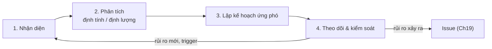

# Chương 18: Quản lý rủi ro

## Mục tiêu học

- Phân biệt được rủi ro (risk) và vấn đề (issue), và nắm quy trình bốn bước quản lý rủi ro.
- Nhận diện rủi ro bằng năm nguồn: brainstorm, checklist, lessons learned, pre-mortem, SWOT.
- Chấm được rủi ro bằng ma trận Xác suất × Tác động và tính EMV cơ bản.
- Chọn được chiến lược ứng phó (Avoid/Mitigate/Transfer/Accept; Exploit/Enhance/Share/Accept) và viết trigger, contingency plan, risk owner.
- Đặt được dự phòng dựa trên EMV thay vì cảm tính.

## 18.1 Rủi ro khác vấn đề

**Rủi ro** (risk) là sự kiện hoặc điều kiện **chưa xảy ra** nhưng nếu xảy ra sẽ ảnh hưởng đến mục tiêu — tích cực hoặc tiêu cực. **Vấn đề** (issue) là điều **đã xảy ra** và đang ảnh hưởng. Ranh giới là **thời gian**: hôm nay bạn quản lý rủi ro; ngày mai nó xảy ra, nó thành vấn đề và bạn xử lý bằng cách khác.

| | Rủi ro | Vấn đề |
|---|---|---|
| Trạng thái | Có thể xảy ra | Đã xảy ra |
| Công cụ | Xác suất, tác động, ứng phó | Người xử lý, hạn, leo thang |
| Hành động | Phòng ngừa, chuẩn bị | Khắc phục, ổn định |
| Ví dụ | "PayEasy có thể trễ chứng nhận" | "PayEasy đã báo trễ 3 tuần" |

Rủi ro có thể **tích cực** (cơ hội): ví dụ nhà hàng đối tác muốn beta sớm. Quản lý rủi ro tốt không chỉ né điều xấu mà còn **tận dụng** điều tốt.

Một sai lầm: coi danh sách rủi ro là thủ tục. Rủi ro có giá trị khi nó **thay đổi hành động của bạn hôm nay** — bạn đặt họp vendor hằng tuần, bạn viết ADR, bạn chọn thứ tự làm.

## 18.2 Quy trình quản lý rủi ro

Bốn bước chạy **liên tục**, không phải một lần ở khởi động. Nhịp đề xuất: rà RAID 15 phút mỗi tuần (Ch19); nhận diện chính thức ở đầu mỗi giai đoạn và trước mốc lớn.

## 18.3 Nhận diện rủi ro

Năm nguồn bổ trợ:

| Nguồn | Cách làm | Ưu | Nhược |
|---|---|---|---|
| **Brainstorm** | Cả đội liệt kê "điều gì có thể sai" | Nhanh, phủ rộng | Nhiều ý trùng, thiên về điều quen |
| **Checklist** | Dùng danh sách rủi ro chuẩn (kỹ thuật, con người, vendor, pháp lý…) | Không bỏ sót loại | Chung chung |
| **Lessons learned** | Đọc bài học dự án cũ | Dựa trên thực tế | Cần có dữ liệu |
| **Pre-mortem** | Giả sử dự án đã thất bại, hỏi vì sao | Lộ ra điều ít ai dám nói | Cần điều phối tốt |
| **SWOT** | Điểm mạnh, yếu, cơ hội, thách thức | Nhìn cả cơ hội | Trừu tượng |

**Pre-mortem** đặc biệt hữu ích: đội thường ngại nói "dự án có thể thất bại", nhưng dễ nói "hãy tưởng tượng nó đã thất bại rồi". Quy trình 6 bước trong 90 phút (đặt bối cảnh, viết một mình, chia sẻ, bỏ phiếu, phân tích top 8, ghi vào Risk Register).

📎 Mẫu đầy đủ: `templates/risk-raid/pre-mortem-worksheet.md`

Cách viết một rủi ro rõ ràng theo công thức: **Nguyên nhân → Sự kiện → Hậu quả.** Ví dụ: "*Vì* PayEasy quá tải hồ sơ, *nên* chứng nhận có thể trễ, *dẫn đến* trễ end-to-end và UAT." Tránh viết "rủi ro vendor" — quá mơ hồ để hành động.

## 18.4 Phân tích: ma trận Xác suất × Tác động và EMV

### Phân tích định tính

Chấm **Xác suất (P)** và **Tác động (I)** từ 1 đến 5, tính **Score = P × I**:

| Score | Mức | Hành động |
|---|---|---|
| 17–25 | Rất cao | Cần Sponsor biết ngay; kế hoạch chi tiết |
| 10–16 | Cao | Kế hoạch ứng phó, chủ sở hữu, theo dõi hằng tuần |
| 5–9 | Trung bình | Theo dõi; ứng phó nhẹ |
| 1–4 | Thấp | Ghi nhận |

Thang chấm cần **thống nhất từ trước**: ví dụ Xác suất 1 = ~10%, 2 = ~30%, 3 = ~50%, 4 = ~70%, 5 = ~90%; Tác động theo tiền hoặc tuần trễ (1 < 20 triệu hay < 1 tuần; 5 > 400 triệu hay > 4 tuần).

### Phân tích định lượng: EMV

**EMV** (Expected Monetary Value — giá trị kỳ vọng tiền tệ) = **Xác suất × Tác động (tiền)**. EMV dùng để so sánh rủi ro, quyết định có đáng đầu tư ứng phó không, và đặt dự phòng.

| ID | Rủi ro | Xác suất | Tác động (triệu) | EMV (triệu) |
|---|---|---|---|---|
| R01 | PayEasy trễ chứng nhận | 90% | 80 | 72,0 |
| R06 | Lộ dữ liệu thẻ | 10% | 800 | 80,0 |
| R05 | Hiệu năng realtime | 50% | 60 | 30,0 |
| R03 | Sponsor thêm yêu cầu | 70% | 40 | 28,0 |

Chú ý R06: Score chỉ 5 (P1 × I5, "trung bình") nhưng EMV cao nhất, vì tác động rất lớn. Đây là lý do **không chỉ nhìn Score**: rủi ro xác suất thấp – tác động cực lớn cần biện pháp riêng (chuyển giao, bảo hiểm, pentest).

**Đặt dự phòng bằng EMV**: FoodNow: tổng EMV các rủi ro Score ≥ 12 là **236,8 triệu**, nằm trong dự phòng **256,8 triệu** (đủ 92%). R06 được **chuyển giao** (tokenization, pentest 45 triệu) nên không tính vào dự phòng. Nếu tổng EMV lớn hơn dự phòng, có ba lựa chọn: tăng dự phòng, giảm rủi ro bằng ứng phó, hoặc chấp nhận có ý thức và nói với Sponsor.

## 18.5 Ứng phó rủi ro

**Rủi ro tiêu cực** — bốn chiến lược:

| Chiến lược | Ý nghĩa | Ví dụ FoodNow |
|---|---|---|
| **Avoid** (tránh) | Loại bỏ nguyên nhân | Luật nhánh ≤ 5 ngày để không có nhánh dài |
| **Mitigate** (giảm) | Giảm xác suất/tác động | Pair Sơn–Backend 2 để giảm bus factor |
| **Transfer** (chuyển giao) | Chuyển tác động cho bên khác | Tokenization của PayEasy; hợp đồng với 2 nhà cung cấp SMS |
| **Accept** (chấp nhận) | Không làm gì (chủ động) hoặc có dự phòng | Chấp nhận Mai Anh 50% và theo dõi |

**Cơ hội** — bốn chiến lược đối xứng: **Exploit** (bảo đảm xảy ra), **Enhance** (tăng khả năng/lợi ích), **Share** (chia sẻ với bên có năng lực), **Accept** (nhận nếu xảy ra).

Mỗi rủi ro có bốn thành phần cần ghi rõ:

- **Chủ sở hữu (risk owner)**: một người chịu trách nhiệm theo dõi và hành động — không phải "cả đội".
- **Hành động phòng ngừa**: việc làm ngay để giảm rủi ro.
- **Trigger** (dấu hiệu kích hoạt): tín hiệu đo được cho thấy rủi ro sắp xảy ra hoặc đã xảy ra ("vendor báo trễ", "nhánh mở > 5 ngày").
- **Contingency plan** (kế hoạch dự phòng): việc sẽ làm **nếu** rủi ro xảy ra.

**Risk appetite** (khẩu vị rủi ro): mức rủi ro tổ chức/Sponsor sẵn sàng chấp nhận. Nếu Sponsor nóng vội với ngày launch và bảo thủ về thanh toán, khẩu vị khác nhau ở từng ràng buộc; PM phải hỏi và ghi (Ch01, Charter).

📎 Mẫu đầy đủ: `templates/risk-raid/FoodNow-Risk-Register.csv` (18 mối đe doạ và 2 cơ hội, có công thức Score, Level, EMV), `templates/risk-raid/risk-response-plan.md`

## 18.6 Theo dõi và kiểm soát

- **Rà hằng tuần** (15 phút, cùng RAID): rủi ro mới, trigger, thay đổi xác suất/tác động, hành động quá hạn.
- **Báo cáo top 5** vào báo cáo tuần (Ch35).
- **Chuyển trạng thái**: đang theo dõi → đã xảy ra (thành Issue) → đóng. Khi rủi ro xảy ra, kích hoạt contingency và cập nhật dự phòng đã dùng.
- **Đóng rủi ro** khi hết khả năng xảy ra hoặc đã ứng phó xong; ghi bài học.

## Tình huống FoodNow

Ngày 22/01/2026, Hà chạy pre-mortem 90 phút với 12 người. Nhóm nguyên nhân được bỏ phiếu cao nhất: **"Cổng thanh toán trễ chứng nhận"** (11 phiếu). Mai Anh nói một điều làm cả phòng im lặng: "Em từng làm dự án tích hợp cổng thanh toán, chứng nhận luôn trễ vì vendor có nhiều khách." Nhờ vậy Hà xếp nó lên R01, ghi trigger ("vendor báo trễ hoặc sandbox không ổn định"), chủ sở hữu (chính chị) và hai hành động: họp vendor hằng tuần, chốt ngày hứa bằng văn bản với chị Yến. Chị cũng đưa mốc "PayEasy cấp sandbox 27/03" vào lịch như phụ thuộc bên ngoài (Ch12).

Ngày 20/04/2026 (tuần 16), Yến báo PayEasy sẽ trễ chứng nhận **3 tuần**. Trigger đã kích hoạt. Hà không hoảng: chị mở Risk Register và Risk Response Plan, chuyển R01 thành Issue I-006, và kích hoạt contingency đã viết từ tháng 1 — crashing thanh toán end-to-end, fast-tracking kiểm thử bảo mật, thuê thêm Dev/QA 4 tuần. Chi phí ước ≈ 110 triệu, dưới ngưỡng 120 triệu Hà được tự quyết theo Charter; chị báo anh Bảo ngay trong ngày (Ch21 kể chi tiết). Bảng EMV cho thấy R01 là rủi ro có giá trị kỳ vọng lớn nhất (72 triệu) — chính là lý do dự phòng 12% có lập luận. Sự kiện này cũng nhắc chị rà tiếp R16 (nhánh sống lâu), vốn được ghi từ 13/04 và sẽ nổ ở tuần 18.

## Bài tập

**Bài 1 (làm ra sản phẩm) — Pre-mortem.** Chạy pre-mortem (hoặc mô phỏng một mình) cho dự án của bạn: liệt kê ≥ 12 nguyên nhân thất bại, gom nhóm, chọn 6 nhóm, điền bảng gồm: dấu hiệu sớm, phòng ngừa, chủ sở hữu, Score.

**Bài 2 (làm ra sản phẩm).** Lập Risk Register ≥ 10 rủi ro (gồm 1–2 cơ hội) với P, I, EMV, chiến lược, trigger, contingency, chủ sở hữu; so tổng EMV rủi ro Score ≥ 12 với dự phòng đề xuất.

**Bài 3 (tình huống ngắn).** Rủi ro "lộ dữ liệu khách" có P = 1 (10%) và I = 5 (800 triệu). Đội nói "xác suất thấp, bỏ qua." Sponsor hỏi bạn ý kiến. Bạn trả lời thế nào? Nêu 2 chiến lược.

Gợi ý đáp án Bài 3

**Chẩn đoán:** Score thấp (5) nhưng EMV = 80 triệu và tác động phi tiền tệ lớn (uy tín, pháp lý). **Phương án A — Transfer:** dùng dịch vụ tokenization của vendor thanh toán; mua bảo hiểm an ninh mạng; hợp đồng có điều khoản trách nhiệm. **Phương án B — Mitigate:** pentest bên ngoài, mã hoá dữ liệu, giới hạn quyền, quét bảo mật trong CI. **Phương án C — Accept:** không nên, vì hậu quả vượt khả năng chịu đựng. **Khuyến nghị:** A + B (chi phí ≈ 45 triệu < EMV 80 triệu). **Lời nói mẫu:** "Xác suất thấp nhưng nếu xảy ra thì thiệt hại rất lớn và không đảo ngược. Em đề xuất chuyển giao phần lưu thẻ cho PayEasy và làm kiểm thử xâm nhập; tổng 45 triệu so với giá trị kỳ vọng 80 triệu." **Sai lầm:** chỉ nhìn Score; hoặc coi mọi rủi ro thấp là bỏ qua.

## Sai lầm thường gặp

1. **Sai lầm:** Rủi ro viết mơ hồ ("rủi ro vendor"). → **Hậu quả:** không ai biết làm gì. **Cách khắc phục:** công thức Nguyên nhân → Sự kiện → Hậu quả.
2. **Sai lầm:** Lập Risk Register một lần rồi cất. → **Hậu quả:** không ai theo dõi, sự cố là bất ngờ. **Cách khắc phục:** rà hằng tuần, gắn với báo cáo.
3. **Sai lầm:** Không có chủ sở hữu hoặc chủ sở hữu là "cả đội". → **Hậu quả:** không ai hành động. **Cách khắc phục:** một người, có hạn.
4. **Sai lầm:** Chỉ nhìn Score, bỏ qua EMV và rủi ro tác động cực lớn. → **Hậu quả:** bỏ sót rủi ro xác suất thấp – hậu quả nặng. **Cách khắc phục:** cả Score và EMV; xử lý riêng rủi ro thảm hoạ.
5. **Sai lầm:** Ứng phó nhưng không có trigger. → **Hậu quả:** biết khi đã quá muộn. **Cách khắc phục:** trigger đo được, ghi cùng rủi ro.
6. **Sai lầm:** Bỏ qua cơ hội. → **Hậu quả:** bỏ lỡ lợi ích dễ lấy. **Cách khắc phục:** thêm phần cơ hội trong pre-mortem/brainstorm; chiến lược Exploit/Enhance.

## Tóm tắt & tiếp theo

- Rủi ro chưa xảy ra; vấn đề đã xảy ra; quy trình gồm nhận diện, phân tích, ứng phó, theo dõi và lặp.
- Năm nguồn nhận diện; pre-mortem giúp lộ ra điều ít ai nói; viết rủi ro theo nguyên nhân → sự kiện → hậu quả.
- Ma trận P × I để xếp hạng; EMV để so sánh và đặt dự phòng; đừng bỏ qua rủi ro xác suất thấp tác động lớn.
- Bốn chiến lược cho rủi ro (Avoid/Mitigate/Transfer/Accept) và cho cơ hội; mỗi rủi ro có chủ sở hữu, trigger, contingency.

Chương 19 mở rộng sang **RAID Log** — nơi quản lý cùng lúc Risk, Assumption, Issue, Dependency.
