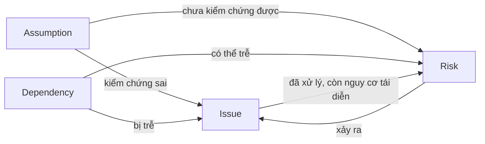

# Chương 19: RAID Log: Risk, Assumption, Issue, Dependency

## Mục tiêu học

- Phân biệt được bốn thành phần R, A, I, D và ranh giới giữa chúng.
- Mô tả được vòng đời từng loại: Assumption được kiểm chứng/đóng thế nào, Issue leo thang khi nào, Dependency có ngày cần/ngày hứa.
- Chạy được nhịp rà RAID hằng tuần 15 phút có đầu ra.
- Phân biệt RAID Log với Risk Register và chuyển đổi qua lại giữa các loại.

## 19.1 RAID là gì

**RAID Log** là một bảng duy nhất theo dõi bốn loại "thứ có thể làm lệch dự án":

| Chữ | Tên | Câu hỏi | Ví dụ FoodNow |
|---|---|---|---|
| **R** | **Risk** (rủi ro) | Điều gì **có thể** xảy ra? | PayEasy có thể trễ chứng nhận |
| **A** | **Assumption** (giả định) | Ta đang **coi là đúng** điều gì? | Khách gửi API nhà hàng trước 15/03 |
| **I** | **Issue** (vấn đề) | Điều gì **đã** xảy ra? | Sơn nghỉ việc |
| **D** | **Dependency** (phụ thuộc) | Ta **cần** gì từ ai, khi nào? | PayEasy cấp sandbox 27/03 |

Vì sao gộp bốn loại vào một? Vì chúng **chuyển đổi cho nhau** liên tục và thường cùng một chủ đề: một giả định (PayEasy đúng hẹn) có thể sai (thành issue), gắn với một phụ thuộc (ngày chứng nhận) và một rủi ro (trễ). Nếu để bốn nơi, bạn không thấy quan hệ.

## 19.2 Ranh giới giữa bốn loại

Dùng ba câu hỏi để phân loại một mục:

1. **Đã xảy ra chưa?** — Rồi → **Issue**.
2. **Chưa xảy ra và ta không chắc?** — **Risk**.
3. **Ta đang tin điều gì đó đúng mà chưa kiểm chứng?** — **Assumption**.
4. **Ta cần cái gì đó từ bên khác để tiếp tục?** — **Dependency**.

Ví dụ phân biệt: "API dữ liệu nhà hàng có thể trễ" là Risk; "Khách sẽ gửi API trước 15/03" là Assumption; "Ta cần API đó vào 15/03" là Dependency (có ngày cần); "Đến 16/03 vẫn chưa có API" là Issue. Cùng một chủ đề, bốn góc nhìn — và nên **liên kết các dòng** bằng cột `Linked_IDs`.

## 19.3 Vòng đời từng loại

### Risk
Nhận diện → phân tích → ứng phó → theo dõi → **đóng** (hết khả năng) hoặc **chuyển thành Issue** khi xảy ra (Ch18).

### Assumption
Mỗi giả định phải có **người kiểm chứng** và **hạn kiểm chứng**. Kết quả:
- **Đúng** → đóng, ghi ngày xác nhận;
- **Sai** → ngay lập tức tạo Issue và/hoặc Risk; đánh giá tác động tới lịch, ngân sách, phạm vi;
- **Chưa biết** → tiếp tục theo dõi; nếu hạn kiểm chứng đến mà chưa rõ, coi như rủi ro.

Giả định không kiểm chứng là loại "bom hẹn giờ" phổ biến nhất trong dự án. Ví dụ: "Sơn ở lại đến hết dự án" là một giả định không ai viết ra — cho đến khi Sơn nghỉ việc.

### Issue
Mỗi issue có **chủ sở hữu, hạn, mức ưu tiên** (P1 nghiêm trọng, P2, P3). Quy tắc leo thang:
- P1 hoặc quá hạn → báo PM ngay; PM báo Sponsor trong **24 giờ**;
- Không tự gỡ trong 1 ngày → leo thang theo Ch06;
- Đóng khi hành động xong và xác nhận bởi người bị ảnh hưởng.

### Dependency
Mỗi phụ thuộc có **hai ngày**:
- **Ngày cần** (need-by): ngày dự án cần nhận;
- **Ngày hứa** (promised): ngày bên kia cam kết.

Cột tiếp theo là **ngày thực nhận** và **độ trễ**. Nếu *ngày hứa > ngày cần*, đó là rủi ro ngay từ đầu — đừng nhận. Nếu *ngày hứa bị đẩy lùi*, cập nhật, đánh giá đường găng (Ch12) và leo thang khi trễ vượt float.

## 19.4 Nhịp rà soát hằng tuần: 15 phút

Đưa RAID vào nhịp làm việc, không để nó là tài liệu "khi có thời gian":

| Phút | Nội dung | Đầu ra |
|---|---|---|
| 0–3 | Issue mới/đang mở | Trạng thái, leo thang |
| 3–6 | Dependency đến hạn trong 14 ngày | Ngày hứa mới, nhắc |
| 6–9 | Top 5 rủi ro và trigger | Cập nhật Score; kích hoạt contingency |
| 9–12 | Assumption cần xác nhận | Đóng/đổi trạng thái |
| 12–15 | Mục mới; chốt hành động | Danh sách người – hạn |

Quy tắc: **cập nhật ngay trong buổi họp**, mỗi mục một **chủ sở hữu**, đọc lại hành động ở cuối. Top 3 mục nóng đưa vào báo cáo tuần (Ch35).

📎 Mẫu đầy đủ: `templates/risk-raid/raid-review-agenda.md`, `templates/risk-raid/FoodNow-RAID-Log.csv` (32 dòng: 8 Risk, 10 Assumption, 6 Issue, 8 Dependency)

Trích RAID FoodNow (tuần 16):

| ID | Loại | Nội dung | Owner | Trạng thái |
|---|---|---|---|---|
| A-02 | Assumption | Khách gửi API nhà hàng trước 15/03 | Châu | **Sai** (nhận 03/04) |
| D-02 | Dependency | PayEasy cấp chứng nhận (cần 29/05) | Yến | **Trễ** — mới hứa 19/06 |
| I-006 | Issue | PayEasy báo trễ chứng nhận 3 tuần | Hà | Đang xử lý |
| R-02 | Risk | Mất Backend senior (bus factor 1) | Dũng | Đã xảy ra → I-004 |

## 19.5 RAID Log và Risk Register

| | Risk Register | RAID Log |
|---|---|---|
| Phạm vi | Chỉ rủi ro (chi tiết) | Cả bốn loại |
| Độ chi tiết rủi ro | Cao (P, I, EMV, chiến lược, trigger, contingency) | Vừa (tiêu đề, owner, trạng thái, liên kết) |
| Người dùng | PM, Sponsor khi cần | Cả đội hằng tuần |
| Khi nào | Phân tích và ứng phó sâu | Theo dõi hàng ngày/tuần |

Dùng cả hai: **Risk Register** cho phân tích sâu top 5–8 rủi ro; **RAID Log** làm bảng vận hành hằng tuần và liên kết (cột `Linked_IDs` trỏ tới ID trong Risk Register). Đừng duy trì hai bản rủi ro song song không đồng bộ; chọn một nguồn và liên kết.

*Xem thêm sách IT Business Analyst — Từ Zero Đến Thành Thạo, Chương 31, về RAID Log dưới góc nhìn BA; hai sách dùng cùng khái niệm.*

## 19.6 Chuyển đổi giữa các loại

Ba quy tắc: (1) **không xoá dòng** khi chuyển — đổi trạng thái và liên kết để giữ lịch sử; (2) mỗi chuyển đổi phải kèm hành động và người; (3) nếu một chủ đề xuất hiện 3 lần ở các loại khác nhau, gộp thành một nhóm theo dõi.

## Tình huống FoodNow

Tuần 11, thứ Hai 16/03/2026. Trong buổi rà RAID 15 phút, đến mục Assumption, Hà đọc dòng A-02: *"Khách gửi tài liệu API dữ liệu nhà hàng trước 15/03."* Chị hỏi Châu, người được giao xác nhận. Châu ngập ngừng: "Bên nhà hàng chưa đưa, em đợi thêm." Hôm qua là 15/03.

Hà đổi ngay A-02 thành **Sai**, tạo **I-002** (Issue: API dữ liệu nhà hàng chưa có, P3), cập nhật **D-03** (Dependency: ngày cần 15/03, ngày hứa lùi) và liên kết ba dòng. Việc cần API là tích hợp dữ liệu nhà hàng và migrate — nhánh phụ có float 5 ngày; chị tính nhanh: trễ dưới 2 tuần chưa chạm đường găng, nhưng trễ hơn sẽ làm Sơn (vốn gần đường găng) bị chồng việc. Chị gửi anh Bảo một tin ngắn: vấn đề – tác động – phương án – đề nghị: "Anh nhờ anh Huy hoặc bộ phận vận hành gửi ngay cho Châu; nếu đến 27/03 chưa có, em sẽ leo thang lên cấp 2." Anh Bảo gọi thẳng cho đối tác; tài liệu đến ngày 03/04 (trễ 19 ngày).

Điểm quan trọng: nhờ RAID, khoảng cách **ngày cần – ngày hứa – hôm nay** trở nên hiển thị; nếu chỉ là một ghi chú trong đầu Châu, sự việc có thể đến tận tuần 14 mới lộ. Hà cũng thêm một quy tắc vào Working Agreement: *assumption nào có hạn kiểm chứng trong 7 ngày phải được nhắc lại ở buổi rà RAID*.

## Bài tập

**Bài 1 (làm ra sản phẩm) — Lập RAID.** Lập RAID Log ≥ 20 dòng cho dự án của bạn (ít nhất 4 dòng mỗi loại), có cột Owner, Status, Need_By, Promised_Date (cho Dependency) và Linked_IDs; chỉ ra 3 chuỗi liên kết (assumption → issue → risk).

**Bài 2 (làm ra sản phẩm) — Phân loại 12 câu.** Phân loại mỗi câu thành R, A, I hoặc D:

1. "Chúng ta cần tài khoản sandbox của vendor SMS trước 09/03."
2. "Đội sẽ ổn định 12 người suốt dự án."
3. "Server staging đang sập từ sáng nay."
4. "Có thể Apple sẽ từ chối bản app iOS."
5. "Khách sẽ phản hồi mọi yêu cầu trong 2 ngày làm việc."
6. "Khách hàng vừa thông báo cắt 20% ngân sách."
7. "Dev senior có thể nghỉ việc."
8. "Ta cần chứng nhận từ vendor trước 29/05."
9. "Tất cả nhà hàng đối tác đều có tablet."
10. "Bản đồ bên thứ ba có thể tăng giá."
11. "Giấy phép phông chữ dùng trong thiết kế đã hết hạn từ tuần trước."
12. "Ta cần đội pháp chế xem lại điều khoản trước go-live."

**Bài 3 (tình huống ngắn).** Bạn phát hiện một giả định quan trọng ("Sponsor luôn có mặt trong tuần Go-live") sai: Sponsor sẽ đi công tác đúng tuần đó. Bạn làm gì trong 24 giờ đầu?

Gợi ý đáp án

**Bài 2:** 1 D; 2 A; 3 I; 4 R; 5 A; 6 I; 7 R; 8 D; 9 A; 10 R; 11 I (đã xảy ra); 12 D.

**Bài 3:** Chẩn đoán: assumption sai → tạo Issue (Sponsor vắng) và Risk (quyết định Go/No-Go, xử lý sự cố chậm); tác động vào mốc 03/10. Phương án A: dời lịch công tác/họp hoàn toàn (hỏi Sponsor). B: uỷ quyền bằng văn bản cho Châu/đại diện ra quyết định Go/No-Go và sự cố, kèm kênh liên lạc khẩn. C: dời go-live. Khuyến nghị: B + kênh khẩn, C chỉ nếu Sponsor không đồng ý. **Lời nói mẫu:** "Em vừa biết anh sẽ ở nước ngoài tuần go-live. Mình cần người thay anh quyết định Go/No-Go và sự cố; anh uỷ quyền cho chị Châu bằng văn bản, và em sẽ thêm anh vào nhóm xử lý sự cố với giờ liên lạc cố định." **Sai lầm:** im lặng, hy vọng Sponsor về kịp.

## Sai lầm thường gặp

1. **Sai lầm:** Chỉ có Risk Register, không có Assumption, Dependency. → **Hậu quả:** giả định sai và phụ thuộc trễ là nguồn sự cố lớn nhưng không ai thấy. **Cách khắc phục:** dùng RAID đủ bốn loại.
2. **Sai lầm:** Assumption không có người kiểm chứng/hạn. → **Hậu quả:** không ai xác nhận; sai lộ ra khi đã muộn. **Cách khắc phục:** mỗi giả định có owner và hạn.
3. **Sai lầm:** Dependency chỉ ghi ngày cần. → **Hậu quả:** không phát hiện sớm khi bên kia hứa muộn hơn. **Cách khắc phục:** hai ngày (cần và hứa) và độ trễ.
4. **Sai lầm:** Xoá dòng khi rủi ro thành issue. → **Hậu quả:** mất lịch sử và bài học. **Cách khắc phục:** đổi trạng thái, liên kết ID.
5. **Sai lầm:** Rà RAID theo cảm hứng. → **Hậu quả:** log lỗi thời. **Cách khắc phục:** nhịp cố định 15 phút hằng tuần, cập nhật trong họp.
6. **Sai lầm:** Log dài 200 dòng không ai đọc. → **Hậu quả:** không hành động. **Cách khắc phục:** dọn hằng tháng, tập trung top mục, lọc theo trạng thái.

## Tóm tắt & tiếp theo

- RAID gộp Risk, Assumption, Issue, Dependency; chúng chuyển đổi và liên kết với nhau.
- Assumption cần người kiểm chứng và hạn; Issue cần chủ sở hữu và quy tắc leo thang; Dependency có ngày cần và ngày hứa.
- Rà 15 phút hằng tuần, cập nhật trực tiếp; RAID vận hành hằng tuần, Risk Register phân tích sâu.
- Khi assumption sai hoặc dependency trễ, chuyển thành Issue/Risk và hành động ngay.

Chương 20 nói về **quản lý thay đổi**: cách đón nhận yêu cầu mới mà không phá kế hoạch.
