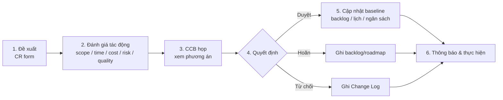

# Chương 20: Quản lý thay đổi (Change Control)

## Mục tiêu học

- Phân biệt scope creep với change request hợp lệ và nhận diện nguồn thay đổi.
- Vận hành quy trình CR: đề xuất → đánh giá tác động → CCB → quyết định → cập nhật baseline → thông báo.
- Lập được CCB: thành phần, nhịp họp, quyền quyết định, thay đổi khẩn cấp.
- Xử lý thay đổi trong Agile (backlog so với sprint đang chạy).
- Nói "không" và "được, nhưng…" với khách và ghi vào Change Log.

## 20.1 Thay đổi là bình thường; thay đổi không kiểm soát là vấn đề

Không có dự án phần mềm nào giữ nguyên yêu cầu từ đầu đến cuối. Người dùng thấy sản phẩm sẽ có ý mới; thị trường đổi; quy định đổi. Mục tiêu của quản lý thay đổi **không phải chặn thay đổi**, mà là **bảo đảm mọi thay đổi được đánh giá tác động và được người có thẩm quyền chấp thuận trước khi thực hiện**.

**Nguồn thay đổi** thường gặp:

| Nguồn | Ví dụ FoodNow |
|---|---|
| Sponsor/khách | Anh Bảo muốn "đặt món theo nhóm" trong MVP |
| Người dùng/vận hành | CS Manager muốn đổi luồng huỷ đơn |
| Kỹ thuật | Phát hiện lỗi thiết kế, cần đổi kiến trúc |
| Thị trường/đối thủ | Đối thủ ra tính năng mới |
| Pháp lý/tuân thủ | Quy định mới về ví điện tử |
| Nội bộ dự án | Đổi nhân sự, đổi lịch |

**Scope creep** (phạm vi phình dần) là thay đổi **không được kiểm soát**: các yêu cầu nhỏ chen vào không ai đánh giá, không ai duyệt. **Change request hợp lệ** là thay đổi **có văn bản, có đánh giá tác động, có người duyệt**. Cùng một yêu cầu "thêm nút chia sẻ" có thể là scope creep (nếu Dev tự làm "cho xong") hoặc là CR hợp lệ (nếu được ghi, đánh giá và duyệt). Đó là sự khác biệt.

## 20.2 Quy trình Change Request

Sáu bước:

1. **Đề xuất**: người yêu cầu điền CR form (tên, nhu cầu, giá trị kỳ vọng, mức khẩn). Không nhận yêu cầu bằng lời nói cho thay đổi ngoài baseline.
2. **Đánh giá tác động**: người làm ước lượng công (O/M/P); PM tính tác động lên **scope, time, cost, risk, quality, resource**, đường găng và float. Luôn nêu **≥ 3 phương án** (gồm "không làm" hoặc "làm sau").
3. **CCB xem xét**: nhóm có thẩm quyền họp và thảo luận.
4. **Quyết định**: duyệt, hoãn hoặc từ chối; ghi người, ngày, lý do.
5. **Cập nhật baseline**: nếu duyệt, cập nhật scope/lịch/chi phí và Baseline Register (Ch17).
6. **Thông báo và thực hiện**: báo người đề xuất, đội và stakeholder trong 24 giờ.

📎 Mẫu đầy đủ: `templates/change-request/change-request-form.md`, `templates/change-request/impact-assessment.md`

### Đánh giá tác động: đừng tính sai

Ba lỗi hay gặp:

- **Dùng cả đội để tính thời gian** trong khi chỉ một nhóm làm được việc đó. Ví dụ FoodNow CR-001: 104 ngày công ÷ (6,5 FTE Backend/Mobile × 4,74 ngày/tuần × 0,87) ≈ **3,9 tuần**, chứ không phải 104 ÷ (12 FTE × …) ≈ 1,7 tuần.
- **Quên chi phí phụ**: kiểm thử, tài liệu, đào tạo, UAT thêm.
- **Quên tác động lên đường găng, rủi ro, chất lượng**, chỉ nhìn công.

## 20.3 Change Control Board (CCB)

**CCB** (Ban kiểm soát thay đổi) là nhóm có thẩm quyền duyệt CR. Thành phần tối thiểu:

| Vai trò | Người ở FoodNow | Lý do |
|---|---|---|
| Chủ trì (người có quyền ngân sách) | Bảo (Sponsor) | Quyết định cuối |
| Đại diện sản phẩm | Châu (PO) | Giá trị và ưu tiên |
| PM | Hà | Tác động lịch/chi phí; điều phối |
| Tech Lead | Dũng | Tác động kỹ thuật |
| QA Lead | Nam | Tác động chất lượng |

Nguyên tắc: **ít người, đủ quyền**; họp theo **nhịp cố định** (FoodNow: thứ Năm, gộp vào họp Sponsor để tiết kiệm thời gian) thay vì họp riêng mỗi CR; có ngưỡng: **thay đổi nhỏ** (< 5 ngày công, không ảnh hưởng mốc và ngân sách) PM/PO duyệt; **thay đổi lớn** cần CCB.

**Thay đổi khẩn cấp** (lỗi nghiêm trọng, quy định, sự cố): cho phép **duyệt tắt** bởi Sponsor + PM trong 24 giờ; sau đó bổ sung CR form và đưa vào CCB kế tiếp để ghi nhận. Không dùng "khẩn cấp" như cách né quy trình — theo dõi số lượng CR khẩn (nếu > 20% tổng CR, có vấn đề).

## 20.4 Thay đổi trong Agile

Trong Agile, khái niệm "yêu cầu thay đổi" khác vì backlog vốn **sống**:

| Loại thay đổi | Xử lý |
|---|---|
| **Thứ tự ưu tiên trong backlog** | PO tự quyết; không cần CR |
| **Chi tiết story trong epic đã duyệt** | PO + BA điều chỉnh; không đổi baseline |
| **Thêm story trong phạm vi epic** | PO xếp backlog; nếu vượt dung lượng, hoán đổi |
| **Thêm epic hoặc đổi mốc/ngân sách** | **Change Request** |
| **Đổi nội dung sprint đang chạy** | Không đổi; ngoại lệ khi Sprint Goal mất ý nghĩa — PO có thể huỷ sprint (rất hiếm) |

Quy tắc: **sprint đang chạy được bảo vệ**. Yêu cầu mới vào backlog và được xem xét ở Sprint Planning kế tiếp. Trong Hybrid, ranh giới giữa "trong phạm vi" và "ngoài phạm vi" là Scope Statement/epic đã duyệt.

## 20.5 Nói "không" và "được, nhưng…"

Người yêu cầu thường không phản đối quy trình; họ phản đối cảm giác bị từ chối. Ba mẫu câu:

| Tình huống | Mẫu câu |
|---|---|
| Ngoài phạm vi, không hợp mục tiêu | "Ý này hay, nhưng em không thể nhận vào MVP mà không đổi ràng buộc. Em ghi vào R2 và mang đi đánh giá tác động." |
| Có thể, nhưng phải đánh đổi | "Được, nhưng nó sẽ tốn khoảng 4 tuần và 130 triệu, hoặc mình đổi với X. Anh chọn cách nào?" |
| Cần thêm thông tin | "Em cần 2 ngày để đội ước lượng. Sau đó em gửi anh 3 phương án." |

Nguyên tắc: **không nói "không" trần trụi**, cũng **không nói "được" khi chưa đánh giá**. Luôn đưa **lựa chọn** để người có thẩm quyền quyết định (Ch36 học thêm về đàm phán).

## 20.6 Change Log

**Change Log** ghi mọi CR: mã, ngày, người đề xuất, tên, loại, tác động (scope/lịch/chi phí), quyết định, ngày, người duyệt, có đổi baseline không. Nó là bằng chứng khi tranh cãi ("đã thống nhất từ tháng 3") và là nguyên liệu cho lessons learned.

📎 Mẫu đầy đủ: `templates/change-request/change-log.csv` (5 CR mẫu với công thức chi phí)

Chỉ số nên theo dõi: **số CR/tháng**, **tỷ lệ duyệt/từ chối**, **tỷ lệ khẩn cấp**, **tổng chi phí thay đổi** — tăng đột biến là dấu hiệu yêu cầu ban đầu chưa rõ (Ch07).

## Tình huống FoodNow

Thứ Hai 09/03/2026 (tuần 10). Anh Bảo gửi tin nhắn: "Chị Hà, tôi muốn có 'đặt món theo nhóm' ngay trong MVP để chạy chiến dịch văn phòng. Chắc không khó lắm?" Hà không trả lời "được" hay "không". Chị nhắn: "Ý rất tốt. Em cho đội đánh giá tác động và gửi anh 3 phương án trước họp thứ Năm." Rồi chị điền **CR-001**.

Trong hai ngày, Dũng, Khoa, Nam và Mai Anh ước lượng theo ba điểm. Tổng PERT khoảng **104 ngày công**. Vì chỉ khoảng 6,5 FTE Backend/Mobile làm được, thời gian tăng khoảng **4 tuần**; chi phí T&M ≈ **130 triệu**; và Backend đã quá tải ở tuần 13–16 (Ch16). Hà chuẩn bị bốn phương án: đưa vào MVP và trễ 4 tuần; đưa vào MVP và cắt hạng mục khác; giữ ở R2 (khuyến nghị); hoặc làm bản tối giản ở R1 (~35 ngày).

Ở CCB thứ Năm 12/03, anh Bảo ban đầu nghiêng về A. Hà hỏi: "Anh giữ ràng buộc nào cố định: ngày 03/10 hay tính năng này?" Anh Bảo trả lời: "Ngày 03/10, vì đã lên kế hoạch marketing." Hà: "Vậy phương án A làm hỏng điều anh cần nhất. Em đề xuất C, và nếu dữ liệu MVP tốt thì làm bản tối giản D ở R1." CCB quyết định **giữ ở R2**. Hà ghi vào Change Log, cập nhật Roadmap v1.0 (13/03) và thông báo đội. Không thay đổi baseline.

Hà rút ra: nếu không có Charter với ràng buộc ưu tiên viết sẵn (Ch05), câu hỏi "anh giữ cái nào?" sẽ không có nền để hỏi.

## Bài tập

**Bài 1 (làm ra sản phẩm) — Đánh giá tác động.** Đề bài: khách yêu cầu "thêm tính năng chat giữa khách và tài xế" vào dự án 9 tháng, đội 12 người. Ước lượng theo O/M/P: Backend 20/28/40, Mobile 25/35/50, Kiểm thử 6/8/14, UX 3/4/7 ngày công. Tính PERT E tổng, thời gian tăng nếu nhóm làm được là 6,5 FTE (hệ số 4,74 ngày/tuần, hiệu suất 0,87), chi phí ở 1,25 triệu/ngày; điền CR form với ≥ 3 phương án và khuyến nghị.

**Bài 2 (làm ra sản phẩm).** Lập Change Log ≥ 6 dòng cho dự án của bạn và tính tỷ lệ duyệt/từ chối/khẩn cấp.

**Bài 3 (tình huống ngắn).** Ở tuần thứ 20, khách nói: "Khách hàng của tôi phản ánh có lỗi nghiêm trọng về quy tắc tính giá, cần sửa gấp trong hôm nay." Quy trình bình thường mất 1 tuần. Bạn làm gì?

Gợi ý đáp án

**Bài 1:** E: Backend (20+112+40)/6 = 28,67; Mobile (25+140+50)/6 = 35,83; Test (6+32+14)/6 = 8,67; UX (3+16+7)/6 = 4,33. **Tổng ≈ 77,5 ngày công.** Năng lực nhóm = 6,5 × 4,74 × 0,87 ≈ 26,8 ngày/tuần → 77,5 ÷ 26,8 ≈ **2,9 tuần**. Chi phí = 77,5 × 1,25 = **96,9 triệu**. Phương án: (A) đưa vào giữ đội — trễ ~3 tuần; (B) đưa vào và cắt hạng mục tương đương; (C) hoãn sang release sau; (D) dùng dịch vụ chat của bên thứ ba (rẻ hơn, phụ thuộc vendor). Khuyến nghị tuỳ ràng buộc ưu tiên: nếu Time cố định → C hoặc D.

**Bài 3:** Thay đổi **khẩn cấp**: duyệt tắt bởi Sponsor + PM trong 24 giờ; Dev sửa và QA kiểm thử; sau đó bổ sung CR form, đánh giá tác động thực tế, đưa vào CCB kế tiếp. Lời nói mẫu: "Em xử lý khẩn ngay hôm nay theo quy trình khẩn; em cần anh xác nhận bằng tin nhắn. Sau khi sửa xong, em sẽ bổ sung hồ sơ CR." **Sai lầm:** làm ngay không ghi; hoặc bắt chờ CCB cả tuần khi lỗi nghiêm trọng.

## Sai lầm thường gặp

1. **Sai lầm:** Nhận yêu cầu bằng lời nói. → **Hậu quả:** không dấu vết, tranh cãi. **Cách khắc phục:** CR form cho mọi thay đổi ngoài baseline.
2. **Sai lầm:** Đánh giá tác động chỉ tính công. → **Hậu quả:** quên rủi ro, chất lượng, đường găng. **Cách khắc phục:** đủ sáu khía cạnh.
3. **Sai lầm:** Tính thời gian bằng cả đội. → **Hậu quả:** ước lượng thiếu, hứa quá. **Cách khắc phục:** dùng năng lực nhóm thực làm việc.
4. **Sai lầm:** CCB đông người, họp riêng mỗi CR. → **Hậu quả:** chậm, tốn thời gian. **Cách khắc phục:** ít người đủ quyền, gộp vào nhịp họp hiện có.
5. **Sai lầm:** Lạm dụng "khẩn cấp". → **Hậu quả:** quy trình mất tác dụng. **Cách khắc phục:** tiêu chí khẩn cấp, theo dõi tỷ lệ.
6. **Sai lầm:** Đổi nội dung sprint đang chạy. → **Hậu quả:** đội mất tập trung; cam kết vỡ. **Cách khắc phục:** yêu cầu mới vào backlog và xét ở planning tiếp.

## Tóm tắt & tiếp theo

- Thay đổi là bình thường; scope creep là thay đổi không kiểm soát; CR hợp lệ có văn bản, đánh giá và người duyệt.
- Quy trình sáu bước; đánh giá tác động đủ scope/time/cost/risk/quality/resource và dùng năng lực nhóm thực.
- CCB ít người đủ quyền, nhịp cố định, có ngưỡng và đường khẩn cấp.
- Trong Agile: ưu tiên backlog thuộc PO; thêm epic hoặc đổi baseline mới cần CR; sprint đang chạy được bảo vệ.

Chương 21 chuyển sang **vendor, phụ thuộc bên ngoài và mua sắm**: khi "bên kia" trễ thì làm gì.
