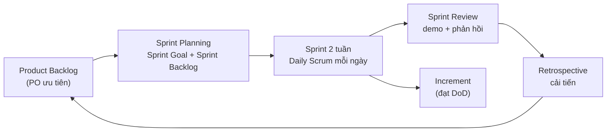

# Chương 23: Scrum dưới góc nhìn PM

## Mục tiêu học

- Mô tả được PM làm gì (và không làm gì) khi đội chạy Scrum, phối hợp với Scrum Master và Product Owner.
- Nắm vai trò, sự kiện, artifact của Scrum ở mức tóm lược và Sprint Goal.
- Nối được kế hoạch khung Waterfall với các sprint.
- Tính được capacity của sprint và phân biệt commitment với forecast.
- Nhận biết khi nào Scrum không phù hợp.

## 23.1 Scrum trong một trang

**Scrum** là khung làm việc Agile dựa trên các vòng ngắn cố định (**sprint**, thường 1–4 tuần) để giao một phần sản phẩm dùng được. (Diễn đạt lại từ Scrum Guide; nguồn ở Phụ lục G.)

| Thành phần | Nội dung |
|---|---|
| **Vai trò** | **Product Owner** (tối đa hoá giá trị, quản lý Product Backlog) · **Scrum Master** (giúp đội và tổ chức làm Scrum tốt) · **Developers** (những người làm ra Increment) |
| **Sự kiện** | Sprint · Sprint Planning · Daily Scrum · Sprint Review · Sprint Retrospective |
| **Artifact** | Product Backlog (+ Product Goal) · Sprint Backlog (+ Sprint Goal) · Increment (+ Definition of Done) |

Ba đặc điểm cần nhớ: **cố định khung thời gian**; **đội tự tổ chức** — không ai giao việc chi tiết cho đội; **kiểm tra và thích nghi** qua Review và Retro.

## 23.2 PM làm gì khi đội chạy Scrum

Scrum Guide **không có vai trò PM**. Nhưng trong Hybrid/outsource, các trách nhiệm PM (ngân sách, hợp đồng, mốc, stakeholder, rủi ro) vẫn cần người làm. Câu hỏi: PM đứng ở đâu?

| Việc | Ai làm chính | PM làm gì |
|---|---|---|
| Ưu tiên backlog | PO | Cung cấp chi phí/thời gian, không quyết ưu tiên |
| Quy trình Scrum, gỡ trở ngại của đội | Scrum Master | Hỗ trợ; ở đội nhỏ có thể kiêm |
| Cách làm ra Increment | Developers | Không giao việc chi tiết |
| Ngân sách, hợp đồng, mốc thanh toán | PM | Chủ trì |
| Rủi ro, RAID, phụ thuộc bên ngoài | PM | Chủ trì; đội đóng góp |
| Báo cáo Sponsor/SteerCo | PM | Chủ trì, dựa dữ liệu sprint |
| Change control | PM + CCB | Bảo vệ sprint đang chạy |

**Khi có Scrum Master riêng**, PM tôn trọng ranh giới: không "chỉ đạo" đội trong Daily. **Khi không có** (như FoodNow), công việc của vai trò Scrum Master vẫn phải có người làm; Hà, Dũng và Lan chia sẻ, nhưng Hà cần cẩn trọng để **không lấn** quyền tự tổ chức của đội và **không đồng thời** là người đánh giá đội và người điều phối nghi thức (xung đột nhẹ).

PM tham dự Scrum thế nào: **Daily** dự thính (không hỏi tiến độ từng người); **Planning** nghe capacity và ràng buộc; **Review** quan sát phản hồi khách; **Retro** tham dự khi đội mời, không dẫn dắt trừ khi được yêu cầu.

## 23.3 Sprint Goal

**Sprint Goal** là mục tiêu giá trị của sprint (xem mẫu): [Ai] có thể [làm gì] để [giá trị], chứng minh bằng [demo]. Nó giúp: đội thống nhất mục đích, cắt việc khi trễ (giữ việc phục vụ Goal), và PM giải thích tiến độ cho Sponsor bằng ngôn ngữ giá trị thay vì "làm xong bao nhiêu task".

📎 Mẫu đầy đủ: `templates/sprint-agile/sprint-goal-examples.md`

## 23.4 Nối kế hoạch khung Waterfall với các sprint

Ở Hybrid, câu hỏi hay gặp: "Gantt nói tháng 5 xong tích hợp thanh toán, nhưng sprint chỉ lên kế hoạch 2 tuần — làm sao khớp?" Cách nối:

1. **Baseline (WBS, Gantt)** cho biết **mục tiêu** của từng giai đoạn/mốc: "đến cuối Sprint 5 (24/04), sandbox PayEasy chạy end-to-end".
2. **Roadmap/Release Plan** chia các mục tiêu đó vào các sprint theo Sprint Goal.
3. **Sprint Planning** chọn story cụ thể từ backlog sao cho phục vụ Sprint Goal **và** mốc.
4. **Sprint Review/velocity** cập nhật dự báo; nếu dự báo lệch mốc, PM xử lý ở cấp khung (crashing, cắt phạm vi, CR).

Quy tắc: **mốc là ràng buộc, story là cách đạt**. Không "khoá" story ở cấp Gantt.

## 23.5 Capacity planning

**Capacity** là số người-ngày thực sự có cho công việc sprint:

**Capacity = (ngày làm việc − ngày nghỉ) × availability × focus factor**

- **Availability**: % thời gian người đó dành cho dự án (Mai Anh 50%).
- **Focus factor**: phần thời gian dành cho công việc sprint sau khi trừ họp, review, hỗ trợ (thường 0,6–0,75).

Ví dụ Sprint 1 FoodNow: 11 người, tổng capacity **62 người-ngày**. Tham chiếu năng suất: nếu sprint trước xong X story point với Y người-ngày, năng suất = X/Y. Dự báo sprint mới = capacity × năng suất.

📎 Mẫu đầy đủ: `templates/sprint-agile/capacity-planning.csv`, `sprint-planning-template.md`

## 23.6 Commitment và forecast

Scrum Guide hiện đại dùng chữ **forecast** (dự báo) cho việc đội chọn bao nhiêu item, và **commitment** (cam kết) gắn với **Sprint Goal** (đội cam kết đạt Goal), Definition of Done và Product Goal. Khác biệt quan trọng cho PM:

| | Forecast | Commitment |
|---|---|---|
| Đối tượng | Số story/point dự kiến làm | Sprint Goal, DoD |
| Có thể đổi giữa sprint? | Có (thương lượng với PO) | Goal thì giữ |
| PM báo cho Sponsor | "Dự báo 23 SP; Goal: đăng nhập và danh sách nhà hàng" | Đừng hứa "23 SP chắc chắn" |

Nếu Sponsor coi forecast là hứa hẹn, khi sprint trượt sẽ có căng thẳng. Giải thích ngay từ đầu.

## 23.7 Khi Scrum không hợp

- **Việc đến ngẫu nhiên, ưu tiên đổi hằng ngày** (đội hỗ trợ, ops): Kanban (Ch25).
- **Đội một người/hai người**: quá nhỏ để có nghi thức đầy đủ.
- **Yêu cầu, giá cố định, phạm vi bất biến, ít phản hồi**: Waterfall có thể hợp hơn.
- **Tổ chức không cho đội tự tổ chức** hoặc PO không có thời gian: Scrum trở thành "nghi thức" mà không có lợi ích.

## Đi sâu: chạy Scrum trong dự án có hợp đồng và mốc

### Năm chỗ PM và Scrum "va" nhau — và cách hoà giải

| Chỗ va | Biểu hiện | Hoà giải |
|---|---|---|
| **Cam kết với khách vs forecast** | Khách coi số story là hợp đồng | Hứa ở mức **Sprint Goal** và mốc; forecast là dự đoán có khoảng |
| **Mốc thanh toán vs sprint** | Mốc rơi giữa sprint | Căn mốc theo cuối sprint hoặc nói rõ tiêu chí nghiệm thu theo Increment |
| **Báo cáo % hoàn thành vs velocity** | Sponsor đòi "xong bao nhiêu %" | Dùng burnup theo phạm vi release + EVM cho khung |
| **Thay đổi phạm vi giữa sprint** | Yêu cầu chen | Đưa backlog; xét ở Planning; chỉ chen khi mất ý nghĩa Sprint Goal |
| **PM kiêm Scrum Master** | Xung đột vai trò | Tách rõ "mũ": khi điều phối nghi thức không đánh giá người |

### Sprint Review: PM chuẩn bị gì

Review là nơi khách nhìn thấy sản phẩm nên PM nên bảo đảm: **danh sách người tham dự** đúng (người quyết định); **bản demo trên staging** không slide; **Sprint Goal đạt hay không** nói thẳng; **phạm vi còn lại/dự báo release** cập nhật; **phản hồi** ghi vào backlog và được xác nhận trong email tóm tắt. Đừng dùng Review để báo cáo ngân sách; việc đó thuộc họp Sponsor.

### Ba chỉ số sprint đáng dùng, hai chỉ số đừng dùng

Dùng: (1) **Sprint Goal đạt tỷ lệ bao nhiêu** trong 5 sprint gần nhất; (2) **velocity trung bình 3 sprint** (xu hướng); (3) **tỷ lệ story bị đưa sang sprint sau** (chỉ dấu ước lượng/cam kết). Đừng dùng: **velocity để so sánh đội** và **số giờ làm** để đánh giá người — cả hai làm dữ liệu bị bóp méo.

### Sprint 0 nên gồm gì

Không chỉ "dựng môi trường". Một Sprint 0 tốt gồm: Working Agreement và DoD/DoR; môi trường và CI cơ bản; kiến trúc mức khái niệm và spike rủi ro; backlog ban đầu ≥ 2 sprint Ready; kế hoạch release và chiến lược nhánh/tag; danh sách phụ thuộc bên ngoài. Độ dài 2–4 tuần tuỳ mức sẵn sàng của đội (FoodNow cần 4 tuần).

## Tình huống FoodNow

Thứ Sáu 27/02/2026, cuối Sprint 1 (09–27/02, gồm tuần Tết). Đội đã **cam kết 55 story point** nhưng chỉ hoàn thành **22 (40%)**; Review chỉ demo được đăng nhập chưa hoàn chỉnh. Anh Bảo, tham dự Review, hỏi: "Sao chỉ 40%?" Hà không né tránh. Hôm sau, chị chủ trì retrospective (đội mời) với dữ liệu.

Nguyên nhân: (1) **cam kết dựa mong muốn**: 55 SP trên capacity 62 người-ngày là 0,89 SP/ngày, trong khi thực tế đạt 0,355 SP/ngày; (2) **Backend 2 mới vào** (learning curve), capacity thực thấp hơn; (3) hai người nghỉ phép sau Tết chưa được tính (5 ngày công); (4) **story quá lớn** (nhiều story 8–13 SP), không đạt DoD trong sprint; (5) **DoD mới**, QA phát hiện lỗi muộn. Hà đề xuất ba thay đổi: **tính capacity đầy đủ** (phép, chia sẻ, học việc), **dùng năng suất thực** (0,355 SP/ngày) để dự báo, **cắt story dưới 5 SP** và chọn Sprint Goal duy nhất.

Sprint 2 (02–13/03): capacity 64,75 người-ngày, dự báo 23 SP; đội cam kết Sprint Goal ("khách đăng ký/đăng nhập bằng OTP và duyệt nhà hàng"), chọn 24 SP với 1 SP dư; kết quả **23 SP (96%)**. Với Sponsor, Hà giải thích: "Sprint 1 là dữ liệu, không phải thất bại; nó cho em năng suất thực để dự báo. Nếu em không nói, em sẽ vẫn tiếp tục hứa 55." Anh Bảo lo về mốc 03/10; Hà mở lịch: đường găng là thanh toán (Ch12), còn dev có float, và velocity sẽ tăng khi đội quen; chị hứa cập nhật dự báo mỗi hai sprint.

## Bài tập

**Bài 1 (làm ra sản phẩm) — Capacity.** Đội 6 người, sprint 10 ngày: A 100% (nghỉ 1 ngày), B 100%, C 50%, D 100% (nghỉ 2 ngày), E 100%, F 100% (mới vào, focus 0,5). Focus factor 0,7 cho người khác. Tính capacity. Sprint trước xong 30 SP với 55 người-ngày. Dự báo sprint mới và đề xuất mức cam kết.

**Bài 2 (làm ra sản phẩm).** Viết 3 Sprint Goal cho dự án của bạn theo công thức, và một phản mẫu được sửa lại.

**Bài 3 (tình huống ngắn).** Sponsor xem Sprint Review và nói: "Sprint sau đội phải làm 10 story nữa, tôi đã hứa với khách." Bạn đứng ở vị trí PM. Bạn làm gì?

Gợi ý đáp án

**Bài 1:** Capacity: A (10−1)×1×0,7 = 6,3; B 7,0; C 10×0,5×0,7 = 3,5; D (10−2)×0,7 = 5,6; E 7,0; F 10×1×0,5 = 5,0. **Tổng = 34,4 người-ngày.** Năng suất = 30/55 = 0,545 SP/ngày → dự báo = 34,4 × 0,545 ≈ **18,8 SP**. Đề xuất cam kết Sprint Goal + ~19 SP (tối đa 20 nếu có "stretch").

**Bài 3:** Không đồng ý hoặc từ chối tại chỗ; không hứa. Hỏi PO và đội: capacity, năng suất; nếu 10 story vượt dự báo thì đưa lựa chọn: giảm số story, hoán đổi, tăng capacity (nếu hợp lý), hoặc CR. Lời nói mẫu: "Em ghi nhận anh cần 10 story. Với capacity sprint này, đội dự báo khoảng 6–7 story; để làm 10 mình cần bỏ bớt hoặc dời mốc với khách. Anh cho em 1 ngày cùng chị Châu chọn." Giải thích forecast không phải hứa. Sai lầm: nói "đội sẽ cố"; hoặc ép đội nhận thêm giữa sprint.

## Sai lầm thường gặp

1. **Sai lầm:** PM chỉ đạo Daily như một cuộc họp báo cáo. → **Hậu quả:** đội mất tự chủ, báo cáo cho "sếp". **Cách khắc phục:** dự thính, hỏi ngoài Daily.
2. **Sai lầm:** Cam kết theo mong muốn, không theo capacity. → **Hậu quả:** trượt sprint, mất niềm tin. **Cách khắc phục:** capacity thực và năng suất thực.
3. **Sai lầm:** Coi forecast như hứa hẹn với Sponsor. → **Hậu quả:** căng thẳng khi trượt. **Cách khắc phục:** giải thích forecast và Sprint Goal.
4. **Sai lầm:** Khoá story ở Gantt. → **Hậu quả:** mất tính linh hoạt. **Cách khắc phục:** khoá mốc/mục tiêu, để story trong backlog.
5. **Sai lầm:** Đổi nội dung sprint đang chạy. → **Hậu quả:** vỡ tập trung. **Cách khắc phục:** đưa vào backlog, xét ở Planning.
6. **Sai lầm:** Áp Scrum cho việc không hợp. → **Hậu quả:** nghi thức nặng, ít lợi ích. **Cách khắc phục:** chọn Kanban/khác khi cần.

## Tóm tắt & tiếp theo

- Scrum có 3 vai trò, 5 sự kiện, 3 artifact; PM không phải Scrum Master nhưng phối hợp và giữ phần ngân sách, mốc, rủi ro.
- Sprint Goal nối giá trị với mốc; mốc là ràng buộc, story là cách đạt.
- Capacity = (ngày − nghỉ) × availability × focus; dự báo bằng năng suất thực.
- Forecast khác commitment; Sprint 1 của FoodNow (40%) cung cấp dữ liệu để Sprint 2 đạt 96%.

Chương 24 nói về **backlog và ưu tiên** dưới góc độ PM.
