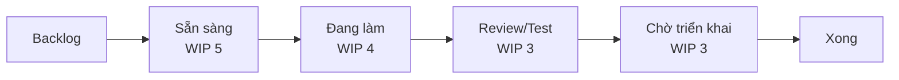

# Chương 25: Kanban & chỉ số dòng chảy (Flow metrics)

## Mục tiêu học

- Thiết lập được bảng Kanban với cột, WIP limit và chính sách.
- Tính và đọc được lead time, cycle time, throughput, WIP và biểu đồ cumulative flow (CFD).
- Chọn được khi nào dùng Kanban thay Scrum, và khi nào dùng Scrumban.
- Hiểu ở mức khái niệm cách dự báo bằng Monte Carlo.

## 25.1 Kanban là gì

**Kanban** là phương pháp quản lý **dòng chảy công việc**: làm cho công việc **hiển thị**, **giới hạn công việc đang làm** (WIP) và **cải tiến liên tục** dòng chảy. Không có sprint, không có vai trò bắt buộc; đội bắt đầu từ cách làm hiện tại và cải tiến từng bước. (Tham khảo Kanban Guide; Phụ lục G.)

Ba nguyên tắc thực hành:

1. **Hiển thị**: mọi việc là một thẻ trên bảng; mọi trạng thái là một cột.
2. **Giới hạn WIP** (Work In Progress): mỗi cột có số thẻ tối đa; muốn kéo thẻ mới, phải xong thẻ cũ.
3. **Quản lý dòng chảy**: đo thời gian, tìm chỗ tắc, xử lý.

Vì sao giới hạn WIP giúp? Làm nhiều việc cùng lúc **chậm hơn** làm lần lượt: chuyển ngữ cảnh mất công, việc dang dở tồn kho, phát hiện lỗi muộn. **Định luật Little**: *thời gian trung bình = WIP ÷ throughput.* Nếu throughput là 4 thẻ/tuần mà WIP là 12, mỗi thẻ mất trung bình 3 tuần; giảm WIP xuống 4, mỗi thẻ mất khoảng 1 tuần (khi throughput không đổi).

## 25.2 Bảng Kanban và WIP limit

Cách đặt WIP ban đầu: **số người ÷ 1,5** hoặc ít hơn cho cột "Đang làm", sau đó điều chỉnh theo dữ liệu. Nếu một cột luôn đầy và chặn cột sau, WIP đang đúng (làm lộ nút cổ chai). Nếu cột luôn trống, WIP quá cao ở cột trước.

**Chính sách rõ ràng** cho từng cột (điều kiện vào/ra), **loại thẻ** với mức ưu tiên và **đường expedite** cho sự cố, **SLE** (Service Level Expectation) rút từ dữ liệu: "85% thẻ Bug thường xong trong 5 ngày".

📎 Mẫu đầy đủ: `templates/sprint-agile/kanban-board-setup.md`

## 25.3 Chỉ số dòng chảy

| Chỉ số | Định nghĩa | Ghi chú |
|---|---|---|
| **Lead time** | Từ khi thẻ được tạo (yêu cầu) đến khi xong | Cảm nhận của người yêu cầu |
| **Cycle time** | Từ khi bắt đầu làm đến khi xong | Hiệu quả của đội |
| **Throughput** | Số thẻ xong mỗi đơn vị thời gian | Năng lực |
| **WIP** | Số thẻ đang làm | Kiểm soát được |
| **Tuổi thẻ (age)** | Thời gian một thẻ đang làm | Cảnh báo sớm |

Ví dụ dữ liệu 15 thẻ bảo trì FoodNow (tháng 11/2026):

| Chỉ số | Kết quả |
|---|---|
| Cycle time trung bình | **4,27 ngày** (trung vị 5 ngày) |
| Lead time trung bình | 5,4 ngày (trung vị 6 ngày) |
| Throughput | 2, 6, 4, 3 thẻ/tuần → **3,75 thẻ/tuần** |

Đọc số: dùng **phân vị** (85%), không chỉ trung bình. Vì phân phối lệch phải, trung bình bị kéo bởi vài thẻ dài. Từ dữ liệu này, đội đặt SLE: "85% thẻ xong trong 7 ngày cycle time".

📎 Mẫu đầy đủ: `templates/sprint-agile/flow-metrics.csv` (15 thẻ, công thức lead/cycle time, trung bình/trung vị)

## 25.4 Cumulative Flow Diagram (CFD)

**CFD** là biểu đồ tích luỹ số thẻ theo trạng thái theo thời gian. Mỗi dải màu là một cột của bảng.

- **Dải song song, khoảng cách ổn định**: dòng chảy khoẻ.
- **Dải đang giãn rộng** (dải "Đang làm/Review" dày lên): WIP tăng, có nút cổ chai.
- **Đường "Xong" phẳng**: không có thẻ nào hoàn thành — dừng dây chuyền.
- Khoảng cách **ngang** giữa hai đường ≈ thời gian trung bình của thẻ; khoảng cách **dọc** ≈ WIP.

Dùng CFD trong báo cáo cho Sponsor: một hình cho thấy dòng chảy khoẻ hay tắc, thay vì con số rời.

## 25.5 Khi nào dùng Kanban thay Scrum

| Tiêu chí | Kanban | Scrum |
|---|---|---|
| Loại việc | Đến ngẫu nhiên, ưu tiên đổi hằng ngày (bảo trì, hỗ trợ, ops) | Phát triển sản phẩm theo mục tiêu |
| Khung thời gian | Liên tục | Sprint cố định |
| Vai trò | Không bắt buộc | PO, SM, Developers |
| Cam kết | SLE, WIP | Sprint Goal |
| Dự báo | Throughput/Monte Carlo | Velocity |

**Scrumban** kết hợp: có sprint hoặc nhịp planning ngắn nhưng dùng WIP limit và chỉ số dòng chảy; hợp đội chuyển từ Scrum sang Kanban dần, hoặc đội có cả việc phát triển và bảo trì.

## 25.6 Dự báo bằng Monte Carlo (mức khái niệm)

Thay vì hỏi "bao lâu?" bằng một con số, dùng **dữ liệu lịch sử** (throughput mỗi tuần) và **mô phỏng ngẫu nhiên**: máy tính rút ngẫu nhiên nhiều lần throughput của các tuần đã qua, cộng lại cho đến khi đủ 20 thẻ, lặp 10.000 lần; kết quả là **phân phối**: "85% khả năng xong 20 thẻ trong ≤ 8 tuần". Ưu điểm: dùng dữ liệu thật, không cần ước lượng từng thẻ; nhược: cần vài tuần dữ liệu và thẻ có cỡ tương đương. PM không cần tự viết mô phỏng nhưng cần hiểu **kết quả là xác suất** và nói bằng khoảng (Ch11).

## Đi sâu: đọc CFD, đặt WIP và dự báo bằng dữ liệu

### Đọc một CFD qua ba kịch bản

Hình dung biểu đồ tích luỹ có bốn dải: *Sẵn sàng*, *Đang làm*, *Review/Test*, *Xong*.

| Hình dạng bạn thấy | Chẩn đoán | Việc cần làm |
|---|---|---|
| Dải *Review/Test* dày lên đều theo thời gian | Nút cổ chai ở kiểm thử; thẻ vào nhanh hơn ra | Giảm WIP cột *Đang làm*; cả đội hỗ trợ review/test; tự động hoá test |
| Đường *Xong* đi ngang 5 ngày | Dây chuyền dừng (thẻ bị chặn hoặc chờ deploy) | Tìm thẻ bị chặn; kiểm tra cửa sổ deploy |
| Dải *Sẵn sàng* co lại gần 0 | Thiếu việc sẵn sàng | Tăng refinement; kéo thẻ từ Backlog |

### Cách đặt WIP limit ban đầu và điều chỉnh

Bắt đầu với **số người ÷ 1,5** cho cột *Đang làm* (đội 6 người → 4). Sau 2–4 tuần xem ba tín hiệu: (1) cột luôn đầy và cột phía sau trống → WIP quá thấp ở cột trước hoặc nghẽn ở cột trước nữa; (2) cột luôn trống → WIP quá cao ở cột trước; (3) tuổi thẻ trung vị tăng → giảm WIP. Chỉ đổi một cột mỗi lần và đo lại trong hai tuần.

### Định luật Little: tính thử

Nếu cycle time trung bình 4,27 ngày và throughput 3,75 thẻ/tuần, WIP dự kiến ≈ 3,75 ÷ 5 ngày làm việc × 4,27 ≈ 3,2 thẻ — khớp với WIP đang đặt (3–4). Công thức có hai cách dùng: dự đoán cycle time khi đổi WIP, hoặc kiểm tra số liệu có nhất quán không (nếu không, dữ liệu ngày vào/ra có thể sai).

### Monte Carlo: ví dụ bằng tay

Giả sử throughput 6 tuần gần nhất là 2, 6, 4, 3, 5, 4 thẻ. Cần xong 20 thẻ. Mỗi lần mô phỏng: rút ngẫu nhiên một trong sáu giá trị cho mỗi tuần và cộng cho đến khi ≥ 20. Lặp nhiều lần sẽ cho phân phối; với dữ liệu này, số tuần thường rơi khoảng 4–7 tuần, và phân vị 85% quanh 6–7 tuần. Vì vậy câu trả lời cho Sponsor là: "Xong 20 thẻ trong khoảng 5–7 tuần, độ tin cậy 85% ở 7 tuần". Lưu ý điều kiện: các thẻ cùng cỡ tương đương và quy trình ổn định.

### Kanban trong công ty outsource: ba lưu ý về hợp đồng

1. **Đơn vị thanh toán** cần khớp mô hình: T&M theo tháng hợp Kanban hơn fixed-price theo tính năng.
2. **SLE thay cho "cam kết ngày"** trong phụ lục hỗ trợ: "85% bug Critical xong trong 2 ngày làm việc".
3. **Báo cáo** dùng lead time, throughput, tuổi thẻ; tránh cam kết số thẻ mỗi tháng vì khối lượng đến ngẫu nhiên.

## Tình huống FoodNow

Thứ Hai 02/11/2026 (tuần 44). Hypercare đã xong, đội MVP thu còn 6 người. Việc đến mỗi ngày: một đơn kẹt, một OTP chậm, một yêu cầu nhỏ từ Huy. Hà thử giữ nhịp sprint 2 tuần trong một tuần rồi nhận ra Sprint Planning chẳng còn ý nghĩa: giữa sprint, 3 việc khẩn xen vào, Sprint Goal vỡ.

Chị họp với Dũng, Backend 2, Khoa và Nam, đề xuất chuyển sang **Kanban** với sáu cột và WIP: Sẵn sàng 5, Đang làm 4, Review/Test 3, Chờ triển khai 3, cùng đường expedite cho sự cố. Ba tuần đầu chưa đặt SLE; chỉ ghi ngày. Đến 25/11, dữ liệu 15 thẻ cho: cycle time trung bình **4,27 ngày**, lead time **5,4 ngày**, throughput **3,75 thẻ/tuần**. Ở buổi review hai tuần, đội thấy cột "Review/Test" thường đầy và Nam là điểm nghẽn (một QA); họ cùng chọn giảm WIP "Đang làm" từ 4 xuống 3 và để Dev viết thêm test tự động. Hà đặt SLE: "85% bug thường xong trong 7 ngày". Với Sponsor, chị chỉ cần một biểu đồ CFD và ba con số mỗi tháng, thay vì báo cáo sprint.

## Bài tập

**Bài 1 (làm ra sản phẩm) — Tính chỉ số.** Dùng `flow-metrics.csv`. (a) Tính cycle time trung bình và trung vị của 15 thẻ; (b) tính throughput theo tuần; (c) tính phân vị 85% cycle time và đề xuất SLE; (d) nếu WIP trung bình là 4, kiểm tra định luật Little.

**Bài 2 (làm ra sản phẩm).** Thiết lập bảng Kanban cho đội hỗ trợ của bạn: 5 cột, WIP limit, chính sách, 3 loại thẻ và SLE giả định.

**Bài 3 (tình huống ngắn).** Cột "Review" luôn đầy 3/3, cột "Đang làm" đầy 4/4 và không ai kéo thẻ mới. Người quản lý nói "tăng WIP lên để mọi người có việc". Bạn nghĩ sao?

Gợi ý đáp án

**Bài 1:** (a) Cycle time (Done − Started): 2, 5, 2, 5, 5, 7, 2, 3, 7, 1, 3, 8, 6, 2, 6 → tổng 64; trung bình **4,27**; trung vị **5**. (b) Throughput 2/6/4/3 → 3,75/tuần. (c) Sắp tăng dần: 1,2,2,2,2,3,3,5,5,5,6,6,7,7,8; phân vị 85% ≈ vị trí 13 → **7 ngày**; SLE: "85% thẻ xong trong 7 ngày kể từ khi bắt đầu". (d) Little: cycle time ≈ WIP ÷ throughput = 4 thẻ ÷ 3,75 thẻ/tuần ≈ 1,07 tuần ≈ 5 ngày làm việc — khớp với cycle time đo được (4–5 ngày).

**Bài 3:** Đây là **nút cổ chai ở Review/QA**, không phải thiếu việc. Tăng WIP chỉ làm thẻ nằm chờ lâu hơn và tăng lead time. Phương án: (A) đưa nhiều người vào review/test (swarming); (B) giảm WIP cột "Đang làm" để dừng đẩy việc mới; (C) tự động hoá test; (D) tăng năng lực QA. Lời nói mẫu: "Nếu cho thêm việc, thẻ sẽ nằm chờ ở Review lâu hơn và thời gian giao cho khách còn dài hơn. Em đề xuất tuần này mọi người ưu tiên review/test thẻ đang chờ."

## Sai lầm thường gặp

1. **Sai lầm:** Kanban không đặt WIP limit. → **Hậu quả:** chỉ còn "bảng công việc", nghẽn không lộ. **Cách khắc phục:** đặt WIP từ đầu và điều chỉnh bằng dữ liệu.
2. **Sai lầm:** Chỉ nhìn giá trị trung bình. → **Hậu quả:** bỏ sót thẻ dài; SLE sai. **Cách khắc phục:** dùng phân vị (85%).
3. **Sai lầm:** Bỏ qua tuổi thẻ. → **Hậu quả:** thẻ chết ngầm. **Cách khắc phục:** cảnh báo thẻ đứng > 5 ngày.
4. **Sai lầm:** Dùng Kanban cho dự án phát triển có mốc mà không có mục tiêu. → **Hậu quả:** trôi mục tiêu. **Cách khắc phục:** Scrum/Scrumban với Sprint Goal.
5. **Sai lầm:** Coi throughput là điểm hiệu suất cá nhân. → **Hậu quả:** đội "chia nhỏ thẻ". **Cách khắc phục:** dùng cho dòng chảy hệ thống.
6. **Sai lầm:** Dự báo bằng một con số. → **Hậu quả:** sai kỳ vọng. **Cách khắc phục:** nói bằng xác suất và khoảng (Monte Carlo/SLE).

## Tóm tắt & tiếp theo

- Kanban: hiển thị, giới hạn WIP, quản lý dòng chảy; định luật Little liên hệ thời gian, WIP và throughput.
- Chỉ số: lead time, cycle time, throughput, WIP, tuổi thẻ; dùng phân vị và CFD.
- Dùng Kanban cho việc đến ngẫu nhiên (bảo trì, hỗ trợ), Scrumban khi chuyển tiếp.
- Dự báo bằng Monte Carlo cho ra xác suất, không phải một con số.

Chương 26 mở rộng ra **Hybrid ở quy mô nhiều đội**.
