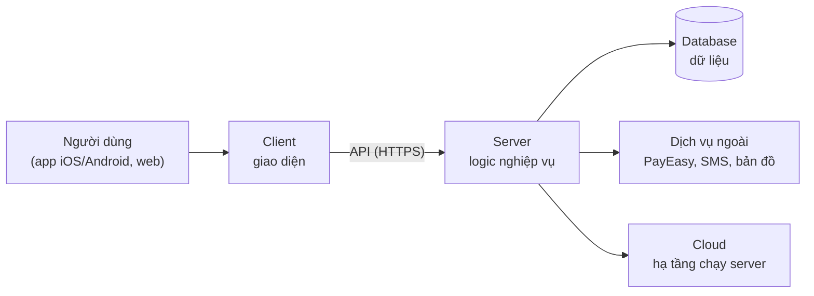

# Chương 29: PM và kỹ thuật: CI/CD, môi trường, nợ kỹ thuật, DevOps

## Mục tiêu học

- Giải thích kiến trúc ở mức khái niệm (client–server, API, database, cloud) đủ để hỏi đúng câu.
- Hiểu CI/CD, feature flag và môi trường ở mức quản lý; biết Phần 5 đi sâu vào đâu.
- Quản lý nợ kỹ thuật bằng register, chi phí trì hoãn và "thương lượng" thời gian trả nợ.
- Dùng spike để giảm bất định và hỏi Tech Lead 10 câu đúng.
- Nắm bảo mật và tuân thủ cơ bản (OWASP top-level, bảo vệ dữ liệu cá nhân) ở mức nhận biết.

## 29.1 PM cần hiểu kỹ thuật đến đâu

PM không cần viết code. Cần **đủ để**: hiểu vì sao việc mất thời gian; phát hiện ước lượng thiếu; đánh giá rủi ro kỹ thuật; nói chuyện tôn trọng với Tech Lead; và giải thích cho Sponsor bằng ngôn ngữ họ hiểu. Nguyên tắc: **hiểu khái niệm và đánh đổi, không hiểu cú pháp**.

## 29.2 Kiến trúc ở mức khái niệm

- **Client–server**: client (app/web) hiển thị và gửi yêu cầu; server xử lý và trả kết quả.
- **API** (Application Programming Interface): "hợp đồng" giữa hai phần mềm — gọi cái gì, nhận gì. Đổi API có thể làm hỏng bên kia (Ch26).
- **Database**: nơi lưu dữ liệu bền vững; thay đổi cấu trúc (migration) là việc rủi ro.
- **Cloud**: thuê máy chủ/dịch vụ thay vì mua; trả theo mức dùng; tăng giảm nhanh.
- **Cache**: lưu tạm dữ liệu hay dùng để nhanh hơn; cấu hình sai gây lỗi khó thấy (Ch38).
- **Monolith vs microservices**: một khối lớn vs nhiều dịch vụ nhỏ — đánh đổi giữa đơn giản và độc lập đội.

Câu hỏi PM có thể hỏi: "Phần nào nếu chậm/hỏng thì người dùng thấy ngay?", "Dịch vụ ngoài nào là điểm chết đơn (single point of failure)?", "Thay đổi này chạm cơ sở dữ liệu không?"

## 29.3 CI/CD, feature flag và môi trường (mức quản lý)

- **CI** (Continuous Integration): mỗi lần commit, hệ thống tự build và chạy test. Lợi ích: lỗi phát hiện sau vài phút.
- **CD** (Continuous Delivery/Deployment): tự động đưa bản build đến các môi trường; **Delivery** = sẵn sàng deploy bất kỳ lúc nào (có người bấm); **Deployment** = tự động lên production khi qua cổng.
- **Feature flag** (công tắc tính năng): bật/tắt tính năng mà không deploy lại. Tách **deploy** (đưa code lên) khỏi **release** (cho người dùng thấy).
- **Môi trường**: dev, staging, production; staging phải giống production.

PM cần biết: **bao lâu từ commit đến staging**, **có rollback không**, **ai bấm deploy**. Chi tiết chiến lược nhánh, tag, release và deploy hằng ngày nằm ở **Phần 5 (Ch30–33)**; ở đây chỉ nắm khái niệm.

## 29.4 Nợ kỹ thuật

**Nợ kỹ thuật** (technical debt) là phần "đi đường tắt" trong code/thiết kế giúp giao nhanh hôm nay nhưng tăng chi phí mai sau — như vay nợ: có **gốc** (công sửa lại) và **lãi** (công thêm mỗi sprint vì đường tắt đó). Nợ có thể **có ý thức** (đánh đổi để kịp mốc) hoặc **vô ý** (thiếu kỹ năng). Không phải mọi nợ đều xấu; nợ xấu là nợ **không ai theo dõi**.

### Register và chi phí trì hoãn

Mỗi khoản nợ ghi: tiêu đề, khu vực, **lãi** (ngày công mỗi sprint), **gốc** (ngày công sửa), rủi ro nếu trì hoãn (1–5), chủ sở hữu, quyết định. Chỉ số: **payback (sprint)** = gốc ÷ lãi. Nếu payback nhỏ hơn số sprint còn lại và rủi ro cao, **sửa ngay**; payback lớn, rủi ro thấp → **hoãn có kế hoạch**.

📎 Mẫu đầy đủ: `templates/quality/technical-debt-register.csv` (10 khoản nợ, payback bằng công thức)

Ví dụ: "Test tự động không ổn định" (lãi 3 ngày/sprint, gốc 5 ngày) → payback 1,7 sprint → sửa ngay. "Module đơn hàng gắn chặt thanh toán" (lãi 1,5, gốc 12) → payback 8 sprint, chỉ còn 4 sprint tới go-live → hoãn.

### "Thương lượng" thời gian trả nợ

PM và Tech Lead thường va nhau: "Cần refactor" vs "Đang sát hạn". Cách làm việc:

1. **Dịch nợ sang tiền/thời gian**: "Mỗi sprint mình mất 2 ngày vì module này".
2. **Chia nhỏ**: không xin 2 tuần liền; xin **10% mỗi sprint**.
3. **Ưu tiên theo rủi ro và payback**, không theo cảm xúc.
4. **Gắn với mốc**: nợ chặn go-live → sửa trước; nợ khác → sau go-live/R1.
5. **Ghi quyết định vào Decision Log** kèm lý do, để sau này biết vì sao hoãn.

## 29.5 Spike

**Spike** là một khoảng thời gian ngắn, có giới hạn (1–5 ngày) để **tìm hiểu** một điều chưa biết (thử công nghệ, tích hợp thử, đo hiệu năng) — sản phẩm là **kiến thức**, không phải tính năng. Dùng khi ước lượng bất định cao (ví dụ theo dõi thời gian thực). Quy tắc: câu hỏi cần trả lời rõ, **timebox cố định**, kết quả ghi lại và ảnh hưởng ước lượng. FoodNow dùng spike 3 ngày cho realtime tracking (R05) ở Sprint 3.

## 29.6 Mười câu hỏi cho Tech Lead

Xem mẫu: hỏi về rủi ro kỹ thuật lớn nhất, bus factor, thời gian commit → staging, test tự động cho phần quan trọng, nợ kỹ thuật, rollback, tải gấp đôi, nơi lưu dữ liệu nhạy cảm, ước lượng ít tin nhất, và điều Tech Lead cần từ PM. Hỏi để hiểu, không để bắt lỗi; lặp lại câu 3, 5, 6, 7 ở mỗi mốc.

📎 Mẫu đầy đủ: `templates/quality/questions-for-tech-lead.md`

## 29.7 Bảo mật và tuân thủ cơ bản

PM không phải chuyên gia bảo mật nhưng cần biết để đặt câu hỏi và ngân sách.

- **OWASP Top 10** (mức nhận biết): danh sách các loại lỗ hổng web phổ biến (kiểm soát truy cập yếu, lỗi mã hoá, injection, cấu hình sai...). Hỏi: "Đội có quét theo OWASP trong CI không? Đã pentest chưa?"
- **Nguyên tắc cơ bản**: quyền tối thiểu; mã hoá dữ liệu nhạy cảm; không lưu thẻ thô (dùng tokenization của cổng thanh toán); quản lý bí mật trong kho riêng; cập nhật thư viện.
- **Bảo vệ dữ liệu cá nhân**: Việt Nam có quy định về bảo vệ dữ liệu cá nhân (ví dụ Nghị định 13/2023/NĐ-CP và các văn bản mới hơn — hãy nhờ pháp lý xác nhận văn bản hiện hành). Ở mức PM: biết dự án thu thập dữ liệu gì, cần **sự đồng ý** của người dùng, **mục đích** rõ, **lưu trữ có thời hạn**, và quy trình xử lý khi lộ dữ liệu. Ghi vào RAID và yêu cầu Tech Lead/pháp lý rà.
- **Tuân thủ thanh toán**: chứng nhận với vendor; không tự lưu số thẻ.

*Lưu ý: nội dung pháp lý ở đây chỉ mang tính nhận biết, không thay thế tư vấn pháp lý.*

## Tình huống FoodNow

Thứ Hai 03/08/2026 (Sprint 13, UAT vòng 1 đang chạy). Backend 2 đề xuất: "Module thông báo cũ khó đọc; em xin **2 tuần refactor**." Dũng ủng hộ. Hà thấy hai điều: UAT đang chạy, còn 8 tuần đến go-live, và nếu 2 tuần refactor gây lỗi mới thì UAT phải chạy lại.

Chị không từ chối và cũng không đồng ý. Chị mời Dũng và Backend 2 lập **Technical Debt Register** trong buổi chiều (10 khoản) và tính payback. Kết quả: module thông báo (TD-04) lãi 2 ngày/sprint, gốc 10 ngày → payback 5 sprint — nhiều hơn số sprint còn lại (4) và rủi ro thấp: **hoãn sau go-live**. Hai khoản có payback thấp và tác động cao được sửa ngay: **TD-05** (test tự động không ổn định, payback 1,7) và **TD-02** (logic giá trùng, payback 3). Khoản **TD-06** (cấu hình cache cứng theo môi trường, lãi 0,3, gốc 1,5) được Ánh đánh giá rủi ro thấp (2) và **hoãn**. Hà ghi cả năm quyết định vào Decision Log.

Hai tháng sau, sự cố cache 4 giờ đầu go-live sẽ chính là TD-06 (Ch38): rủi ro bị đánh giá thấp hơn thực tế. Bài học của Hà: **rủi ro của nợ kỹ thuật cần được kiểm tra chéo**, đặc biệt với những thứ liên quan đến cấu hình môi trường production — nơi "lãi" nhỏ nhưng "phạt" lớn. Chị bổ sung câu hỏi số 6 (rollback) và một câu về **khác biệt cấu hình giữa staging và production** vào danh sách rà mỗi mốc.

## Bài tập

**Bài 1 (làm ra sản phẩm) — Quyết định trả nợ.** Cho ba khoản nợ: (A) lãi 2 ngày/sprint, gốc 6 ngày, rủi ro 2; (B) lãi 0,5, gốc 8, rủi ro 4; (C) lãi 1,5, gốc 3, rủi ro 3. Còn 5 sprint đến go-live. Tính payback từng khoản, quyết định sửa ngay/hoãn, lập register và giải thích cho Sponsor bằng một đoạn ≤ 5 dòng.

**Bài 2 (làm ra sản phẩm).** Viết 10 câu hỏi cho Tech Lead của dự án bạn (dựa trên mẫu), kèm "dấu hiệu tốt" và "dấu hiệu đáng lo".

**Bài 3 (tình huống ngắn).** Dev đề xuất refactor 2 tuần khi còn 3 tuần đến hạn. Bạn xử lý thế nào? Nêu 2 phương án hợp lệ.

Gợi ý đáp án

**Bài 1:** Payback: A = 6/2 = 3 sprint; B = 8/0,5 = 16 sprint; C = 3/1,5 = 2 sprint. Sửa ngay: **C** (payback 2 < 5, gốc nhỏ) và **A** (payback 3 < 5) nếu còn dung lượng; **B** hoãn — nhưng rủi ro 4 nên cần biện pháp giảm (giám sát, ghi vào RAID) và kiểm tra chéo rủi ro. Đoạn giải thích: "Hai khoản nợ giúp mình lấy lại công sức trong 2–3 sprint, nên mình trả trước; khoản còn lại tốn 8 ngày mà chỉ tiết kiệm 0,5 ngày/sprint nên hoãn có giám sát."

**Bài 3:** Phương án A: chia nhỏ — chỉ sửa phần gây rủi ro cho hạn (1–2 ngày), phần còn lại sau hạn (ghi register). Phương án B: nếu refactor bảo vệ an toàn/chất lượng bắt buộc, dời hạn hoặc cắt phạm vi với Sponsor (CR). Khuyến nghị A. Lời nói mẫu: "Mình cần refactor, nhưng còn 3 tuần nên em đề xuất chỉ làm phần đang cản trở go-live (khoảng 2 ngày) và đưa phần còn lại vào sprint đầu sau ra mắt." Sai lầm: cấm không giải thích; đồng ý rồi trễ.

## Sai lầm thường gặp

1. **Sai lầm:** Coi kỹ thuật là "việc của Dev". → **Hậu quả:** không hiểu rủi ro, ước lượng hớ. **Cách khắc phục:** hiểu khái niệm; hỏi 10 câu.
2. **Sai lầm:** Tranh luận giải pháp kỹ thuật. → **Hậu quả:** xung đột, mất tôn trọng. **Cách khắc phục:** hỏi "vì sao", "bằng chứng", "đánh đổi".
3. **Sai lầm:** Không theo dõi nợ kỹ thuật. → **Hậu quả:** lãi tích luỹ, tốc độ giảm dần. **Cách khắc phục:** register, payback, 10% sprint.
4. **Sai lầm:** Cắt hoàn toàn thời gian trả nợ để kịp hạn. → **Hậu quả:** vỡ khi go-live/bảo trì. **Cách khắc phục:** trả nợ nhỏ, đều, ưu tiên theo rủi ro.
5. **Sai lầm:** Đánh giá rủi ro nợ kỹ thuật một chiều. → **Hậu quả:** bỏ sót khoản nguy hiểm. **Cách khắc phục:** kiểm tra chéo với DevOps/QA, đặc biệt cấu hình production.
6. **Sai lầm:** Bỏ qua bảo mật và tuân thủ. → **Hậu quả:** lộ dữ liệu, vi phạm. **Cách khắc phục:** pentest, tokenization, rà pháp lý sớm.

## Tóm tắt & tiếp theo

- PM hiểu khái niệm kiến trúc, CI/CD, feature flag, môi trường để hỏi đúng và đánh giá rủi ro.
- Nợ kỹ thuật có gốc và lãi; quyết định bằng payback và rủi ro; "thương lượng" bằng 10% mỗi sprint và ghi quyết định.
- Spike để giảm bất định; 10 câu hỏi Tech Lead lặp lại ở mỗi mốc.
- Bảo mật cơ bản: OWASP, quyền tối thiểu, tokenization, dữ liệu cá nhân (nhận biết; cần pháp lý xác nhận).

Hết Phần 4. Chương 30 mở **Phần 5**: Delivery Plan và Release Engineering — code đi từ máy Dev đến tay người dùng theo kế hoạch nào.
