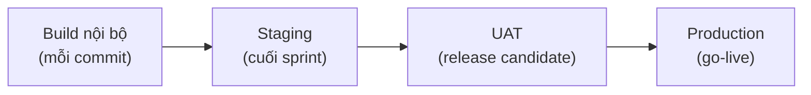

# Chương 30: Delivery Plan tổng thể: từ Roadmap đến từng bản phát hành

## Mục tiêu học

- Phân biệt Delivery Plan với Roadmap, Release Plan và Gantt.
- Chọn release cadence và lập Environment Matrix, Release Calendar.
- Ánh xạ Sprint → Release candidate → Tag → Môi trường và đặt quy tắc freeze.
- Phân vai Release Manager bằng RACI.
- Chọn giữa hai chiến lược — (A) release theo kế hoạch/GitFlow và (B) trunk-based + daily deploy — bằng ma trận có trọng số.

## 30.1 Câu hỏi PM hay bị hỏi

Sponsor, khách và cả đội sẽ hỏi: **"Code đi từ máy Dev đến tay người dùng theo kế hoạch nào — nhánh nào, tag nào, release khi nào, deploy bao lâu một lần?"** Roadmap trả lời "làm gì và hướng đi", Release Plan trả lời "mỗi lần phát hành gồm gì và khi nào đủ điều kiện", Gantt trả lời "task nào khi nào". Chỗ còn trống là **cơ chế thực tế**: bản nào lên môi trường nào, bằng cách nào, ai duyệt. Đó là **Delivery Plan**.

PM **không** cần biết gõ lệnh Git. PM cần **duyệt chiến lược**, **đặt chính sách**, **đọc được release** và **hỏi đúng câu**. Phần 5 (Ch30–33) dạy hai mô hình song song để bạn chọn theo bối cảnh:

- **(A)** Branching & release theo kế hoạch (GitFlow/release train, tag theo Release Plan);
- **(B)** Trunk-based + **daily deployment** (deploy hằng ngày, tách deploy khỏi release bằng feature flag).

| Tài liệu | Trả lời | Ví dụ |
|---|---|---|
| Roadmap (Ch13) | Hướng đi | MVP → R1 → R2 |
| Release Plan (Ch13) | Phạm vi và Go/No-Go từng release | MVP: 11 epic; 0 Critical/High |
| Gantt (Ch12) | Task, ngày, phụ thuộc | Đường găng thanh toán |
| **Delivery Plan** | **Bản nào, lên đâu, khi nào, ai duyệt** | Tag `v0.N.0` → staging; `rc.N` → UAT; `v1.0.0` → prod |

## 30.2 Các cấp phát hành và release cadence

Một bản phần mềm thường đi qua các cấp:

**Release cadence** là nhịp phát hành. Lựa chọn phổ biến:

| Cadence | Ưu | Nhược | Hợp khi |
|---|---|---|---|
| **Mỗi sprint** (2 tuần) lên staging | Phản hồi đều; dễ dự đoán | Chưa phải production | Hybrid, hợp đồng theo mốc |
| **2–4 tuần** lên production | Ổn định, dễ kiểm thử | Bản lớn hơn | Mobile, ứng dụng doanh nghiệp |
| **Hằng ngày/nhiều lần/ngày** | Phản hồi rất nhanh, rủi ro mỗi lần nhỏ | Cần tự động hoá cao (Ch33) | Web/backend trưởng thành |

Nguyên tắc chọn: **khách nhận bản khi nào**, **mức tự động hoá kiểm thử**, **kiểm toán/tuân thủ**, **loại sản phẩm** (mobile hay web/backend). Lưu ý mobile: App Store/Google Play có review 1–3 ngày → **không "daily deploy" bản app**; chỉ backend, web và **feature flag/remote config** mới làm được hằng ngày.

## 30.3 Environment Matrix

**Environment Matrix** liệt kê từng môi trường: mục đích, ai deploy, cách deploy, dữ liệu, cổng vào, ai truy cập.

| Môi trường | Mục đích | Dữ liệu | Cổng vào |
|---|---|---|---|
| Dev/Local | Dev tự thử | Giả | — |
| QA/Integration | Test tích hợp mỗi sprint | Giả | CI xanh |
| **Staging** | Giống production; test và demo | Ẩn danh/giả | Tag `v0.N.0` + QA duyệt |
| **UAT** | Người dùng nghiệm thu | Giả gần thật | Tag rc + Nam/Dũng duyệt |
| **Production** | Người dùng thật | Thật | Go/No-Go, tag `v1.0.0` |

Ba quy tắc: staging **giống production nhất có thể** (cấu hình, cache, sandbox tương ứng); **không dữ liệu thật ngoài production**; **khác biệt cấu hình** phải nằm trong danh sách được biết và rà trước go-live (bài học ở Ch38).

📎 Mẫu đầy đủ: `templates/delivery-plan/environment-matrix.md`

## 30.4 Release Calendar

**Release Calendar** đặt các mốc phát hành và **những ngày không được deploy** lên cùng một lịch: cuối sprint (lên staging), freeze, UAT, Go/No-Go, go-live, hypercare; kỳ **Tết, lễ**, **cửa sổ deploy** và **ngày cấm deploy** (ví dụ chiều thứ Sáu cho production, sát lễ).

Ba loại freeze:

- **Scope Freeze**: không nhận phạm vi mới (FoodNow: 13/07).
- **Feature complete**: mọi tính năng đã merge (17/07).
- **Code freeze/cắt release branch**: chỉ sửa lỗi (24/07).

Lịch phải tính **Tết** (nghỉ 16–20/02/2026), **27/04, 30/04–01/05, 02/09** — các ngày bạn đã dùng ở Gantt (Ch12); Release Calendar và Gantt phải khớp nhau.

📎 Mẫu đầy đủ: `templates/delivery-plan/release-calendar.csv` (36 dòng)

## 30.5 Sprint → Release candidate → Tag → Môi trường

| Sprint | Ngày cuối | Tag | Môi trường |
|---|---|---|---|
| Sprint 1 | 27/02 | `v0.1.0` | Staging |
| Sprint 2–11 | 13/03 … 17/07 | `v0.2.0` … `v0.11.0` | Staging |
| Sprint 12 | 31/07 | `v0.12.0`; cắt `release/1.0.0` 24/07 → `v1.0.0-rc.1` 27/07 | Staging; UAT |
| Sprint 13–15 | 14/08 … 11/09 | `v0.13.0` … `v0.15.0`; `v1.0.0-rc.2` 04/09 | Staging; UAT |
| Sprint 16 | 25/09 | `v0.16.0` | Staging |
| Go-live | 03/10 | `v1.0.0` | Production |

Ý chính: **mỗi bản lên UAT hoặc production phải có tag** (Ch32).

## 30.6 Ai chịu trách nhiệm phát hành

**Release Manager** có thể là PM, Tech Lead hoặc DevOps tuỳ tổ chức. Trong FoodNow: **Dũng** chịu trách nhiệm kỹ thuật (cắt nhánh, tag), **Ánh** thực thi deploy, **Nam** cổng chất lượng, **Hà** lịch và truyền thông, **Bảo** quyết Go/No-Go.

| Việc | Hà (PM) | Dũng (TL) | Ánh (DevOps) | Nam (QA) | Bảo (Sponsor) |
|---|---|---|---|---|---|
| Lịch phát hành | **A** | C | C | C | I |
| Cắt release, tag | I | **A** | R | C | I |
| Deploy staging/UAT | I | A | **R** | C | I |
| Go/No-Go | R | C | C | R | **A** |
| Deploy production | A | C | **R** | C | I |
| Hotfix | A | R | R | R | C |

## 30.7 Chọn chiến lược A hay B

| Tiêu chí | Nghiêng về A (kế hoạch/GitFlow) | Nghiêng về B (trunk-based/daily) |
|---|---|---|
| Đội | Mới, chưa quen PR nhỏ | Quen, kỷ luật |
| Test tự động | Chưa đủ | Đủ tin cậy |
| Tuân thủ/kiểm toán | Cần UAT, vết duyệt từng release | Approval tự động, log pipeline |
| Hợp đồng | Theo mốc phát hành | T&M/hỗ trợ |
| Loại sản phẩm | Mobile | Web/backend |
| Khách | Nhận ở sprint review | Muốn thay đổi nhanh |
| Hạ tầng | Đang dựng | Canary, rollback, monitoring |

FoodNow MVP: điểm **A = 4,05, B = 2,05** → chọn A. Sau go-live cho backend/web: **A = 3,15, B = 4,35** → chuyển B (Ch33); mobile giữ release train.

📎 Mẫu đầy đủ: `templates/delivery-plan/FoodNow-Delivery-Plan.md`, `templates/delivery-plan/delivery-strategy-decision-matrix.md`

## Tình huống FoodNow

Tuần 4 (26–30/01/2026). Dũng đến với đề xuất "cho nhanh" — dùng trunk-based và deploy staging hằng ngày. Hà hỏi lại theo ma trận: test tự động hiện chưa có regression (điểm 1), Backend mới vừa vào, hợp đồng thanh toán theo bảy mốc, ba app mobile chịu review app store, và UAT chính thức bắt buộc. Cả hai chấm riêng rồi đối chiếu: A = 4,05, B = 2,05. Dũng đồng ý và xin một điều: "Nhưng mình đặt mục tiêu chuyển sang trunk-based cho backend/web sau go-live."

Hà chốt **GitFlow-lite + release theo sprint + tag SemVer** (30/01/2026, DL-005) và viết Delivery Plan v1.0: mỗi cuối sprint tag `v0.N.0` lên staging; UAT bằng `v1.0.0-rc.N`; production chỉ một lần lớn (go-live 03/10) rồi hotfix. Chị lập Release Calendar từ Gantt với freeze và ngày cấm deploy (Tết, lễ, chiều thứ Sáu), Environment Matrix và RACI. Kế hoạch có một điều khoản chuyển đổi: **đánh giá lại chiến lược sau hypercare (tuần 44)** — và đúng lúc đó điểm B lên 4,35 (Ch33). Anh Bảo, khi xem Delivery Plan lần đầu, hỏi: "Khi nào tôi thấy bản mới?" — Hà chỉ vào cột "Cuối sprint lên staging" và mời anh dự Review hai tuần một lần.

## Bài tập

**Bài 1 (làm ra sản phẩm) — Chọn chiến lược.** Chọn A hay B cho 3 dự án bằng ma trận trọng số (chấm 1–5, nêu lý do): (a) app ngân hàng di động, hợp đồng theo mốc, kiểm toán chặt; (b) web thương mại điện tử của công ty lớn, đội 10 người, test tự động 80%, cần thay đổi theo chiến dịch hằng ngày; (c) hệ thống nội bộ cho 200 nhân viên, đội 4 người, chưa có CI.

**Bài 2 (làm ra sản phẩm) — Release Calendar 3 tháng.** Lập Release Calendar cho 3 tháng gần nhất của dự án bạn (hoặc giả định: 6 sprint 2 tuần từ 04/01/2027): cột Start, End, Type, Event, Environment, Tag, Deploy_Allowed; có ≥ 2 kỳ freeze, 1 kỳ lễ (Tết 2027 nghỉ 04–14/02 giả định), 1 UAT.

**Bài 3 (tình huống ngắn).** Sponsor muốn "phát hành mọi tính năng ngay khi xong" cho app mobile của bạn. Bạn giải thích thế nào?

Gợi ý đáp án

**Bài 1:** (a) A — mobile, tuân thủ, mốc; B chỉ cho backend nếu đủ tự động hoá. (b) B — web, test 80%, thay đổi nhanh; giữ approval tự động cho kiểm toán nếu cần. (c) A (nhẹ, GitHub Flow) — chưa có CI nên chưa thể B; ưu tiên dựng CI trước. **Bài 3:** Chẩn đoán: Sponsor hiểu "deploy" như web; mobile chịu review 1–3 ngày và người dùng phải cập nhật. Phương án A: release train 2 tuần cho app + feature flag/remote config để bật tính năng không cần bản mới; B: staged rollout theo % người dùng. Lời nói mẫu: "App phải qua review của Apple/Google và người dùng phải cập nhật, nên em đề xuất phát hành app mỗi 2 tuần, còn tính năng thì bật từ xa bằng công tắc để anh thấy nhanh mà vẫn an toàn." Sai lầm: hứa "hằng ngày" cho mobile.

## Sai lầm thường gặp

1. **Sai lầm:** Không có Delivery Plan; chỉ có Gantt. → **Hậu quả:** không ai biết bản nào ở đâu. **Cách khắc phục:** bảng cấp phát hành, Environment Matrix, Release Calendar.
2. **Sai lầm:** Chọn chiến lược theo trào lưu ("ai cũng daily deploy"). → **Hậu quả:** deploy thường xuyên khi chưa có test tự động → sự cố. **Cách khắc phục:** ma trận và điều kiện tiên quyết.
3. **Sai lầm:** Staging khác production. → **Hậu quả:** lỗi chỉ xảy ra ở production. **Cách khắc phục:** danh sách khác biệt cấu hình và rà soát.
4. **Sai lầm:** Release Calendar không khớp Gantt/lễ. → **Hậu quả:** hẹn deploy ngày nghỉ. **Cách khắc phục:** tạo từ Gantt, `excludes` cùng danh sách.
5. **Sai lầm:** Không rõ Release Manager. → **Hậu quả:** mọi người nghĩ người khác lo. **Cách khắc phục:** RACI phát hành, một "A" cho mỗi việc.
6. **Sai lầm:** Hứa daily deploy cho mobile. → **Hậu quả:** vỡ kỳ vọng vì app store. **Cách khắc phục:** release train + feature flag.

## Tóm tắt & tiếp theo

- Delivery Plan nối Roadmap và lịch với cơ chế phát hành thực: cấp phát hành, cadence, môi trường, calendar, RACI.
- Mỗi bản lên UAT/production phải có tag; freeze và ngày cấm deploy phải khớp Gantt.
- Chọn A hay B bằng ma trận có trọng số; mobile không daily deploy.
- FoodNow: A cho MVP (4,05 so với 2,05), chuyển B cho backend/web sau go-live (4,35 so với 3,15).

Chương 31 đi vào **chiến lược nhánh**: GitFlow, GitHub Flow và trunk-based.
