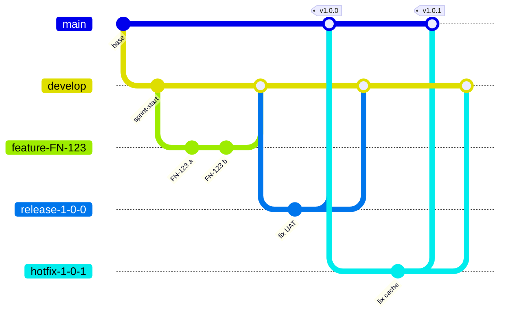

# Chương 31: Chiến lược nhánh (Branching): GitFlow, GitHub Flow, Trunk-based

## Mục tiêu học

- Giải thích vì sao cần chiến lược nhánh và mô tả vai trò từng nhánh của GitFlow.
- So sánh GitFlow, GitFlow-lite, GitHub Flow và Trunk-based theo tốc độ, rủi ro, yêu cầu tự động hoá.
- Đặt chính sách PR, branch protection và chiến lược merge ở mức PM cần biết.
- Chọn chiến lược cho monorepo/multi-repo và xử lý nhánh sống lâu, merge conflict.

> Lệnh Git chỉ xuất hiện ở mức minh hoạ. PM cần hiểu **ý nghĩa** và **chính sách**, không cần nhớ cú pháp.

## 31.1 Vì sao cần chiến lược nhánh

**Nhánh** (branch) là một "dòng phát triển" riêng của mã nguồn, cho phép nhiều người làm song song mà không giẫm chân nhau. Vấn đề: cuối cùng các dòng phải **gộp** (merge). Nếu không có luật chung, bạn gặp: mã chưa xong lọt vào bản phát hành; không biết bản nào đang chạy production; gộp nhánh mất nhiều ngày; sửa lỗi khẩn cấp không có đường an toàn. **Chiến lược nhánh** là bộ luật: có những nhánh nào, tạo từ đâu, gộp về đâu, sống bao lâu, ai được gộp.

Vì sao PM nên quan tâm: chiến lược nhánh quyết định **tốc độ phản hồi**, **rủi ro phát hành**, **chi phí hợp nhất** và **khả năng truy vết** (ai duyệt, bản nào ở đâu) — những thứ ảnh hưởng lịch, chất lượng và kiểm toán.

## 31.2 GitFlow đầy đủ

**GitFlow** có năm loại nhánh:

| Nhánh | Vai trò | Tạo từ | Gộp về | Vòng đời |
|---|---|---|---|---|
| `main` | Luôn là production; mỗi commit là một bản phát hành có tag | — | — | Vĩnh viễn |
| `develop` | Tích hợp các tính năng; nguồn của staging | `main` | — | Vĩnh viễn |
| `feature/*` | Một tính năng/story | `develop` | `develop` | Ngắn |
| `release/*` | Ổn định bản phát hành, chỉ sửa lỗi | `develop` | `main` **và** `develop` | Ngày–tuần |
| `hotfix/*` | Sửa lỗi khẩn cấp production | `main` (tag) | `main` **và** `develop` | ≤ 1 ngày |

Ưu điểm: rõ ràng, hợp phát hành có kế hoạch, nhiều phiên bản, UAT chính thức, kiểm toán. Nhược điểm: nhiều nhánh, dễ quên back-merge, nhánh sống lâu gây conflict, tốc độ phát hành chậm.

**GitFlow-lite** (FoodNow chọn) bỏ bớt: không nhánh `support/*`, chỉ cắt `release/*` khi cần rc (không cho từng sprint), merge squash, luật tuổi nhánh.

## 31.3 GitHub Flow và Trunk-based

**GitHub Flow**: một nhánh `main` luôn deploy được; mọi thay đổi trên nhánh ngắn hạn và qua Pull Request; merge xong deploy. Rất đơn giản; hợp web/SaaS phát hành liên tục; không có `develop`/`release`.

**Trunk-based Development**: mọi người commit vào một nhánh chính (trunk) thường xuyên; nhánh (nếu có) sống **≤ 1–2 ngày**; tính năng chưa xong ẩn sau **feature flag**; CI nhanh, test tự động đáng tin. Là nền của daily deployment (Ch33).

### Bảng so sánh bốn mô hình

| Tiêu chí | GitFlow | GitFlow-lite | GitHub Flow | Trunk-based |
|---|---|---|---|---|
| Độ phức tạp | Cao | Vừa | Thấp | Thấp (nhưng kỷ luật cao) |
| Tốc độ phát hành | Chậm | Vừa | Nhanh | Rất nhanh |
| Rủi ro conflict | Cao | Vừa | Thấp | Rất thấp (nhánh ngắn) |
| Độ ổn định release | Cao (có release branch) | Cao | Vừa | Cần feature flag, test tốt |
| Yêu cầu tự động hoá | Vừa | Vừa | Cao | **Rất cao** |
| Nhiều phiên bản song song | Tốt | Tốt | Kém | Kém |
| Hợp với | Mobile, sản phẩm đóng gói, UAT chính thức | Hybrid, hợp đồng theo mốc | Web/SaaS nhỏ | Đội trưởng thành, daily deploy |

## 31.4 Đặt tên nhánh, Pull Request và Branch Protection

**Tên nhánh**: `feature/FN-123-them-gio-hang` — loại nhánh, **mã Jira**, mô tả ngắn không dấu. Nhờ mã Jira, có thể truy vết từ code đến story, đến Fix Version (Ch32).

**Pull Request (PR)**: đề xuất gộp nhánh, kèm review. Chính sách:
- **PR nhỏ** (< 400 dòng; lý tưởng < 200); PR lớn khó review nên dễ lọt lỗi;
- **Review trong 24 giờ** (trunk-based: 4 giờ);
- ≥ 1 approver (thanh toán: 2); CI xanh mới được merge;
- Có checklist (mục đích, cách test, ảnh hưởng API/DB, flag, bảo mật).

**Branch protection**: cấu hình nền tảng Git **bắt buộc** các luật: không push trực tiếp vào `main`/`develop`, bắt buộc PR, ≥ 1 review, CI xanh, cấm force-push và cấm xoá nhánh, bảo vệ tag. Luật viết trong tài liệu mà không bật trong công cụ thì chỉ là lời khuyên.

📎 Mẫu đầy đủ: `templates/delivery-plan/pull-request-template.md`, `templates/delivery-plan/branch-protection-checklist.md`

## 31.5 Chiến lược merge (mức PM biết)

| Cách | Kết quả | Khi dùng |
|---|---|---|
| **Merge commit** | Giữ nguyên lịch sử nhánh, có commit gộp | `release/*`, `hotfix/*` về `main` (truy vết rõ) |
| **Squash** | Gộp cả nhánh thành 1 commit | `feature/*` về `develop`; lịch sử gọn |
| **Rebase** | Đặt lại commit lên đầu nhánh đích | Cập nhật nhánh từ `develop` để giữ lịch sử thẳng |

PM chỉ cần biết: chọn một cách nhất quán, ghi trong chính sách; đừng để mỗi người một kiểu.

## 31.6 Monorepo và multi-repo

FoodNow có ba app + backend + hạ tầng:

| Cách | Ưu | Nhược | FoodNow |
|---|---|---|---|
| **Monorepo** (một repo cho tất cả) | Thay đổi xuyên thành phần dễ; một CI | Repo lớn; quyền truy cập khó tách | Không chọn |
| **Multi-repo** (mỗi thành phần một repo) | Tách quyền, CI riêng, đội độc lập | Phối hợp version và API khó hơn | **Chọn**: backend, web, mobile, infra |

Mỗi repo có thể dùng chiến lược khác: MVP dùng **GitFlow-lite** cho backend/web/mobile, **GitHub Flow** cho infra; sau go-live backend/web sang **trunk-based**, mobile giữ release train. Phối hợp qua **hợp đồng API có phiên bản** (Ch26).

## 31.7 Nhánh sống lâu và merge conflict

**Merge conflict** xảy ra khi hai nhánh sửa cùng chỗ. Nhánh càng sống lâu, khác biệt càng lớn và conflict càng nặng (có khi hàng trăm file). Dấu hiệu cảnh báo cho PM:

- Nhánh mở > 5 ngày; PR hàng nghìn dòng;
- Đội nói "chờ merge" hoặc "conflict nặng";
- Bug xuất hiện sau merge lớn.

**Chính sách**: **nhánh > 5 ngày phải báo trong Daily** và có kế hoạch tách nhỏ; cập nhật từ `develop` mỗi ngày; chia tính năng thành PR nhỏ ẩn sau feature flag; bảng tuổi nhánh gửi báo cáo tuần. PM đóng vai trò **theo dõi và hỗ trợ**, không tự merge.

📎 Mẫu đầy đủ: `templates/delivery-plan/branching-strategy.md`, `gitflow-diagram.md`, `trunk-based-workflow.md`

## Tình huống FoodNow

Thứ Sáu 08/05/2026, cuối Sprint 6 (tuần 18). Hai nhánh feature — **tài xế nhận chuyến** (`feature/FN-117-…`, Khoa và Quỳnh) và **kết nối sandbox PayEasy** (`feature/FN-115-…`, Dũng và Backend 2) — sống **3 tuần** (từ 20/04) vì mỗi bên nghĩ "xong hẳn rồi mới merge". Cả hai cùng sửa máy trạng thái đơn hàng, cộng thêm việc định dạng lại code. Khi merge vào `develop`, Git báo **conflict ở khoảng 200 file**. Dũng, Backend 2 và Khoa mất hai ngày (06–08/05) giải quyết, chặn cả đội merge; Nam nhắc rằng bản `v0.6.0` sẽ trễ.

Hà không tìm người đổ lỗi. Cuối ngày, chị hỏi Dũng: "Luật gì sẽ khiến điều này không thể lặp lại?" Dũng đề xuất **"nhánh tối đa 5 ngày làm việc"**, kèm PR nhỏ và cập nhật từ `develop` mỗi ngày. Hà bổ sung: ngày thứ 4 phải báo trong Daily; ngày thứ 5 tách nhỏ hoặc dùng feature flag; bảng **tuổi nhánh** gửi báo cáo tuần. Chính sách nhánh nâng lên **v1.1** (08/05/2026, DL-014) và branch protection được rà lại. Tag `v0.6.0` vẫn được đặt vào 17:30 nhưng đội mất khoảng 2 ngày công. Rủi ro R16 được đóng lại thành bài học; hai tháng sau không còn nhánh nào quá 5 ngày.

## Bài tập

**Bài 1 (làm ra sản phẩm) — Vẽ gitGraph.** Vẽ `gitGraph` (Mermaid) cho tình huống: từ `main` v1.0.0 → nhánh `develop`; hai feature A và B; merge A; cắt `release/1.1.0`, sửa một lỗi trên release, merge về `main` (tag v1.1.0) và `develop`; sau đó một hotfix v1.1.1 từ `main` với back-merge.

**Bài 2 (làm ra sản phẩm) — Chính sách nhánh.** Viết chính sách nhánh cho đội 6 người làm web + API (không mobile): loại nhánh, tên, PR (kích thước, thời gian review, số approver), branch protection, luật tuổi nhánh, chiến lược merge, quy tắc hotfix.

**Bài 3 (tình huống ngắn).** Bạn thấy trong báo cáo tuổi nhánh có một nhánh 9 ngày (Dev senior), "sắp xong". Dev nói cần thêm 3 ngày. Bạn xử lý thế nào?

Gợi ý đáp án

**Bài 1 (mẫu):** commit "v1.0.0" trên main → branch develop → branch feature-A, feature-B → merge A → cắt release-1-1-0 (fix) → merge vào main tag "v1.1.0" → merge vào develop → branch hotfix-1-1-1 từ main → merge main tag "v1.1.1" → merge develop. **Bài 3:** Chẩn đoán: rủi ro conflict cao; không cần cấm, cần tách. Phương án A: tách phần đã xong thành PR nhỏ ẩn sau feature flag, merge hôm nay; phần còn lại làm tiếp. B: rebase/merge từ develop ngay và chia lịch review. C: pair với người khác để rút ngắn. Khuyến nghị A. Lời nói mẫu: "Em không muốn để nhánh sống thêm 3 ngày vì conflict sẽ khó hơn. Anh tách phần đã xong, ẩn sau flag, merge hôm nay; phần còn lại làm tiếp — em hỗ trợ review trong ngày." Sai lầm: ép "merge ngay" phần chưa an toàn; bỏ qua vì người senior.

## Sai lầm thường gặp

1. **Sai lầm:** Chỉ viết luật, không bật branch protection. → **Hậu quả:** vẫn push thẳng, luật vô nghĩa. **Cách khắc phục:** cấu hình công cụ và kiểm tra bằng thử.
2. **Sai lầm:** PR hàng nghìn dòng. → **Hậu quả:** review hình thức, lỗi lọt. **Cách khắc phục:** giới hạn kích thước, PR nhỏ.
3. **Sai lầm:** Nhánh feature sống nhiều tuần. → **Hậu quả:** conflict lớn, mất ngày. **Cách khắc phục:** luật 5 ngày, feature flag.
4. **Sai lầm:** Quên back-merge hotfix vào `develop`. → **Hậu quả:** lỗi tái xuất ở bản sau. **Cách khắc phục:** checklist hotfix hai chiều.
5. **Sai lầm:** Mỗi repo, mỗi người một kiểu merge. → **Hậu quả:** lịch sử lộn xộn, khó truy vết. **Cách khắc phục:** chọn nhất quán, ghi trong chính sách.
6. **Sai lầm:** Chọn trunk-based khi chưa có test tự động. → **Hậu quả:** bug vào trunk liên tục. **Cách khắc phục:** ma trận và điều kiện tiên quyết (Ch30, Ch33).

## Tóm tắt & tiếp theo

- Chiến lược nhánh là bộ luật về nhánh, gộp và bảo vệ; ảnh hưởng tốc độ, rủi ro, truy vết.
- GitFlow (main, develop, feature, release, hotfix) hợp phát hành có kế hoạch; GitHub Flow và trunk-based hợp phát hành liên tục.
- PR nhỏ, review ≤ 24 giờ, branch protection bật thật; merge squash/merge commit/rebase dùng nhất quán.
- Nhánh > 5 ngày là dấu hiệu cảnh báo; FoodNow rút bài học từ conflict 200 file.

Chương 32 nói về **versioning, tag và release management** theo kế hoạch.
