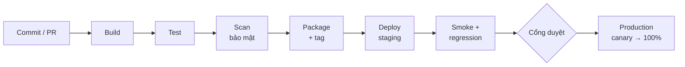

# Chương 33: Deployment Pipeline & Daily Deployment

## Mục tiêu học

- Mô tả pipeline CI/CD (build → test → scan → package → deploy) và các cổng chất lượng.
- Phân biệt Continuous Delivery với Continuous Deployment, và **deploy** với **release**.
- Nêu điều kiện tiên quyết để deploy hằng ngày và một ngày deploy điển hình.
- Giải thích rolling, blue-green, canary, staged rollout và vòng đời feature flag.
- Tính 4 chỉ số DORA và dùng chúng để báo cáo hệ thống (không chấm điểm cá nhân).
- So sánh (A) release theo kế hoạch với (B) daily deploy và lập lộ trình chuyển đổi 6 bước.

## 33.1 Pipeline CI/CD

**CI/CD pipeline** là dây chuyền tự động đưa thay đổi từ commit đến môi trường:

Mỗi giai đoạn có **cổng chất lượng** (điều kiện để sang bước tiếp theo): build thành công; test đạt ≥ ngưỡng (coverage không giảm); quét bảo mật không có lỗ hổng mức cao; artifact bất biến có tag; staging khoẻ; smoke/regression đạt; duyệt (tự động hoặc bởi Tech Lead). Nếu một cổng đỏ, dây chuyền **dừng** — sửa trước khi làm việc mới.

📎 Mẫu đầy đủ: `templates/delivery-plan/ci-cd-pipeline-stages.md`

**Continuous Delivery vs Continuous Deployment:**

| | Continuous Delivery | Continuous Deployment |
|---|---|---|
| Ý nghĩa | Mọi bản qua pipeline **sẵn sàng** deploy bất kỳ lúc nào | Bản qua pipeline **tự động lên production** |
| Quyết định phát hành | Con người bấm nút | Tự động theo cổng |
| Hợp khi | Cần duyệt/kiểm toán, thay đổi rủi ro cao | Rủi ro thấp, tin cậy cao |

FoodNow backend/web: Delivery đến canary cho mọi thay đổi; Deployment tự động cho thay đổi rủi ro thấp; thanh toán/migration cần Tech Lead duyệt.

## 33.2 Daily Deployment

**Daily Deployment** là deploy lên production **nhiều lần mỗi ngày** với thay đổi nhỏ. Ý tưởng cốt lõi: **thay đổi nhỏ = rủi ro nhỏ mỗi lần**, dễ tìm nguyên nhân và dễ lùi. Thay vì "một bản lớn hai tuần một lần", bạn có "nhiều bản nhỏ mỗi ngày".

**Điều kiện tiên quyết** (thiếu điều nào, đừng làm):

1. Test tự động **đáng tin** (regression, contract test; flaky thấp);
2. **Trunk-based**, PR nhỏ, review nhanh;
3. **Feature flag** để tách deploy khỏi release;
4. **Monitoring và cảnh báo** cho luồng chính;
5. **Rollback nhanh** (< 10–15 phút);
6. **On-call** rõ ràng.

**Một ngày deploy điển hình (FoodNow, tuần 12):** 09:00 hai PR nhỏ merge → pipeline chạy 20 phút → staging xanh; 10:15 canary 10% → theo dõi 15 phút → rollout 100%; 13:30 một sửa lỗi nhỏ → tự động (rủi ro thấp); 15:00 thay đổi liên quan thanh toán → Tech Lead duyệt trong pipeline; sau 16:00 không deploy mới; cảnh báo chỉ một lần (độ trễ) và tự hết. Tổng 3–4 deploy, mỗi deploy vài chục dòng.

### Deploy ≠ Release

**Deploy** là đưa code lên production. **Release** là **cho người dùng thấy/dùng** tính năng. Tách hai việc bằng **feature flag** hoặc **dark launch** (chạy ngầm không hiển thị): code có thể nằm trên production nhiều ngày với flag tắt, rồi bật cho 1% → 10% → 100% khi sẵn sàng. Lợi ích: deploy thường xuyên không buộc phải ra mắt; sự cố xử lý bằng **tắt flag** (vài giây) thay vì deploy lại. Với PM: khái niệm này trả lời Sponsor "tính năng X có trên production chưa?" bằng hai câu khác nhau — **đã deploy?** và **đã bật cho ai?**

## 33.3 Chiến lược giảm rủi ro khi deploy

| Chiến lược | Cách làm | Ưu | Nhược |
|---|---|---|---|
| **Rolling** | Thay dần từng máy chủ | Không cần gấp đôi hạ tầng | Hai phiên bản cùng chạy tạm thời |
| **Blue-green** | Hai môi trường giống nhau; chuyển lưu lượng từ "xanh" sang "lục" | Chuyển và lùi tức thì | Tốn gấp đôi hạ tầng; xử lý DB khó |
| **Canary** | Cho 5–10% lưu lượng dùng bản mới, theo dõi, rồi mở rộng | Phát hiện lỗi sớm với ít người ảnh hưởng | Cần monitoring tốt |
| **Staged rollout** | Mở dần theo % (1 → 10 → 50 → 100%) | Kiểm soát rủi ro | Cần cơ chế điều tiết |

**Mobile**: **phased release** (Apple/Google cho phát hành dần theo %), **remote config** và feature flag để bật tắt tính năng mà không đợi bản app mới; nhớ backend tương thích ngược ≥ 2 phiên bản app.

**Vòng đời feature flag**: tạo → bật dần → 100% → **xoá flag** (dọn code). Flag để mãi là **flag debt** (nợ flag): code rối, dễ nhầm. Có register (flag, mục đích, chủ sở hữu, hạn xoá) và dọn hằng tháng.

📎 Mẫu đầy đủ: `templates/delivery-plan/feature-flag-register.csv`

## 33.4 DORA metrics

**DORA** (DevOps Research and Assessment) đo hiệu quả giao phần mềm. Bộ bốn chỉ số kinh điển là Deployment Frequency, Lead Time for Changes, Change Failure Rate và Time to Restore. **Cập nhật (đối chiếu dora.dev, 09/2026):** DORA hiện mô tả **năm** chỉ số — nhóm *throughput* gồm Change Lead Time, Deployment Frequency, **Failed Deployment Recovery Time** (thay cho Time to Restore/MTTR cũ) và nhóm *instability* gồm Change Fail Rate cùng **Deployment Rework Rate** (tỷ lệ deploy ngoài kế hoạch phát sinh do sự cố). Sách giữ cách gọi bốn chỉ số vì dễ tính từ log deploy; nếu đội bạn có dữ liệu sự cố, hãy đo thêm rework rate. Cột "mức tham chiếu" dưới đây là **tham chiếu lịch sử** (các báo cáo cũ chia elite/high/medium/low; báo cáo gần đây phân nhóm theo dữ liệu khảo sát từng năm nên ngưỡng thay đổi) — không dùng như chuẩn chấm điểm.

| Chỉ số | Đo gì | Công thức | Mức tốt (tham chiếu) |
|---|---|---|---|
| **Deployment Frequency** | Tần suất deploy production | Số deploy ÷ số ngày | Nhiều lần/ngày (elite) → hằng tuần (medium) |
| **Lead Time for Changes** | Từ commit đến chạy trên production | Trung vị thời gian | < 1 ngày (elite) … > 1 tháng (low) |
| **Change Failure Rate** | Tỷ lệ deploy gây sự cố cần khắc phục | Deploy lỗi ÷ tổng deploy | ~0–15% (elite/high) |
| **Time to Restore** (nay: Failed Deployment Recovery Time) | Thời gian khôi phục sau deploy lỗi | Trung vị | < 1 giờ (tham chiếu lịch sử) |

FoodNow, so sánh tuần 1–4 và tuần 9–12 sau chuyển đổi:

| Chỉ số | Tuần 1–4 | Tuần 9–12 |
|---|---|---|
| Deploy | 18 (≈ 4,5/tuần) | 55 (≈ 13,8/tuần, hằng ngày) |
| Change Failure Rate | 4/18 = **22%** | 5/55 = **9%** |
| Lead time (trung vị) | 60–96 giờ | 6–14 giờ |
| Time to Restore | 140–180 phút | 35–55 phút |

📎 Mẫu đầy đủ: `templates/delivery-plan/dora-metrics.csv` (12 tuần, công thức)

**Cách dùng đúng**: đo **hệ thống**, dùng để **cải tiến quy trình** và báo cáo Sponsor. **Không** chấm điểm cá nhân hay so sánh giữa đội (Goodhart: khi chỉ số thành mục tiêu, nó mất nghĩa — người ta chia nhỏ deploy để "tăng tần suất"). Bốn chỉ số phải nhìn **cùng nhau**: tần suất tăng mà CFR tăng theo là dấu hiệu nguy hiểm.

## 33.5 Cửa sổ deploy, on-call và khi deploy hỏng

- **Cửa sổ**: tránh chiều thứ Sáu, sát lễ, cao điểm kinh doanh (giờ ăn trưa/tối với FoodNow); hotfix ngoại lệ.
- **On-call**: người trực trả lời cảnh báo trong 15 phút, có runbook, được bù giờ.
- **Khi hỏng**: (1) tắt flag hoặc rollback **trước** khi điều tra; (2) thông báo; (3) sửa nhỏ và deploy lại; (4) post-incident review không đổ lỗi.

📎 Mẫu đầy đủ: `templates/delivery-plan/daily-deployment-policy.md`, `deployment-runbook.md`

## 33.6 So sánh (A) và (B) và lộ trình chuyển đổi 6 bước

| Tiêu chí | (A) Release theo kế hoạch | (B) Daily deploy |
|---|---|---|
| Kích thước mỗi lần | Lớn (2 tuần công) | Nhỏ (giờ–ngày công) |
| Rủi ro mỗi lần | Cao | Thấp |
| Phản hồi | Chậm (mỗi sprint/release) | Nhanh (hằng ngày) |
| Kiểm toán | Dễ (tag, UAT, duyệt) | Cần change record tự sinh |
| Nhu cầu tự động hoá | Vừa | **Rất cao** |
| Hợp với | Mobile, UAT chính thức, hợp đồng mốc | Web/backend trưởng thành |
| Chi phí đầu tư ban đầu | Thấp | Cao (test, flag, monitoring) |

**Lộ trình A → B, 6 bước**: (1) tăng test tự động → (2) rút ngắn nhánh → (3) thêm feature flag → (4) deploy staging hằng ngày → (5) canary production → (6) daily production. Không sang bước sau khi bước trước chưa đạt; dừng nếu CFR > 25% hai tuần liền.

**Tuân thủ/kiểm toán khi daily deploy**: **approval tự động** theo quy tắc (test, scan, không nằm trong cửa sổ cấm), **change record sinh từ pipeline** (tag, người commit, người duyệt, thời điểm, kết quả), giữ log không sửa được; thay đổi rủi ro cao vẫn cần người duyệt.

📎 Mẫu đầy đủ: `templates/delivery-plan/release-strategy-migration-plan.md`

## Tình huống FoodNow

Sau hypercare (kết thúc 30/10/2026), tuần 44 (02/11), Dũng đề xuất và Hà đồng ý bắt đầu chuyển **backend/web** sang **trunk-based + daily deploy** (mobile giữ release train). Ma trận sau go-live cho B = 4,35 so với A = 3,15 (Ch30). Đội thực hiện 6 bước trong 12 tuần: tuần đầu **3 deploy/tuần** (staging chủ yếu), test tự động tăng lên 70%; đến **tuần 8**, canary production và duyệt tự động cho rủi ro thấp giúp deploy **hằng ngày** (11 lần/tuần). **Change Failure Rate giảm từ 22% xuống 9%**, lead time từ 60–96 giờ xuống 6–14 giờ.

Tuần 8 có một sự cố: một thay đổi thuật toán ghép tài xế làm thời gian giao tăng bất thường; canary phát hiện trong 5 phút và đội tắt feature flag `driver_matching_v2` — **rollback trong 6 phút**, không ai nhận ra ngoài đội. Hà báo Sponsor: "Deploy hỏng, khách chưa thấy, và mình lùi trong 6 phút."

Cũng trong giai đoạn này, anh Bảo gọi cho Hà: "Tôi muốn tính năng khuyến mãi *ra ngay trong ngày*, chiều nay tôi có buổi với đối tác." Hà trả lời bằng hai khái niệm: "Deploy thì có thể trong hôm nay. Nhưng em sẽ deploy với flag tắt, kiểm thử trên production ở 1% và bật cho đối tác xem trước; bật cho toàn bộ khi đủ điều kiện. Còn app mobile phải chờ review của Apple/Google; phần khuyến mãi hiển thị được nhờ remote config." Anh Bảo có thứ để cho đối tác xem lúc 15:00, mà rủi ro cho người dùng thật vẫn thấp.

## Bài tập

**Bài 1 (làm ra sản phẩm) — Tính 4 chỉ số DORA.** Dữ liệu 10 ngày làm việc (mỗi dòng là một deploy production; thời gian từ commit đến deploy; nếu lỗi, thời gian khôi phục):

| Deploy | Lead time (giờ) | Kết quả | Thời gian khôi phục (phút) |
|---|---|---|---|
| D1 | 20 | OK | — |
| D2 | 6 | OK | — |
| D3 | 30 | Lỗi | 40 |
| D4 | 8 | OK | — |
| D5 | 12 | OK | — |
| D6 | 4 | OK | — |
| D7 | 26 | Lỗi | 20 |
| D8 | 10 | OK | — |
| D9 | 5 | OK | — |
| D10 | 14 | OK | — |

Tính: Deployment Frequency, Lead Time (trung vị), Change Failure Rate, Time to Restore (trung vị); nhận xét.

**Bài 2 (làm ra sản phẩm) — Kế hoạch chuyển đổi 6 bước.** Lập kế hoạch chuyển đổi cho hệ thống của bạn (đang release 2 tuần/lần), mỗi bước có tuần, việc, tiêu chí hoàn thành, chỉ số và rủi ro.

**Bài 3 (tình huống ngắn).** Sponsor đòi "deploy tính năng ngay trong ngày" cho một app mobile có ba tuần dev. Team chưa có feature flag và chưa test tự động. Bạn trả lời thế nào?

Gợi ý đáp án

**Bài 1:** DF = 10 deploy ÷ 10 ngày = **1/ngày**. Lead time sắp xếp: 4,5,6,8,10,12,14,20,26,30 → trung vị (10+12)/2 = **11 giờ**. CFR = 2/10 = **20%**. TTR = trung vị (20, 40) = **30 phút**. Nhận xét: tần suất và thời gian khôi phục tốt, lead time dưới 1 ngày; **CFR 20%** cao hơn ngưỡng ~15% → cần tăng test/canary; hai deploy lỗi có lead time dài (30h, 26h) → PR/khối thay đổi lớn hơn thường lỗi hơn.

**Bài 3:** Chẩn đoán: yêu cầu trái điều kiện tiên quyết (không flag, không test tự động, mobile). Phương án A: nói rõ "deploy ≠ release", lập lộ trình: trước mắt dùng release train/beta cho đối tác; B: thêm remote config/flag tối thiểu cho tính năng này (2–3 ngày) và kiểm thử tay có kiểm soát; C: nếu bắt buộc, phát hành nội bộ (TestFlight/nhóm nhỏ) hôm nay, đại trà sau. Lời nói mẫu: "Để an toàn mà vẫn nhanh, em đề xuất cho đối tác dùng bản thử nội bộ ngay hôm nay, còn phát hành đại trà sau khi qua review và test — em không muốn đặt người dùng thật vào rủi ro khi chưa có cách tắt tính năng." Sai lầm: hứa "trong ngày" mà không có đường lùi.

## Sai lầm thường gặp

1. **Sai lầm:** Daily deploy khi chưa có test tự động và rollback nhanh. → **Hậu quả:** CFR cao, sự cố liên tục. **Cách khắc phục:** điều kiện tiên quyết và lộ trình 6 bước.
2. **Sai lầm:** Coi deploy là release. → **Hậu quả:** không thể deploy thường xuyên mà không ra mắt ngoài ý muốn. **Cách khắc phục:** feature flag/dark launch.
3. **Sai lầm:** Không dọn feature flag. → **Hậu quả:** flag debt, code rối, nhầm trạng thái. **Cách khắc phục:** register, hạn xoá, dọn hằng tháng.
4. **Sai lầm:** Dùng DORA để chấm điểm cá nhân/đội. → **Hậu quả:** bóp méo số liệu, mất niềm tin. **Cách khắc phục:** dùng để cải tiến hệ thống, nhìn bốn chỉ số cùng nhau.
5. **Sai lầm:** Deploy chiều thứ Sáu/trước lễ/giờ cao điểm. → **Hậu quả:** sự cố lúc ít người xử lý. **Cách khắc phục:** cửa sổ deploy và on-call.
6. **Sai lầm:** Daily deploy bản app mobile. → **Hậu quả:** vỡ kỳ vọng vì app store. **Cách khắc phục:** release train + remote config.

## Tóm tắt & tiếp theo

- Pipeline gồm build, test, scan, package, deploy, smoke và cổng duyệt; Delivery = sẵn sàng, Deployment = tự động lên production.
- Daily deploy cần test tự động tốt, trunk-based, feature flag, monitoring, rollback nhanh; deploy khác release.
- Rolling, blue-green, canary, staged rollout; dọn feature flag; DORA đo hệ thống, nhìn bốn chỉ số cùng nhau.
- Lộ trình A → B 6 bước; FoodNow: 22% → 9% CFR, deploy hằng ngày từ tuần 8, rollback 6 phút nhờ flag.

Hết Phần 5. Chương 34 mở Phần 6 với **theo dõi tiến độ: burndown, velocity và EVM**.
