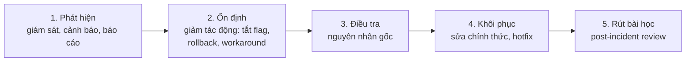

# Chương 38: Xử lý sự cố, leo thang & quản trị khủng hoảng dự án

## Mục tiêu học

- Phân cấp sự cố (dự án và production) và áp dụng quy trình 5 bước: phát hiện → ổn định → điều tra → khôi phục → rút bài học.
- Tổ chức war room và giao tiếp trong khủng hoảng (nội bộ, khách, người dùng).
- Leo thang đúng lúc, đúng người, kèm phương án.
- Áp dụng 5 đòn bẩy cứu dự án "đỏ" và nhận biết khi nào đề xuất dừng dự án.

## 38.1 Hai loại "khủng hoảng"

| | Sự cố production | Dự án "đỏ" |
|---|---|---|
| Bản chất | Hệ thống đang chạy hỏng, người dùng bị ảnh hưởng | Dự án trệch khỏi baseline nghiêm trọng |
| Thời gian | Phút – giờ | Tuần – tháng |
| Thước đo | Thời gian khôi phục, số người bị ảnh hưởng | SPI/CPI, mốc, chất lượng |
| Người xử lý | Kỹ thuật + PM điều phối | PM + Sponsor |
| Công cụ | War room, runbook, rollback, hotfix | Recovery plan, 5 đòn bẩy, CR |

Hai loại có điểm chung: **bình tĩnh, sự thật, phương án, quyết định nhanh, giao tiếp rõ**.

### Phân cấp sự cố production

| Mức | Định nghĩa | Ví dụ | Phản hồi | Leo thang |
|---|---|---|---|---|
| **P1** | Sập/mất tiền/dữ liệu/ảnh hưởng nhiều người | Không đặt được đơn; giá sai | 15 phút, war room | PM → Sponsor ngay |
| **P2** | Chức năng chính lỗi, có cách né | Thông báo trễ | 1 giờ | PM trong 1 giờ; Sponsor nếu > 4 giờ |
| **P3** | Lỗi nhỏ | Hiển thị sai một số máy | 1 ngày | Kanban/backlog |
| **P4** | Cải tiến | Văn bản | — | Backlog |

## 38.2 Quy trình ứng phó sự cố: 5 bước

Nguyên tắc: **ổn định trước, điều tra sau**. Khi người dùng đang bị ảnh hưởng, việc đầu tiên là giảm tác động (tắt tính năng, rollback, chuyển sang phương án dự phòng), không phải tìm "ai gây ra". Điều tra nguyên nhân gốc diễn ra song song hoặc sau khi ổn định.

Tình huống quyết định "rollback hay tiến lên (roll forward)": rollback khi sự cố do bản mới, đường lùi rõ, dữ liệu không bị ảnh hưởng; **không rollback** khi dữ liệu đã migration không thể lùi an toàn, hoặc sửa nhanh hơn. Quyết định này cần **lập luận ghi lại** (như INC-001).

## 38.3 War room và vai trò

**War room** (phòng chỉ huy sự cố) là kênh/phòng riêng tập trung người cần thiết. Vai trò:

| Vai trò | Trách nhiệm |
|---|---|
| **Incident Commander** (thường PM hoặc Tech Lead) | Điều phối, quyết định, giữ nhịp |
| **Kỹ thuật** | Điều tra, đề xuất khắc phục |
| **Communications** | Cập nhật Sponsor, CS, khách; ghi dòng thời gian |
| **Scribe** | Ghi lại sự kiện, quyết định, giờ |
| **QA/Verification** | Xác nhận khắc phục |

Quy tắc: một người chỉ huy; cập nhật định kỳ (30 phút) dù chưa có tiến triển; **không đổ lỗi**; chỉ những người cần thiết ở trong; ghi dòng thời gian bằng giờ thật.

## 38.4 Leo thang: đúng lúc, đúng người, kèm phương án

Leo thang là đưa vấn đề lên người có quyền xử lý — không phải thất bại. Ba nguyên tắc:

1. **Đúng lúc**: theo quy tắc cấp và hạn (Ch06): P1 báo Sponsor ngay; blocker > 1 ngày báo lên cấp kế.
2. **Đúng người**: người có **quyền** quyết định điều bạn cần (tiền, phạm vi, vendor).
3. **Kèm phương án**: vấn đề – tác động – phương án – khuyến nghị – quyết định cần; đừng "ném" vấn đề lên.

## 38.5 Giao tiếp trong khủng hoảng

| Đối tượng | Nội dung | Kênh | Tần suất |
|---|---|---|---|
| **Đội (nội bộ)** | Sự thật, vai trò, bước tiếp | War room | Liên tục |
| **Sponsor/lãnh đạo** | Tác động, khắc phục, dự kiến, quyết định cần | Điện thoại + tin nhắn | Mỗi 30–60 phút |
| **Khách/đối tác** | Đã xảy ra gì, ảnh hưởng gì, làm gì, khi nào cập nhật | Email/kênh chính thức | Theo mốc |
| **Người dùng** | Thông báo ngắn, rõ, xin lỗi, hướng dẫn | Trong app/SMS/trang trạng thái | Khi có thay đổi |
| **CS** | Kịch bản trả lời, danh sách đơn ảnh hưởng | Kênh CS | Ngay |

Nguyên tắc: **nhanh hơn hoàn hảo**; **sự thật, không đoán mò**; một **nguồn phát ngôn**; **không hứa điều chưa chắc**; **cập nhật ngay cả khi chưa có tin mới** ("vẫn đang xử lý, cập nhật tiếp lúc…").

📎 Mẫu đầy đủ: `templates/status-report/incident-report.md`

## 38.6 Dự án "đỏ": năm đòn bẩy

Khi dự án đỏ, bạn có năm loại đòn bẩy (nhớ **C-T-Đ-L-R**):

| # | Đòn bẩy | Ý nghĩa | Khi dùng | Cảnh báo |
|---|---|---|---|---|
| 1 | **Cắt scope** | Bỏ/hoãn hạng mục giá trị thấp | Time cố định; cần giảm khối lượng | Giữ giá trị cốt lõi; Sponsor duyệt |
| 2 | **Thêm người đúng cách** | Nguồn lực cho việc chia được, kỹ năng sẵn có, còn thời gian học | Nguyên nhân là thiếu người thật | Luật Brooks (Ch16) |
| 3 | **Đổi cách làm** | Bỏ nghi thức thừa, PR nhỏ, trả nợ có kế hoạch, giảm WIP | Quy trình đang ăn năng suất | Cần kỷ luật |
| 4 | **Làm rõ quyết định** | Chốt scope, uỷ quyền, quyết định 48 giờ | Chờ quyết định, đổi ý | Cần Sponsor |
| 5 | **Reset kỳ vọng** | Dự báo mới bằng khoảng, cập nhật baseline qua CR | Dự báo cũ không còn khả thi | Nói thật, có kế hoạch |

Quy trình: **chẩn đoán bằng dữ liệu** (EVM, đường găng, velocity) → chọn 2–4 đòn bẩy → đặt **mục tiêu và mốc kiểm tra định lượng** → Sponsor duyệt → đo hằng tuần. Đừng dùng một đòn bẩy duy nhất; và **đừng "thêm người + tăng ca"** như phản xạ.

📎 Mẫu đầy đủ: `templates/status-report/project-recovery-plan.md`

## 38.7 Khi nào đề xuất dừng dự án

Dừng dự án là một lựa chọn hợp lệ, đôi khi tốt nhất. Đề xuất khi: (1) **Business Case không còn đứng vững** (chi phí hoàn thành vượt lợi ích kỳ vọng hoặc mục tiêu thị trường biến mất); (2) **các đòn bẩy đã hết** mà dự báo vẫn không đạt ràng buộc tối thiểu; (3) **rủi ro không chấp nhận được** (pháp lý, an toàn); (4) **Sponsor không còn ủng hộ/nguồn lực rút**. Cách làm: trình bày **phân tích chi phí đã chìm** (không dùng để quyết định), **chi phí tiếp tục vs lợi ích còn lại**, **phương án**: dừng, thu nhỏ, chuyển hướng. Dừng có trật tự: bảo toàn tài sản (code, tài liệu), chăm sóc đội, bàn giao, bài học.

## Tình huống FoodNow

Thứ Bảy 03/10/2026, 02:00, cutover `v1.0.0`. 02:40, hệ thống giám sát báo giá và trạng thái đơn giữa app và Admin **không nhất quán**. Hà, đang ở phòng chỉ huy, xác nhận cùng Nam qua smoke test lần hai lúc 02:50 và **mở war room lúc 03:10**: Dũng điều tra, Ánh phụ trách hạ tầng, Nam xác nhận, Hà là Incident Commander và người nói chuyện với anh Bảo. Trong 20 phút đầu loại trừ code và PayEasy; nghi ngờ cache. Đến 04:15 đội thấy **TTL cache production 300 giây và khoá không đổi sau migration**, trong khi staging 60 giây — nên UAT không tái hiện.

Lúc 05:00, Dũng hỏi: rollback về `v0.16.0`? Hà cân nhắc: migration đã chạy, rollback sẽ kéo theo khôi phục dữ liệu, rủi ro cao hơn; sự cố có thể sửa bằng xả cache và giảm TTL. **Quyết định: không rollback**, ghi rõ lý do. 06:10 xả cache, giảm TTL — ổn định; smoke test đạt. Trong thời gian đó chỉ có **38 khách** thấy giá cũ, **42 đơn** hiển thị lệch, không mất tiền (đối soát khớp). Hà gọi anh Bảo lúc 03:20 (chưa có nguyên nhân), 05:00 (quyết định không rollback), 06:30 (ổn định) — không lần nào anh nghe từ người khác. 11:30 tag `v1.0.1`, 12:10 deploy hotfix chuẩn hoá cấu hình. Báo cáo sự cố hoàn tất 05/10: nguyên nhân gốc là khác biệt cấu hình đã biết (TD-06) bị đánh giá rủi ro thấp; hành động: chuẩn hoá cấu hình, phiên bản khoá cache, thêm smoke test cập nhật thực đơn, thêm "config diff" vào checklist release.

Khi anh Bảo hỏi "Có nên hoãn hypercare không?" Hà đáp: "Không, mình cần hypercare hơn bao giờ hết. Nhưng em xin cho đội nghỉ luân phiên vì đã thức trắng." Anh đồng ý.

## Bài tập

**Bài 1 (làm ra sản phẩm) — Recovery plan cho dự án đỏ.** Dự án web thương mại 8 tháng, tuần 18: SPI 0,78, CPI 0,90, 40% thời gian đã trôi, Backend Lead nghỉ việc, hai release liên tiếp trễ, Sponsor lo. Lập kế hoạch phục hồi: chẩn đoán (≥ 4 nguyên nhân), chọn ≥ 3 trong 5 đòn bẩy với hành động/tác động/chi phí, mốc kiểm tra định lượng và điểm dừng.

**Bài 2 (làm ra sản phẩm).** Viết báo cáo sự cố (mẫu incident-report) cho một sự cố giả định: thông báo push gửi trùng cho 20% người dùng trong 2 giờ.

**Bài 3 (tình huống ngắn).** 01:30 sáng, bạn nhận cuộc gọi: thanh toán thẻ đang thất bại ở 30% giao dịch. Bạn ở nhà, on-call là Ánh. Nêu 5 việc đầu tiên bạn làm trong 30 phút.

Gợi ý đáp án

**Bài 3:** (1) Xác nhận mức P1 và mở war room; gọi Ánh và Tech Lead; (2) ổn định: nếu có kill switch thanh toán thẻ, cân nhắc chuyển tạm sang COD để không mất đơn; (3) liên hệ vendor thanh toán (hotline) và kiểm tra trạng thái dịch vụ; (4) báo Sponsor bằng tin nhắn ngắn: vấn đề – tác động – việc đang làm – lần cập nhật kế tiếp; (5) chuẩn bị thông báo cho người dùng/CS và ghi dòng thời gian. Sau ổn định: điều tra, báo cáo sự cố 48 giờ.

**Bài 1 (gợi ý):** nguyên nhân: thiếu lãnh đạo kỹ thuật, ước lượng lạc quan, quy trình, quyết định chậm. Đòn bẩy: cắt scope Could; thêm người: chỉ cho QA/Dev việc chia được; đổi cách làm (PR nhỏ, rà họp); làm rõ quyết định và Scope Freeze; reset kỳ vọng bằng khoảng. Mốc: SPI ≥ 0,85 sau 4 tuần, ≥ 0,92 sau 8; điểm dừng: SPI < 0,75 hai tuần liền → cắt thêm hoặc dời release. Sai lầm: chỉ thêm người và tăng ca.

## Sai lầm thường gặp

1. **Sai lầm:** Điều tra trước khi ổn định. → **Hậu quả:** người dùng bị ảnh hưởng lâu. **Cách khắc phục:** giảm tác động trước (flag/rollback/workaround).
2. **Sai lầm:** Nhiều người chỉ huy. → **Hậu quả:** chỉ đạo chồng chéo. **Cách khắc phục:** một Incident Commander; vai trò rõ.
3. **Sai lầm:** Giao tiếp chậm/đoán mò. → **Hậu quả:** mất niềm tin. **Cách khắc phục:** cập nhật đều, sự thật, không hứa thứ chưa chắc.
4. **Sai lầm:** Đổ lỗi cá nhân sau sự cố. → **Hậu quả:** lần sau giấu. **Cách khắc phục:** post-incident review không đổ lỗi, tìm nguyên nhân hệ thống.
5. **Sai lầm:** Cứu dự án đỏ bằng thêm người + tăng ca. → **Hậu quả:** trễ hơn, kiệt sức. **Cách khắc phục:** năm đòn bẩy, chẩn đoán bằng dữ liệu.
6. **Sai lầm:** Không bao giờ nghĩ đến dừng dự án. → **Hậu quả:** đốt tiền vào thứ không còn giá trị. **Cách khắc phục:** xem lại Business Case; phân tích chi phí tiếp tục vs lợi ích còn lại.

## Tóm tắt & tiếp theo

- Phân biệt sự cố production (phút–giờ) và dự án đỏ (tuần–tháng); quy trình 5 bước, ổn định trước điều tra.
- War room có vai trò rõ; leo thang đúng lúc, đúng người, kèm phương án; giao tiếp nhanh, thật, một nguồn.
- Năm đòn bẩy cứu dự án: cắt scope, thêm người đúng cách, đổi cách làm, làm rõ quyết định, reset kỳ vọng.
- Dừng dự án là lựa chọn hợp lệ khi Business Case không còn đứng vững hoặc các đòn bẩy đã hết.

Hết Phần 6. Chương 39 mở **Phần 7** với **go-live và cutover**.
