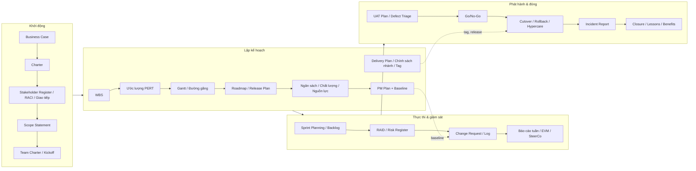

# Chương 47: Capstone — FoodNow từ ý tưởng đến sau go-live

## Mục tiêu học

- Nhìn lại toàn bộ vòng đời một dự án và nối các tài liệu với các giai đoạn.
- Phân tích 10 quyết định then chốt của PM: bối cảnh, lựa chọn, lý do, kết quả.
- Suy luận "nếu làm khác đi" bằng số liệu để hiểu đánh đổi.
- Lập bộ tài liệu khởi động và kế hoạch cho dự án của chính bạn.

## 47.1 Dòng thời gian 52 tuần

| Thời điểm | Sự kiện | Chương/tài liệu |
|---|---|---|
| 10/12/2025 | Business Case; HĐQT duyệt ngân sách 2,4 tỷ (dự phòng 12%) | Ch05 |
| 15/12/2025 | Charter ký | Ch05 |
| T1 05/01/2026 | Kickoff; Sponsor đề xuất đổi mục tiêu → parking lot; thiếu 1 Backend | Ch08, Ch09 |
| T3 22/01 | Pre-mortem; Team Charter (14/01) | Ch18, Ch08 |
| T4 26–30/01 | Phát hiện stakeholder ẩn (CS); chốt GitFlow-lite, Delivery Plan, SemVer | Ch06, Ch30–32 |
| T5–T6 | WBS 06/02 (66 gói, 1.927 ngày công); Scope v1.0; ép 6 tháng → giữ 9, ví → R2 (Scope v1.1, 13/02) | Ch07, Ch10, Ch11 |
| T7–T8 | Tết; Sprint 1 (40% cam kết); tag `v0.1.0` (27/02); Gantt baseline | Ch12, Ch23, Ch32 |
| T9 02/03 | Cost baseline; Resource Plan v1.1 | Ch14, Ch16 |
| T10 09–13/03 | CR-001 đặt nhóm → từ chối; Roadmap v1.0 | Ch13, Ch20 |
| T11 20/03 | PM Plan ký | Ch17 |
| T14 06/04 | Sơn nghỉ việc | Ch16, Ch43 |
| T16 20/04 | PayEasy trễ chứng nhận 3 tuần → contingency | Ch18, Ch21 |
| T18 08/05 | Conflict nhánh 200 file → luật ≤ 5 ngày | Ch31 |
| T20 22/05 | SPI 0,82 / CPI 0,96; recovery plan | Ch34, Ch38 |
| T22 03/06 | Demo HĐQT | Ch11, Ch36 |
| T24 15–19/06 | Xung đột Dũng–Nam; audit họp (T25) | Ch27, Ch28 |
| T28–T29 | Scope Freeze 13/07; feature complete 17/07; cắt `release/1.0.0` 24/07 | Ch30, Ch32 |
| T30 27/07 | `v1.0.0-rc.1`, UAT vòng 1 | Ch37 |
| T33 21/08 | Go/No-Go lần 1 = **No-Go** (47 defect, 3 Critical) | Ch37 |
| T35 04/09 | `v1.0.0-rc.2` | Ch32 |
| T37 16/09 | Go/No-Go lần 2 = **Go** | Ch37 |
| **T39 03/10** | **Go-live 02:00; INC-001 (3,5 giờ); hotfix `v1.0.1`** | Ch38, Ch39 |
| T39–T43 | Hypercare 4 tuần | Ch39 |
| T44 02/11 | Đóng MVP; nghiệm thu; thực chi **2,31 tỷ**; 12 bài học | Ch40 |
| T44–T55 | Chuyển trunk-based + daily deploy (CFR 22% → 9%) | Ch33 |
| +3 tháng 05/01/2027 | 430 đơn/ngày (85%); huỷ 6% → điều chỉnh R1 | Ch41 |

## 47.2 Mười quyết định then chốt của PM

| # | Quyết định | Bối cảnh | Phương án đã cân nhắc | Vì sao chọn | Kết quả |
|---|---|---|---|---|---|
| 1 | **Ghi ràng buộc ưu tiên** (Time cố định, Scope linh hoạt, Cost trần, Quality thanh toán bất khả nhượng) | Sponsor muốn "trước Tết", tiền có hạn | Không ghi; ghi ba dòng trong Charter | Có điểm tựa khi ép lịch/CR | Giải quyết ép 6 tháng và CR-001 trong một buổi |
| 2 | **Giữ dự phòng 12% và quyền 5%** | Sponsor đề nghị 5% | 5%; 12% theo EMV | Ba rủi ro lớn (PayEasy, nhân sự, yêu cầu) | Dự phòng đã dùng 170/256,8, không cần xin thêm |
| 3 | **Chọn Hybrid** | Khách cần ngân sách/mốc, yêu cầu sẽ đổi | Waterfall; Agile; Hybrid | Ma trận 4,20 điểm | Vừa có baseline vừa có sprint; CR T&M |
| 4 | **Điều động nội bộ thay vì tuyển Backend** | Thiếu 1 Backend từ kickoff | Tuyển; freelancer; điều động; cắt phạm vi | Nhanh (3 tuần), rủi ro thấp | Đủ đội ở tuần 4 |
| 5 | **GitFlow-lite + release theo sprint + SemVer** | Hợp đồng mốc, mobile, UAT | Trunk-based; GitFlow | Ma trận 4,05 vs 2,05 | Truy vết rõ; chuyển B sau go-live |
| 6 | **Giữ 9 tháng, chuyển ví sang R2** | Ép rút MVP còn 6 tháng | 6 tháng cắt 38%; 9 tháng; 7,5 tháng rủi ro cao | Dữ liệu năng lực (1.420 vs 1.985 ngày công) | Go-live đúng hạn |
| 7 | **Kích hoạt contingency PayEasy** (fast-tracking + crashing 110 triệu) | Vendor trễ 3 tuần trên đường găng | Chờ; fast-track; crashing | Contingency và quyền quyết đã chuẩn bị | Giữ 03/10 |
| 8 | **Recovery plan bằng 5 đòn bẩy** khi SPI 0,82 | Đỏ ở tuần 20 | Chỉ thêm người + tăng ca; dời 4 tuần | Chẩn đoán bằng dữ liệu và đường găng | SPI 0,98 ở T36 |
| 9 | **No-Go lần 1** dựa tiêu chí đã ký | 47 defect, 3 Critical | Go có điều kiện; No-Go | Tiêu chí ký từ tháng 3; QA phản đối | Go lần 2 an toàn |
| 10 | **Không rollback INC-001**, sửa tiến và hotfix | Sự cố cache 3,5 giờ sau cutover | Rollback `v0.16.0`; xả cache + hotfix | Migration đã chạy; sửa nhanh hơn | 38 khách bị ảnh hưởng, không mất tiền |

(Quyết định thứ 11, sau hypercare: chuyển backend/web sang trunk-based + daily deploy, nhưng giữ release train cho mobile.)

## 47.3 Bản đồ tài liệu: tài liệu nào ra đời ở giai đoạn nào

**Liên kết quan trọng giữa tài liệu:** Charter (ràng buộc ưu tiên) → Scope Statement → WBS → Schedule/Gantt (đường găng) → Budget → PM Plan (baseline) → Change Request (đổi baseline) → Báo cáo/EVM (so baseline) → Go/No-Go (tiêu chí ký từ Quality Plan) → Closure (so baseline) → Benefits (so Business Case). Mọi số (1.927 ngày công; 2,14 tỷ; 131 ngày làm việc) đều đi xuyên suốt chuỗi này — nếu số nào đứng đơn lẻ, đó là dấu hiệu tài liệu không được nối.

## 47.4 Ba phiên bản "nếu làm khác đi" (What-if)

**What-if 1 — Nếu nhận ép "6 tháng".** Năng lực 25 tuần ≈ 1.420 ngày công so với nhu cầu ≈ 1.985; ngay cả khi làm 100%, thiếu ≈ 560 ngày công; nếu giữ 87% năng lực, phải cắt khoảng 38% phạm vi — chỉ còn app Khách hàng và Nhà hàng, không có Tài xế và Admin, không vận hành được. Kết cục dự kiến: go-live 6 tháng với hệ thống không dùng được, hoặc trễ thực tế và mất niềm tin. **Bài học:** ràng buộc phải đi cùng năng lực; nói "không" bằng số.

**What-if 2 — Nếu dự phòng chỉ 5% (≈ 107 triệu).** Chi thực dùng dự phòng là 170 triệu (PayEasy 110 + thay thế nhân sự 60). Với 5% cả hai khoản không thể cùng xảy ra mà không xin thêm vào giữa tháng 5 — đúng lúc SPI đỏ. Hà sẽ mất 1–2 tuần xin duyệt, và cơ hội fast-tracking (bắt đầu 01/06) có thể bị lỡ, kéo go-live khoảng 3 tuần. **Bài học:** dự phòng gắn với EMV rủi ro và quy tắc dùng bằng văn bản.

**What-if 3 — Nếu "Go có điều kiện" ở lần 1 (T33).** Ba Critical (trừ tiền không tạo đơn, tài xế nhận trùng chuyến, đối soát lệch) có xác suất xảy ra cao ở 500 đơn/ngày; giả sử 200 đơn ảnh hưởng × 165.000 VND = 33 triệu thiệt hại trực tiếp, cộng bồi thường, mất khách và rủi ro uy tín ước lượng 300+ triệu; xa hơn, chứng nhận PayEasy có thể bị đình chỉ. **Bài học:** tiêu chí Go/No-Go ký từ đầu bảo vệ cả khách lẫn nhà thầu.

## 47.5 Bài tập cuối: bộ tài liệu khởi động và kế hoạch cho dự án của bạn

Chọn một dự án thật hoặc giả định (đội 6–12 người, 4–9 tháng). Lập **bộ tài liệu tối thiểu** sau, dùng `templates/` làm mẫu và nối với nhau bằng số liệu thống nhất:

| # | Tài liệu | Yêu cầu tối thiểu | Chương |
|---|---|---|---|
| 1 | Business Case | 3 phương án (gồm "không làm gì"), payback/ROI, độ nhạy | Ch05 |
| 2 | Charter | Mục tiêu SMART, ràng buộc ưu tiên một dòng, quyền hạn PM bằng ngưỡng | Ch05 |
| 3 | Stakeholder Register + RACI | ≥ 10 stakeholder, RACI mỗi việc một "A" | Ch06 |
| 4 | Scope Statement | in-scope, ≥ 5 out-of-scope, tiêu chí chấp nhận | Ch07 |
| 5 | WBS | ≥ 25 work package, quy tắc 100%, tổng kiểm tra | Ch10 |
| 6 | Ước lượng | 8 gói bằng PERT, khoảng 80% | Ch11 |
| 7 | Gantt + đường găng | ≥ 15 dòng, milestone, `crit`, float | Ch12 |
| 8 | Roadmap + Release Plan | Now–Next–Later, OKR, Go/No-Go | Ch13 |
| 9 | Ngân sách | 4 nhóm, dự phòng theo EMV, cash flow | Ch14 |
| 10 | Quality Plan + DoD + Go/No-Go | mục tiêu chất lượng có số, 3 cấp DoD | Ch15 |
| 11 | RAID + Risk Register | ≥ 20 dòng RAID, ≥ 10 rủi ro có EMV | Ch18–19 |
| 12 | Delivery Plan | Chọn A/B bằng ma trận, chính sách nhánh/tag, Release Calendar | Ch30–32 |
| 13 | PM Plan | 15 mục, ≤ 12 trang, baseline có người duyệt | Ch17 |

**Tiêu chí tự đánh giá:** (a) số liệu khớp giữa các tài liệu (ngày công ↔ ngân sách ↔ lịch); (b) mỗi rủi ro lớn có chủ sở hữu và contingency; (c) ràng buộc ưu tiên xuất hiện ở Charter, PM Plan và ít nhất một quyết định; (d) bạn có thể trả lời "khi nào xong?" bằng một khoảng và ba giả định; (e) người khác đọc PM Plan của bạn trong 15 phút hiểu được dự án.

**Cách tự kiểm:** đưa bộ tài liệu cho một người chưa biết dự án; yêu cầu họ trả lời 5 câu: Dự án nhằm gì? Ràng buộc nào cố định? Đường găng ở đâu? Rủi ro lớn nhất là gì và ai lo? Khi nào Go/No-Go? Nếu không trả lời được, sửa tài liệu chứ không sửa người đọc.

## Tình huống FoodNow

Tối 13/11/2026, hai ngày sau khi báo cáo đóng dự án được ký, Hà ngồi lại một mình và đọc lại bảng mười quyết định. Chị nhận ra không có quyết định nào trong đó là "thông minh" theo nghĩa hiếm có; mỗi quyết định đều xuất phát từ một thứ chị đã **chuẩn bị từ sớm**: ràng buộc ghi ở Charter, dự phòng có quy tắc, tiêu chí Go/No-Go đã ký, phụ thuộc vendor nằm trên đường găng có kế hoạch dự phòng, RAID hằng tuần, báo cáo không bất ngờ. Khi khủng hoảng đến, chị không phải nghĩ ra cách xử lý — chị mở tài liệu.

Chị viết vào đầu file lessons learned một câu ngắn gửi chính mình cho dự án sau: *"Việc quan trọng nhất của PM không phải chữa cháy giỏi; là làm cho đám cháy có đường thoát đã vẽ sẵn."* Rồi chị mở file kế hoạch chứng chỉ (Ch04): PSM I đã thi đạt tháng 5; PMP lên lịch cho năm 2027 khi hồ sơ giờ dẫn dự án đủ. Tháng 12, chị nhận vai Delivery Manager cho hai đội R1 — và bắt đầu lại từ Charter.

## Bài tập

**Bài 1 (làm ra sản phẩm)** — Lập bộ tài liệu ở mục 47.5 cho dự án của bạn.

**Bài 2 (làm ra sản phẩm)** — Chọn ba quyết định trong mười quyết định của Hà; viết lại chúng theo bối cảnh dự án của bạn: bạn sẽ chọn gì, dữ liệu nào ủng hộ.

**Bài 3 (tình huống ngắn)** — Với What-if 2 (dự phòng 5%), hãy đề xuất quy tắc dự phòng thay thế cho dự án của bạn: mức %, hạn mức PM tự quyết, khi nào xin Sponsor, và cách gắn với rủi ro.

Gợi ý đáp án Bài 3

Quy tắc mẫu: dự phòng bằng tổng EMV các rủi ro Score ≥ 12 cộng 5% biên độ (FoodNow: 236,8 + phần đệm ≈ 256,8 triệu = 12%); PM tự dùng ≤ 5% ngân sách trong tuần và báo cáo; vượt cần Sponsor duyệt bằng văn bản trong 48 giờ; chỉ dùng cho rủi ro có ID trong RAID; theo dõi ở báo cáo tuần; nếu dùng > 50% trước 60% thời gian dự án → cắt hạng mục Could. Lý do: tách quyền tự quyết (nhanh) khỏi tổng quỹ (đủ lớn).

## Sai lầm thường gặp

1. **Sai lầm:** Coi capstone như "chuyện của người khác". → **Hậu quả:** không chuyển được sang dự án của mình. **Cách khắc phục:** làm bài tập 47.5 với dự án thật.
2. **Sai lầm:** Sao chép mẫu mà không nối số liệu. → **Hậu quả:** tài liệu mâu thuẫn. **Cách khắc phục:** kiểm chuỗi số (ngày công ↔ ngân sách ↔ lịch).
3. **Sai lầm:** Chỉ ghi kết quả, không ghi lý do quyết định. → **Hậu quả:** không học được. **Cách khắc phục:** Decision Log có bối cảnh và phương án.
4. **Sai lầm:** Chuẩn bị tài liệu xong rồi cất. → **Hậu quả:** khi khủng hoảng không ai mở. **Cách khắc phục:** dùng hằng tuần (RAID, báo cáo).
5. **Sai lầm:** Đổ mọi thành công cho "PM giỏi". → **Hậu quả:** không nhân rộng. **Cách khắc phục:** đưa bài học vào template.

## Tóm tắt & tiếp theo

- FoodNow đi qua 52 tuần với mười quyết định then chốt, mỗi quyết định dựa trên thứ đã chuẩn bị từ sớm.
- Tài liệu nối với nhau bằng chuỗi số; baseline đổi qua CR; Go/No-Go ký từ đầu; báo cáo không bất ngờ.
- What-if cho thấy đánh đổi bằng số: 6 tháng, dự phòng 5%, Go có điều kiện.
- Bạn kết thúc sách bằng việc lập bộ tài liệu cho dự án của mình.

Phần phụ lục gồm chỉ mục template (A), các mẫu đầy đủ (B–D2), thuật ngữ (E), checklist nhanh (F), tài liệu tham khảo (G) và hồ sơ chứng chỉ (H).
