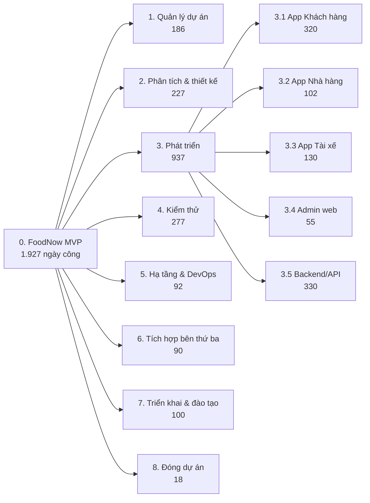
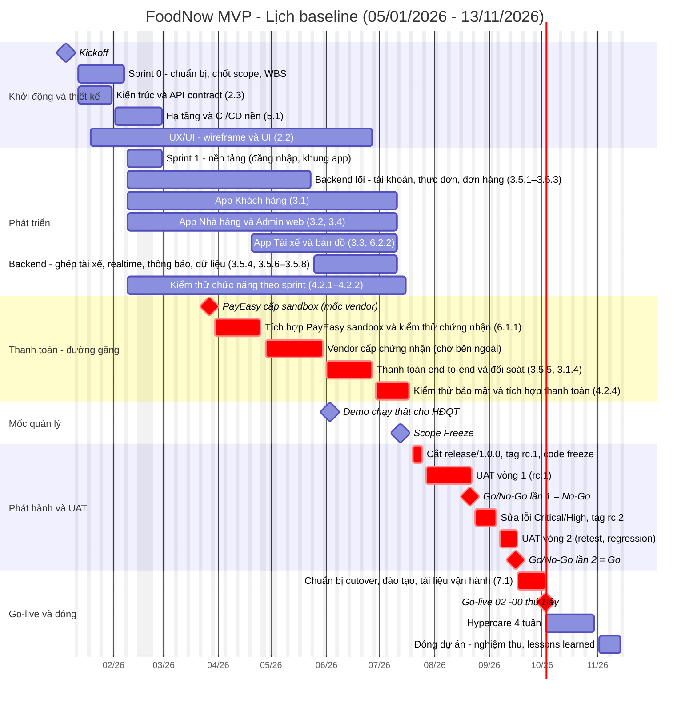
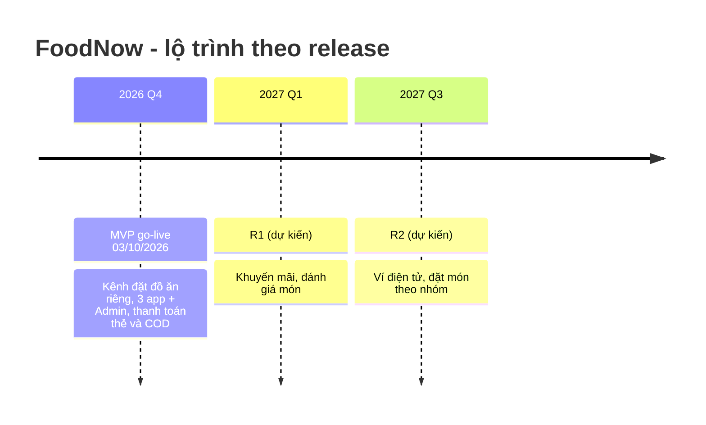
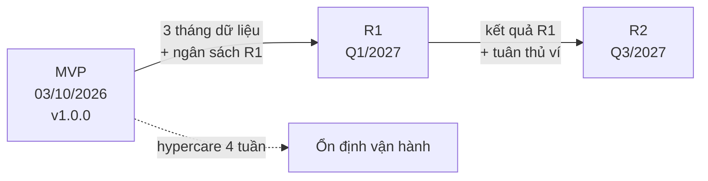

# Phụ lục C — Mẫu WBS + Timeline/Gantt + Roadmap đầy đủ (FoodNow)

Bản in từ `templates/wbs/`, `timeline-gantt/`, `roadmap/`. Đọc kèm Ch10–Ch13.

## C.1 WBS (cây và tóm tắt)

📎 Nguồn: `templates/wbs/FoodNow-WBS.md`

**Tên tài liệu:** WBS — FoodNow MVP
**Dự án:** FoodNow MVP
**Phiên bản / ngày:** v1.0 — 06/02/2026 (baseline, cùng Scope Statement v1.0; điều chỉnh cho v1.1 ở Ch11/Ch12)
**Mục đích & khi nào dùng:** Phân rã deliverable thành các work package để ước lượng, lập lịch, giao việc; dùng sau khi chốt Scope Statement.

---

#### 1. Cây WBS (đến cấp 3)

#### 2. Tóm tắt theo nhóm

| Mã | Nhóm | Số work package | Ngày công | Tỷ trọng |
|---|---|---|---|---|
| 1 | Quản lý dự án | 5 | 186 | 9,7% |
| 2 | Phân tích và thiết kế | 8 | 227 | 11,8% |
| 3 | Phát triển | 27 | 937 | 48,6% |
| 4 | Kiểm thử | 7 | 277 | 14,4% |
| 5 | Hạ tầng và DevOps | 5 | 92 | 4,8% |
| 6 | Tích hợp bên thứ ba | 5 | 90 | 4,7% |
| 7 | Triển khai và đào tạo | 6 | 100 | 5,2% |
| 8 | Đóng dự án | 3 | 18 | 0,9% |
| | **Tổng** | **66** | **1.927** | 100% |

#### 3. Kiểm tra với năng lực đội

- Năng lực: 12 FTE × ~185 ngày làm việc (từ 05/01 đến 03/10/2026, trừ Tết và lễ) = **2.220 ngày**.
- Ước lượng WBS = **1.927 ngày** ≈ **87%** năng lực; phần còn lại ≈ 293 ngày (13%) cho họp, nghỉ phép, học việc, việc phát sinh — đó chính là lý do không xếp 100%.
- Chi phí nhân sự MVP 1,67 tỷ ÷ 1.927 ngày ≈ 0,87 triệu VND/ngày công (chi phí bình quân đã gồm overhead; xem Ch14).

#### 4. Chi tiết work package

Xem `FoodNow-WBS.csv` (cột: `WBS_ID, Level, Name, Description, Owner, Estimate_Days, Depends_On, Status`); dòng cuối là **dòng tổng kiểm tra** bằng công thức. Từ điển WBS cho các gói lớn ở `wbs-dictionary.md`.

Quy tắc:
- Level 1 = toàn dự án; Level 2 = nhóm deliverable; Level 3 = nhóm con; **Level 4 = work package** (lá cây).
- Work package lớn nhất 65 ngày (dịch vụ đơn hàng) — sẽ được chia nhỏ thành story khi vào backlog (Ch24).

---

#### Cách dùng cho dự án của bạn

1. Bắt đầu từ Scope Statement: mỗi epic in-scope và mỗi hạng mục project scope (quản lý, kiểm thử, triển khai) là một nhánh cấp 2.
2. Phân rã đến khi mỗi lá ước lượng được và có một người chịu trách nhiệm.
3. Kiểm tra quy tắc 100%: cộng các con phải bằng cha, không thiếu cũng không thừa.
4. So tổng ước lượng với năng lực đội; nếu > 90% thì lịch quá căng.
5. Lưu ID ổn định; khi đổi WBS sau baseline phải qua change control.

## C.2 WBS chi tiết (66 work package)

📎 Nguồn: `templates/wbs/FoodNow-WBS.csv` (bảng dưới là bản đọc của tệp CSV; công thức Excel giữ nguyên trong tệp gốc).

| WBS_ID | Level | Name | Description | Owner | Estimate_Days | Depends_On | Status |
|---|---|---|---|---|---|---|---|
| 0 | 1 | FoodNow MVP | Toàn bộ dự án MVP | Hà | =F3+F11+F23+F56+F66+F74+F82+F91 |  | Baseline v1.0 |
| 1 | 2 | Quản lý dự án |  |  | =F4+F7 |  | Baseline v1.0 |
| 1.1 | 3 | Khởi động và lập kế hoạch |  |  | =SUM(F5:F6) |  | Baseline v1.0 |
| 1.1.1 | 4 | Charter, scope, PM Plan | Business Case, Charter, Scope Statement, kế hoạch tổng | Hà | 15 |  | Chưa bắt đầu |
| 1.1.2 | 4 | Stakeholder, RACI, giao tiếp | Register, RACI, kế hoạch giao tiếp, kickoff | Hà | 6 | 1.1.1 | Chưa bắt đầu |
| 1.2 | 3 | Điều hành và giám sát |  |  | =SUM(F8:F10) |  | Baseline v1.0 |
| 1.2.1 | 4 | Điều hành sprint và họp | Họp Sponsor, sprint ceremony, gỡ blocker suốt dự án | Hà | 100 | 1.1.2 | Chưa bắt đầu |
| 1.2.2 | 4 | Báo cáo, rủi ro, thay đổi | Báo cáo tuần/tháng, RAID, change control | Hà | 45 | 1.1.2 | Chưa bắt đầu |
| 1.2.3 | 4 | Quản lý vendor và nguồn lực | Đồng bộ PayEasy, SMS, bản đồ; kế hoạch nguồn lực | Hà | 20 | 1.1.2 | Chưa bắt đầu |
| 2 | 2 | Phân tích và thiết kế |  |  | =F12+F16+F20 |  | Baseline v1.0 |
| 2.1 | 3 | Phân tích nghiệp vụ |  |  | =SUM(F13:F15) |  | Baseline v1.0 |
| 2.1.1 | 4 | Epic và backlog ban đầu | Workshop, epic, backlog v1 | Lan | 20 | 1.1.1 | Chưa bắt đầu |
| 2.1.2 | 4 | Đặc tả story và tiêu chí chấp nhận | Viết và tinh chỉnh story liên tục theo sprint | Lan | 90 | 2.1.1 | Chưa bắt đầu |
| 2.1.3 | 4 | Quy trình nghiệp vụ và workshop người dùng | Nhà hàng, tài xế, CS | Lan | 15 | 2.1.1 | Chưa bắt đầu |
| 2.2 | 3 | Thiết kế UX/UI |  |  | =SUM(F17:F19) |  | Baseline v1.0 |
| 2.2.1 | 4 | Nghiên cứu và wireframe | Luồng chính, wireframe 3 app | Mai Anh | 20 | 2.1.1 | Chưa bắt đầu |
| 2.2.2 | 4 | UI 3 app và Admin | Màn hình chi tiết, prototype | Mai Anh | 45 | 2.2.1 | Chưa bắt đầu |
| 2.2.3 | 4 | Design system và bàn giao | Component, hướng dẫn cho Dev | Mai Anh | 10 | 2.2.2 | Chưa bắt đầu |
| 2.3 | 3 | Thiết kế kỹ thuật |  |  | =SUM(F21:F22) |  | Baseline v1.0 |
| 2.3.1 | 4 | Kiến trúc tổng thể và ADR | Kiến trúc, quyết định kỹ thuật | Dũng | 12 | 1.1.1 | Chưa bắt đầu |
| 2.3.2 | 4 | Thiết kế CSDL và API contract | Schema, hợp đồng API | Dũng | 15 | 2.3.1 | Chưa bắt đầu |
| 3 | 2 | Phát triển |  |  | =F24+F32+F37+F42+F47 |  | Baseline v1.0 |
| 3.1 | 3 | App Khách hàng (iOS/Android) |  |  | =SUM(F25:F31) |  | Baseline v1.0 |
| 3.1.1 | 4 | Đăng ký/đăng nhập OTP |  | Khoa | 30 | 2.3.2 | Chưa bắt đầu |
| 3.1.2 | 4 | Duyệt và tìm món |  | Khoa | 55 | 3.1.1 | Chưa bắt đầu |
| 3.1.3 | 4 | Giỏ hàng và đặt đơn |  | Tuấn | 65 | 3.1.2 | Chưa bắt đầu |
| 3.1.4 | 4 | Thanh toán thẻ và COD (client) |  | Tuấn | 50 | 3.1.3;6.1.1 | Chưa bắt đầu |
| 3.1.5 | 4 | Theo dõi đơn và bản đồ |  | Khoa | 70 | 3.1.3 | Chưa bắt đầu |
| 3.1.6 | 4 | Lịch sử đơn và đặt lại |  | Quỳnh | 30 | 3.1.3 | Chưa bắt đầu |
| 3.1.7 | 4 | Thông báo push |  | Quỳnh | 20 | 3.5.6 | Chưa bắt đầu |
| 3.2 | 3 | App Nhà hàng (web tablet) |  |  | =SUM(F33:F36) |  | Baseline v1.0 |
| 3.2.1 | 4 | Đăng nhập và phân quyền |  | FE Web | 12 | 2.3.2 | Chưa bắt đầu |
| 3.2.2 | 4 | Nhận và xử lý đơn |  | FE Web | 45 | 3.2.1 | Chưa bắt đầu |
| 3.2.3 | 4 | Quản lý thực đơn |  | FE Web | 30 | 3.2.1 | Chưa bắt đầu |
| 3.2.4 | 4 | Báo cáo doanh thu cơ bản |  | FE Web | 15 | 3.2.2 | Chưa bắt đầu |
| 3.3 | 3 | App Tài xế (Android) |  |  | =SUM(F38:F41) |  | Baseline v1.0 |
| 3.3.1 | 4 | Đăng nhập và hồ sơ |  | Quỳnh | 15 | 2.3.2 | Chưa bắt đầu |
| 3.3.2 | 4 | Nhận chuyến và điều hướng |  | Quỳnh | 60 | 3.3.1;6.3.1 | Chưa bắt đầu |
| 3.3.3 | 4 | Cập nhật trạng thái giao và thu COD |  | Tuấn | 40 | 3.3.2 | Chưa bắt đầu |
| 3.3.4 | 4 | Thu nhập và lịch sử |  | Quỳnh | 15 | 3.3.3 | Chưa bắt đầu |
| 3.4 | 3 | Admin web |  |  | =SUM(F43:F46) |  | Baseline v1.0 |
| 3.4.1 | 4 | Quản lý người dùng và phân quyền |  | FE Web | 15 | 3.5.1 | Chưa bắt đầu |
| 3.4.2 | 4 | Quản lý nhà hàng và thực đơn |  | FE Web | 15 | 3.5.2 | Chưa bắt đầu |
| 3.4.3 | 4 | Quản lý đơn và tranh chấp |  | FE Web | 15 | 3.5.3 | Chưa bắt đầu |
| 3.4.4 | 4 | Báo cáo cơ bản |  | FE Web | 10 | 3.5.8 | Chưa bắt đầu |
| 3.5 | 3 | Backend / API |  |  | =SUM(F48:F55) |  | Baseline v1.0 |
| 3.5.1 | 4 | Dịch vụ tài khoản và xác thực |  | Sơn | 35 | 2.3.2 | Chưa bắt đầu |
| 3.5.2 | 4 | Dịch vụ thực đơn và nhà hàng |  | Backend 2 | 35 | 2.3.2 | Chưa bắt đầu |
| 3.5.3 | 4 | Dịch vụ đơn hàng và vòng đời |  | Sơn | 65 | 3.5.1 | Chưa bắt đầu |
| 3.5.4 | 4 | Dịch vụ ghép tài xế và định tuyến |  | Backend 2 | 50 | 3.5.3 | Chưa bắt đầu |
| 3.5.5 | 4 | Dịch vụ thanh toán và đối soát |  | Sơn | 55 | 3.5.3;6.1.1 | Chưa bắt đầu |
| 3.5.6 | 4 | Dịch vụ thông báo (push/SMS) |  | Backend 2 | 25 | 3.5.1 | Chưa bắt đầu |
| 3.5.7 | 4 | Theo dõi thời gian thực |  | Backend 2 | 40 | 3.5.3 | Chưa bắt đầu |
| 3.5.8 | 4 | Dữ liệu và báo cáo |  | Sơn | 25 | 3.5.3 | Chưa bắt đầu |
| 4 | 2 | Kiểm thử |  |  | =F57+F60 |  | Baseline v1.0 |
| 4.1 | 3 | Kế hoạch kiểm thử |  |  | =SUM(F58:F59) |  | Baseline v1.0 |
| 4.1.1 | 4 | Chiến lược và kế hoạch kiểm thử |  | Nam | 10 | 1.1.1 | Chưa bắt đầu |
| 4.1.2 | 4 | Viết test case |  | QA | 45 | 2.1.2 | Chưa bắt đầu |
| 4.2 | 3 | Thực thi kiểm thử |  |  | =SUM(F61:F65) |  | Baseline v1.0 |
| 4.2.1 | 4 | Kiểm thử chức năng theo sprint |  | Nam | 120 | 4.1.2 | Chưa bắt đầu |
| 4.2.2 | 4 | Kiểm thử tự động và regression |  | QA | 45 | 4.2.1 | Chưa bắt đầu |
| 4.2.3 | 4 | Kiểm thử hiệu năng |  | Nam | 15 | 3.5.3 | Chưa bắt đầu |
| 4.2.4 | 4 | Kiểm thử bảo mật cơ bản |  | Nam | 12 | 3.5.5 | Chưa bắt đầu |
| 4.2.5 | 4 | Hỗ trợ UAT và regression cuối |  | Nam | 30 | 4.2.2 | Chưa bắt đầu |
| 5 | 2 | Hạ tầng và DevOps |  |  | =F67+F70 |  | Baseline v1.0 |
| 5.1 | 3 | Môi trường và pipeline |  |  | =SUM(F68:F69) |  | Baseline v1.0 |
| 5.1.1 | 4 | Môi trường dev/staging/prod |  | Ánh | 20 | 2.3.1 | Chưa bắt đầu |
| 5.1.2 | 4 | CI/CD pipeline |  | Ánh | 25 | 5.1.1 | Chưa bắt đầu |
| 5.2 | 3 | Giám sát và an toàn |  |  | =SUM(F71:F73) |  | Baseline v1.0 |
| 5.2.1 | 4 | Giám sát và logging |  | Ánh | 15 | 5.1.1 | Chưa bắt đầu |
| 5.2.2 | 4 | Sao lưu và bảo mật hạ tầng |  | Ánh | 12 | 5.1.1 | Chưa bắt đầu |
| 5.2.3 | 4 | Hỗ trợ release |  | Ánh | 20 | 5.1.2 | Chưa bắt đầu |
| 6 | 2 | Tích hợp bên thứ ba |  |  | =F75+F77 |  | Baseline v1.0 |
| 6.1 | 3 | Thanh toán |  |  | =SUM(F76:F76) |  | Baseline v1.0 |
| 6.1.1 | 4 | Tích hợp PayEasy và chứng nhận | Sandbox, tích hợp, chứng nhận | Dũng | 40 | 2.3.2 | Chưa bắt đầu |
| 6.2 | 3 | Dịch vụ khác |  |  | =SUM(F78:F81) |  | Baseline v1.0 |
| 6.2.1 | 4 | SMS OTP |  | Backend 2 | 10 | 2.3.2 | Chưa bắt đầu |
| 6.2.2 | 4 | Bản đồ và định tuyến |  | Quỳnh | 20 | 2.3.2 | Chưa bắt đầu |
| 6.2.3 | 4 | Push notification service |  | Backend 2 | 8 | 2.3.2 | Chưa bắt đầu |
| 6.2.4 | 4 | API dữ liệu nhà hàng |  | Sơn | 12 | 2.3.2 | Chưa bắt đầu |
| 7 | 2 | Triển khai và đào tạo |  |  | =F83+F88 |  | Baseline v1.0 |
| 7.1 | 3 | Chuẩn bị go-live |  |  | =SUM(F84:F87) |  | Baseline v1.0 |
| 7.1.1 | 4 | Kế hoạch cutover và rollback |  | Dũng | 8 | 5.1.2 | Chưa bắt đầu |
| 7.1.2 | 4 | Di chuyển dữ liệu nhà hàng |  | Sơn | 12 | 6.2.4 | Chưa bắt đầu |
| 7.1.3 | 4 | Đào tạo nhà hàng và tài xế |  | Lan | 15 | 4.2.5 | Chưa bắt đầu |
| 7.1.4 | 4 | Tài liệu người dùng và runbook |  | Lan | 15 | 4.2.5 | Chưa bắt đầu |
| 7.2 | 3 | Go-live và hypercare |  |  | =SUM(F89:F90) |  | Baseline v1.0 |
| 7.2.1 | 4 | Go-live và cutover |  | Dũng | 10 | 7.1.1 | Chưa bắt đầu |
| 7.2.2 | 4 | Hypercare 4 tuần |  | Hà | 40 | 7.2.1 | Chưa bắt đầu |
| 8 | 2 | Đóng dự án |  |  | =F92 |  | Baseline v1.0 |
| 8.1 | 3 | Đóng và bàn giao |  |  | =SUM(F93:F95) |  | Baseline v1.0 |
| 8.1.1 | 4 | Nghiệm thu và bàn giao vận hành |  | Hà | 8 | 7.2.2 | Chưa bắt đầu |
| 8.1.2 | 4 | Lessons learned và báo cáo đóng |  | Hà | 6 | 8.1.1 | Chưa bắt đầu |
| 8.1.3 | 4 | Đóng hợp đồng, giải phóng nguồn lực |  | Hà | 4 | 8.1.2 | Chưa bắt đầu |
| KIEM-TRA |  | Tổng kiểm tra (chỉ cộng work package cấp 4) | Phải bằng dòng 0; đối chiếu năng lực = 12 FTE × 185 ngày = 2.220 |  | =SUMIFS(F2:F95,B2:B95,4) |  | OK |

## C.3 WBS Dictionary

📎 Nguồn: `templates/wbs/wbs-dictionary.md`

**Tên tài liệu:** Từ điển WBS (WBS Dictionary) — FoodNow MVP
**Dự án:** FoodNow MVP
**Phiên bản / ngày:** v1.0 — 06/02/2026
**Mục đích & khi nào dùng:** Mô tả chi tiết từng work package quan trọng để mọi người hiểu cùng một nghĩa; dùng cho các gói lớn/rủi ro cao.

---

#### Khung mô tả

Mỗi work package: **ID · Tên · Mô tả phạm vi · Deliverable · Tiêu chí hoàn thành · Chịu trách nhiệm · Ước lượng · Phụ thuộc · Giả định/Rủi ro.**

#### 3.5.3 Dịch vụ đơn hàng và vòng đời

| Trường | Nội dung |
|---|---|
| Mô tả | Tạo, cập nhật, huỷ đơn; máy trạng thái (mới → xác nhận → chuẩn bị → giao → hoàn tất/huỷ) |
| Deliverable | API đơn hàng; tài liệu máy trạng thái; unit test |
| Tiêu chí hoàn thành | Mọi chuyển trạng thái hợp lệ được kiểm thử; API theo hợp đồng; qua code review; không bug Critical/High |
| Người chịu trách nhiệm | Sơn |
| Ước lượng | 65 ngày (khoảng 50–80) |
| Phụ thuộc | 3.5.1 |
| Rủi ro | Yêu cầu huỷ/hoàn tiền chưa rõ → BA làm rõ trước Sprint 3 |

#### 6.1.1 Tích hợp PayEasy và chứng nhận

| Trường | Nội dung |
|---|---|
| Mô tả | Tích hợp cổng thanh toán thẻ: tạo giao dịch, callback, hoàn tiền, đối soát; hoàn tất chứng nhận của PayEasy |
| Deliverable | Module tích hợp; báo cáo kiểm thử sandbox; giấy chứng nhận |
| Tiêu chí hoàn thành | Giao dịch thành công/thất bại/hoàn tiền đúng; đối soát khớp; chứng nhận được cấp |
| Người chịu trách nhiệm | Dũng |
| Ước lượng | 40 ngày (chưa gồm thời gian chờ chứng nhận của vendor) |
| Phụ thuộc | 2.3.2 |
| Rủi ro | **Cao**: vendor có thể trễ chứng nhận — ghi RAID, kế hoạch dự phòng (Ch18, Ch21) |

#### 3.1.5 Theo dõi đơn và bản đồ (app Khách hàng)

| Trường | Nội dung |
|---|---|
| Mô tả | Hiển thị vị trí tài xế theo thời gian thực, thời gian dự kiến, trạng thái đơn |
| Deliverable | Màn hình theo dõi iOS/Android; kết nối realtime |
| Tiêu chí hoàn thành | Cập nhật vị trí ≤ 5 giây; pin/dữ liệu trong ngưỡng chấp nhận; qua UAT |
| Người chịu trách nhiệm | Khoa |
| Ước lượng | 70 ngày |
| Phụ thuộc | 3.1.3, 3.5.7 |

#### 4.2.5 Hỗ trợ UAT và regression cuối

| Trường | Nội dung |
|---|---|
| Mô tả | Chuẩn bị dữ liệu, môi trường UAT; hỗ trợ người dùng; chạy regression khi có bản vá |
| Deliverable | Báo cáo UAT; danh sách defect và trạng thái |
| Tiêu chí hoàn thành | Đạt tiêu chí Go/No-Go (Ch37) |
| Người chịu trách nhiệm | Nam |
| Ước lượng | 30 ngày |

---

#### Cách dùng cho dự án của bạn

1. Chỉ viết từ điển cho gói lớn (> 30 ngày), rủi ro cao hoặc hay gây hiểu lầm.
2. Viết tiêu chí hoàn thành kiểm tra được, không dùng từ như "tốt", "ổn".
3. Ghi khoảng ước lượng (thấp–cao), không chỉ một con số.
4. Cập nhật từ điển khi WBS đổi; lưu cùng phiên bản.
5. Gửi người chịu trách nhiệm xác nhận từng dòng.

## C.4 Gantt và lịch sprint

📎 Nguồn: `templates/timeline-gantt/FoodNow-Gantt.md`

**Tên tài liệu:** Gantt baseline — FoodNow MVP
**Dự án:** FoodNow MVP
**Phiên bản / ngày:** v1.0 — 27/02/2026 (baseline lịch sau Tết, đồng bộ Scope Statement v1.1 và WBS v1.0)
**Mục đích & khi nào dùng:** Hiển thị lịch tổng thể, đường găng và các mốc để trình bày với Sponsor và đội; dùng sau khi có WBS, ước lượng và phụ thuộc.

---

#### 1. Gantt (Mermaid)

> Gantt loại bỏ cuối tuần, Tết (16–20/02/2026), bù Giỗ Tổ 27/04, 30/04–01/05 và 02/09. Các gói màu "crit" nằm trên đường găng. Chi tiết ngày, phụ thuộc và float ở `FoodNow-Schedule.csv`.

#### 2. Lịch sprint

| Sprint | Từ – Đến | Tuần | Tag cuối sprint |
|---|---|---|---|
| Sprint 0 | 12/01 – 06/02 | T2–T5 | — |
| Sprint 1 | 09/02 – 27/02 (gồm Tết) | T6–T8 | v0.1.0 |
| Sprint 2 | 02/03 – 13/03 | T9–T10 | v0.2.0 |
| Sprint 3 | 16/03 – 27/03 | T11–T12 | v0.3.0 |
| Sprint 4 | 30/03 – 10/04 | T13–T14 | v0.4.0 |
| Sprint 5 | 13/04 – 24/04 | T15–T16 | v0.5.0 |
| Sprint 6 | 27/04 – 08/05 | T17–T18 | v0.6.0 |
| Sprint 7 | 11/05 – 22/05 | T19–T20 | v0.7.0 |
| Sprint 8 | 25/05 – 05/06 | T21–T22 | v0.8.0 |
| Sprint 9 | 08/06 – 19/06 | T23–T24 | v0.9.0 |
| Sprint 10 | 22/06 – 03/07 | T25–T26 | v0.10.0 |
| Sprint 11 | 06/07 – 17/07 | T27–T28 | v0.11.0 |
| Sprint 12 | 20/07 – 31/07 | T29–T30 | v0.12.0 (+ rc.1 cho UAT) |
| Sprint 13 | 03/08 – 14/08 | T31–T32 | v0.13.0 |
| Sprint 14 | 17/08 – 28/08 | T33–T34 | v0.14.0 |
| Sprint 15 | 31/08 – 11/09 | T35–T36 | v0.15.0 (+ rc.2) |
| Sprint 16 | 14/09 – 25/09 | T37–T38 | v0.16.0 |
| Go-live | Thứ Bảy 03/10 | T39 | **v1.0.0** |

#### 3. Đọc-hiểu đường găng

| Gói | Từ – Đến | Ngày làm việc | Float | Vì sao găng |
|---|---|---|---|---|
| PayEasy cấp sandbox (mốc vendor) | 27/03 | 0 | 0 | Phụ thuộc bên ngoài, không tự rút ngắn |
| Tích hợp PayEasy sandbox + kiểm thử chứng nhận | 30/03 – 24/04 | 20 | 0 | Cần sandbox trước khi tích hợp |
| Vendor cấp chứng nhận | 28/04 – 29/05 | 22 | 0 | Chờ bên ngoài |
| Thanh toán end-to-end + đối soát | 01/06 – 26/06 | 20 | 0 | Cần chứng nhận |
| Kiểm thử bảo mật và tích hợp thanh toán | 29/06 – 17/07 | 15 | 0 | Phải xong trước code freeze |
| Cắt release/1.0.0, tag rc.1 | 20/07 – 24/07 | 5 | 0 | Điều kiện vào UAT |
| UAT vòng 1 | 27/07 – 21/08 | 20 | 0 | |
| Sửa lỗi Critical/High, rc.2 | 24/08 – 04/09 | 9 | 0 | Sau No-Go lần 1 |
| UAT vòng 2 → Go/No-Go lần 2 | 07/09 – 16/09 | 8 | 0 | |
| Chuẩn bị cutover, đào tạo | 17/09 – 02/10 | 12 | 0 | |
| **Go-live** | **03/10 (T7)** | — | 0 | |

**Kết luận:** đường găng đi qua **tích hợp thanh toán** (tổng 131 ngày làm việc từ 30/03 đến 02/10). Các nhánh phát triển (app Khách hàng, Nhà hàng, Tài xế, Backend) có float 2–5 ngày làm việc — **gần găng** (near-critical), cần theo dõi. Mọi trễ ở nhánh găng làm trễ go-live nếu không có biện pháp rút ngắn (crashing/fast-tracking, Ch12).

#### 4. Ghi chú

- Baseline lịch này khớp WBS v1.0 (66 work package, 1.927 ngày công) và Scope Statement v1.1.
- Demo cho HĐQT: 03/06/2026 (tuần 22).
- Scope Freeze: 13/07/2026 (tuần 28).

---

#### Cách dùng cho dự án của bạn

1. Bắt đầu từ WBS: gom work package thành 15–30 dòng lịch (đủ để trình bày, không quá chi tiết).
2. Xác định phụ thuộc (FS/SS/FF/SF) và các mốc bên ngoài (vendor, khách).
3. Tính đường găng, ghi float; đánh dấu `crit` trong Mermaid.
4. Loại trừ cuối tuần và ngày nghỉ của quốc gia/công ty trong `excludes`.
5. Cập nhật hằng tuần (ngày thực tế, % hoàn thành) và lưu baseline để so sánh.

## C.5 Schedule (bảng ngày, phụ thuộc, float)

📎 Nguồn: `templates/timeline-gantt/FoodNow-Schedule.csv` (bảng dưới là bản đọc của tệp CSV; công thức Excel giữ nguyên trong tệp gốc).

| Task_ID | Task | Start | End | Duration_wd | Predecessors | Resource | Percent_Complete | Critical | Float_wd | Ghi_chu |
|---|---|---|---|---|---|---|---|---|---|---|
| M01 | Kickoff (mốc) | 2026-01-05 | 2026-01-05 | 0 |  | Cả đội | 0 | No | 6 | Mốc |
| S02 | Sprint 0: chuẩn bị, chốt scope, WBS | 2026-01-12 | 2026-02-06 | 20 | M01 | Hà, Lan, Dũng | 0 | No | 2 | Kéo dài 4 tuần (kế hoạch 2 tuần) do chờ Backend và chốt scope |
| S03 | Kiến trúc và API contract (2.3) | 2026-01-12 | 2026-01-30 | 15 | M01 | Dũng | 0 | No | 10 |  |
| S04 | Hạ tầng và CI/CD nền (5.1) | 2026-02-02 | 2026-02-27 | 15 | S03 | Ánh (50%) | 0 | No | 151 |  |
| S05 | UX/UI: wireframe và UI (2.2) | 2026-01-19 | 2026-06-26 | 107 | M01 | Mai Anh (50%) | 0 | No | 69 | Thiết kế trước dev 1 sprint |
| S06 | Sprint 1: nền tảng (đăng nhập, khung app) | 2026-02-09 | 2026-02-27 | 10 | S03 | Cả đội | 0 | No | 151 | Gồm tuần Tết; tag v0.1.0 cuối sprint |
| S07 | Backend lõi: tài khoản, thực đơn, đơn hàng (3.5.1–3.5.3) | 2026-02-09 | 2026-05-22 | 67 | S03 | Sơn, Backend 2 | 0 | No | 5 |  |
| S08 | PayEasy cấp sandbox (mốc vendor) | 2026-03-27 | 2026-03-27 | 0 |  | Yến (PayEasy) | 0 | Yes | 0 | Mốc bên ngoài, hứa tại kickoff |
| S09 | Tích hợp PayEasy sandbox và kiểm thử chứng nhận (6.1.1) | 2026-03-30 | 2026-04-24 | 20 | S08;S03 | Dũng, Backend 2 | 0 | Yes | 0 | Đường găng |
| S10 | Vendor cấp chứng nhận (chờ bên ngoài) | 2026-04-28 | 2026-05-29 | 22 | S09 | PayEasy | 0 | Yes | 0 | Đường găng; báo trễ 3 tuần ở tuần 16 |
| S11 | Thanh toán end-to-end và đối soát (3.5.5, 3.1.4) | 2026-06-01 | 2026-06-26 | 20 | S10;S07 | Backend 2, Tuấn | 0 | Yes | 0 | Đường găng |
| S12 | Kiểm thử bảo mật và tích hợp thanh toán (4.2.4) | 2026-06-29 | 2026-07-17 | 15 | S11 | Nam, QA | 0 | Yes | 0 | Đường găng |
| S13 | App Khách hàng (3.1) | 2026-02-09 | 2026-07-10 | 102 | S03 | Khoa, Tuấn, Quỳnh | 0 | No | 5 |  |
| S14 | App Nhà hàng và Admin web (3.2, 3.4) | 2026-02-09 | 2026-07-10 | 102 | S03 | FE Web | 0 | No | 5 |  |
| S15 | App Tài xế và bản đồ (3.3, 6.2.2) | 2026-04-20 | 2026-07-10 | 57 | S03 | Quỳnh, Tuấn | 0 | No | 5 |  |
| S16 | Backend: ghép tài xế, realtime, thông báo, dữ liệu (3.5.4, 3.5.6–3.5.8) | 2026-05-25 | 2026-07-10 | 35 | S07 | Backend 2 | 0 | No | 5 |  |
| S17 | Kiểm thử chức năng theo sprint (4.2.1–4.2.2) | 2026-02-09 | 2026-07-15 | 105 | S02 | Nam, QA | 0 | No | 2 |  |
| S18 | Demo chạy thật cho HĐQT (mốc) | 2026-06-03 | 2026-06-03 | 0 |  | Hà, Bảo | 0 | No | 86 | Thoả thuận ở tuần 6 |
| S19 | Scope Freeze (mốc) | 2026-07-13 | 2026-07-13 | 0 |  | Hà, Châu | 0 | No | 58 | Không nhận phạm vi mới |
| S20 | Cắt release/1.0.0, tag rc.1, code freeze | 2026-07-20 | 2026-07-24 | 5 | S12;S13;S14;S15;S16;S17 | Dũng, Ánh | 0 | Yes | 0 | Đường găng |
| S21 | UAT vòng 1 (rc.1) | 2026-07-27 | 2026-08-21 | 20 | S20 | Châu, Huy, Nam | 0 | Yes | 0 | Đường găng |
| S22 | Go/No-Go lần 1 = No-Go (mốc) | 2026-08-21 | 2026-08-21 | 0 | S21 | Bảo, Hà | 0 | Yes | 0 | Đường găng |
| S23 | Sửa lỗi Critical/High, tag rc.2 | 2026-08-24 | 2026-09-04 | 9 | S22 | Cả đội | 0 | Yes | 0 | Đường găng |
| S24 | UAT vòng 2 (retest, regression) | 2026-09-07 | 2026-09-16 | 8 | S23 | Châu, Huy, Nam | 0 | Yes | 0 | Đường găng |
| S25 | Go/No-Go lần 2 = Go (mốc) | 2026-09-16 | 2026-09-16 | 0 | S24 | Bảo, Hà | 0 | Yes | 0 | Đường găng |
| S26 | Chuẩn bị cutover, đào tạo, tài liệu vận hành (7.1) | 2026-09-17 | 2026-10-02 | 12 | S25 | Dũng, Lan, Ánh | 0 | Yes | 0 | Đường găng |
| S27 | Go-live 02:00 thứ Bảy (mốc) | 2026-10-03 | 2026-10-03 | 0 | S26 | Cả đội | 0 | Yes | 0 | Đường găng; tag v1.0.0 |
| S28 | Hypercare 4 tuần | 2026-10-03 | 2026-10-30 | 20 | S27 | Hà, Dũng, Nam | 0 |  |  | Sau go-live |
| S29 | Đóng dự án: nghiệm thu, lessons learned | 2026-11-02 | 2026-11-13 | 10 | S28 | Hà | 0 |  |  | Tuần 44 |

## C.6 Phiếu đường găng

📎 Nguồn: `templates/timeline-gantt/critical-path-worksheet.md`

**Tên tài liệu:** Phiếu tính đường găng (Critical Path Worksheet)
**Dự án:** FoodNow MVP (ví dụ) và bài luyện tập
**Phiên bản / ngày:** v1.0 — 27/02/2026
**Mục đích & khi nào dùng:** Tính tay ES/EF/LS/LF và float để tìm đường găng; dùng khi lập lịch hoặc khi cần đánh giá tác động của một task trễ.

---

#### 1. Quy ước

- **ES** (Early Start): bắt đầu sớm nhất = lớn nhất EF của các task tiền nhiệm (0 nếu không có).
- **EF** (Early Finish) = ES + Duration.
- **LF** (Late Finish): kết thúc muộn nhất mà không làm trễ dự án = nhỏ nhất LS của các task hậu nhiệm (= EF lớn nhất của dự án nếu là task cuối).
- **LS** (Late Start) = LF − Duration.
- **Float (Total Float)** = LS − ES = LF − EF.
- **Đường găng** = chuỗi task có Float = 0; độ dài = tổng Duration = thời gian ngắn nhất để xong dự án.
- Quan hệ dùng: Finish-to-Start (FS) không lag.

#### 2. Ví dụ mẫu (6 task)

| Task | Duration | Tiền nhiệm |
|---|---|---|
| A | 3 | — |
| B | 4 | A |
| C | 2 | A |
| D | 5 | B |
| E | 3 | C |
| F | 2 | D, E |

**Lượt đi (forward):** A 0→3; B 3→7; C 3→5; D 7→12; E 5→8; F: ES = max(12, 8) = 12 → EF = 14.
**Lượt về (backward):** F: LF = 14, LS = 12; D: LF = 12, LS = 7; E: LF = 12, LS = 9; B: LF = 7, LS = 3; C: LF = 9, LS = 7; A: LF = min(LS(B), LS(C)) = min(3, 7) = 3, LS = 0.

| Task | Dur | ES | EF | LS | LF | Float | Găng? |
|---|---|---|---|---|---|---|---|
| A | 3 | 0 | 3 | 0 | 3 | 0 | Có |
| B | 4 | 3 | 7 | 3 | 7 | 0 | Có |
| C | 2 | 3 | 5 | 7 | 9 | 4 | Không |
| D | 5 | 7 | 12 | 7 | 12 | 0 | Có |
| E | 3 | 5 | 8 | 9 | 12 | 4 | Không |
| F | 2 | 12 | 14 | 12 | 14 | 0 | Có |

**Đường găng: A → B → D → F = 14 ngày.** C và E có float 4: trễ tới 4 ngày không ảnh hưởng dự án.

#### 3. Bài luyện (8 task) — tự điền

| Task | Duration | Tiền nhiệm | ES | EF | LS | LF | Float |
|---|---|---|---|---|---|---|---|
| A | 2 | — | | | | | |
| B | 4 | A | | | | | |
| C | 3 | A | | | | | |
| D | 5 | B | | | | | |
| E | 2 | B, C | | | | | |
| F | 4 | C | | | | | |
| G | 3 | D, E | | | | | |
| H | 2 | F, G | | | | | |

Câu hỏi: (1) Đường găng và tổng thời gian? (2) Float của C, E, F? (3) Nếu D trễ 2 ngày thì sao? (đáp án ở cuối chương 12).

#### 4. Đường găng của FoodNow (từ `FoodNow-Schedule.csv`)

| Task | Bắt đầu | Kết thúc | Ngày làm việc | Float |
|---|---|---|---|---|
| PayEasy cấp sandbox (mốc vendor) | 27/03 | 27/03 | 0 | 0 |
| Tích hợp PayEasy + kiểm thử chứng nhận | 30/03 | 24/04 | 20 | 0 |
| Vendor cấp chứng nhận | 28/04 | 29/05 | 22 | 0 |
| Thanh toán end-to-end + đối soát | 01/06 | 26/06 | 20 | 0 |
| Kiểm thử bảo mật + tích hợp thanh toán | 29/06 | 17/07 | 15 | 0 |
| Cắt release/1.0.0, rc.1 | 20/07 | 24/07 | 5 | 0 |
| UAT vòng 1 | 27/07 | 21/08 | 20 | 0 |
| Sửa lỗi Critical/High, rc.2 | 24/08 | 04/09 | 9 | 0 |
| UAT vòng 2 → Go/No-Go lần 2 | 07/09 | 16/09 | 8 | 0 |
| Chuẩn bị cutover, đào tạo | 17/09 | 02/10 | 12 | 0 |
| Go-live | 03/10 | 03/10 | — | 0 |

Tổng chuỗi: 20 + 22 + 20 + 15 + 5 + 20 + 9 + 8 + 12 = **131 ngày làm việc**.

**Task gần găng (float 2–5 ngày làm việc):** app Khách hàng, Nhà hàng, Tài xế, Backend (float 5); kiểm thử chức năng theo sprint (float 2). Theo dõi sát vì một trễ nhỏ biến chúng thành găng.

#### 5. Hành động khi đường găng bị trễ

1. Xác định task nào và trễ bao nhiêu ngày làm việc.
2. Trễ trên đường găng ⇒ trễ dự án; hỏi: **crashing** (thêm nguồn lực cho task găng) hay **fast-tracking** (chạy song song các task vốn tuần tự)?
3. Ghi chi phí và rủi ro của từng lựa chọn; chọn với Sponsor.
4. Cập nhật lịch, RAID và báo cáo tuần.

---

#### Cách dùng cho dự án của bạn

1. Liệt kê task, Duration, tiền nhiệm (FS); vẽ mạng nếu cần.
2. Tính ES/EF từ trái sang phải; LS/LF từ phải sang trái.
3. Float = LS − ES; tô đậm task có Float = 0.
4. Ghi task gần găng (float ≤ 20% thời lượng) để theo dõi sát.
5. Tính lại mỗi khi có thay đổi lớn hoặc task găng bị trễ.

## C.7 Product Roadmap

📎 Nguồn: `templates/roadmap/FoodNow-Product-Roadmap.md`

**Tên tài liệu:** Product Roadmap — FoodNow (MVP → R1 → R2)
**Dự án:** FoodNow
**Phiên bản / ngày:** v1.1 — 06/07/2026 (v1.0 ngày 13/03/2026)
**Mục đích & khi nào dùng:** Trình bày hướng đi theo mục tiêu/kết quả, không cam kết ngày chi tiết; dùng cho lãnh đạo, đội và khách; cập nhật khi thông tin lớn thay đổi.

---

#### 1. Nguyên tắc đọc roadmap này

- Là **định hướng**, không phải lịch cam kết. Ngày chi tiết chỉ có cho **Now**; **Next** chỉ có tháng/quý; **Later** chỉ có mục tiêu, **không có ngày**.
- Mỗi release có một **mục tiêu kết quả (outcome)** và một vài **KR** đo được; tính năng chỉ là cách đạt kết quả.
- Độ tin cậy giảm dần từ Now → Later.

#### 2. Tổng quan (timeline)

#### 3. Now – Next – Later

| Vùng | Release | Theme / Outcome | Nội dung | Độ chắc chắn |
|---|---|---|---|---|
| **NOW** (đang làm, có lịch) | **MVP** | Kênh đặt đồ ăn riêng đáng tin cậy | 11 epic: đăng nhập, duyệt/tìm món, giỏ hàng & đặt đơn, thanh toán thẻ + COD, xử lý đơn (nhà hàng), thực đơn, nhận chuyến (tài xế), theo dõi đơn, lịch sử, Admin, thông báo | Cao — go-live 03/10/2026 |
| **NEXT** (đã cam kết ở mức quý) | **R1** (Q1/2027) | Tăng đơn lặp lại và giảm huỷ đơn | Khuyến mãi/mã giảm giá; đánh giá và xếp hạng món; cải thiện hiệu năng theo dữ liệu thật | Trung bình |
| **LATER** (hướng đi, chưa có ngày) | **R2** (dự kiến Q3/2027) | Mở rộng cách thanh toán và cách đặt | Ví điện tử; đặt món theo nhóm; cân nhắc mở rộng khu vực | Thấp — phụ thuộc kết quả R1, quy định |

#### 4. OKR theo release

| Release | Objective | Key results (đo lường) |
|---|---|---|
| **MVP** | Có kênh đặt đồ ăn riêng đáng tin cậy | 500 đơn/ngày sau 3 tháng go-live · huỷ đơn < 5% · thời gian giao TB < 35 phút · payback < 18 tháng |
| **R1** | Khách quay lại nhiều hơn | Tỷ lệ khách đặt lại trong 30 ngày ≥ 35% (mục tiêu đề xuất) · huỷ đơn < 5% ổn định · ≥ 30% đơn có đánh giá món (mục tiêu đề xuất) |
| **R2** | Thanh toán và đặt món linh hoạt hơn | ≥ 25% giao dịch qua ví (mục tiêu đề xuất) · ≥ 10% đơn là đơn nhóm (mục tiêu đề xuất) |

Các KR của R1, R2 là **giả thuyết cần kiểm chứng** bằng dữ liệu sau MVP (Ch41); sẽ chỉnh khi có số liệu thật.

#### 5. Ba phiên bản cho ba đối tượng

| Đối tượng | Nội dung | Độ chi tiết |
|---|---|---|
| **Lãnh đạo/HĐQT** | Mục tiêu kinh doanh từng release, KR, rủi ro lớn | 1 slide |
| **Đội phát triển** | Theme, epic, phụ thuộc kỹ thuật, nợ kỹ thuật cần xử lý trước release | 1 trang + backlog |
| **Khách/đối tác** | Thứ họ sẽ dùng, khi nào (mức quý) | Tóm tắt, không hứa tính năng chi tiết |

#### 6. Lịch sử thay đổi

| Phiên bản | Ngày | Thay đổi | Lý do |
|---|---|---|---|
| v1.0 | 13/03/2026 | Bản đầu: MVP/R1/R2; ví điện tử ở R2 | Sau đàm phán tuần 6 |
| **v1.1** | 06/07/2026 | Trong R2 (Later): đặt món theo nhóm **đi trước** ví điện tử; ví chờ hoàn tất yêu cầu tuân thủ mới về xác thực người dùng ví | Yêu cầu pháp lý từ cố vấn pháp lý FoodNow; **mục tiêu R2 và quý dự kiến không đổi** |

---

#### Cách dùng cho dự án của bạn

1. Bắt đầu từ mục tiêu kinh doanh, không từ danh sách tính năng; mỗi release có Objective + 2–3 KR.
2. Chia Now / Next / Later; **không** ghi ngày cho Later.
3. Ghi độ chắc chắn để người đọc không hiểu nhầm là cam kết.
4. Viết 3 phiên bản (lãnh đạo, đội, khách) từ cùng một nguồn.
5. Khi cập nhật, ghi rõ **cái gì đổi, cái gì không đổi, vì sao** ở bảng lịch sử thay đổi.

## C.8 Release Plan

📎 Nguồn: `templates/roadmap/FoodNow-Release-Plan.md`

**Tên tài liệu:** Release Plan — FoodNow MVP, R1, R2
**Dự án:** FoodNow
**Phiên bản / ngày:** v1.0 — 13/03/2026 (chỉnh 06/07/2026)
**Mục đích & khi nào dùng:** Chuyển roadmap thành kế hoạch phát hành: mục tiêu, phạm vi, tiêu chí Go/No-Go và phụ thuộc từng release; dùng sau roadmap, trước Delivery Plan (Ch30).

---

#### 1. Tổng quan release

| Release | Cửa sổ dự kiến | Mục tiêu | Trạng thái |
|---|---|---|---|
| **MVP** | Go-live **03/10/2026** (T7, 02:00) | Kênh đặt đồ ăn riêng đáng tin cậy | Đang thực hiện |
| **R1** | Q1/2027 | Tăng đơn lặp lại, giảm huỷ | Kế hoạch |
| **R2** | Q3/2027 | Mở rộng thanh toán và cách đặt | Định hướng |

#### 2. Phạm vi từng release

| Release | Trong phạm vi | Ngoài phạm vi |
|---|---|---|
| MVP | 11 epic E1–E11 (xem Scope Statement v1.1) | Khuyến mãi, đánh giá, ví, đặt nhóm |
| R1 | Khuyến mãi/mã giảm giá; đánh giá món; tối ưu hiệu năng | Ví điện tử, đặt nhóm |
| R2 | Đặt món theo nhóm; ví điện tử (sau khi đủ yêu cầu tuân thủ) | Mở rộng đa thành phố (chưa lên lịch) |

#### 3. Tiêu chí Go/No-Go từng release

| Nhóm | MVP | R1 | R2 |
|---|---|---|---|
| Chất lượng | Không còn bug Critical/High; luồng thanh toán qua kiểm thử đầy đủ | Không còn bug Critical; ≤ 5 High có kế hoạch sửa | Như R1 + kiểm thử thanh toán ví |
| UAT | Đạt kịch bản nghiệm thu, Châu và Huy ký | Người dùng đại diện ký | Người dùng đại diện ký |
| Hiệu năng | Đáp ứng tải dự kiến 500 đơn/ngày | Đáp ứng 800 đơn/ngày (mục tiêu đề xuất) | Theo dữ liệu R1 |
| Vận hành | Runbook, đội hỗ trợ được đào tạo, rollback sẵn sàng | Runbook cập nhật | Runbook cập nhật |
| Tuân thủ | Chứng nhận thanh toán còn hiệu lực | Rà soát khuyến mãi theo quy định | **Yêu cầu tuân thủ ví điện tử hoàn tất** |
| Kinh doanh | Sponsor đồng ý ngày go-live | Sponsor duyệt ngân sách R1 sau khi có số liệu MVP | Sponsor duyệt ngân sách R2 |

#### 4. Phụ thuộc và rủi ro

| Release | Phụ thuộc | Rủi ro chính |
|---|---|---|
| MVP | Chứng nhận PayEasy; API dữ liệu nhà hàng; nhân sự đủ 12 FTE | Trễ chứng nhận; thiếu nhân sự |
| R1 | Số liệu 3 tháng sau go-live; nợ kỹ thuật MVP được xử lý | Ngân sách chưa duyệt; đội bị tách |
| R2 | Vendor ví điện tử; yêu cầu tuân thủ | Quy định thay đổi; vendor mới |

#### 5. Lộ trình MVP → R1 → R2

#### 6. Cách cập nhật mà không "lật kèo"

- Mọi thay đổi ghi vào bảng lịch sử của roadmap: **đổi gì – không đổi gì – vì sao**.
- Đổi thứ tự trong cùng release thì thông báo trong SteerCo; đổi release cho một mục lớn cần Sponsor duyệt.
- Không đổi ngày đã công bố cho **Now**; nếu bất khả kháng, thông báo sớm kèm phương án.

---

#### Cách dùng cho dự án của bạn

1. Liệt kê 3 release (hoặc nhiều hơn) với mục tiêu và cửa sổ thời gian ở mức quý.
2. Với mỗi release, viết tiêu chí Go/No-Go đo được (chất lượng, UAT, hiệu năng, vận hành, tuân thủ, kinh doanh).
3. Liệt kê phụ thuộc và rủi ro chính; chuyển vào RAID.
4. Đặt quy tắc cập nhật release plan; ai được duyệt thay đổi.
5. Khi chuyển sang lịch phát hành chi tiết (Delivery Plan), giữ nguyên mục tiêu và tiêu chí ở đây làm nguồn.

## C.9 Roadmap dạng bảng

📎 Nguồn: `templates/roadmap/roadmap.csv` (bảng dưới là bản đọc của tệp CSV; công thức Excel giữ nguyên trong tệp gốc).

| Item_ID | Release | Horizon | Theme | Outcome | Item | Priority_MoSCoW | Target_Window | Confidence | Depends_On | Status |
|---|---|---|---|---|---|---|---|---|---|---|
| R-01 | MVP | Now | Đặt hàng cốt lõi | Khách đặt được món và thanh toán | Đăng ký/đăng nhập OTP | Must | 2026-Q4 | Cao | PayEasy sandbox | Đang làm |
| R-02 | MVP | Now | Đặt hàng cốt lõi | Khách đặt được món và thanh toán | Duyệt và tìm món | Must | 2026-Q4 | Cao |  | Đang làm |
| R-03 | MVP | Now | Đặt hàng cốt lõi | Khách đặt được món và thanh toán | Giỏ hàng và đặt đơn | Must | 2026-Q4 | Cao |  | Đang làm |
| R-04 | MVP | Now | Thanh toán | Thanh toán thẻ và COD an toàn | Thanh toán thẻ (PayEasy) + COD | Must | 2026-Q4 | Trung bình | Chứng nhận PayEasy | Đang làm |
| R-05 | MVP | Now | Vận hành nhà hàng | Nhà hàng xử lý đơn nhanh | Nhận và xử lý đơn (web tablet) | Must | 2026-Q4 | Cao |  | Đang làm |
| R-06 | MVP | Now | Vận hành nhà hàng | Nhà hàng tự cập nhật thực đơn | Quản lý thực đơn | Must | 2026-Q4 | Cao |  | Đang làm |
| R-07 | MVP | Now | Giao hàng | Tài xế nhận và giao đúng hạn | App Tài xế (Android): nhận chuyến và điều hướng | Must | 2026-Q4 | Cao | Bản đồ | Đang làm |
| R-08 | MVP | Now | Trải nghiệm | Khách theo dõi đơn chủ động | Theo dõi đơn thời gian thực | Must | 2026-Q4 | Trung bình | Realtime service | Đang làm |
| R-09 | MVP | Now | Vận hành | Admin quản lý được hệ thống | Admin web (người dùng, nhà hàng, đơn, báo cáo cơ bản) | Must | 2026-Q4 | Cao |  | Đang làm |
| R-10 | MVP | Now | Trải nghiệm | Khách được thông báo đúng lúc | Thông báo push/SMS | Should | 2026-Q4 | Cao |  | Đang làm |
| R-11 | MVP | Now | Trải nghiệm | Khách đặt lại dễ | Lịch sử đơn và đặt lại | Should | 2026-Q4 | Cao |  | Đang làm |
| R-12 | R1 | Next | Giữ chân khách | Tăng đơn lặp lại | Khuyến mãi và mã giảm giá | Should | 2027-Q1 | Trung bình | Dữ liệu 3 tháng MVP | Kế hoạch |
| R-13 | R1 | Next | Giữ chân khách | Nâng chất lượng món và tin cậy | Đánh giá và xếp hạng món | Should | 2027-Q1 | Trung bình |  | Kế hoạch |
| R-14 | R1 | Next | Hiệu quả vận hành | Giảm huỷ đơn | Cải thiện luồng huỷ đơn và hiệu năng | Should | 2027-Q1 | Trung bình | Dữ liệu huỷ đơn | Kế hoạch |
| R-15 | R1 | Next | Nền tảng | Giảm nợ kỹ thuật MVP | Xử lý nợ kỹ thuật ưu tiên cao | Could | 2027-Q1 | Trung bình |  | Kế hoạch |
| R-16 | R2 | Later | Mở rộng thanh toán | Thanh toán linh hoạt hơn | Thanh toán ví điện tử | Should | 2027-Q3 | Thấp | Vendor ví; yêu cầu tuân thủ | Định hướng |
| R-17 | R2 | Later | Cách đặt mới | Đặt cho nhiều người | Đặt món theo nhóm | Should | 2027-Q3 | Thấp | R1 | Định hướng |
| R-18 | R2 | Later | Mở rộng | Thêm khu vực | Mở rộng khu vực giao | Could |  | Rất thấp | Kết quả R1 | Ý tưởng |
| R-19 | R1 | Next | Vận hành nhà hàng | Nhà hàng theo dõi doanh thu và khách đặt lại nhanh | Báo cáo doanh thu nhà hàng và nút đặt lại (cắt khỏi MVP ở tuần 20) | Should | 2027-Q1 | Trung bình |  | Kế hoạch |
