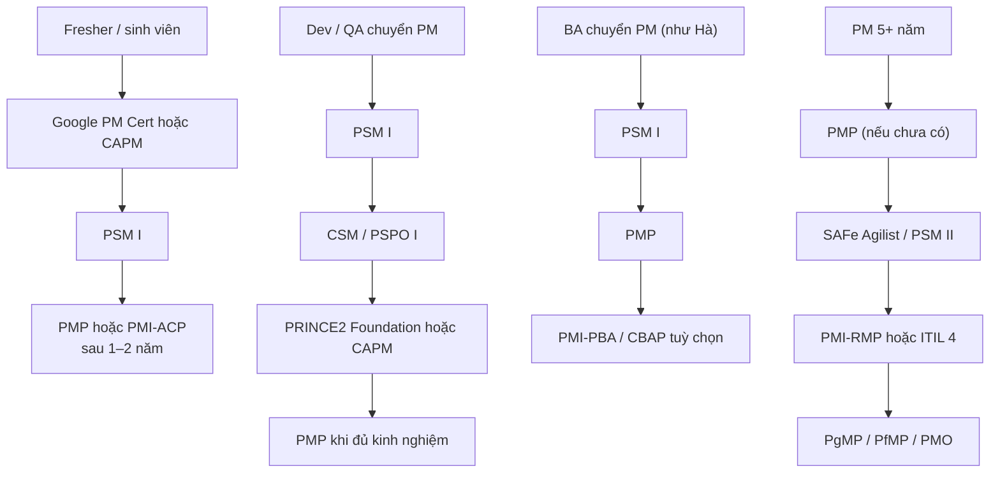

# Phụ lục H — Hồ sơ chứng chỉ PM & ánh xạ đề cương thi

Phụ lục này gồm bốn phần: (H.1) **thẻ chứng chỉ**, (H.2) **ánh xạ nội dung sách ↔ đề cương thi**, (H.3) **lộ trình theo persona**, (H.4) **khung kế hoạch ôn thi 8/12 tuần**.

> **Kiểm tra lại trên trang chính thức của tổ chức cấp — thông tin có thể đã đổi.** Phụ lục biên soạn ngày **20/09/2026**. Sách **không nêu lệ phí và mức lương cụ thể**; chi phí chỉ ở mức tương đối ($/$$/$$$), số tuần học là **ước lượng của tác giả**. Nguyên tắc: học từ **tài liệu chính thức**, không dùng braindump/đề rò rỉ, chứng chỉ **không thay thế** kinh nghiệm, ghi trung thực kinh nghiệm khi đăng ký. Bảng ánh xạ ở H.2 là **đánh giá của tác giả**; đối chiếu với đề cương hiện hành trước khi dựa vào.

## H.1 Thẻ chứng chỉ (37 thẻ)

Mỗi thẻ theo khung: Tên · Tổ chức cấp · Nhóm/Cấp (L0–L3) · Ai nên thi · Điều kiện đăng ký · Hình thức thi · Nội dung/Domain chính · Hiệu lực & gia hạn · Chi phí tương đối · Tuần học ước lượng · Tiền đề/tiếp theo · Giá trị thị trường VN · Chương sách liên quan · Nguồn học chính thức · Ngày biên soạn. Bản CSV: `templates/pm-plan/pm-certification-map.csv`.

### CAPM

- **Tên:** CAPM · **Tổ chức cấp:** PMI · **Nhóm/Cấp:** 1. Quản lý dự án tổng quát / L0
- **Ai nên thi:** Sinh viên/fresher muốn có nền tảng PM
- **Điều kiện đăng ký:** Theo điều kiện chính thức của PMI *(kiểm tra điều kiện hiện hành)*
- **Hình thức thi:** kiểm tra số câu, thời gian, ngôn ngữ trên trang chính thức *(không nêu số liệu vì thay đổi thường xuyên)*
- **Nội dung/Domain chính:** Kiến thức nền quản lý dự án
- **Hiệu lực & gia hạn:** Theo quy định của PMI
- **Chi phí tương đối:** $$ *(ước lượng của tác giả; không nêu lệ phí cụ thể)*
- **Tuần học ước lượng:** 6-10 tuần *(ước lượng của tác giả, cho người đã có kinh nghiệm phù hợp)*
- **Chứng chỉ tiền đề/tiếp theo:** PMP
- **Giá trị trên thị trường VN (định tính):** Trung bình (định tính)
- **Chương sách liên quan:** Ch01-Ch04; Phần 1-3
- **Nguồn học chính thức:** PMBOK Guide & tài liệu PMI
- **Ngày biên soạn:** 2026-09-20 — **Kiểm tra lại trên trang chính thức của tổ chức cấp — thông tin có thể đã đổi.**

### PMP

- **Tên:** PMP · **Tổ chức cấp:** PMI · **Nhóm/Cấp:** 1. Quản lý dự án tổng quát / L2
- **Ai nên thi:** PM đã dẫn dự án end-to-end
- **Điều kiện đăng ký:** Theo điều kiện kinh nghiệm chính thức của PMI *(kiểm tra điều kiện hiện hành)*
- **Hình thức thi:** kiểm tra số câu, thời gian, ngôn ngữ trên trang chính thức *(không nêu số liệu vì thay đổi thường xuyên)*
- **Nội dung/Domain chính:** Con người / Quy trình / Môi trường kinh doanh
- **Hiệu lực & gia hạn:** Cần gia hạn theo chu kỳ (PDU)
- **Chi phí tương đối:** $$$ *(ước lượng của tác giả; không nêu lệ phí cụ thể)*
- **Tuần học ước lượng:** 10-14 tuần *(ước lượng của tác giả, cho người đã có kinh nghiệm phù hợp)*
- **Chứng chỉ tiền đề/tiếp theo:** PgMP; PMI-RMP
- **Giá trị trên thị trường VN (định tính):** Cao — chuẩn được nhắc nhiều trong tin tuyển dụng
- **Chương sách liên quan:** Toàn sách
- **Nguồn học chính thức:** PMBOK Guide; Agile Practice Guide
- **Ngày biên soạn:** 2026-09-20 — **Kiểm tra lại trên trang chính thức của tổ chức cấp — thông tin có thể đã đổi.**

### PgMP

- **Tên:** PgMP · **Tổ chức cấp:** PMI · **Nhóm/Cấp:** 1. Quản lý dự án tổng quát / L3
- **Ai nên thi:** Người quản lý chương trình nhiều dự án
- **Điều kiện đăng ký:** Theo điều kiện chính thức của PMI *(kiểm tra điều kiện hiện hành)*
- **Hình thức thi:** kiểm tra số câu, thời gian, ngôn ngữ trên trang chính thức *(không nêu số liệu vì thay đổi thường xuyên)*
- **Nội dung/Domain chính:** Quản lý chương trình
- **Hiệu lực & gia hạn:** Theo quy định của PMI
- **Chi phí tương đối:** $$$ *(ước lượng của tác giả; không nêu lệ phí cụ thể)*
- **Tuần học ước lượng:** 12-16 tuần *(ước lượng của tác giả, cho người đã có kinh nghiệm phù hợp)*
- **Chứng chỉ tiền đề/tiếp theo:** PfMP
- **Giá trị trên thị trường VN (định tính):** Thấp-trung bình
- **Chương sách liên quan:** Ch26; Ch41
- **Nguồn học chính thức:** Tài liệu PMI
- **Ngày biên soạn:** 2026-09-20 — **Kiểm tra lại trên trang chính thức của tổ chức cấp — thông tin có thể đã đổi.**

### PfMP

- **Tên:** PfMP · **Tổ chức cấp:** PMI · **Nhóm/Cấp:** 1. Quản lý dự án tổng quát / L3
- **Ai nên thi:** Người quản lý danh mục dự án
- **Điều kiện đăng ký:** Theo điều kiện chính thức của PMI *(kiểm tra điều kiện hiện hành)*
- **Hình thức thi:** kiểm tra số câu, thời gian, ngôn ngữ trên trang chính thức *(không nêu số liệu vì thay đổi thường xuyên)*
- **Nội dung/Domain chính:** Quản lý danh mục
- **Hiệu lực & gia hạn:** Theo quy định của PMI
- **Chi phí tương đối:** $$$ *(ước lượng của tác giả; không nêu lệ phí cụ thể)*
- **Tuần học ước lượng:** 12-16 tuần *(ước lượng của tác giả, cho người đã có kinh nghiệm phù hợp)*
- **Chứng chỉ tiền đề/tiếp theo:** —
- **Giá trị trên thị trường VN (định tính):** Thấp
- **Chương sách liên quan:** Ch41
- **Nguồn học chính thức:** Tài liệu PMI
- **Ngày biên soạn:** 2026-09-20 — **Kiểm tra lại trên trang chính thức của tổ chức cấp — thông tin có thể đã đổi.**

### PRINCE2 Foundation/Practitioner

- **Tên:** PRINCE2 Foundation/Practitioner · **Tổ chức cấp:** PeopleCert (AXELOS) · **Nhóm/Cấp:** 1. Quản lý dự án tổng quát / L1-L2
- **Ai nên thi:** PM làm dự án khu vực công/châu Âu/Anh/Úc
- **Điều kiện đăng ký:** Practitioner cần chứng chỉ tiền đề theo quy định *(kiểm tra điều kiện hiện hành)*
- **Hình thức thi:** kiểm tra số câu, thời gian, ngôn ngữ trên trang chính thức *(không nêu số liệu vì thay đổi thường xuyên)*
- **Nội dung/Domain chính:** 7 nguyên tắc / chủ đề / quy trình
- **Hiệu lực & gia hạn:** Theo quy định của tổ chức cấp
- **Chi phí tương đối:** $$ *(ước lượng của tác giả; không nêu lệ phí cụ thể)*
- **Tuần học ước lượng:** 4-8 tuần *(ước lượng của tác giả, cho người đã có kinh nghiệm phù hợp)*
- **Chứng chỉ tiền đề/tiếp theo:** PRINCE2 Practitioner
- **Giá trị trên thị trường VN (định tính):** Trung bình (tuỳ khách hàng)
- **Chương sách liên quan:** Ch03; Ch17
- **Nguồn học chính thức:** Manual PRINCE2
- **Ngày biên soạn:** 2026-09-20 — **Kiểm tra lại trên trang chính thức của tổ chức cấp — thông tin có thể đã đổi.**

### IPMA Level D/C/B/A

- **Tên:** IPMA Level D/C/B/A · **Tổ chức cấp:** IPMA · **Nhóm/Cấp:** 1. Quản lý dự án tổng quát / L1-L3
- **Ai nên thi:** PM hướng chuẩn châu Âu
- **Điều kiện đăng ký:** Theo quy định IPMA *(kiểm tra điều kiện hiện hành)*
- **Hình thức thi:** kiểm tra số câu, thời gian, ngôn ngữ trên trang chính thức *(không nêu số liệu vì thay đổi thường xuyên)*
- **Nội dung/Domain chính:** Năng lực kỹ thuật/hành vi/bối cảnh
- **Hiệu lực & gia hạn:** Theo quy định IPMA
- **Chi phí tương đối:** $$$ *(ước lượng của tác giả; không nêu lệ phí cụ thể)*
- **Tuần học ước lượng:** 8-16 tuần *(ước lượng của tác giả, cho người đã có kinh nghiệm phù hợp)*
- **Chứng chỉ tiền đề/tiếp theo:** Cấp cao hơn
- **Giá trị trên thị trường VN (định tính):** Thấp
- **Chương sách liên quan:** Ch02; Ch27
- **Nguồn học chính thức:** IPMA ICB
- **Ngày biên soạn:** 2026-09-20 — **Kiểm tra lại trên trang chính thức của tổ chức cấp — thông tin có thể đã đổi.**

### CompTIA Project+

- **Tên:** CompTIA Project+ · **Tổ chức cấp:** CompTIA · **Nhóm/Cấp:** 1. Quản lý dự án tổng quát / L0-L1
- **Ai nên thi:** Người mới vào nghề PM
- **Điều kiện đăng ký:** Không yêu cầu kinh nghiệm cứng *(kiểm tra điều kiện hiện hành)*
- **Hình thức thi:** kiểm tra số câu, thời gian, ngôn ngữ trên trang chính thức *(không nêu số liệu vì thay đổi thường xuyên)*
- **Nội dung/Domain chính:** Nền tảng quản lý dự án
- **Hiệu lực & gia hạn:** Theo quy định CompTIA
- **Chi phí tương đối:** $$ *(ước lượng của tác giả; không nêu lệ phí cụ thể)*
- **Tuần học ước lượng:** 6-8 tuần *(ước lượng của tác giả, cho người đã có kinh nghiệm phù hợp)*
- **Chứng chỉ tiền đề/tiếp theo:** PMP
- **Giá trị trên thị trường VN (định tính):** Thấp
- **Chương sách liên quan:** Ch01-Ch04
- **Nguồn học chính thức:** CompTIA
- **Ngày biên soạn:** 2026-09-20 — **Kiểm tra lại trên trang chính thức của tổ chức cấp — thông tin có thể đã đổi.**

### Google Project Management Certificate

- **Tên:** Google Project Management Certificate · **Tổ chức cấp:** Google/Coursera · **Nhóm/Cấp:** 1. Quản lý dự án tổng quát / L0
- **Ai nên thi:** Người mới hoàn toàn
- **Điều kiện đăng ký:** Không *(kiểm tra điều kiện hiện hành)*
- **Hình thức thi:** kiểm tra số câu, thời gian, ngôn ngữ trên trang chính thức *(không nêu số liệu vì thay đổi thường xuyên)*
- **Nội dung/Domain chính:** Nhập môn PM và Agile
- **Hiệu lực & gia hạn:** Không có hạn (chứng nhận khoá học)
- **Chi phí tương đối:** $ *(ước lượng của tác giả; không nêu lệ phí cụ thể)*
- **Tuần học ước lượng:** 8-16 tuần *(ước lượng của tác giả, cho người đã có kinh nghiệm phù hợp)*
- **Chứng chỉ tiền đề/tiếp theo:** CAPM/PSM I
- **Giá trị trên thị trường VN (định tính):** Thấp-trung bình
- **Chương sách liên quan:** Ch01-Ch04
- **Nguồn học chính thức:** Coursera
- **Ngày biên soạn:** 2026-09-20 — **Kiểm tra lại trên trang chính thức của tổ chức cấp — thông tin có thể đã đổi.**

### PSM I

- **Tên:** PSM I · **Tổ chức cấp:** Scrum.org · **Nhóm/Cấp:** 2. Agile & Scrum / L1
- **Ai nên thi:** Dev/QA/BA/PM làm Scrum
- **Điều kiện đăng ký:** Không yêu cầu khoá bắt buộc *(kiểm tra điều kiện hiện hành)*
- **Hình thức thi:** kiểm tra số câu, thời gian, ngôn ngữ trên trang chính thức *(không nêu số liệu vì thay đổi thường xuyên)*
- **Nội dung/Domain chính:** Scrum Guide
- **Hiệu lực & gia hạn:** Không hết hạn
- **Chi phí tương đối:** $ *(ước lượng của tác giả; không nêu lệ phí cụ thể)*
- **Tuần học ước lượng:** 4-8 tuần *(ước lượng của tác giả, cho người đã có kinh nghiệm phù hợp)*
- **Chứng chỉ tiền đề/tiếp theo:** PSM II; PSPO I
- **Giá trị trên thị trường VN (định tính):** Cao trong công ty Agile
- **Chương sách liên quan:** Ch23; Ch24
- **Nguồn học chính thức:** Scrum Guide
- **Ngày biên soạn:** 2026-09-20 — **Kiểm tra lại trên trang chính thức của tổ chức cấp — thông tin có thể đã đổi.**

### PSM II/III

- **Tên:** PSM II/III · **Tổ chức cấp:** Scrum.org · **Nhóm/Cấp:** 2. Agile & Scrum / L2
- **Ai nên thi:** Scrum Master kinh nghiệm
- **Điều kiện đăng ký:** PSM I trước *(kiểm tra điều kiện hiện hành)*
- **Hình thức thi:** kiểm tra số câu, thời gian, ngôn ngữ trên trang chính thức *(không nêu số liệu vì thay đổi thường xuyên)*
- **Nội dung/Domain chính:** Scrum nâng cao
- **Hiệu lực & gia hạn:** Không hết hạn
- **Chi phí tương đối:** $$ *(ước lượng của tác giả; không nêu lệ phí cụ thể)*
- **Tuần học ước lượng:** 8-12 tuần *(ước lượng của tác giả, cho người đã có kinh nghiệm phù hợp)*
- **Chứng chỉ tiền đề/tiếp theo:** PSM III
- **Giá trị trên thị trường VN (định tính):** Trung bình
- **Chương sách liên quan:** Ch23; Ch26
- **Nguồn học chính thức:** Scrum Guide
- **Ngày biên soạn:** 2026-09-20 — **Kiểm tra lại trên trang chính thức của tổ chức cấp — thông tin có thể đã đổi.**

### PSPO I/II/III

- **Tên:** PSPO I/II/III · **Tổ chức cấp:** Scrum.org · **Nhóm/Cấp:** 2. Agile & Scrum / L1-L2
- **Ai nên thi:** Product Owner/PM ảnh hưởng backlog
- **Điều kiện đăng ký:** Không *(kiểm tra điều kiện hiện hành)*
- **Hình thức thi:** kiểm tra số câu, thời gian, ngôn ngữ trên trang chính thức *(không nêu số liệu vì thay đổi thường xuyên)*
- **Nội dung/Domain chính:** Product ownership
- **Hiệu lực & gia hạn:** Không hết hạn
- **Chi phí tương đối:** $ *(ước lượng của tác giả; không nêu lệ phí cụ thể)*
- **Tuần học ước lượng:** 4-8 tuần *(ước lượng của tác giả, cho người đã có kinh nghiệm phù hợp)*
- **Chứng chỉ tiền đề/tiếp theo:** PSPO II
- **Giá trị trên thị trường VN (định tính):** Trung bình-cao
- **Chương sách liên quan:** Ch24
- **Nguồn học chính thức:** Scrum Guide
- **Ngày biên soạn:** 2026-09-20 — **Kiểm tra lại trên trang chính thức của tổ chức cấp — thông tin có thể đã đổi.**

### PAL-E

- **Tên:** PAL-E · **Tổ chức cấp:** Scrum.org · **Nhóm/Cấp:** 2. Agile & Scrum / L1
- **Ai nên thi:** Người lãnh đạo hỗ trợ đội Agile
- **Điều kiện đăng ký:** Không *(kiểm tra điều kiện hiện hành)*
- **Hình thức thi:** kiểm tra số câu, thời gian, ngôn ngữ trên trang chính thức *(không nêu số liệu vì thay đổi thường xuyên)*
- **Nội dung/Domain chính:** Lãnh đạo Agile
- **Hiệu lực & gia hạn:** Không hết hạn
- **Chi phí tương đối:** $ *(ước lượng của tác giả; không nêu lệ phí cụ thể)*
- **Tuần học ước lượng:** 3-5 tuần *(ước lượng của tác giả, cho người đã có kinh nghiệm phù hợp)*
- **Chứng chỉ tiền đề/tiếp theo:** —
- **Giá trị trên thị trường VN (định tính):** Thấp
- **Chương sách liên quan:** Ch27
- **Nguồn học chính thức:** Scrum.org
- **Ngày biên soạn:** 2026-09-20 — **Kiểm tra lại trên trang chính thức của tổ chức cấp — thông tin có thể đã đổi.**

### PSK

- **Tên:** PSK · **Tổ chức cấp:** Scrum.org · **Nhóm/Cấp:** 2. Agile & Scrum / L1
- **Ai nên thi:** Người làm Kanban
- **Điều kiện đăng ký:** Không *(kiểm tra điều kiện hiện hành)*
- **Hình thức thi:** kiểm tra số câu, thời gian, ngôn ngữ trên trang chính thức *(không nêu số liệu vì thay đổi thường xuyên)*
- **Nội dung/Domain chính:** Kanban
- **Hiệu lực & gia hạn:** Không hết hạn
- **Chi phí tương đối:** $ *(ước lượng của tác giả; không nêu lệ phí cụ thể)*
- **Tuần học ước lượng:** 3-5 tuần *(ước lượng của tác giả, cho người đã có kinh nghiệm phù hợp)*
- **Chứng chỉ tiền đề/tiếp theo:** —
- **Giá trị trên thị trường VN (định tính):** Thấp
- **Chương sách liên quan:** Ch25
- **Nguồn học chính thức:** Kanban Guide
- **Ngày biên soạn:** 2026-09-20 — **Kiểm tra lại trên trang chính thức của tổ chức cấp — thông tin có thể đã đổi.**

### CSM

- **Tên:** CSM · **Tổ chức cấp:** Scrum Alliance · **Nhóm/Cấp:** 2. Agile & Scrum / L1
- **Ai nên thi:** Người muốn vào vai Scrum Master
- **Điều kiện đăng ký:** Khoá do đơn vị được công nhận *(kiểm tra điều kiện hiện hành)*
- **Hình thức thi:** kiểm tra số câu, thời gian, ngôn ngữ trên trang chính thức *(không nêu số liệu vì thay đổi thường xuyên)*
- **Nội dung/Domain chính:** Scrum
- **Hiệu lực & gia hạn:** Cần gia hạn theo quy định
- **Chi phí tương đối:** $$ *(ước lượng của tác giả; không nêu lệ phí cụ thể)*
- **Tuần học ước lượng:** 2-6 tuần *(ước lượng của tác giả, cho người đã có kinh nghiệm phù hợp)*
- **Chứng chỉ tiền đề/tiếp theo:** A-CSM
- **Giá trị trên thị trường VN (định tính):** Cao trong công ty Agile
- **Chương sách liên quan:** Ch23
- **Nguồn học chính thức:** Scrum Alliance
- **Ngày biên soạn:** 2026-09-20 — **Kiểm tra lại trên trang chính thức của tổ chức cấp — thông tin có thể đã đổi.**

### CSPO

- **Tên:** CSPO · **Tổ chức cấp:** Scrum Alliance · **Nhóm/Cấp:** 2. Agile & Scrum / L1
- **Ai nên thi:** Product Owner
- **Điều kiện đăng ký:** Khoá do đơn vị được công nhận *(kiểm tra điều kiện hiện hành)*
- **Hình thức thi:** kiểm tra số câu, thời gian, ngôn ngữ trên trang chính thức *(không nêu số liệu vì thay đổi thường xuyên)*
- **Nội dung/Domain chính:** Product ownership
- **Hiệu lực & gia hạn:** Cần gia hạn theo quy định
- **Chi phí tương đối:** $$ *(ước lượng của tác giả; không nêu lệ phí cụ thể)*
- **Tuần học ước lượng:** 2-6 tuần *(ước lượng của tác giả, cho người đã có kinh nghiệm phù hợp)*
- **Chứng chỉ tiền đề/tiếp theo:** A-CSPO
- **Giá trị trên thị trường VN (định tính):** Trung bình
- **Chương sách liên quan:** Ch24
- **Nguồn học chính thức:** Scrum Alliance
- **Ngày biên soạn:** 2026-09-20 — **Kiểm tra lại trên trang chính thức của tổ chức cấp — thông tin có thể đã đổi.**

### PMI-ACP

- **Tên:** PMI-ACP · **Tổ chức cấp:** PMI · **Nhóm/Cấp:** 2. Agile & Scrum / L1-L2
- **Ai nên thi:** Người có kinh nghiệm Agile
- **Điều kiện đăng ký:** Theo điều kiện chính thức của PMI *(kiểm tra điều kiện hiện hành)*
- **Hình thức thi:** kiểm tra số câu, thời gian, ngôn ngữ trên trang chính thức *(không nêu số liệu vì thay đổi thường xuyên)*
- **Nội dung/Domain chính:** Agile rộng (Scrum/Kanban/Lean/XP)
- **Hiệu lực & gia hạn:** Cần gia hạn theo chu kỳ
- **Chi phí tương đối:** $$ *(ước lượng của tác giả; không nêu lệ phí cụ thể)*
- **Tuần học ước lượng:** 8-12 tuần *(ước lượng của tác giả, cho người đã có kinh nghiệm phù hợp)*
- **Chứng chỉ tiền đề/tiếp theo:** PMP
- **Giá trị trên thị trường VN (định tính):** Trung bình
- **Chương sách liên quan:** Ch03; Ch23-Ch26
- **Nguồn học chính thức:** Agile Practice Guide
- **Ngày biên soạn:** 2026-09-20 — **Kiểm tra lại trên trang chính thức của tổ chức cấp — thông tin có thể đã đổi.**

### AgilePM Foundation/Practitioner

- **Tên:** AgilePM Foundation/Practitioner · **Tổ chức cấp:** APMG · **Nhóm/Cấp:** 2. Agile & Scrum / L1-L2
- **Ai nên thi:** PM Agile theo khung DSDM
- **Điều kiện đăng ký:** Practitioner cần Foundation *(kiểm tra điều kiện hiện hành)*
- **Hình thức thi:** kiểm tra số câu, thời gian, ngôn ngữ trên trang chính thức *(không nêu số liệu vì thay đổi thường xuyên)*
- **Nội dung/Domain chính:** Agile Project Management
- **Hiệu lực & gia hạn:** Theo quy định APMG
- **Chi phí tương đối:** $$ *(ước lượng của tác giả; không nêu lệ phí cụ thể)*
- **Tuần học ước lượng:** 4-8 tuần *(ước lượng của tác giả, cho người đã có kinh nghiệm phù hợp)*
- **Chứng chỉ tiền đề/tiếp theo:** —
- **Giá trị trên thị trường VN (định tính):** Thấp
- **Chương sách liên quan:** Ch03
- **Nguồn học chính thức:** APMG
- **Ngày biên soạn:** 2026-09-20 — **Kiểm tra lại trên trang chính thức của tổ chức cấp — thông tin có thể đã đổi.**

### KMP/KMP II

- **Tên:** KMP/KMP II · **Tổ chức cấp:** Kanban University · **Nhóm/Cấp:** 2. Agile & Scrum / L1-L2
- **Ai nên thi:** Người triển khai Kanban
- **Điều kiện đăng ký:** Khoá chính thức *(kiểm tra điều kiện hiện hành)*
- **Hình thức thi:** kiểm tra số câu, thời gian, ngôn ngữ trên trang chính thức *(không nêu số liệu vì thay đổi thường xuyên)*
- **Nội dung/Domain chính:** Kanban
- **Hiệu lực & gia hạn:** Theo quy định
- **Chi phí tương đối:** $$ *(ước lượng của tác giả; không nêu lệ phí cụ thể)*
- **Tuần học ước lượng:** 3-6 tuần *(ước lượng của tác giả, cho người đã có kinh nghiệm phù hợp)*
- **Chứng chỉ tiền đề/tiếp theo:** —
- **Giá trị trên thị trường VN (định tính):** Thấp
- **Chương sách liên quan:** Ch25
- **Nguồn học chính thức:** Kanban University
- **Ngày biên soạn:** 2026-09-20 — **Kiểm tra lại trên trang chính thức của tổ chức cấp — thông tin có thể đã đổi.**

### SAFe Agilist (SA)

- **Tên:** SAFe Agilist (SA) · **Tổ chức cấp:** Scaled Agile · **Nhóm/Cấp:** 3. Scale, Program & Enterprise Agile / L2
- **Ai nên thi:** Người trong tổ chức dùng SAFe
- **Điều kiện đăng ký:** Khoá chính thức *(kiểm tra điều kiện hiện hành)*
- **Hình thức thi:** kiểm tra số câu, thời gian, ngôn ngữ trên trang chính thức *(không nêu số liệu vì thay đổi thường xuyên)*
- **Nội dung/Domain chính:** SAFe
- **Hiệu lực & gia hạn:** Cần gia hạn hằng năm
- **Chi phí tương đối:** $$$ *(ước lượng của tác giả; không nêu lệ phí cụ thể)*
- **Tuần học ước lượng:** 3-6 tuần *(ước lượng của tác giả, cho người đã có kinh nghiệm phù hợp)*
- **Chứng chỉ tiền đề/tiếp theo:** SAFe RTE
- **Giá trị trên thị trường VN (định tính):** Trung bình (doanh nghiệp lớn)
- **Chương sách liên quan:** Ch26
- **Nguồn học chính thức:** Scaled Agile
- **Ngày biên soạn:** 2026-09-20 — **Kiểm tra lại trên trang chính thức của tổ chức cấp — thông tin có thể đã đổi.**

### SAFe Scrum Master

- **Tên:** SAFe Scrum Master · **Tổ chức cấp:** Scaled Agile · **Nhóm/Cấp:** 3. Scale, Program & Enterprise Agile / L2
- **Ai nên thi:** Scrum Master ở môi trường SAFe
- **Điều kiện đăng ký:** Khoá chính thức *(kiểm tra điều kiện hiện hành)*
- **Hình thức thi:** kiểm tra số câu, thời gian, ngôn ngữ trên trang chính thức *(không nêu số liệu vì thay đổi thường xuyên)*
- **Nội dung/Domain chính:** Scrum trong SAFe
- **Hiệu lực & gia hạn:** Cần gia hạn hằng năm
- **Chi phí tương đối:** $$$ *(ước lượng của tác giả; không nêu lệ phí cụ thể)*
- **Tuần học ước lượng:** 3-5 tuần *(ước lượng của tác giả, cho người đã có kinh nghiệm phù hợp)*
- **Chứng chỉ tiền đề/tiếp theo:** SAFe RTE
- **Giá trị trên thị trường VN (định tính):** Trung bình
- **Chương sách liên quan:** Ch26
- **Nguồn học chính thức:** Scaled Agile
- **Ngày biên soạn:** 2026-09-20 — **Kiểm tra lại trên trang chính thức của tổ chức cấp — thông tin có thể đã đổi.**

### SAFe POPM

- **Tên:** SAFe POPM · **Tổ chức cấp:** Scaled Agile · **Nhóm/Cấp:** 3. Scale, Program & Enterprise Agile / L2
- **Ai nên thi:** PO/PM trong SAFe
- **Điều kiện đăng ký:** Khoá chính thức *(kiểm tra điều kiện hiện hành)*
- **Hình thức thi:** kiểm tra số câu, thời gian, ngôn ngữ trên trang chính thức *(không nêu số liệu vì thay đổi thường xuyên)*
- **Nội dung/Domain chính:** Product management trong SAFe
- **Hiệu lực & gia hạn:** Cần gia hạn hằng năm
- **Chi phí tương đối:** $$$ *(ước lượng của tác giả; không nêu lệ phí cụ thể)*
- **Tuần học ước lượng:** 3-5 tuần *(ước lượng của tác giả, cho người đã có kinh nghiệm phù hợp)*
- **Chứng chỉ tiền đề/tiếp theo:** —
- **Giá trị trên thị trường VN (định tính):** Trung bình
- **Chương sách liên quan:** Ch24; Ch26
- **Nguồn học chính thức:** Scaled Agile
- **Ngày biên soạn:** 2026-09-20 — **Kiểm tra lại trên trang chính thức của tổ chức cấp — thông tin có thể đã đổi.**

### SAFe RTE

- **Tên:** SAFe RTE · **Tổ chức cấp:** Scaled Agile · **Nhóm/Cấp:** 3. Scale, Program & Enterprise Agile / L3
- **Ai nên thi:** Điều phối release train
- **Điều kiện đăng ký:** Khoá chính thức *(kiểm tra điều kiện hiện hành)*
- **Hình thức thi:** kiểm tra số câu, thời gian, ngôn ngữ trên trang chính thức *(không nêu số liệu vì thay đổi thường xuyên)*
- **Nội dung/Domain chính:** Release train
- **Hiệu lực & gia hạn:** Cần gia hạn hằng năm
- **Chi phí tương đối:** $$$ *(ước lượng của tác giả; không nêu lệ phí cụ thể)*
- **Tuần học ước lượng:** 4-8 tuần *(ước lượng của tác giả, cho người đã có kinh nghiệm phù hợp)*
- **Chứng chỉ tiền đề/tiếp theo:** —
- **Giá trị trên thị trường VN (định tính):** Thấp-trung bình
- **Chương sách liên quan:** Ch26
- **Nguồn học chính thức:** Scaled Agile
- **Ngày biên soạn:** 2026-09-20 — **Kiểm tra lại trên trang chính thức của tổ chức cấp — thông tin có thể đã đổi.**

### Disciplined Agile (DASM/DASSM)

- **Tên:** Disciplined Agile (DASM/DASSM) · **Tổ chức cấp:** PMI · **Nhóm/Cấp:** 3. Scale, Program & Enterprise Agile / L2
- **Ai nên thi:** Người cần tuỳ biến quy trình
- **Điều kiện đăng ký:** Khoá chính thức *(kiểm tra điều kiện hiện hành)*
- **Hình thức thi:** kiểm tra số câu, thời gian, ngôn ngữ trên trang chính thức *(không nêu số liệu vì thay đổi thường xuyên)*
- **Nội dung/Domain chính:** Disciplined Agile
- **Hiệu lực & gia hạn:** Theo quy định
- **Chi phí tương đối:** $$ *(ước lượng của tác giả; không nêu lệ phí cụ thể)*
- **Tuần học ước lượng:** 4-6 tuần *(ước lượng của tác giả, cho người đã có kinh nghiệm phù hợp)*
- **Chứng chỉ tiền đề/tiếp theo:** —
- **Giá trị trên thị trường VN (định tính):** Thấp
- **Chương sách liên quan:** Ch26
- **Nguồn học chính thức:** PMI
- **Ngày biên soạn:** 2026-09-20 — **Kiểm tra lại trên trang chính thức của tổ chức cấp — thông tin có thể đã đổi.**

### Scrum@Scale

- **Tên:** Scrum@Scale · **Tổ chức cấp:** Scrum Inc. · **Nhóm/Cấp:** 3. Scale, Program & Enterprise Agile / L2
- **Ai nên thi:** Đội nhiều nhóm Scrum
- **Điều kiện đăng ký:** Khoá chính thức *(kiểm tra điều kiện hiện hành)*
- **Hình thức thi:** kiểm tra số câu, thời gian, ngôn ngữ trên trang chính thức *(không nêu số liệu vì thay đổi thường xuyên)*
- **Nội dung/Domain chính:** Mở rộng Scrum
- **Hiệu lực & gia hạn:** Theo quy định
- **Chi phí tương đối:** $$ *(ước lượng của tác giả; không nêu lệ phí cụ thể)*
- **Tuần học ước lượng:** 3-5 tuần *(ước lượng của tác giả, cho người đã có kinh nghiệm phù hợp)*
- **Chứng chỉ tiền đề/tiếp theo:** —
- **Giá trị trên thị trường VN (định tính):** Thấp
- **Chương sách liên quan:** Ch26
- **Nguồn học chính thức:** Scrum Inc.
- **Ngày biên soạn:** 2026-09-20 — **Kiểm tra lại trên trang chính thức của tổ chức cấp — thông tin có thể đã đổi.**

### MSP

- **Tên:** MSP · **Tổ chức cấp:** PeopleCert (AXELOS) · **Nhóm/Cấp:** 3. Scale, Program & Enterprise Agile / L3
- **Ai nên thi:** Người quản lý chương trình
- **Điều kiện đăng ký:** Theo quy định *(kiểm tra điều kiện hiện hành)*
- **Hình thức thi:** kiểm tra số câu, thời gian, ngôn ngữ trên trang chính thức *(không nêu số liệu vì thay đổi thường xuyên)*
- **Nội dung/Domain chính:** Managing Successful Programmes
- **Hiệu lực & gia hạn:** Theo quy định
- **Chi phí tương đối:** $$$ *(ước lượng của tác giả; không nêu lệ phí cụ thể)*
- **Tuần học ước lượng:** 6-10 tuần *(ước lượng của tác giả, cho người đã có kinh nghiệm phù hợp)*
- **Chứng chỉ tiền đề/tiếp theo:** —
- **Giá trị trên thị trường VN (định tính):** Thấp
- **Chương sách liên quan:** Ch41
- **Nguồn học chính thức:** Manual MSP
- **Ngày biên soạn:** 2026-09-20 — **Kiểm tra lại trên trang chính thức của tổ chức cấp — thông tin có thể đã đổi.**

### ITIL 4 Foundation

- **Tên:** ITIL 4 Foundation · **Tổ chức cấp:** PeopleCert (AXELOS) · **Nhóm/Cấp:** 4. Vận hành, DevOps, quản trị dịch vụ IT / L0-L2
- **Ai nên thi:** PM nối dự án với vận hành
- **Điều kiện đăng ký:** Không *(kiểm tra điều kiện hiện hành)*
- **Hình thức thi:** kiểm tra số câu, thời gian, ngôn ngữ trên trang chính thức *(không nêu số liệu vì thay đổi thường xuyên)*
- **Nội dung/Domain chính:** Quản trị dịch vụ IT
- **Hiệu lực & gia hạn:** Không hết hạn
- **Chi phí tương đối:** $$ *(ước lượng của tác giả; không nêu lệ phí cụ thể)*
- **Tuần học ước lượng:** 3-6 tuần *(ước lượng của tác giả, cho người đã có kinh nghiệm phù hợp)*
- **Chứng chỉ tiền đề/tiếp theo:** ITIL 4 MP
- **Giá trị trên thị trường VN (định tính):** Trung bình-cao
- **Chương sách liên quan:** Ch39; Ch41
- **Nguồn học chính thức:** ITIL 4
- **Ngày biên soạn:** 2026-09-20 — **Kiểm tra lại trên trang chính thức của tổ chức cấp — thông tin có thể đã đổi.**

### DevOps Foundation

- **Tên:** DevOps Foundation · **Tổ chức cấp:** DevOps Institute/PeopleCert · **Nhóm/Cấp:** 4. Vận hành, DevOps, quản trị dịch vụ IT / L1
- **Ai nên thi:** PM làm việc với DevOps
- **Điều kiện đăng ký:** Không *(kiểm tra điều kiện hiện hành)*
- **Hình thức thi:** kiểm tra số câu, thời gian, ngôn ngữ trên trang chính thức *(không nêu số liệu vì thay đổi thường xuyên)*
- **Nội dung/Domain chính:** DevOps
- **Hiệu lực & gia hạn:** Theo quy định
- **Chi phí tương đối:** $$ *(ước lượng của tác giả; không nêu lệ phí cụ thể)*
- **Tuần học ước lượng:** 2-4 tuần *(ước lượng của tác giả, cho người đã có kinh nghiệm phù hợp)*
- **Chứng chỉ tiền đề/tiếp theo:** —
- **Giá trị trên thị trường VN (định tính):** Trung bình
- **Chương sách liên quan:** Ch29; Ch33
- **Nguồn học chính thức:** DevOps Institute
- **Ngày biên soạn:** 2026-09-20 — **Kiểm tra lại trên trang chính thức của tổ chức cấp — thông tin có thể đã đổi.**

### AWS Cloud Practitioner / Azure AZ-900 / Google Cloud Digital Leader

- **Tên:** AWS Cloud Practitioner / Azure AZ-900 / Google Cloud Digital Leader · **Tổ chức cấp:** AWS/Microsoft/Google · **Nhóm/Cấp:** 4. Vận hành, DevOps, quản trị dịch vụ IT / L0
- **Ai nên thi:** Người cần hiểu cloud
- **Điều kiện đăng ký:** Không *(kiểm tra điều kiện hiện hành)*
- **Hình thức thi:** kiểm tra số câu, thời gian, ngôn ngữ trên trang chính thức *(không nêu số liệu vì thay đổi thường xuyên)*
- **Nội dung/Domain chính:** Khái niệm cloud
- **Hiệu lực & gia hạn:** Theo từng hãng
- **Chi phí tương đối:** $ *(ước lượng của tác giả; không nêu lệ phí cụ thể)*
- **Tuần học ước lượng:** 3-6 tuần *(ước lượng của tác giả, cho người đã có kinh nghiệm phù hợp)*
- **Chứng chỉ tiền đề/tiếp theo:** Cấp cao hơn cùng hãng
- **Giá trị trên thị trường VN (định tính):** Trung bình
- **Chương sách liên quan:** Ch29
- **Nguồn học chính thức:** Tài liệu từng hãng
- **Ngày biên soạn:** 2026-09-20 — **Kiểm tra lại trên trang chính thức của tổ chức cấp — thông tin có thể đã đổi.**

### ISTQB Foundation

- **Tên:** ISTQB Foundation · **Tổ chức cấp:** ISTQB · **Nhóm/Cấp:** 4. Vận hành, DevOps, quản trị dịch vụ IT / L1
- **Ai nên thi:** PM hiểu kiểm thử
- **Điều kiện đăng ký:** Không *(kiểm tra điều kiện hiện hành)*
- **Hình thức thi:** kiểm tra số câu, thời gian, ngôn ngữ trên trang chính thức *(không nêu số liệu vì thay đổi thường xuyên)*
- **Nội dung/Domain chính:** Kiểm thử phần mềm
- **Hiệu lực & gia hạn:** Không hết hạn
- **Chi phí tương đối:** $$ *(ước lượng của tác giả; không nêu lệ phí cụ thể)*
- **Tuần học ước lượng:** 4-6 tuần *(ước lượng của tác giả, cho người đã có kinh nghiệm phù hợp)*
- **Chứng chỉ tiền đề/tiếp theo:** —
- **Giá trị trên thị trường VN (định tính):** Trung bình
- **Chương sách liên quan:** Ch15; Ch37
- **Nguồn học chính thức:** ISTQB
- **Ngày biên soạn:** 2026-09-20 — **Kiểm tra lại trên trang chính thức của tổ chức cấp — thông tin có thể đã đổi.**

### PMI-RMP

- **Tên:** PMI-RMP · **Tổ chức cấp:** PMI · **Nhóm/Cấp:** 5. Chuyên sâu bổ trợ / L3
- **Ai nên thi:** Người chuyên rủi ro
- **Điều kiện đăng ký:** Theo điều kiện chính thức của PMI *(kiểm tra điều kiện hiện hành)*
- **Hình thức thi:** kiểm tra số câu, thời gian, ngôn ngữ trên trang chính thức *(không nêu số liệu vì thay đổi thường xuyên)*
- **Nội dung/Domain chính:** Quản lý rủi ro
- **Hiệu lực & gia hạn:** Cần gia hạn theo chu kỳ
- **Chi phí tương đối:** $$$ *(ước lượng của tác giả; không nêu lệ phí cụ thể)*
- **Tuần học ước lượng:** 8-12 tuần *(ước lượng của tác giả, cho người đã có kinh nghiệm phù hợp)*
- **Chứng chỉ tiền đề/tiếp theo:** —
- **Giá trị trên thị trường VN (định tính):** Thấp-trung bình
- **Chương sách liên quan:** Ch18; Ch19
- **Nguồn học chính thức:** PMI
- **Ngày biên soạn:** 2026-09-20 — **Kiểm tra lại trên trang chính thức của tổ chức cấp — thông tin có thể đã đổi.**

### PMI-SP

- **Tên:** PMI-SP · **Tổ chức cấp:** PMI · **Nhóm/Cấp:** 5. Chuyên sâu bổ trợ / L3
- **Ai nên thi:** Người chuyên lập lịch
- **Điều kiện đăng ký:** Theo điều kiện chính thức của PMI *(kiểm tra điều kiện hiện hành)*
- **Hình thức thi:** kiểm tra số câu, thời gian, ngôn ngữ trên trang chính thức *(không nêu số liệu vì thay đổi thường xuyên)*
- **Nội dung/Domain chính:** Lập lịch
- **Hiệu lực & gia hạn:** Cần gia hạn theo chu kỳ
- **Chi phí tương đối:** $$$ *(ước lượng của tác giả; không nêu lệ phí cụ thể)*
- **Tuần học ước lượng:** 8-12 tuần *(ước lượng của tác giả, cho người đã có kinh nghiệm phù hợp)*
- **Chứng chỉ tiền đề/tiếp theo:** —
- **Giá trị trên thị trường VN (định tính):** Thấp
- **Chương sách liên quan:** Ch12
- **Nguồn học chính thức:** PMI
- **Ngày biên soạn:** 2026-09-20 — **Kiểm tra lại trên trang chính thức của tổ chức cấp — thông tin có thể đã đổi.**

### PMI-PBA

- **Tên:** PMI-PBA · **Tổ chức cấp:** PMI · **Nhóm/Cấp:** 5. Chuyên sâu bổ trợ / L2
- **Ai nên thi:** PM/BA nâng chuyên môn phân tích
- **Điều kiện đăng ký:** Theo điều kiện chính thức của PMI *(kiểm tra điều kiện hiện hành)*
- **Hình thức thi:** kiểm tra số câu, thời gian, ngôn ngữ trên trang chính thức *(không nêu số liệu vì thay đổi thường xuyên)*
- **Nội dung/Domain chính:** Business analysis
- **Hiệu lực & gia hạn:** Cần gia hạn theo chu kỳ
- **Chi phí tương đối:** $$$ *(ước lượng của tác giả; không nêu lệ phí cụ thể)*
- **Tuần học ước lượng:** 8-12 tuần *(ước lượng của tác giả, cho người đã có kinh nghiệm phù hợp)*
- **Chứng chỉ tiền đề/tiếp theo:** —
- **Giá trị trên thị trường VN (định tính):** Trung bình
- **Chương sách liên quan:** Ch07; Ch24
- **Nguồn học chính thức:** PMI
- **Ngày biên soạn:** 2026-09-20 — **Kiểm tra lại trên trang chính thức của tổ chức cấp — thông tin có thể đã đổi.**

### CBAP/CCBA

- **Tên:** CBAP/CCBA · **Tổ chức cấp:** IIBA · **Nhóm/Cấp:** 5. Chuyên sâu bổ trợ / L2-L3
- **Ai nên thi:** BA chuyên nghiệp
- **Điều kiện đăng ký:** Theo điều kiện chính thức của IIBA *(kiểm tra điều kiện hiện hành)*
- **Hình thức thi:** kiểm tra số câu, thời gian, ngôn ngữ trên trang chính thức *(không nêu số liệu vì thay đổi thường xuyên)*
- **Nội dung/Domain chính:** BABOK
- **Hiệu lực & gia hạn:** Cần gia hạn
- **Chi phí tương đối:** $$$ *(ước lượng của tác giả; không nêu lệ phí cụ thể)*
- **Tuần học ước lượng:** 8-12 tuần *(ước lượng của tác giả, cho người đã có kinh nghiệm phù hợp)*
- **Chứng chỉ tiền đề/tiếp theo:** —
- **Giá trị trên thị trường VN (định tính):** Trung bình
- **Chương sách liên quan:** Ch07; Ch24
- **Nguồn học chính thức:** IIBA BABOK
- **Ngày biên soạn:** 2026-09-20 — **Kiểm tra lại trên trang chính thức của tổ chức cấp — thông tin có thể đã đổi.**

### Lean Six Sigma Yellow/Green Belt

- **Tên:** Lean Six Sigma Yellow/Green Belt · **Tổ chức cấp:** Nhiều tổ chức · **Nhóm/Cấp:** 5. Chuyên sâu bổ trợ / L1-L2
- **Ai nên thi:** Người cải tiến quy trình
- **Điều kiện đăng ký:** Theo tổ chức cấp *(kiểm tra điều kiện hiện hành)*
- **Hình thức thi:** kiểm tra số câu, thời gian, ngôn ngữ trên trang chính thức *(không nêu số liệu vì thay đổi thường xuyên)*
- **Nội dung/Domain chính:** Cải tiến quy trình
- **Hiệu lực & gia hạn:** Theo tổ chức
- **Chi phí tương đối:** $$ *(ước lượng của tác giả; không nêu lệ phí cụ thể)*
- **Tuần học ước lượng:** 4-10 tuần *(ước lượng của tác giả, cho người đã có kinh nghiệm phù hợp)*
- **Chứng chỉ tiền đề/tiếp theo:** —
- **Giá trị trên thị trường VN (định tính):** Thấp
- **Chương sách liên quan:** Ch15
- **Nguồn học chính thức:** Tổ chức cấp
- **Ngày biên soạn:** 2026-09-20 — **Kiểm tra lại trên trang chính thức của tổ chức cấp — thông tin có thể đã đổi.**

### ISO/IEC 27001 Foundation/Lead Implementer

- **Tên:** ISO/IEC 27001 Foundation/Lead Implementer · **Tổ chức cấp:** Nhiều tổ chức · **Nhóm/Cấp:** 5. Chuyên sâu bổ trợ / L2
- **Ai nên thi:** Dự án liên quan bảo mật
- **Điều kiện đăng ký:** Theo tổ chức cấp *(kiểm tra điều kiện hiện hành)*
- **Hình thức thi:** kiểm tra số câu, thời gian, ngôn ngữ trên trang chính thức *(không nêu số liệu vì thay đổi thường xuyên)*
- **Nội dung/Domain chính:** An toàn thông tin
- **Hiệu lực & gia hạn:** Theo tổ chức
- **Chi phí tương đối:** $$ *(ước lượng của tác giả; không nêu lệ phí cụ thể)*
- **Tuần học ước lượng:** 3-8 tuần *(ước lượng của tác giả, cho người đã có kinh nghiệm phù hợp)*
- **Chứng chỉ tiền đề/tiếp theo:** —
- **Giá trị trên thị trường VN (định tính):** Thấp
- **Chương sách liên quan:** Ch29
- **Nguồn học chính thức:** ISO
- **Ngày biên soạn:** 2026-09-20 — **Kiểm tra lại trên trang chính thức của tổ chức cấp — thông tin có thể đã đổi.**

### PMI-PMOCP

- **Tên:** PMI-PMOCP · **Tổ chức cấp:** PMI · **Nhóm/Cấp:** 5. Chuyên sâu bổ trợ / L3
- **Ai nên thi:** Người xây/vận hành PMO
- **Điều kiện đăng ký:** Theo điều kiện chính thức của PMI *(kiểm tra điều kiện hiện hành)*
- **Hình thức thi:** kiểm tra số câu, thời gian, ngôn ngữ trên trang chính thức *(không nêu số liệu vì thay đổi thường xuyên)*
- **Nội dung/Domain chính:** PMO
- **Hiệu lực & gia hạn:** Cần gia hạn theo chu kỳ
- **Chi phí tương đối:** $$$ *(ước lượng của tác giả; không nêu lệ phí cụ thể)*
- **Tuần học ước lượng:** 8-12 tuần *(ước lượng của tác giả, cho người đã có kinh nghiệm phù hợp)*
- **Chứng chỉ tiền đề/tiếp theo:** —
- **Giá trị trên thị trường VN (định tính):** Thấp
- **Chương sách liên quan:** Ch41
- **Nguồn học chính thức:** PMI
- **Ngày biên soạn:** 2026-09-20 — **Kiểm tra lại trên trang chính thức của tổ chức cấp — thông tin có thể đã đổi.**

### CISSP/Security+

- **Tên:** CISSP/Security+ · **Tổ chức cấp:** ISC2/CompTIA · **Nhóm/Cấp:** 5. Chuyên sâu bổ trợ / L3
- **Ai nên thi:** Chỉ khi làm dự án bảo mật
- **Điều kiện đăng ký:** Theo quy định *(kiểm tra điều kiện hiện hành)*
- **Hình thức thi:** kiểm tra số câu, thời gian, ngôn ngữ trên trang chính thức *(không nêu số liệu vì thay đổi thường xuyên)*
- **Nội dung/Domain chính:** An toàn thông tin
- **Hiệu lực & gia hạn:** Theo quy định
- **Chi phí tương đối:** $$$ *(ước lượng của tác giả; không nêu lệ phí cụ thể)*
- **Tuần học ước lượng:** 10-20 tuần *(ước lượng của tác giả, cho người đã có kinh nghiệm phù hợp)*
- **Chứng chỉ tiền đề/tiếp theo:** —
- **Giá trị trên thị trường VN (định tính):** Thấp
- **Chương sách liên quan:** Ch29
- **Nguồn học chính thức:** Tổ chức cấp
- **Ngày biên soạn:** 2026-09-20 — **Kiểm tra lại trên trang chính thức của tổ chức cấp — thông tin có thể đã đổi.**

## H.2 Ánh xạ chương sách ↔ đề cương thi

Mức phủ: **Đủ** (sách đủ làm nền, cần luyện thêm), **Một phần** (nắm khái niệm; cần đọc tài liệu chính thức), **Cần học thêm** (sách chưa/ít đề cập).

### H.2.1 PMP

Đề cương chia thành ba mảng lớn (con người, quy trình, môi trường kinh doanh). **Cập nhật đối chiếu 09/2026:** theo các nguồn công khai, đề cương mới áp dụng từ 09/07/2026 đổi tỷ trọng khoảng People 33% · Process 41% · Business Environment 26% (bản cũ 42/50/8) và thêm chủ đề như AI, bền vững, giá trị — **cần xác minh trên tài liệu chính thức của PMI** vì trang PMI không truy cập được khi biên soạn.

| Domain / nội dung thi | Chương sách | Mức phủ |
|---|---|---|
| Con người: lãnh đạo, xây dựng đội, xung đột, động lực, giao tiếp | Ch02, Ch08, Ch27, Ch28, Ch36 | Đủ |
| Con người: quản lý stakeholder | Ch06, Ch36 | Đủ |
| Quy trình: phạm vi, lịch, chi phí (WBS, CPM, EVM) | Ch07, Ch10–Ch14, Ch34 | Đủ |
| Quy trình: chất lượng, nguồn lực, mua sắm | Ch15, Ch16, Ch21 | Đủ |
| Quy trình: rủi ro, thay đổi, tích hợp | Ch17–Ch20, Ch22 | Đủ |
| Quy trình: Agile và Hybrid | Ch03, Ch23–Ch26 | Một phần |
| Môi trường kinh doanh: tuân thủ, lợi ích, thay đổi tổ chức, bối cảnh thị trường (tỷ trọng tăng mạnh ở đề cương mới) | Ch05, Ch29, Ch41 | Cần học thêm |
| Thuật ngữ và dạng câu hỏi tình huống theo PMBOK | Phụ lục E; Ch42–Ch46 (luyện) | Cần học thêm (đọc tài liệu chính thức) |

### H.2.2 CAPM

Đề cương 2023 gồm bốn domain: nền tảng và khái niệm cốt lõi (36%), phương pháp dự đoán (17%), Agile (20%), phân tích nghiệp vụ (27%) — đã đối chiếu nguồn công khai 09/2026; kiểm tra lại bản hiện hành.

| Domain / nội dung thi | Chương sách | Mức phủ |
|---|---|---|
| Nền tảng và khái niệm cốt lõi của quản lý dự án | Ch01–Ch04 | Đủ |
| Phương pháp dự đoán (Waterfall, plan-based) | Ch10–Ch17, Ch18–Ch22 | Đủ |
| Khung Agile/Scrum/Kanban | Ch23–Ch26 | Một phần |
| Khung phân tích nghiệp vụ | Ch07; sách *IT Business Analyst* | Cần học thêm |

### H.2.3 PMI-ACP

Nhóm chủ đề Agile (mindset, giá trị, stakeholder, đội, lập kế hoạch thích nghi, xử lý vấn đề, cải tiến). **Lưu ý:** PMI đã cập nhật đề cương ACP từ 11/2024 (theo nguồn công khai, gồm 7 domain); bảng dưới ánh xạ theo **chủ đề**, không theo tên/tỷ trọng domain — đối chiếu đề cương hiện hành.

| Domain / nội dung thi | Chương sách | Mức phủ |
|---|---|---|
| Tư duy và nguyên tắc Agile | Ch03 | Một phần |
| Giao giá trị và ưu tiên | Ch13, Ch24 | Đủ |
| Stakeholder | Ch06, Ch36 | Đủ |
| Hiệu suất đội và lãnh đạo phục vụ | Ch08, Ch27 | Đủ |
| Lập kế hoạch và ước lượng thích nghi | Ch11, Ch13, Ch23 | Đủ |
| Phát hiện và giải quyết vấn đề, rủi ro | Ch18, Ch19, Ch38 | Đủ |
| Cải tiến liên tục (retro) | Ch28 | Đủ |
| Kanban, XP, Lean chi tiết | Ch25 (tóm tắt) | Cần học thêm |

### H.2.4 PSM I

Bám Scrum Guide; câu hỏi dựa trên lời văn của guide.

| Domain / nội dung thi | Chương sách | Mức phủ |
|---|---|---|
| Lý thuyết Scrum và giá trị | Ch23 | Một phần |
| Đội Scrum: PO, Scrum Master, Developers | Ch02, Ch23, Ch27 | Một phần |
| Sự kiện Scrum | Ch23, Ch28 | Đủ |
| Artifact và cam kết (Product Goal, Sprint Goal, DoD) | Ch15, Ch23, Ch24 | Đủ |
| Đội tự quản, chức năng chéo | Ch08, Ch27 | Đủ |
| Diễn giải chính xác lời văn Scrum Guide | Scrum Guide chính thức | Cần học thêm |

### H.2.5 CSM

Chứng chỉ theo khoá học của đơn vị được công nhận.

| Domain / nội dung thi | Chương sách | Mức phủ |
|---|---|---|
| Khung Scrum và vai trò | Ch23 | Một phần |
| Product Backlog và ưu tiên | Ch24 | Đủ |
| Lãnh đạo phục vụ, hỗ trợ đội | Ch27 | Một phần |
| Điều phối sự kiện | Ch28 | Đủ |
| Nội dung khoá học cụ thể của trainer | Tài liệu khoá | Cần học thêm |

### H.2.6 PRINCE2 Foundation

Cấu trúc gồm nguyên tắc, chủ đề, quy trình, thích ứng.

| Domain / nội dung thi | Chương sách | Mức phủ |
|---|---|---|
| Bảy nguyên tắc | Rải rác (Ch05, Ch17, Ch20, Ch35) | Cần học thêm |
| Chủ đề Business Case | Ch05, Ch41 | Đủ |
| Chủ đề Organization (vai trò) | Ch02, Ch06 | Một phần |
| Chủ đề Quality, Plans, Risk, Change, Progress | Ch15, Ch10–Ch17, Ch18, Ch20, Ch34–Ch35 | Đủ |
| Bảy quy trình và thuật ngữ (Project Board, stage, exception) | Ch03 (tổng quan) | Cần học thêm |

### H.2.7 ITIL 4 Foundation

Tập trung quản trị dịch vụ IT; phần dự án chỉ nhận biết.

| Domain / nội dung thi | Chương sách | Mức phủ |
|---|---|---|
| Khái niệm quản lý dịch vụ, giá trị | Ch39, Ch41 | Một phần |
| Bốn khía cạnh và hệ thống giá trị dịch vụ | — | Cần học thêm |
| Nguyên tắc chỉ đạo | Ch03, Ch28 (tinh thần) | Một phần |
| Thực hành: change enablement, incident, release/deployment | Ch20, Ch32–Ch33, Ch38 | Một phần |
| Thực hành: service desk, monitoring, problem | Ch39, Ch25 | Một phần |

### H.2.8 SAFe Agilist

Khung mở rộng Agile cho tổ chức lớn.

| Domain / nội dung thi | Chương sách | Mức phủ |
|---|---|---|
| Tư duy Lean-Agile | Ch03 | Một phần |
| Agile Release Train và PI Planning | Ch26 | Một phần |
| Dòng giá trị, dòng chảy | Ch25, Ch33 | Một phần |
| Quản lý danh mục tinh gọn | Ch41 | Một phần |
| DevOps và Release on Demand | Ch32, Ch33 | Đủ |
| Vai trò và sự kiện SAFe chi tiết | Khoá chính thức | Cần học thêm |

## H.3 Lộ trình mẫu theo persona

| Persona | Lộ trình | Lưu ý |
|---|---|---|
| **Fresher/sinh viên** | L0 (Google PM Certificate hoặc CAPM) → PSM I → sau 1–2 năm PMP hoặc PMI-ACP | Chưa vội chứng chỉ cấp cao; ưu tiên dự án thật |
| **Dev/QA chuyển PM** | PSM I → CSM/PSPO I → PRINCE2 Foundation hoặc CAPM → PMP khi đủ kinh nghiệm dẫn dự án | Xin dẫn nhóm nhỏ trước |
| **BA chuyển PM (Hà)** | PSM I → PMP → (tuỳ) PMI-PBA/CBAP để giữ mảng yêu cầu | Kiểm tra giờ dẫn dự án cho hồ sơ PMP |
| **PM 5+ năm** | PMP (nếu chưa có) → SAFe Agilist/PSM II → PMI-RMP hoặc ITIL 4 → PgMP/PfMP/PMO nếu hướng quản lý cấp cao | Chọn theo mục tiêu nghề, không săn số lượng |

Theo bối cảnh: **outsource/xuất khẩu phần mềm** ưu tiên PMP, PSM/CSM, ITIL 4 Foundation, cloud cơ bản; **dự án khu vực công/châu Âu/Anh/Úc** cân nhắc PRINCE2; **doanh nghiệp dùng SAFe** ưu tiên SAFe Agilist/SSM.

## H.4 Khung kế hoạch ôn thi 8/12 tuần

Chi tiết tuần-theo-tuần ở `templates/pm-plan/certification-study-plan.md`.

| | PSM I (8 tuần) | PMP (12 tuần) |
|---|---|---|
| Tuần 1–2 | Đọc Scrum Guide, giá trị, vai trò | Đề cương thi, chẩn đoán; người – khởi động |
| Tuần 3–5 | Sự kiện, artifact, DoD, tự quản | Phạm vi, lịch, chi phí, chất lượng |
| Tuần 6 | Tình huống Scrum | Rủi ro, mua sắm, nguồn lực |
| Tuần 7–8 (PMP: 8–10) | Đề thử, error log | Agile/Hybrid; lãnh đạo; tình huống |
| PMP tuần 11–12 | — | Đề thử đầy đủ, phân tích lỗi, nghỉ |

**Quy tắc:** chỉ đặt lịch thi khi **3 đề thử liên tiếp** vượt ngưỡng tự đặt; ghi **error log** (câu sai, khái niệm, lý do, cách nhớ); có kế hoạch dự phòng nếu trượt (nghỉ, đọc báo cáo điểm, học lại domain yếu 3–4 tuần); ghi lịch gia hạn (PDU/CPE/SEU) ngay khi đạt; tính chi phí duy trì trước khi thi.

> **Cảnh báo đạo đức & thực tế:** không dùng "braindump"/đề rò rỉ; không nhờ thi hộ; chứng chỉ ≠ năng lực; đừng dồn chứng chỉ khi chưa có kinh nghiệm; ghi trung thực kinh nghiệm khi đăng ký (tổ chức cấp có thể audit); tính chi phí gia hạn trước khi thi.
