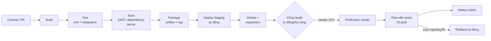

**Tên tài liệu:** Các giai đoạn CI/CD pipeline — FoodNow backend/web
**Dự án:** FoodNow (sau go-live)
**Phiên bản / ngày:** v1.0 — 09/11/2026 (tuần 45)
**Mục đích & khi nào dùng:** Mô tả pipeline từ commit đến production và các cổng chất lượng; dùng cho mô hình B (daily deploy).

---

## Pipeline

## Các giai đoạn và cổng

| Giai đoạn | Việc làm | Cổng (điều kiện qua) | Thời gian mục tiêu |
|---|---|---|---|
| **Build** | Biên dịch, tạo artifact | Build thành công | < 3 phút |
| **Test** | Unit, integration, contract | ≥ 95% đạt; coverage không giảm (thanh toán ≥ 85%) | < 8 phút |
| **Scan** | Quét mã (SAST), thư viện, bí mật | Không lỗ hổng mức cao/critical; không lộ bí mật | < 3 phút |
| **Package** | Đóng gói, gắn phiên bản/tag SemVer | Artifact bất biến, có SBOM/metadata | < 2 phút |
| **Deploy Staging** | Triển khai tự động | Health check xanh | < 5 phút |
| **Smoke + Regression** | Luồng đặt đơn, thanh toán COD/thẻ sandbox | 100% smoke; regression đạt | < 10 phút |
| **Cổng duyệt** | Change record tự sinh từ pipeline; duyệt tự động nếu điều kiện đủ (test, scan, ngoài cửa sổ cấm) | Người duyệt (Tech Lead) cho thay đổi rủi ro cao | Tức thì–15 phút |
| **Canary production** | 10% lưu lượng | Lỗi < ngưỡng; độ trễ p95 < 2 giây | 15 phút |
| **Rollout 100%** | Mở rộng dần (25% → 50% → 100%) | Metric ổn định | 15–30 phút |
| **Rollback** | Quay lại artifact trước tự động/1 nút | Kích hoạt khi vượt ngưỡng | < 10 phút |

## Continuous Delivery vs Continuous Deployment

- **Delivery**: mọi bản qua pipeline **sẵn sàng deploy**; có người quyết định bấm nút.
- **Deployment**: bản qua pipeline **tự động lên production**. FoodNow backend/web: Delivery đến canary, Deployment cho thay đổi rủi ro thấp; thay đổi rủi ro cao (thanh toán) cần Tech Lead duyệt.

## Chỉ số theo dõi

Deployment Frequency, Lead Time for Changes, Change Failure Rate, Time to Restore (xem `dora-metrics.csv`).

---

## Cách dùng cho dự án của bạn

1. Vẽ pipeline hiện tại của bạn; đánh dấu bước thủ công.
2. Đặt cổng chất lượng có ngưỡng cho từng giai đoạn.
3. Đặt mục tiêu thời gian; nếu > 30 phút tổng, tối ưu trước khi tăng tần suất deploy.
4. Bảo đảm rollback tự động hoặc một nút.
5. Sinh change record từ pipeline để phục vụ kiểm toán.
