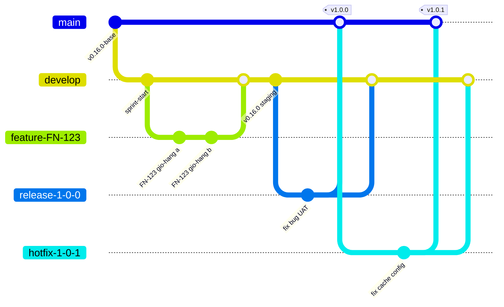

**Tên tài liệu:** Sơ đồ GitFlow-lite — một sprint và một hotfix
**Dự án:** FoodNow MVP
**Phiên bản / ngày:** v1.0 — 30/01/2026
**Mục đích & khi nào dùng:** Minh hoạ luồng merge giữa `main`, `develop`, `feature`, `release`, `hotfix`; dùng khi giải thích chính sách nhánh cho đội và Sponsor.

---

## Sơ đồ

## Đọc sơ đồ

1. **`feature-*`** tách từ `develop`, sống ngắn, merge lại bằng PR.
2. **`develop`** gộp các feature; cuối sprint gắn tag `v0.N.0` lên staging.
3. **`release-*`** tách từ `develop` khi cắt bản phát hành; chỉ sửa lỗi; xong thì merge về `main` (gắn tag `v1.0.0`) **và** về `develop`.
4. **`hotfix-*`** tách từ `main` (tag production), sửa, merge về `main` (tag `v1.0.1`) **và** `develop`.
5. Tên nhánh thật có dạng `feature/FN-123-...`, `release/1.0.0`, `hotfix/1.0.1` (sơ đồ dùng gạch ngang để tương thích công cụ vẽ).

## Ví dụ 1 sprint và 1 hotfix (FoodNow)

- 22–25/09: các feature cuối Sprint 16 merge vào `develop`; 25/09 tag `v0.16.0`.
- `release/1.0.0` (cắt 24/07, sửa lỗi UAT) → tag `v1.0.0` ngày 02/10.
- 03/10: sự cố cache → `hotfix/1.0.1` từ tag `v1.0.0` → tag `v1.0.1` (12:10 deploy), back-merge vào `develop`.

---

## Cách dùng cho dự án của bạn

1. Thay tên nhánh và tag bằng của bạn; giữ cấu trúc merge hai chiều cho `release` và `hotfix`.
2. Dán sơ đồ vào wiki; in cho buổi onboarding.
3. Kiểm tra: mọi hotfix có back-merge vào `develop` chưa?
4. Đánh dấu nơi tag được đặt và môi trường tương ứng.
5. Cập nhật sơ đồ khi đổi chiến lược (ví dụ sang trunk-based).
