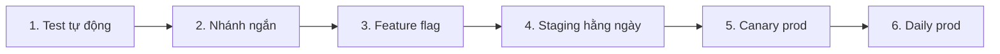

**Tên tài liệu:** Kế hoạch chuyển đổi chiến lược release: từ (A) theo kế hoạch sang (B) daily deploy — 6 bước
**Dự án:** FoodNow (backend/web), tuần 44 → tuần 55
**Phiên bản / ngày:** v1.0 — 02/11/2026
**Mục đích & khi nào dùng:** Lộ trình an toàn chuyển sang trunk-based + daily deploy, có mốc và tiêu chí đạt từng bước; dùng khi đã đủ điều kiện tiên quyết.

---

## 1. Lộ trình 6 bước (12 tuần)

| Bước | Tuần | Việc | Tiêu chí hoàn thành | Chỉ số |
|---|---|---|---|---|
| 1. **Tăng test tự động** | 44–46 | Regression tự động, contract test, sửa flaky (TD-05 đã xong) | ≥ 70% coverage; flaky < 2% | Test pass rate ≥ 98% |
| 2. **Rút ngắn nhánh** | 44–47 | Luật nhánh ≤ 2 ngày; PR ≤ 200 dòng; review ≤ 4 giờ | 90% PR đạt | Tuổi nhánh trung vị ≤ 1 ngày |
| 3. **Thêm feature flag** | 45–48 | Flag cho tính năng dở; register; kill switch thanh toán | Mọi tính năng dài đều sau flag | Flag debt < 10 |
| 4. **Deploy staging hằng ngày** | 46–49 | Tự động sau merge; smoke/regression | Staging ≥ 5 lần/tuần | Lead time ≤ 24 giờ |
| 5. **Canary production** | 48–52 | Canary 10% → rollout; rollback tự động; cửa sổ deploy | 1 rollback diễn tập < 10 phút | CFR ≤ 15% |
| 6. **Daily production** | 52–55 | Deploy production hằng ngày cho rủi ro thấp; duyệt tự động | ≥ 5 deploy/tuần | Deployment Frequency ≥ 1/ngày |

## 2. Rủi ro và giảm thiểu

| Rủi ro | Giảm thiểu |
|---|---|
| Deploy thường xuyên khi test yếu → lỗi | Không sang bước 5 nếu bước 1–3 chưa đạt |
| Flag chất đống (flag debt) | Register, hạn xoá, dọn hằng tháng |
| Mobile bị kéo theo | Giữ release train; backend tương thích ngược ≥ 2 phiên bản app |
| Kiểm toán | Change record tự sinh; approval theo quy tắc |
| Đội quá tải | Bước theo nhịp, không ép; dừng nếu CFR > 25% |

## 3. Cổng quyết định tiếp tục

Cuối mỗi bước: họp 30 phút (Hà, Dũng, Ánh, Nam) kiểm tra tiêu chí; **dừng hoặc quay lại** nếu Change Failure Rate > 25% hai tuần liên tiếp.

## 4. Kết quả thực tế (đối chiếu `dora-metrics.csv`)

| | Tuần 1–4 | Tuần 9–12 |
|---|---|---|
| Deploy/tuần | 3–6 | 13–15 |
| Change Failure Rate | 22% | 9% |
| Lead time (trung vị) | 60–96 giờ | 6–14 giờ |
| Time to Restore | 140–180 phút | 35–55 phút |

---

## Cách dùng cho dự án của bạn

1. Đánh giá điều kiện tiên quyết; chỉ bắt đầu bước 1 nếu còn thiếu.
2. Gán chủ sở hữu và tiêu chí đo cho từng bước.
3. Bắt đầu với một dịch vụ; nhân rộng sau.
4. Đo DORA trước, trong, sau; công bố kết quả cho đội.
5. Xem lại chính sách mỗi quý; đừng biến tần suất deploy thành mục tiêu.
