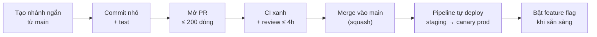

**Tên tài liệu:** Quy trình Trunk-based Development — backend/web FoodNow sau go-live
**Dự án:** FoodNow (từ tuần 44)
**Phiên bản / ngày:** v1.0 — 02/11/2026
**Mục đích & khi nào dùng:** Quy trình làm việc khi mọi người commit vào một nhánh chính ngắn hạn; dùng cho repo đã chuyển sang mô hình B.

---

## 1. Nguyên tắc

- **Một nhánh chính** (`main` = trunk) luôn ở trạng thái deploy được.
- Nhánh ngắn hạn (`short-lived`) **≤ 1–2 ngày**; PR **nhỏ** (< 200 dòng lý tưởng).
- **Tính năng chưa xong** được che sau **feature flag**, không nằm trong nhánh dài.
- **CI phải nhanh** (< 10 phút) và **đáng tin**; không merge khi đỏ.
- **Ai làm hỏng build thì sửa ngay** (dừng dây chuyền).

## 2. Luồng một thay đổi

## 3. Quy tắc bổ sung

| Vấn đề | Quy tắc |
|---|---|
| Thay đổi lớn | Chia thành nhiều PR; dùng flag; "branch by abstraction" |
| Review | Trong 4 giờ làm việc; ưu tiên hơn việc mới |
| Deploy | Tự động sau khi merge; production theo cửa sổ và canary (Ch33) |
| Sự cố | Tắt feature flag hoặc rollback trước; sửa sau |
| Chất lượng | Test tự động bắt buộc; coverage không giảm |
| Phiên bản | Tag tự động theo SemVer từ pipeline (PATCH cho mỗi deploy nhỏ) |

## 4. Điều kiện tiên quyết

Test tự động đáng tin (≥ 70%, regression); CI nhanh; feature flag; monitoring và cảnh báo; rollback nhanh (< 15 phút); PR nhỏ theo văn hoá đội.

## 5. Khi nào KHÔNG dùng

Mobile app (review app store), đội chưa có test tự động, dự án cần cổng UAT chính thức từng release.

---

## Cách dùng cho dự án của bạn

1. Kiểm tra điều kiện tiên quyết trước khi chuyển.
2. Đặt giới hạn tuổi nhánh và kích thước PR bằng công cụ (cảnh báo tự động).
3. Bắt đầu với một repo/module; đo DORA trước và sau.
4. Có kế hoạch dọn feature flag cũ (`feature-flag-register.csv`).
5. Luyện tập tắt flag/rollback định kỳ.
