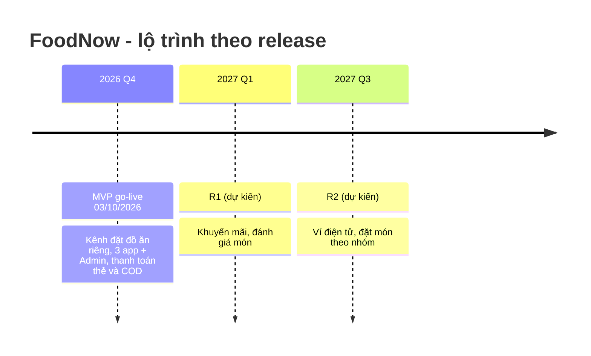

**Tên tài liệu:** Product Roadmap — FoodNow (MVP → R1 → R2)
**Dự án:** FoodNow
**Phiên bản / ngày:** v1.1 — 06/07/2026 (v1.0 ngày 13/03/2026)
**Mục đích & khi nào dùng:** Trình bày hướng đi theo mục tiêu/kết quả, không cam kết ngày chi tiết; dùng cho lãnh đạo, đội và khách; cập nhật khi thông tin lớn thay đổi.

---

## 1. Nguyên tắc đọc roadmap này

- Là **định hướng**, không phải lịch cam kết. Ngày chi tiết chỉ có cho **Now**; **Next** chỉ có tháng/quý; **Later** chỉ có mục tiêu, **không có ngày**.
- Mỗi release có một **mục tiêu kết quả (outcome)** và một vài **KR** đo được; tính năng chỉ là cách đạt kết quả.
- Độ tin cậy giảm dần từ Now → Later.

## 2. Tổng quan (timeline)

## 3. Now – Next – Later

| Vùng | Release | Theme / Outcome | Nội dung | Độ chắc chắn |
|---|---|---|---|---|
| **NOW** (đang làm, có lịch) | **MVP** | Kênh đặt đồ ăn riêng đáng tin cậy | 11 epic: đăng nhập, duyệt/tìm món, giỏ hàng & đặt đơn, thanh toán thẻ + COD, xử lý đơn (nhà hàng), thực đơn, nhận chuyến (tài xế), theo dõi đơn, lịch sử, Admin, thông báo | Cao — go-live 03/10/2026 |
| **NEXT** (đã cam kết ở mức quý) | **R1** (Q1/2027) | Tăng đơn lặp lại và giảm huỷ đơn | Khuyến mãi/mã giảm giá; đánh giá và xếp hạng món; cải thiện hiệu năng theo dữ liệu thật | Trung bình |
| **LATER** (hướng đi, chưa có ngày) | **R2** (dự kiến Q3/2027) | Mở rộng cách thanh toán và cách đặt | Ví điện tử; đặt món theo nhóm; cân nhắc mở rộng khu vực | Thấp — phụ thuộc kết quả R1, quy định |

## 4. OKR theo release

| Release | Objective | Key results (đo lường) |
|---|---|---|
| **MVP** | Có kênh đặt đồ ăn riêng đáng tin cậy | 500 đơn/ngày sau 3 tháng go-live · huỷ đơn < 5% · thời gian giao TB < 35 phút · payback < 18 tháng |
| **R1** | Khách quay lại nhiều hơn | Tỷ lệ khách đặt lại trong 30 ngày ≥ 35% (mục tiêu đề xuất) · huỷ đơn < 5% ổn định · ≥ 30% đơn có đánh giá món (mục tiêu đề xuất) |
| **R2** | Thanh toán và đặt món linh hoạt hơn | ≥ 25% giao dịch qua ví (mục tiêu đề xuất) · ≥ 10% đơn là đơn nhóm (mục tiêu đề xuất) |

Các KR của R1, R2 là **giả thuyết cần kiểm chứng** bằng dữ liệu sau MVP (Ch41); sẽ chỉnh khi có số liệu thật.

## 5. Ba phiên bản cho ba đối tượng

| Đối tượng | Nội dung | Độ chi tiết |
|---|---|---|
| **Lãnh đạo/HĐQT** | Mục tiêu kinh doanh từng release, KR, rủi ro lớn | 1 slide |
| **Đội phát triển** | Theme, epic, phụ thuộc kỹ thuật, nợ kỹ thuật cần xử lý trước release | 1 trang + backlog |
| **Khách/đối tác** | Thứ họ sẽ dùng, khi nào (mức quý) | Tóm tắt, không hứa tính năng chi tiết |

## 6. Lịch sử thay đổi

| Phiên bản | Ngày | Thay đổi | Lý do |
|---|---|---|---|
| v1.0 | 13/03/2026 | Bản đầu: MVP/R1/R2; ví điện tử ở R2 | Sau đàm phán tuần 6 |
| **v1.1** | 06/07/2026 | Trong R2 (Later): đặt món theo nhóm **đi trước** ví điện tử; ví chờ hoàn tất yêu cầu tuân thủ mới về xác thực người dùng ví | Yêu cầu pháp lý từ cố vấn pháp lý FoodNow; **mục tiêu R2 và quý dự kiến không đổi** |

---

## Cách dùng cho dự án của bạn

1. Bắt đầu từ mục tiêu kinh doanh, không từ danh sách tính năng; mỗi release có Objective + 2–3 KR.
2. Chia Now / Next / Later; **không** ghi ngày cho Later.
3. Ghi độ chắc chắn để người đọc không hiểu nhầm là cam kết.
4. Viết 3 phiên bản (lãnh đạo, đội, khách) từ cùng một nguồn.
5. Khi cập nhật, ghi rõ **cái gì đổi, cái gì không đổi, vì sao** ở bảng lịch sử thay đổi.
