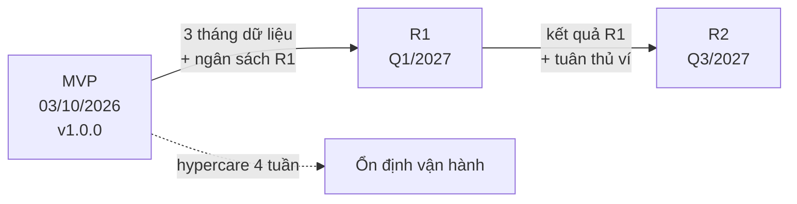

**Tên tài liệu:** Release Plan — FoodNow MVP, R1, R2
**Dự án:** FoodNow
**Phiên bản / ngày:** v1.0 — 13/03/2026 (chỉnh 06/07/2026)
**Mục đích & khi nào dùng:** Chuyển roadmap thành kế hoạch phát hành: mục tiêu, phạm vi, tiêu chí Go/No-Go và phụ thuộc từng release; dùng sau roadmap, trước Delivery Plan (Ch30).

---

## 1. Tổng quan release

| Release | Cửa sổ dự kiến | Mục tiêu | Trạng thái |
|---|---|---|---|
| **MVP** | Go-live **03/10/2026** (T7, 02:00) | Kênh đặt đồ ăn riêng đáng tin cậy | Đang thực hiện |
| **R1** | Q1/2027 | Tăng đơn lặp lại, giảm huỷ | Kế hoạch |
| **R2** | Q3/2027 | Mở rộng thanh toán và cách đặt | Định hướng |

## 2. Phạm vi từng release

| Release | Trong phạm vi | Ngoài phạm vi |
|---|---|---|
| MVP | 11 epic E1–E11 (xem Scope Statement v1.1) | Khuyến mãi, đánh giá, ví, đặt nhóm |
| R1 | Khuyến mãi/mã giảm giá; đánh giá món; tối ưu hiệu năng | Ví điện tử, đặt nhóm |
| R2 | Đặt món theo nhóm; ví điện tử (sau khi đủ yêu cầu tuân thủ) | Mở rộng đa thành phố (chưa lên lịch) |

## 3. Tiêu chí Go/No-Go từng release

| Nhóm | MVP | R1 | R2 |
|---|---|---|---|
| Chất lượng | Không còn bug Critical/High; luồng thanh toán qua kiểm thử đầy đủ | Không còn bug Critical; ≤ 5 High có kế hoạch sửa | Như R1 + kiểm thử thanh toán ví |
| UAT | Đạt kịch bản nghiệm thu, Châu và Huy ký | Người dùng đại diện ký | Người dùng đại diện ký |
| Hiệu năng | Đáp ứng tải dự kiến 500 đơn/ngày | Đáp ứng 800 đơn/ngày (mục tiêu đề xuất) | Theo dữ liệu R1 |
| Vận hành | Runbook, đội hỗ trợ được đào tạo, rollback sẵn sàng | Runbook cập nhật | Runbook cập nhật |
| Tuân thủ | Chứng nhận thanh toán còn hiệu lực | Rà soát khuyến mãi theo quy định | **Yêu cầu tuân thủ ví điện tử hoàn tất** |
| Kinh doanh | Sponsor đồng ý ngày go-live | Sponsor duyệt ngân sách R1 sau khi có số liệu MVP | Sponsor duyệt ngân sách R2 |

## 4. Phụ thuộc và rủi ro

| Release | Phụ thuộc | Rủi ro chính |
|---|---|---|
| MVP | Chứng nhận PayEasy; API dữ liệu nhà hàng; nhân sự đủ 12 FTE | Trễ chứng nhận; thiếu nhân sự |
| R1 | Số liệu 3 tháng sau go-live; nợ kỹ thuật MVP được xử lý | Ngân sách chưa duyệt; đội bị tách |
| R2 | Vendor ví điện tử; yêu cầu tuân thủ | Quy định thay đổi; vendor mới |

## 5. Lộ trình MVP → R1 → R2

## 6. Cách cập nhật mà không "lật kèo"

- Mọi thay đổi ghi vào bảng lịch sử của roadmap: **đổi gì – không đổi gì – vì sao**.
- Đổi thứ tự trong cùng release thì thông báo trong SteerCo; đổi release cho một mục lớn cần Sponsor duyệt.
- Không đổi ngày đã công bố cho **Now**; nếu bất khả kháng, thông báo sớm kèm phương án.

---

## Cách dùng cho dự án của bạn

1. Liệt kê 3 release (hoặc nhiều hơn) với mục tiêu và cửa sổ thời gian ở mức quý.
2. Với mỗi release, viết tiêu chí Go/No-Go đo được (chất lượng, UAT, hiệu năng, vận hành, tuân thủ, kinh doanh).
3. Liệt kê phụ thuộc và rủi ro chính; chuyển vào RAID.
4. Đặt quy tắc cập nhật release plan; ai được duyệt thay đổi.
5. Khi chuyển sang lịch phát hành chi tiết (Delivery Plan), giữ nguyên mục tiêu và tiêu chí ở đây làm nguồn.
