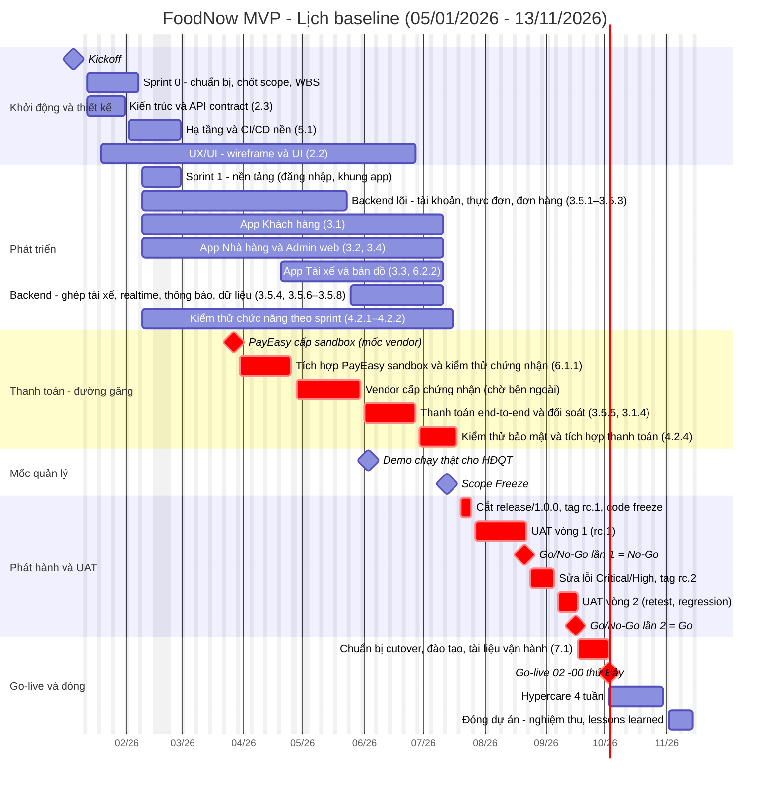

**Tên tài liệu:** Gantt baseline — FoodNow MVP
**Dự án:** FoodNow MVP
**Phiên bản / ngày:** v1.0 — 27/02/2026 (baseline lịch sau Tết, đồng bộ Scope Statement v1.1 và WBS v1.0)
**Mục đích & khi nào dùng:** Hiển thị lịch tổng thể, đường găng và các mốc để trình bày với Sponsor và đội; dùng sau khi có WBS, ước lượng và phụ thuộc.

---

## 1. Gantt (Mermaid)

> Gantt loại bỏ cuối tuần, Tết (16–20/02/2026), bù Giỗ Tổ 27/04, 30/04–01/05 và 02/09. Các gói màu "crit" nằm trên đường găng. Chi tiết ngày, phụ thuộc và float ở `FoodNow-Schedule.csv`.

## 2. Lịch sprint

| Sprint | Từ – Đến | Tuần | Tag cuối sprint |
|---|---|---|---|
| Sprint 0 | 12/01 – 06/02 | T2–T5 | — |
| Sprint 1 | 09/02 – 27/02 (gồm Tết) | T6–T8 | v0.1.0 |
| Sprint 2 | 02/03 – 13/03 | T9–T10 | v0.2.0 |
| Sprint 3 | 16/03 – 27/03 | T11–T12 | v0.3.0 |
| Sprint 4 | 30/03 – 10/04 | T13–T14 | v0.4.0 |
| Sprint 5 | 13/04 – 24/04 | T15–T16 | v0.5.0 |
| Sprint 6 | 27/04 – 08/05 | T17–T18 | v0.6.0 |
| Sprint 7 | 11/05 – 22/05 | T19–T20 | v0.7.0 |
| Sprint 8 | 25/05 – 05/06 | T21–T22 | v0.8.0 |
| Sprint 9 | 08/06 – 19/06 | T23–T24 | v0.9.0 |
| Sprint 10 | 22/06 – 03/07 | T25–T26 | v0.10.0 |
| Sprint 11 | 06/07 – 17/07 | T27–T28 | v0.11.0 |
| Sprint 12 | 20/07 – 31/07 | T29–T30 | v0.12.0 (+ rc.1 cho UAT) |
| Sprint 13 | 03/08 – 14/08 | T31–T32 | v0.13.0 |
| Sprint 14 | 17/08 – 28/08 | T33–T34 | v0.14.0 |
| Sprint 15 | 31/08 – 11/09 | T35–T36 | v0.15.0 (+ rc.2) |
| Sprint 16 | 14/09 – 25/09 | T37–T38 | v0.16.0 |
| Go-live | Thứ Bảy 03/10 | T39 | **v1.0.0** |

## 3. Đọc-hiểu đường găng

| Gói | Từ – Đến | Ngày làm việc | Float | Vì sao găng |
|---|---|---|---|---|
| PayEasy cấp sandbox (mốc vendor) | 27/03 | 0 | 0 | Phụ thuộc bên ngoài, không tự rút ngắn |
| Tích hợp PayEasy sandbox + kiểm thử chứng nhận | 30/03 – 24/04 | 20 | 0 | Cần sandbox trước khi tích hợp |
| Vendor cấp chứng nhận | 28/04 – 29/05 | 22 | 0 | Chờ bên ngoài |
| Thanh toán end-to-end + đối soát | 01/06 – 26/06 | 20 | 0 | Cần chứng nhận |
| Kiểm thử bảo mật và tích hợp thanh toán | 29/06 – 17/07 | 15 | 0 | Phải xong trước code freeze |
| Cắt release/1.0.0, tag rc.1 | 20/07 – 24/07 | 5 | 0 | Điều kiện vào UAT |
| UAT vòng 1 | 27/07 – 21/08 | 20 | 0 | |
| Sửa lỗi Critical/High, rc.2 | 24/08 – 04/09 | 9 | 0 | Sau No-Go lần 1 |
| UAT vòng 2 → Go/No-Go lần 2 | 07/09 – 16/09 | 8 | 0 | |
| Chuẩn bị cutover, đào tạo | 17/09 – 02/10 | 12 | 0 | |
| **Go-live** | **03/10 (T7)** | — | 0 | |

**Kết luận:** đường găng đi qua **tích hợp thanh toán** (tổng 131 ngày làm việc từ 30/03 đến 02/10). Các nhánh phát triển (app Khách hàng, Nhà hàng, Tài xế, Backend) có float 2–5 ngày làm việc — **gần găng** (near-critical), cần theo dõi. Mọi trễ ở nhánh găng làm trễ go-live nếu không có biện pháp rút ngắn (crashing/fast-tracking, Ch12).

## 4. Ghi chú

- Baseline lịch này khớp WBS v1.0 (66 work package, 1.927 ngày công) và Scope Statement v1.1.
- Demo cho HĐQT: 03/06/2026 (tuần 22).
- Scope Freeze: 13/07/2026 (tuần 28).

---

## Cách dùng cho dự án của bạn

1. Bắt đầu từ WBS: gom work package thành 15–30 dòng lịch (đủ để trình bày, không quá chi tiết).
2. Xác định phụ thuộc (FS/SS/FF/SF) và các mốc bên ngoài (vendor, khách).
3. Tính đường găng, ghi float; đánh dấu `crit` trong Mermaid.
4. Loại trừ cuối tuần và ngày nghỉ của quốc gia/công ty trong `excludes`.
5. Cập nhật hằng tuần (ngày thực tế, % hoàn thành) và lưu baseline để so sánh.
