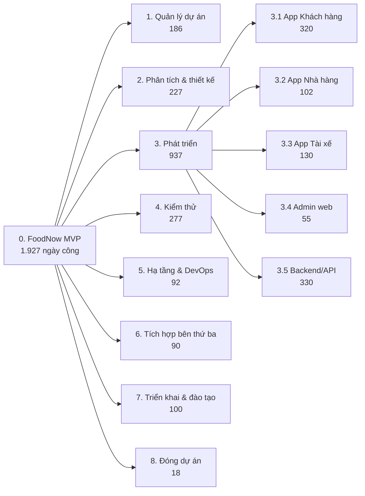

**Tên tài liệu:** WBS — FoodNow MVP
**Dự án:** FoodNow MVP
**Phiên bản / ngày:** v1.0 — 06/02/2026 (baseline, cùng Scope Statement v1.0; điều chỉnh cho v1.1 ở Ch11/Ch12)
**Mục đích & khi nào dùng:** Phân rã deliverable thành các work package để ước lượng, lập lịch, giao việc; dùng sau khi chốt Scope Statement.

---

## 1. Cây WBS (đến cấp 3)

## 2. Tóm tắt theo nhóm

| Mã | Nhóm | Số work package | Ngày công | Tỷ trọng |
|---|---|---|---|---|
| 1 | Quản lý dự án | 5 | 186 | 9,7% |
| 2 | Phân tích và thiết kế | 8 | 227 | 11,8% |
| 3 | Phát triển | 27 | 937 | 48,6% |
| 4 | Kiểm thử | 7 | 277 | 14,4% |
| 5 | Hạ tầng và DevOps | 5 | 92 | 4,8% |
| 6 | Tích hợp bên thứ ba | 5 | 90 | 4,7% |
| 7 | Triển khai và đào tạo | 6 | 100 | 5,2% |
| 8 | Đóng dự án | 3 | 18 | 0,9% |
| | **Tổng** | **66** | **1.927** | 100% |

## 3. Kiểm tra với năng lực đội

- Năng lực: 12 FTE × ~185 ngày làm việc (từ 05/01 đến 03/10/2026, trừ Tết và lễ) = **2.220 ngày**.
- Ước lượng WBS = **1.927 ngày** ≈ **87%** năng lực; phần còn lại ≈ 293 ngày (13%) cho họp, nghỉ phép, học việc, việc phát sinh — đó chính là lý do không xếp 100%.
- Chi phí nhân sự MVP 1,67 tỷ ÷ 1.927 ngày ≈ 0,87 triệu VND/ngày công (chi phí bình quân đã gồm overhead; xem Ch14).

## 4. Chi tiết work package

Xem `FoodNow-WBS.csv` (cột: `WBS_ID, Level, Name, Description, Owner, Estimate_Days, Depends_On, Status`); dòng cuối là **dòng tổng kiểm tra** bằng công thức. Từ điển WBS cho các gói lớn ở `wbs-dictionary.md`.

Quy tắc:
- Level 1 = toàn dự án; Level 2 = nhóm deliverable; Level 3 = nhóm con; **Level 4 = work package** (lá cây).
- Work package lớn nhất 65 ngày (dịch vụ đơn hàng) — sẽ được chia nhỏ thành story khi vào backlog (Ch24).

---

## Cách dùng cho dự án của bạn

1. Bắt đầu từ Scope Statement: mỗi epic in-scope và mỗi hạng mục project scope (quản lý, kiểm thử, triển khai) là một nhánh cấp 2.
2. Phân rã đến khi mỗi lá ước lượng được và có một người chịu trách nhiệm.
3. Kiểm tra quy tắc 100%: cộng các con phải bằng cha, không thiếu cũng không thừa.
4. So tổng ước lượng với năng lực đội; nếu > 90% thì lịch quá căng.
5. Lưu ID ổn định; khi đổi WBS sau baseline phải qua change control.
